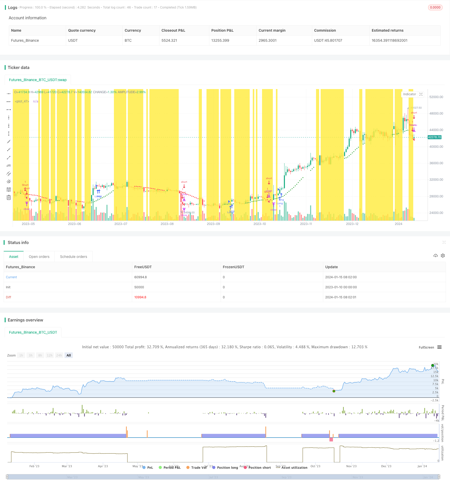

> Name

Baseline-Cross-Qualifier-ATR-Volatility-HMA-Trend-Bias-Mean-Reversion-Strategy based on ATR volatility and HMA trend deviation
> Author

ChaoZhang

> Strategy Description


 [trans]
## Overview
This strategy is a quantitative trading strategy that combines double moving average breakthrough signals with ATR volatility filtering and HMA trend deviation. The strategy uses two moving averages of different periods to construct trading signals, combines with the volatility indicator ATR to filter out some invalid signals, and uses HMA to determine the trend direction to avoid counter-trend operations.
## Strategy Principle
The strategy uses a 37-period moving average as the base moving average. A buy signal is generated when the price breaks upward from below the moving average, and a sell signal is generated when the price breaks downward from above. In order to filter out false positive signals, the strategy sets that after the price breaks through the benchmark moving average, it will continue to move in the same direction for more than 2 times the ATR volatility before the signal is confirmed to be valid and an order is generated. In addition, the strategy also uses an HMA with a length of 11 periods to determine the direction of the general trend. Only when the price breaks through the benchmark moving average and the HMA also shows the same direction, will the signal be confirmed to effectively generate instructions to avoid losses caused by counter-trend operations.
In terms of profit methods, the strategy supports the choice of using one take-profit level or two or even three take-profit levels at different prices. For the stop loss method, the strategy directly uses the upper and lower track lines as the stop loss level for long and short orders.
## Strategic advantage analysis
Compared with the single moving average breakthrough strategy, this strategy adds ATR volatility filtering when generating signals, which can filter out most invalid signals. This is very consistent with the visual K-line shape strategy, so a higher winning rate can be obtained. At the same time, increasing the HMA judgment trend deviation and avoiding opening positions against the trend can significantly reduce unnecessary losses. In terms of profit methods, the strategy supports the setting of multiple take-profit points, which can lock in more profits to a certain extent.
## Risk and solution analysis
The biggest risk of this strategy is that the ATR volatility filter may filter out some effective signals, causing the strategy to be unable to establish a position in time. In addition, the effect of HMA on judging the general trend is not obvious. Sometimes the price is only a short-term adjustment rather than a reversal of the general trend, which may lead to unnecessary losses. In order to reduce the above risks, the parameters of ATR volatility filtering can be appropriately reduced, the volatility range can be expanded, and more K-line form signals can be verified to generate instructions. At the same time, you can also adjust the HMA cycle parameters and use longer-period HMA to judge the general trend to avoid being disturbed by short-term adjustments.
## Strategy optimization direction
This strategy can be optimized from the following directions:
1. Test more types of parameter combinations and find the optimal parameter combination. Such as the base moving average length, ATR period, volatility filter coefficient, etc. are all adjustable parameters.
2. Add more filter indicators or oscillator indicators to judge market conditions to further improve the robustness of the strategy.
3. Optimize profit method parameter settings. Further test take-profit settings at different quantities and price levels.
4. Combine with machine learning models to generate more effective trading signals.
## Summarize
This strategy integrates the core signals of double moving average breakthroughs, ATR volatility to filter invalid signals, and uses HMA to determine the deviation of the general trend to avoid opening positions against the trend. It is a very practical quantitative trading strategy. There is a large space for optimization of strategy parameters, and there is still room for improvement in the effect, which is worthy of further research and optimization implementation.
|| 

## Overview

This strategy integrates the baseline mean reversion signal, ATR volatility filter, and HMA trend filter to generate robust trading signals for quantitative trading strategies. It uses two moving averages with different periods to construct trading signals, combines the ATR volatility indicator to filter out some invalid signals, and utilizes HMA to determine the major trend direction to avoid adverse selection.  

## Strategy Logic

The strategy uses a 37-period moving average as the baseline. When the price breaks out upward from this baseline, it generates a buy signal, and when it breaks down from above, it generates a sell signal. To avoid false signals, the strategy requires the price to move beyond 2xATR volatility after penetrating the baseline to confirm the validity of signals. Also, the strategy uses an 11-period HMA to judge the major trend. It only confirms valid signals when price penetrating baseline is aligned with HMA direction to prevent adverse selection.

For profit taking, the strategy supports using one or multiple (two or three) take profit levels. For stop loss, it simply takes the upper and lower band lines as SL for long and short positions.

## Advantage Analysis  

Compared with simple moving average breakout strategies, this strategy adds the ATR volatility filter that removes a lot of invalid signals. This aligns very well with visual pattern breakout techniques, thus leading to higher win rates. Also, the HMA trend bias prevents adverse selection and significantly reduces unnecessary losses. The multiple take-profit scheme also allows more profits to be locked in.

## Risks & Solutions

The major risk is the ATR volatility filter may remove some valid signals, causing failure to open positions timely. Also, the HMA trend judgment is not very significant sometimes when price is just having a short-term retracement, not reversal. This may lead to unnecessary stop loss. To reduce the risks, we can lower the ATR volatility filter parameter to allow more signals. We can also adjust the HMA period parameter to use longer-term HMA for judging major trends, preventing interference from short-term fluctuations. 

## Optimization Directions  

The strategy can be optimized in the following aspects:

1. Test more parameter combinations to find the optimum set of values, e.g., baseline period, ATR period, volatility coefficient etc.

2. Add more filters or oscillators to judge market conditions to enhance model robustness.  

3. Optimize parameters for profit taking mechanisms, test more price levels and allocation schemes.

4. Incorporate machine learning models to generate more effective trading signals.

## Conclusion
This strategy integrates dual moving average baseline signal, ATR volatility filter and HMA trend bias filter into a very practical quantitative trading system. Although it still has space to enhance performance through parameter tuning, it already serves well for disciplined rule-based trading.

[/trans]

> Strategy Arguments


|Argument|Default|Description|
|----|----|----|
|v_input_int_1|20|Baseline Length|
|v_input_bool_1|true|Post Baseline Cross Qualifier Enabled|
|v_input_int_2|3|Post Baseline Cross Qualifier Bars Ago|
|v_input_int_3|14|ATR Length|
|v_input_float_1|2|Volatility Multiplier|
|v_input_float_2|true|Volatility Range Multiplier|
|v_input_float_3|0.5|Volatility Qualifier Multiplier|
|v_input_string_1|0|Take Profit Type: 1 Take Profit|2 Take Profits|3 Take Profits|
|v_input_int_4|50|HMA Length|


> Source (PineScript)

``` pinescript
/*backtest
start: 2023-01-10 00:00:00
end: 2024-01-16 00:00:00
period: 1d
basePeriod: 1h
exchanges: [{"eid":"Futures_Binance","currency":"BTC_USDT"}]
*/

// This source code is subject to the terms of the Mozilla Public License 2.0 at https://mozilla.org/MPL/2.0/
// © sevencampbell

//@version=5
strategy(title="Baseline Cross Qualifier Volatility Strategy with HMA Trend Bias", overlay=true)

// --- User Inputs ---

// Baseline Inputs
baselineLength = input.int(title="Baseline Length", defval=20)
baseline = ta.sma(close, baselineLength)

// PBCQ Inputs
pbcqEnabled = input.bool(title="Post Baseline Cross Qualifier Enabled", defval=true)
pbcqBarsAgo = input.int(title="Post Baseline Cross Qualifier Bars Ago", defval=3)

// Volatility Inputs
atrLength = input.int(title="ATR Length", defval=14)
multiplier = input.float(title="Volatility Multiplier", defval=2.0)
rangeMultiplier = input.float(title="Volatility Range Multiplier", defval=1.0)
qualifierMultiplier = input.float(title="Volatility Qualifier Multiplier", defval=0.5)

// Take Profit Inputs
takeProfitType = input.string(title="Take Profit Type", options=["1 Take Profit", "2 Take Profits", "3 Take Profits"], defval="1 Take Profit")

// HMA Inputs
hmaLength = input.int(title="HMA Length", defval=50)

// --- Calculations ---

// ATR
atr = ta.atr(atrLength)

// Range Calculation
rangeHigh = baseline + rangeMultiplier * atr
rangeLow = baseline - rangeMultiplier * atr
rangeColor = rangeLow <= close and close <= rangeHigh ? color.yellow : na
bgcolor(rangeColor, transp=90)

// Qualifier Calculation
qualifier = qualifierMultiplier * atr

// Dot Calculation
isLong = close > baseline and (close - baseline) >= qualifier and close > ta.hma(close, hmaLength)
isShort = close < baseline and (baseline - close) >= qualifier and close < ta.hma(close, hmaLength)
colorDot = isLong ? color.green : isShort ? color.red : na
plot(isLong or isShort ? baseline : na, color=colorDot, style=plot.style_circles, linewidth=3)

// --- Strategy Logic ---

// PBCQ
pbcqValid = not pbcqEnabled or low[pbcqBarsAgo] > baseline

// Entry Logic
longCondition = isLong and pbcqValid
shortCondition = isShort and pbcqValid
if (longCondition)
    strategy.entry("Long", strategy.long)
if (shortCondition)
    strategy.entry("Short", strategy.short)

// Exit Logic
if (takeProfitType == "1 Take Profit")
    strategy.exit("TP/SL", "Long", limit=rangeHigh, stop=rangeLow)
    strategy.exit("TP/SL", "Short", limit=rangeLow, stop=rangeHigh)
else if (takeProfitType == "2 Take Profits")
    strategy.exit("TP1", "Long", qty=strategy.position_size * 0.5, limit=rangeHigh / 2)
    strategy.exit("TP2", "Long", qty=strategy.position_size * 0.5, limit=rangeHigh)
    strategy.exit("TP1", "Short", qty=strategy.position_size * 0.5, limit=rangeLow / 2)
    strategy.exit("TP2", "Short", qty=strategy.position_size * 0.5, limit=rangeLow)
else if (takeProfitType == "3 Take Profits")
    strategy.exit("TP1", "Long", qty=strategy.position_size * 0.5, limit=rangeHigh / 2)
    strategy.exit("TP2", "Long", qty=strategy.position_size * 0.25, limit=rangeHigh * 0.75)
    strategy.exit("TP3", "Long", qty=strategy.position_size * 0.25, limit=rangeHigh * 1.5)

```

> Detail

https://www.fmz.com/strategy/439089

> Last Modified

2024-01-17 16:37:23
