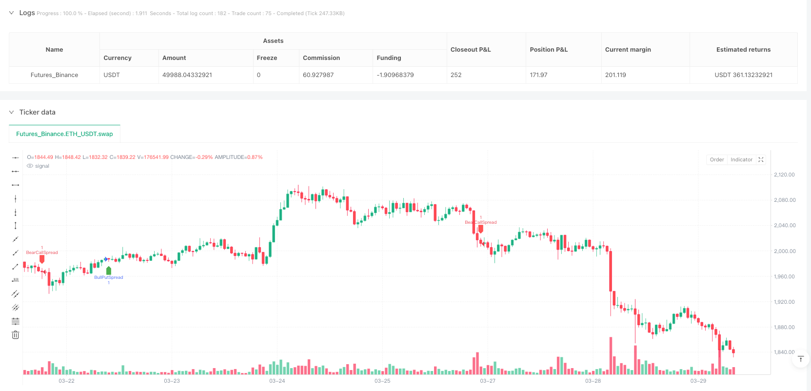
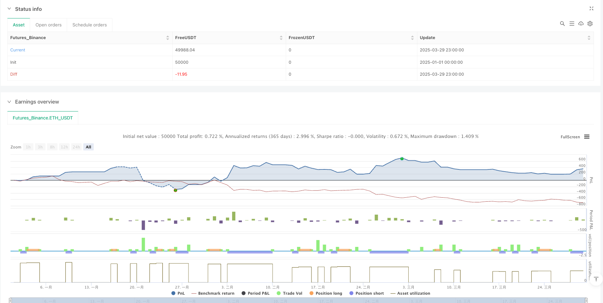

> Name

Multi-Indicator-Fusion-Options-Selling-Strategy-Trend-Confirmation-with-ATR-Dynamic-Stop-Loss-Optimization
> Author

ianzeng123

> Strategy Description





[trans]

## Overview
The multi-indicator fusion option selling strategy is a quantitative trading strategy that combines multiple technical indicators for option selling. It is designed to identify the direction of market trends and establish bullish put spread or bearish call spread positions under appropriate conditions. The strategy combines multi-dimensional signals such as moving average crossovers, trend strength confirmations, momentum indicators and volume-weighted average prices, while using a dynamic stop-loss mechanism based on true volatility to manage risk. The core of the strategy is to reduce the risk of false signals through the resonance of multiple indicators, and only enter the market when multiple technical conditions are met at the same time, thereby improving the reliability of trading signals.
#### Strategy Principle
The core principle of the multi-indicator fusion option sales strategy is to determine the market trend through the collaborative judgment of multiple indicators and select an appropriate option strategy accordingly. The specific principles are as follows:
1. **Trend Identification System**: The strategy uses the intersection of the 20-period and 50-period exponential moving averages (EMA) to determine the general direction of the market. When the short-term EMA crosses above the long-term EMA, it is identified as an upward trend; when the short-term EMA crosses below the long-term EMA, it is identified as a downtrend.
2. **Trend Strength Verification**: The strategy introduces the average direction index (ADX) to verify the trend strength. Only when ADX is greater than 15, is it confirmed that the trend has sufficient strength and is worth following.
3. **Momentum Confirmation Mechanism**: Use the Relative Strength Index (RSI) to avoid entering a weak trend or possible reversal area. The RSI is required to be greater than 45 in an upward trend and less than 55 in a downward trend.
4. **Price Position Verification**: Compare the price to the Volume Weighted Average Price (VWAP), with an uptrend requiring price above VWAP and a downtrend requiring price below VWAP to confirm overall market sentiment.
5. **Option strategy construction**:
   - In a bullish market, use a bull put spread strategy to sell at-the-money or one-level out-of-the-money puts while buying 200-300 points lower out-of-the-money puts for protection.
   - In a bearish market, adopt a bear call spread strategy and sell at-the-money or one-level out-of-the-money calls while buying 200-300 points higher out-of-the-money calls as protection.
6. **Risk Management System**: The strategy uses dynamic stop loss based on the average true fluctuation range (ATR). The stop loss level is set to 1.5 times of ATR, and the protection level is automatically adjusted with market volatility.
#### Strategic Advantages
1. **Multi-dimensional signal confirmation**: The strategy combines indicators from the four dimensions of trend, strength, momentum and price position, which greatly reduces the misleading signals that a single indicator may produce and improves the quality of trading signals.
2. **Adaptive Risk Management**: The dynamic stop-loss mechanism based on ATR can automatically adjust the protection level according to market volatility, provide a wider stop-loss space in high-volatility markets, tighten the stop-loss position in low-volatility markets, and effectively adapt to different market environments.
3. **Risk Limitation of Option Strategy**: By adopting a vertical spread strategy instead of naked selling options, the maximum loss is limited to a known range and the unlimited risk that naked selling options may face is avoided.
4. **Trend and reversal dual protection**: RSI threshold setting (uptrend > 45, downtrend < 55) provides an additional layer of market reversal protection for the strategy to avoid entering the market when the trend weakens or may reverse.
5. **Clear strategy logic**: Each component has a clear role, from trend confirmation to strength verification, to momentum confirmation and position verification, the logic chain is complete and easy to understand and optimize.
6. **Flexible parameter adjustment**: The key parameters of the strategy such as EMA period, ADX threshold, RSI range and ATR multiplier can be adjusted according to different markets and time frames, providing good adaptability.
#### Strategy Risk
1. **False Breakout Risk**: Despite the use of multiple indicators for confirmation, in highly volatile markets, EMA crossovers may still generate false signals. Solution: You can increase the confirmation period and require the cross signal to last for multiple periods before it is considered valid.
2. **Trend reversal response delay**: Moving average systems often have a lag when the trend reverses, which may result in exiting the position after the trend has already begun to reverse. Solution: More sensitive short-term indicators can be introduced as an early warning system.
3. **Poor results in dense trading ranges**: In a range-bound market with no obvious trend, strategy performance may decline and frequently cancel each other out. Solution: You can add a volatility filter to pause trading if the market is confirmed to be choppy.
4. **Systemic Risk Exposure**: In the event of a rapid market crash or gap, the actual execution price may be far lower than the theoretical stop loss position, even with stop loss protection. Solution: Adjust the width of option spreads to choose a wider hedging space in high-risk environments.
5. **Parameter optimization trap**: Over-optimizing strategy parameters may lead to overfitting historical data and poor performance in the future. Solution: Backtest in multiple different market environments and time periods, and choose robust rather than optimal parameter settings.
6. **Liquidity Risk**: Under certain market conditions, options may be illiquid, making it difficult to open or close a position at the desired price. Solution: Avoid the liquidity issues of deeply out-of-the-money options by choosing major option series and options that are close to the money.
#### Strategy optimization direction
1. **Add market environment filter**: The current strategy uses the same judgment criteria in all market environments, you can introduce volatility indicators (such as VIX or historical volatility), and use different parameter settings and option strategies in different volatility environments. This allows for a more conservative stance in high-volatility markets and a more aggressive stance in low-volatility markets.
2. **Optimize stop loss mechanism**: The current ATR stop loss is a fixed multiplier design. You can consider implementing a dynamic multiplier and automatically adjust based on market conditions. For example, use a wider stop loss (such as 2x ATR) in an upward trend and a narrower stop loss (such as 1x ATR) in a downtrend to adapt to the risk characteristics in different trend environments.
3. **Integrated Support and Resistance Judgment**: The code comments mention avoiding transactions close to the support and resistance areas, but this function is not implemented in the actual code. Support and resistance identification algorithms can be added to avoid establishing positions near key price levels and reduce the risk of encountering reversals at technical key points.
4. **Introducing time filters**: Options have time decay characteristics, and filters based on trading periods and market seasonality can be added to avoid major event announcements or periods of generally higher volatility. This can take advantage of the decaying characteristics of option time value and improve the winning rate of the strategy.
5. **Increase profit target mechanism**: The current strategy only has a stop-loss exit mechanism, and there is no design for active profit-making exit. A profit exit mechanism based on the target rate of return or the reversal of technical indicators can be introduced to actively lock in profits when the predetermined target is reached or the market begins to show signs of reversal.
6. **Optimize option selection logic**: The current strategy simply selects ATM or 1-tier OTM options. It can optimize option selection based on the volatility smile and the degree of deviation of implied volatility from historical volatility, and look for options with unreasonable volatility pricing to increase the return on option selling.
#### Summarize
The multi-indicator fusion option sales strategy builds a comprehensive market trend judgment system by combining EMA crossover, ADX trend strength, RSI momentum confirmation and VWAP price position, and adopts a bull put spread or bear call spread option strategy based on the judgment results. The strategy uses a dynamic stop-loss mechanism based on ATR to manage risks, which effectively controls the downside risk while retaining the profit potential of the option selling strategy.
The biggest advantage of this strategy is its multi-layer filtering mechanism, which effectively reduces the risk of false signals by requiring multiple indicators to be confirmed together to generate trading signals. At the same time, by using option spreads instead of naked option selling strategies, the maximum risk is controlled within a predetermined range and the unlimited risks that option sellers may face are avoided.
Future optimization directions include integrating market environment filters, dynamically adjusting stop-loss multipliers, adding support and resistance judgments, introducing time filters, adding active profit-making mechanisms, and optimizing option selection based on volatility structure. These optimization measures will further improve the robustness and adaptability of the strategy, allowing it to maintain good performance in different market environments.
Overall, the multi-indicator fusion option sales strategy is a quantitative trading system with a well-structured and clear logic, suitable for traders who want to obtain the benefits of option time value decay when the market trend is clear, while at the same time effectively controlling risks. Through continuous optimization and parameter adjustment, this strategy has the potential to become a stable source of income. ||
## Overview

The Multi-Indicator Fusion Options Selling Strategy is a quantitative trading approach that combines multiple technical indicators for options selling, specifically designed to identify market trend direction and establish Bull Put Spread or Bear Call Spread positions under appropriate conditions. This strategy fuses multidimensional signals including moving average crossovers, trend strength confirmation, momentum indicators, and volume-weighted average price, while employing a dynamic stop-loss mechanism based on Average True Range (ATR) for risk management. The core strength of this strategy lies in its ability to reduce false signals by requiring resonance across multiple indicators, entering the market only when several technical conditions are simultaneously satisfied, thereby enhancing the reliability of trading signals.

#### Strategy Principles

The core principle of the Multi-Indicator Fusion Options Selling Strategy is to determine market trends through collaborative assessment of multiple indicators and select appropriate options strategies accordingly. The specific principles are as follows:

1. **Trend Identification System**: The strategy uses crossovers between 20-period and 50-period Exponential Moving Averages (EMA) to determine the market direction. An uptrend is identified when the short-term EMA crosses above the long-term EMA; a downtrend is identified when the short-term EMA crosses below the long-term EMA.

2. **Trend Strength Verification**: The strategy incorporates the Average Directional Index (ADX) to verify trend strength, confirming a trend is worth following only when the ADX is greater than 15.

3. **Momentum Confirmation Mechanism**: The Relative Strength Index (RSI) is used to avoid entering weak trends or potential reversal zones, requiring RSI to be above 45 in uptrends and below 55 in downtrends.

4. **Price Position Verification**: Price is compared to the Volume-Weighted Average Price (VWAP), requiring price to be above VWAP in uptrends and below VWAP in downtrends to confirm overall market sentiment.

5. **Options Strategy Construction**:
   - In bullish markets, a Bull Put Spread strategy is employed, selling At-The-Money (ATM) or one strike Out-of-The-Money (OTM) put options while purchasing OTM put options 200-300 points lower for protection.
   - In bearish markets, a Bear Call Spread strategy is employed, selling ATM or one strike OTM call options while purchasing OTM call options 200-300 points higher for protection.

6. **Risk Management System**: The strategy employs a dynamic stop-loss based on Average True Range (ATR), setting the stop-loss level at 1.5 times the ATR, automatically adjusting protection levels with market volatility.

#### Strategy Advantages

1. **Multi-dimensional Signal Confirmation**: The strategy combines indicators across four dimensions - trend, strength, momentum, and price position - significantly reducing misleading signals that might arise from single indicators and enhancing trading signal quality.

2. **Adaptive Risk Management**: The ATR-based dynamic stop-loss mechanism automatically adjusts protection levels according to market volatility, providing wider stop-loss margins in high-volatility markets and tighter stop-loss positioning in low-volatility markets, effectively adapting to different market environments.

3. **Risk Limitation of Options Strategy**: By employing vertical spread strategies rather than naked options selling, maximum losses are confined to a known range, avoiding the unlimited risk exposure associated with naked options selling.

4. **Dual Protection Against Trends and Reversals**: The RSI threshold settings (>45 for uptrends, <55 for downtrends) provide an additional layer of protection against market reversals, avoiding market entry when trends are weakening or potentially reversing.

5. **Clear Strategy Logic**: Each component has a well-defined role, from trend confirmation to strength verification, momentum confirmation, and position verification, creating a complete and easily understandable logical chain that's straightforward to optimize.

6. **Flexible Parameter Adjustment**: Key parameters such as EMA periods, ADX threshold, RSI ranges, and ATR multiplier can all be adjusted for different markets and timeframes, providing excellent adaptability.

#### Strategy Risks

1. **False Breakout Risk**: Despite using multiple indicators for confirmation, EMA crossovers can still generate false signals in highly volatile markets. Solution: Add confirmation periods, requiring crossover signals to persist for multiple periods before being considered valid.

2. **Trend Reversal Response Delay**: Moving average systems often lag during trend reversals, potentially leading to position exits after trends have already begun to reverse. Solution: Incorporate more sensitive short-term indicators as an early warning system.

3. **Poor Performance in Range-Bound Markets**: In range-bound markets without clear trends, strategy performance may decline, frequently generating mutually offsetting signals. Solution: Add volatility filters to pause trading when the market is confirmed to be in a sideways state.

4. **Systemic Risk Exposure**: In cases of rapid market crashes or gaps, even with stop-loss protection, actual execution prices may be far below theoretical stop-loss levels. Solution: Adjust the width of options spreads, choosing wider hedging spaces in high-risk environments.

5. **Parameter Optimization Trap**: Excessive optimization of strategy parameters may lead to overfitting historical data, resulting in poor future performance. Solution: Backtest across multiple different market environments and time periods, selecting robust rather than optimal parameter settings.

6. **Liquidity Risk**: Under certain market conditions, options liquidity may be insufficient, making it difficult to establish or close positions at ideal prices. Solution: Select major options series and near-the-money options, avoiding liquidity issues with deep OTM options.

#### Strategy Optimization Directions

1. **Add Market Environment Filters**: The current strategy uses the same judgment criteria across all market environments. Volatility indicators (such as VIX or historical volatility) could be introduced to use different parameter settings and options strategies in different volatility environments. This would allow for a more conservative approach in high-volatility markets and a more aggressive stance in low-volatility markets.

2. **Optimize Stop-Loss Mechanism**: The current ATR stop-loss uses a fixed multiplier design. Consider implementing a dynamic multiplier that automatically adjusts based on market conditions. For example, using wider stops (e.g., 2x ATR) in uptrends and tighter stops (e.g., 1x ATR) in downtrends to adapt to the risk characteristics of different trend environments.

3. **Integrate Support and Resistance Judgment**: The code comments mention avoiding trades near support and resistance areas, but this functionality is not implemented in the actual code. Adding support and resistance identification algorithms would help avoid establishing positions near key price levels, reducing the risk of reversals at technical key points.

4. **Introduce Time Filters**: Options have time decay characteristics. Adding filters based on trading sessions and market seasonality would help avoid major event announcements or typically high-volatility periods. This would leverage the time value decay characteristic of options to increase the strategy's win rate.

5. **Add Profit Target Mechanism**: The current strategy only has a stop-loss exit mechanism with no active profit-taking design. Introducing profit exit mechanisms based on target return rates or technical indicator reversals would actively lock in profits when reaching predetermined targets or when the market begins to show signs of reversal.

6. **Optimize Option Selection Logic**: The current strategy simply selects ATM or 1-strike OTM options. Basing selection on volatility smiles and the degree of implied volatility deviation from historical volatility would optimize option selection, seeking options with unreasonably priced volatility to improve the yield rate of options selling.

#### Summary

The Multi-Indicator Fusion Options Selling Strategy combines EMA crossovers, ADX trend strength, RSI momentum confirmation, and VWAP price position to build a comprehensive market trend judgment system, implementing Bull Put Spread or Bear Call Spread options strategies based on the judgment results. The strategy employs an ATR-based dynamic stop-loss mechanism to manage risk, effectively controlling downside risk while preserving the yield potential of options selling strategies.

The strategy's greatest advantage lies in its multi-layered filtering mechanism, effectively reducing false signal risks by requiring multiple indicators to jointly confirm before generating trading signals. Additionally, by employing options spreads rather than naked options strategies, maximum risk is controlled within a predetermined range, avoiding the unlimited risk that options sellers might face.

Future optimization directions include integrating market environment filters, dynamically adjusting stop-loss multipliers, adding support and resistance judgment, introducing time filters, increasing active profit-taking mechanisms, and optimizing options selection based on volatility structures. These optimization measures will further enhance the strategy's robustness and adaptability, enabling it to maintain good performance across different market environments.

Overall, the Multi-Indicator Fusion Options Selling Strategy is a well-structured, logically clear quantitative trading system suitable for traders seeking to capture options time value decay returns when market trends are clear while effectively controlling risk. Through continuous optimization and parameter adjustments, this strategy has the potential to become a stable source of returns.[/trans]


> Source (PineScript)

``` pinescript
/*backtest
start: 2025-01-01 00:00:00
end: 2025-03-30 00:00:00
period: 1h
basePeriod: 1h
exchanges: [{"eid":"Futures_Binance","currency":"ETH_USDT"}]
*/

//@version=5
strategy("Improved Option Selling Strategy", overlay=true)

// Input Parameters
emaShortLength = input(20, title="Short EMA")
emaLongLength = input(50, title="Long EMA")
adxLength = input(14, title="ADX Length")
rsiLength = input(14, title="RSI Length")
atrMultiplier = input(1.5, title="ATR Multiplier")

// Indicator Calculations
emaShort = ta.ema(close, emaShortLength)
emaLong = ta.ema(close, emaLongLength)
vwap = ta.vwap(close)
rsi = ta.rsi(close, rsiLength)
atr = ta.atr(adxLength)

// ADX Calculation (Manual)
upMove = ta.change(high)
downMove = -ta.change(low)
plusDM = upMove > downMove and upMove > 0 ? upMove : 0
minusDM = downMove > upMove and downMove > 0 ? downMove : 0
plusDI = 100 * ta.rma(plusDM, adxLength) / ta.rma(high - low, adxLength)
minusDI = 100 * ta.rma(minusDM, adxLength) / ta.rma(high - low, adxLength)
dx = 100 * math.abs(plusDI - minusDI) / (plusDI + minusDI)
adx = ta.rma(dx, adxLength)

// Buy Condition (Bull Put Spread)
buyCondition = ta.crossover(emaShort, emaLong) and adx > 15 and rsi > 45 and close > vwap

// Sell Condition (Bear Call Spread)
sellCondition = ta.crossunder(emaShort, emaLong) and adx > 15 and rsi < 55 and close < vwap

// Stop-Loss Calculation (ATR Based)
stopLossLevel = atr * atrMultiplier

// Plot Buy & Sell Signals
plotshape(series=buyCondition, location=location.belowbar, color=color.green, style=shape.labelup, title="BUY Signal")
plotshape(series=sellCondition, location=location.abovebar, color=color.red, style=shape.labeldown, title="SELL Signal")

// Strategy Execution with Stop-Loss
strategy.entry("BullPutSpread", strategy.long, when=buyCondition)
strategy.exit("BullPutSpreadExit", from_entry="BullPutSpread", stop=close - stopLossLevel)

strategy.entry("BearCallSpread", strategy.short, when=sellCondition)
strategy.exit("BearCallSpreadExit", from_entry="BearCallSpread", stop=close + stopLossLevel)

```

> Detail

https://www.fmz.com/strategy/488862

> Last Modified

2025-03-31 13:10:34
