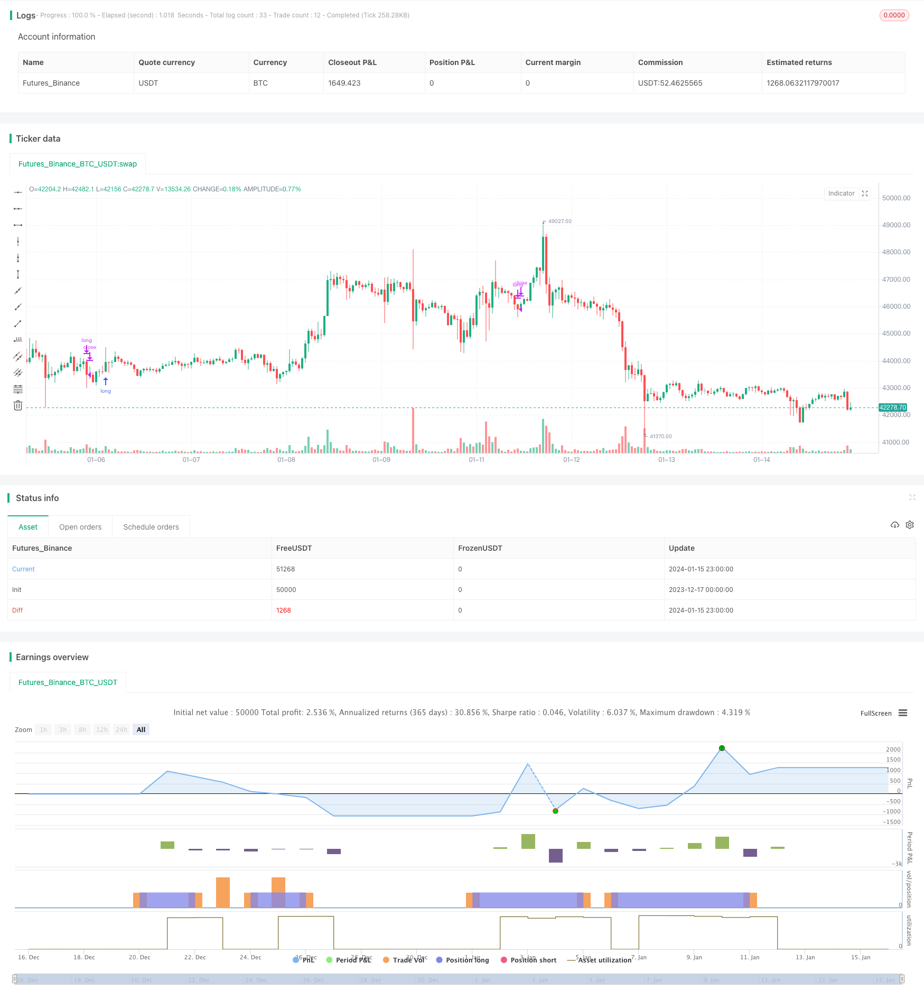

> Name

Dual-Period ATR Volatility Breakout Stock Trend StrategyVolatility-Bands-and-VWAP-Multi-Timeframe-Stock-Trend-Trading-Strategy
> Author

ChaoZhang

> Strategy Description



[trans]
This strategy calculates the ATR volatility of the price, combines it with the VWAP average price of different periods, and sets the entry and exit conditions for long positions to achieve trend-following transactions in stocks.
## Strategy Overview
This strategy is mainly used for trend tracking of stock products. By calculating the ATR volatility and combining the VWAP prices of different periods, it sets the buying and selling conditions to realize the judgment and tracking of the trend. The strategy is more flexible and can be switched between long-term and short-term, and is suitable for capturing medium and long-term trends.
## Strategy Principle
The strategy uses the ATR indicator to calculate price volatility and determines the trend direction based on whether the price breaks through the volatility channel. At the same time, VWAP prices of different periods are introduced to judge the consistency of long and short-term trends. The specific logic is as follows:
1. Calculate price’s ATR volatility channel
2. Determine whether the price breaks through the volatility channel
   1. When it breaks through the upper track, it is judged as a bullish trend.
   2. When it breaks through the lower track, it is judged as a bearish trend.
3. Introduce weekly and daily VWAP prices
   1. When the price breaks through the upper volatility track, if the daily and weekly VWAP are both above the price, a long position signal will be generated.
   2. When the price breaks through the lower volatility track, if the daily and weekly VWAP are both below the price, a short position signal will be generated.
The above is the core logic of the strategy. ATR volatility determines the short-term trend, and VWAP price determines the long-term trend. The combination of the two determines the consistency of the trend, thereby generating trading signals.
## Strategic Advantages
- Use the combination of ATR and VWAP to determine trends, which is more reliable
- Configurable ATR cycle parameters to adjust the sensitivity of the strategy
- Introducing VWAP of different periods to determine the consistency of long and short-term trends
- Flexible switching between long and short lines
- Suitable for tracking medium and long-term stock trends
## Strategy Risk and Optimization
- As a trend following strategy, more transactions will be generated during the shock adjustment phase, bringing slippage risk
- ATR and VWAP parameter settings will affect strategy performance and need to be carefully tested for different varieties.
- Consider adding a stop-loss mechanism to control single losses
- Can be combined with moving average and other indicators to filter entry signals to reduce unnecessary transactions
## Summarize
This strategy uses dual judgments of ATR volatility and VWAP to track stock trends. There is a large space for strategy optimization, and parameters can be adjusted or other technical indicators can be added to optimize signals. Generally speaking, the strategy logic is clear and easy to understand, the performance is stable, and it is suitable for tracking medium and long-term trends.
||

This strategy calculates the ATR volatility of price and combines different period VWAP to set long entry and exit conditions for stock trend trading.  

## Strategy Overview

The strategy is mainly used for trend tracking of stock products. By calculating the ATR volatility and combining VWAP prices of different periods, it sets buy and sell conditions to judge and track trends. The strategy is flexible enough to switch between long term and short term, suitable for capturing medium and long term trends.  

## Strategy Logic

The strategy uses the ATR indicator to calculate price volatility and judges the trend direction based on whether the price breaks through the volatility channel. At the same time, it introduces VWAP prices of different cycles to determine the consistency of long and short term trends. The specific logic is as follows:

1. Calculate the ATR volatility channel of the price  
2. Judge if the price breaks through the volatility channel
    1. Breaking through the upper rail indicates a bullish trend 
    2. Breaking through the lower rail indicates a bearish trend
3. Introduce weekly and daily VWAP prices
    1. When the price breaks through the upper volatility rail, if both daily and weekly VWAPs are above the price, a long signal is generated  
    2. When the price breaks through the lower volatility rail, if both daily and weekly VWAPs are below the price, a short signal is generated

The above is the core logic of the strategy. The ATR volatility judges the short-term trend and the VWAP price judges the long-term trend. The two are combined to determine the consistency of the trend and thus generate trading signals.  

## Advantages of the Strategy

- Use a combination of ATR and VWAP to judge trends, more reliable
- Customizable ATR period parameter to adjust strategy sensitivity 
- Introducing multi-timeframe VWAP to determine long and short term trend consistency
- Flexible to switch between long term and short term
- Suitable for tracking medium and long term stock trends  

## Risks and Optimization

- As a trend following strategy, it may generate more trades during consolidation, bringing slippage risks
- ATR and VWAP parameter settings impact strategy performance, require careful testing against different products  
- Consider adding stop loss to control single trade loss
- Can combine with MA and other indicators to filter entry signals and reduce unnecessary trades
   
## Summary 

The strategy realizes stock trend tracking through dual confirmation of ATR volatility and VWAP. There is ample room for optimization by adjusting parameters or incorporating other technical indicators. Overall, the strategy logic is clear and robust for tracking medium to long term trends.

[/trans]

> Strategy Arguments


|Argument|Default|Description|
|----|----|----|
|v_input_1|27|length|
|v_input_2|false|mult|
|v_input_3|true|From Day|
|v_input_4|true|From Month|
|v_input_5|2000|From Year|
|v_input_6|31|To Day|
|v_input_7|12|To Month|
|v_input_8|2021|To Year|
|v_input_9_ohlc4|0|srcX: ohlc4|high|low|open|hl2|hlc3|hlcc4|close|


> Source (PineScript)

``` pinescript
/*backtest
start: 2023-12-17 00:00:00
end: 2024-01-16 00:00:00
period: 1h
basePeriod: 15m
exchanges: [{"eid":"Futures_Binance","currency":"BTC_USDT"}]
*/

// This source code is subject to the terms of the Mozilla Public License 2.0 at https://mozilla.org/MPL/2.0/
// © exlux99

//@version=4
strategy(title="VWAP MTF STOCK STRATEGY", overlay=true )

// high^2 / 2 - low^2 -2

h=pow(high,2) / 2
l=pow(low,2) / 2

o=pow(open,2) /2
c=pow(close,2) /2


x=(h+l+o+c) / 4
y= sqrt(x)

source = y
useTrueRange = false
length = input(27, minval=1)
mult = input(0, step=0.1)
ma = sma(source, length)
range = useTrueRange ? tr : high - low
rangema = sma(range, length)
upper = ma + rangema * mult
lower = ma - rangema * mult
crossUpper = crossover(source, upper)
crossLower = crossunder(source, lower)
bprice = 0.0
bprice := crossUpper ? high+syminfo.mintick : nz(bprice[1])
sprice = 0.0
sprice := crossLower ? low -syminfo.mintick : nz(sprice[1])
crossBcond = false
crossBcond := crossUpper ? true
     : na(crossBcond[1]) ? false : crossBcond[1]
crossScond = false
crossScond := crossLower ? true
     : na(crossScond[1]) ? false : crossScond[1]
cancelBcond = crossBcond and (source < ma or high >= bprice )
cancelScond = crossScond and (source > ma or low <= sprice )

longOnly = true

fromDay = input(defval = 1, title = "From Day", minval = 1, maxval = 31)
fromMonth = input(defval = 1, title = "From Month", minval = 1, maxval = 12)
fromYear = input(defval = 2000, title = "From Year", minval = 1970)
 //monday and session 
// To Date Inputs
toDay = input(defval = 31, title = "To Day", minval = 1, maxval = 31)
toMonth = input(defval = 12, title = "To Month", minval = 1, maxval = 12)
toYear = input(defval = 2021, title = "To Year", minval = 1970)

startDate = timestamp(fromYear, fromMonth, fromDay, 00, 00)
finishDate = timestamp(toYear, toMonth, toDay, 00, 00)
time_cond = true

srcX = input(ohlc4)
t = time("W")
start = na(t[1]) or t > t[1]

sumSrc = srcX * volume
sumVol = volume
sumSrc := start ? sumSrc : sumSrc + sumSrc[1]
sumVol := start ? sumVol : sumVol + sumVol[1]

vwapW= sumSrc / sumVol

 
//crossUpper = crossover(source, upper)
//crossLower = crossunder(source, lower)
shortCondition = close < vwap and time_cond and (close < vwapW)
longCondition = close > vwap and time_cond and (close > vwapW)

 


if(longOnly and time_cond)
    if (crossLower and close < vwapW )
        strategy.close("long")
    if (crossUpper and close>vwapW)
        strategy.entry("long", strategy.long, stop=bprice)

```

> Detail

https://www.fmz.com/strategy/439088

> Last Modified

2024-01-17 16:34:23
