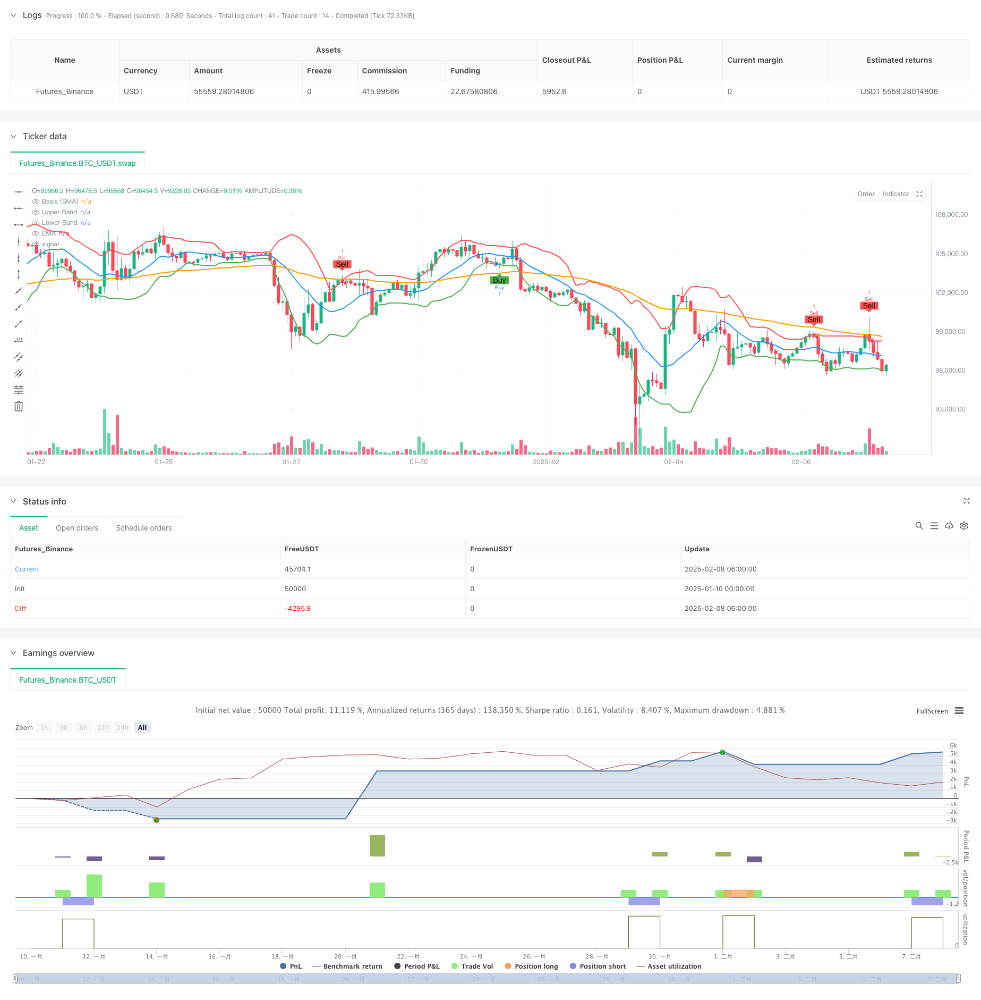

> Name

Adaptive-Bollinger-Bands-Trend-Following-Strategy-with-Multi-Level-Risk-Management-Adaptive Bollinger Bands Trend Following Strategy and Multi-Level Risk Management System
> Author

ChaoZhang

> Strategy Description



[trans]
#### Overview
This strategy is a trend following system that combines Bollinger Bands and EMA indicators to optimize trading performance through a multi-layer risk control mechanism. The core of the strategy is to use the breakout return pattern of the upper and lower Bollinger Bands to capture the market trend, and at the same time combine it with the EMA trend filter to improve the accuracy of trading. The system also includes a complete risk management system, including trailing stop loss, fixed stop loss, profit target and time-based closing mechanism.
#### Strategy Principle
The trading logic of the strategy is based on the following core elements:
1. Use Bollinger Bands with a standard deviation (STDDEV) of 1.5 and a period of 14 as the main trading signal indicator
2. When the closing price of the previous K line breaks through the upper track and the current K line reverses, a short signal is triggered.
3. When the closing price of the previous K line breaks through the lower track and the current K line strengthens, a long signal is triggered.
4. You can optionally add the 80-period EMA as a trend filter, and only open positions when the trend direction is consistent.
5. Activate trailing stop when price crosses the middle Bollinger Bands track
6. Fixed stop loss and profit target amounts can be set
7. Support automatic closing mechanism based on the number of K lines
#### Strategic Advantages
1. It combines the characteristics of trend following and reversal trading, and can perform stably in different market environments.
2. The multi-level risk control system provides a comprehensive fund management solution
3. Flexible parameter settings allow strategies to adapt to different market conditions
4. The EMA filter effectively reduces the risk of false breakthroughs
5. The trailing stop loss mechanism can effectively lock in profits
6. The time dimension liquidation mechanism avoids the risk of long-term lock-up
#### Strategy Risk
1. Frequent false breakthrough signals may occur in a volatile market
2. Fixed amount stop loss may not be suitable for all market conditions
3. EMA filtering may lead to missing some important trading opportunities
4. Trailing stops may close positions prematurely in highly volatile markets
5. Parameter optimization may lead to overfitting of historical data
#### Strategy optimization direction
1. Introduce adaptive Bollinger Band cycle and dynamically adjust according to market volatility
2. Develop a dynamic stop-loss system based on fund management
3. Add trading volume analysis to confirm the effectiveness of the breakthrough
4. Implement an intelligent parameter optimization system
5. Add a market environment identification module and use different parameter settings under different market conditions.
#### Summary
This is a well-designed trend tracking system that provides reliable trading signals through a combination of Bollinger Bands and EMA, and ensures the safety of transactions through multi-level risk control. The strategy is highly configurable and can adapt to different trading styles and market environments. Although there are some inherent risks, the stability and profitability of the strategy can be further improved through the suggested optimization directions. ||
#### Overview
This strategy is a trend-following system that combines Bollinger Bands and EMA indicators with a multi-layer risk control mechanism to optimize trading performance. The core strategy utilizes Bollinger Bands breakout-reversion patterns to capture market trends while incorporating an EMA trend filter to enhance trading accuracy. The system includes a comprehensive risk management framework with trailing stops, fixed stop losses, profit targets, and time-based position closure.

#### Strategy Principles
The trading logic is based on the following core elements:
1. Uses Bollinger Bands with 1.5 standard deviation and 14-period length as the primary trading signal indicator
2. Triggers short signals when the previous candle closes above the upper band and current candle reverses
3. Triggers long signals when the previous candle closes below the lower band and current candle turns bullish
4. Optionally applies an 80-period EMA as a trend filter, only entering positions when trend direction aligns
5. Activates trailing stops when price crosses the Bollinger Bands middle line
6. Allows setting fixed stop loss and take profit amounts
7. Supports automatic position closure based on bar count

#### Strategy Advantages
1. Combines trend-following and reversal trading characteristics for stable performance across different market conditions
2. Multi-layered risk control system provides comprehensive money management
3. Flexible parameter settings allow strategy adaptation to different market conditions
4. EMA filter effectively reduces false breakout risks
5. Trailing stop mechanism effectively locks in profits
6. Time-dimensional closure mechanism prevents long-term position trapping

#### Strategy Risks
1. May generate frequent false breakout signals in ranging markets
2. Fixed monetary stop losses may not suit all market conditions
3. EMA filtering might cause missing important trading opportunities
4. Trailing stops may close positions prematurely in highly volatile markets
5. Parameter optimization may lead to overfitting historical data

#### Strategy Optimization Directions
1. Introduce adaptive Bollinger Bands periods based on market volatility
2. Develop dynamic stop-loss system based on money management
3. Add volume analysis to confirm breakout validity
4. Implement intelligent parameter optimization system
5. Add market environment recognition module for different parameter settings in different market conditions

#### Summary
This is a well-designed trend-following system that provides reliable trading signals through the combination of Bollinger Bands and EMA, while ensuring trading safety through multi-layered risk control. The strategy offers strong configurability to adapt to different trading styles and market environments. While there are some inherent risks, the suggested optimization directions can further enhance the strategy's stability and profitability.[/trans]


> Source (PineScript)

``` pinescript
/*backtest
start: 2025-01-10 00:00:00
end: 2025-02-08 08:00:00
period: 2h
basePeriod: 2h
exchanges: [{"eid":"Futures_Binance","currency":"BTC_USDT"}]
*/

//@version=5
strategy("AI Bollinger Bands Strategy with SL, TP, and Bars Till Close", overlay=true)

// Input parameters
bb_length           = input.int(14, title="Bollinger Bands Length", minval=1)
bb_stddev           = input.float(1.5, title="Bollinger Bands Standard Deviation", minval=0.1)
use_ema             = input.bool(true, title="Use EMA Filter")
ema_length          = input.int(80, title="EMA Length", minval=1)
use_trailing_stop   = input.bool(true, title="Use Trailing Stop")
use_sl              = input.bool(true, title="Use Stop Loss")
use_tp              = input.bool(false, title="Use Take Profit")
sl_dollars          = input.float(300.0, title="Stop Loss (\$)", minval=0.0)
tp_dollars          = input.float(1000.0, title="Take Profit (\$)", minval=0.0)
use_bars_till_close = input.bool(true, title="Use Bars Till Close")
bars_till_close     = input.int(10, title="Bars Till Close", minval=1)
// New input to toggle indicator plotting
plot_indicators     = input.bool(true, title="Plot Bollinger Bands and EMA on Chart")

// Calculate Bollinger Bands and EMA
basis      = ta.sma(close, bb_length)
upper_band = basis + bb_stddev * ta.stdev(close, bb_length)
lower_band = basis - bb_stddev * ta.stdev(close, bb_length)
ema        = ta.ema(close, ema_length)

// Plot Bollinger Bands and EMA conditionally
plot(plot_indicators  ? basis : na, color=color.blue, linewidth=2, title="Basis (SMA)")
plot(plot_indicators ? upper_band : na, color=color.red, linewidth=2, title="Upper Band")
plot(plot_indicators  ? lower_band : na, color=color.green, linewidth=2, title="Lower Band")
plot(plot_indicators   ? ema   : na, color=color.orange, linewidth=2, title="EMA")

// EMA conditions
ema_long_condition  = ema > ema[1]
ema_short_condition = ema < ema[1]

// Entry conditions
sell_condition = close[1] > upper_band[1] and close[1] > open[1] and close < open
if sell_condition and (not use_ema or ema_short_condition)
    strategy.entry("Sell", strategy.short)

buy_condition = close[1] < lower_band[1] and close > open
if buy_condition and (not use_ema or ema_long_condition)
    strategy.entry("Buy", strategy.long)

// Trailing stop logic
if use_trailing_stop
    if strategy.position_size > 0 and close >= basis
        strategy.exit("Trailing Stop Long", from_entry="Buy", stop=low)
    if strategy.position_size < 0 and close <= basis
        strategy.exit("Trailing Stop Short", from_entry="Sell", stop=high)

// Stop Loss and Take Profit logic
if use_sl or use_tp
    if strategy.position_size > 0
        long_entry = strategy.position_avg_price
        long_sl    = long_entry - sl_dollars
        long_tp    = long_entry + tp_dollars
        if use_sl and close <= long_sl
            strategy.close("Buy", comment="Long SL Hit")
        if use_tp and close >= long_tp
            strategy.close("Buy", comment="Long TP Hit")
    if strategy.position_size < 0
        short_entry = strategy.position_avg_price
        short_sl    = short_entry + sl_dollars
        short_tp    = short_entry - tp_dollars
        if use_sl and close >= short_sl
            strategy.close("Sell", comment="Short SL Hit")
        if use_tp and close <= short_tp
            strategy.close("Sell", comment="Short TP Hit")

// Bars Till Close logic
var int bars_since_entry = na
if strategy.position_size != 0
    bars_since_entry := na(bars_since_entry) ? 0 : bars_since_entry + 1
else
    bars_since_entry := na

if use_bars_till_close and not na(bars_since_entry) and bars_since_entry >= bars_till_close
    strategy.close("Buy", comment="Bars Till Close Hit")
    strategy.close("Sell", comment="Bars Till Close Hit")

// Plot buy/sell signals
plotshape(sell_condition and (not use_ema or ema_short_condition), title="Sell Signal", location=location.abovebar, color=color.red, style=shape.labeldown, text="Sell")
plotshape(buy_condition and (not use_ema or ema_long_condition), title="Buy Signal", location=location.belowbar, color=color.green, style=shape.labelup, text="Buy")
```

> Detail

https://www.fmz.com/strategy/481370

> Last Modified

2025-02-10 15:14:57
