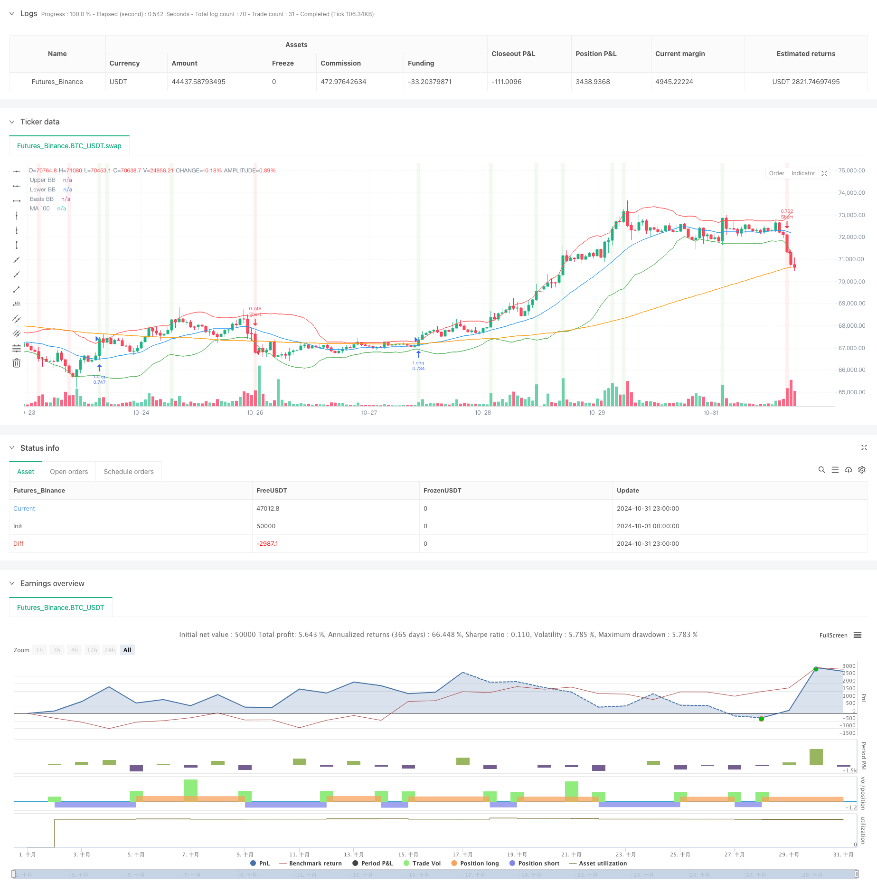

> Name

Adaptive-Bollinger-Breakout-with-Moving-Average-Quantitative-Strategy-System
> Author

ChaoZhang

> Strategy Description



[trans]
#### Overview
This strategy is a quantitative trading system that combines Bollinger Band breakthroughs and moving average trends. The strategy realizes the automatic capture of market opportunities by monitoring the relationship between price and the upper and lower rails of the Bollinger Bands, and combining the 100-day moving average as trend confirmation. The system adopts dynamic position size management and automatically adjusts the number of transactions based on account equity to achieve dynamic control of risks.
#### Strategy Principle
The core logic of the strategy is based on the following key elements:
1. Use 20-period Bollinger Bands as the volatility channel, and the standard deviation multiple is 2
2. Use the 100-day moving average as a confirmation indicator of the mid- to long-term trend
3. When the price breaks through the upper Bollinger Band and did not break through in the previous period, a long signal is triggered.
4. When the price falls below the lower Bollinger Band and has not fallen below in the previous period, a short signal is triggered.
5. Positions are dynamically calculated based on the current account equity to achieve adaptive adjustment of positions.
6. Automatically close positions when opposite signals appear to ensure timely stop loss
#### Strategic Advantages
1. Strong adaptability - Bollinger Bands can automatically adjust the channel width according to market volatility
2. Risks are controllable - ensure that risks match account size through dynamic position management
3. Trend confirmation - combined with moving average trends to improve the reliability of trading signals
4. Stop losses in time - clear position closing conditions are set to avoid excessive losses
5. Two-way trading - can capture rising and falling prices and improve capital utilization efficiency
6. Simple code - clear strategy logic, easy to maintain and optimize
#### Strategy Risk
1. A volatile market may produce frequent false breakthroughs, leading to continuous stop losses.
2. Bollinger Bands parameters are fixed and may not adapt to all market environments.
3. If a trailing stop is not set, profits may not be effectively locked in
4. The moving average period is long, which may cause signal lag.
5. Transaction costs are not taken into account, and the actual results may be lower than the backtest results.
#### Strategy optimization direction
1. Add volatility filter to reduce trading frequency in low volatility environment
2. Introduce a dynamic stop loss mechanism and adjust the stop loss position according to market volatility
3. To optimize Bollinger Band parameters, consider using adaptive cycles
4. Add filter conditions such as trading volume and position holding time
5. Add more technical indicators as auxiliary confirmation
6. Consider setting a maximum drawdown limit to enhance risk control
#### Summary
This strategy builds a complete quantitative trading system by combining Bollinger Bands and moving averages. While keeping the logic simple, the system implements core functions such as signal generation, position management and risk control. Although there are some areas that need to be optimized, the overall design is reasonable and has practical application value. It is recommended that sufficient parameter optimization and backtest verification be carried out before real use, and targeted adjustments should be made according to specific market characteristics. ||
#### Overview
This strategy is a quantitative trading system that combines Bollinger Bands breakout with moving average trends. The system automatically captures market opportunities by monitoring price relationships with Bollinger Bands while using a 100-day moving average for trend confirmation. It implements dynamic position sizing based on account equity for automatic risk management.

#### Strategy Principles
The core logic is based on the following key elements:
1. Uses 20-period Bollinger Bands as volatility channels with 2 standard deviations
2. Employs 100-day moving average as medium to long-term trend confirmation
3. Generates long signals when price breaks above the upper band and wasn't above in the previous period
4. Generates short signals when price breaks below the lower band and wasn't below in the previous period
5. Calculates position size dynamically based on current account equity
6. Automatically closes positions on contrary signals for timely risk management

#### Strategy Advantages
1. High Adaptability - Bollinger Bands automatically adjust channel width based on market volatility
2. Controlled Risk - Dynamic position sizing ensures risk matches account size
3. Trend Confirmation - Integration with moving average improves signal reliability
4. Timely Stop Loss - Clear exit conditions prevent excessive losses
5. Bilateral Trading - Captures both upward and downward trends for improved capital efficiency
6. Clean Code - Clear strategy logic for easy maintenance and optimization

#### Strategy Risks
1. False breakouts in ranging markets may lead to consecutive losses
2. Fixed Bollinger Bands parameters may not suit all market conditions
3. Lack of trailing stops may fail to lock in profits effectively
4. Long moving average period may result in delayed signals
5. Trading costs not considered, live performance may differ from backtests

#### Optimization Directions
1. Add volatility filters to reduce trading frequency in low volatility environments
2. Implement dynamic stop-loss mechanisms based on market volatility
3. Optimize Bollinger Bands parameters with adaptive periods
4. Add volume and holding time filters
5. Include additional technical indicators for signal confirmation
6. Set maximum drawdown limits for enhanced risk control

#### Summary
This strategy builds a complete quantitative trading system by combining Bollinger Bands and moving averages. While maintaining simple logic, it implements core functionalities including signal generation, position management, and risk control. Though there are areas for optimization, the overall design is sound and has practical application value. It's recommended to thoroughly optimize parameters and validate through backtesting before live implementation, with adjustments made according to specific market characteristics.[/trans]


> Source (PineScript)

``` pinescript
/*backtest
start: 2024-10-01 00:00:00
end: 2024-10-31 23:59:59
period: 1h
basePeriod: 1h
exchanges: [{"eid":"Futures_Binance","currency":"BTC_USDT"}]
*/

//@version=5
strategy("BB Breakout with MA 100 Strategy", overlay=true)

// Parameter Bollinger Bands
length = input(20, title="BB Length")
stdDev = input(2.0, title="BB Standard Deviation")

// Hitung Bollinger Bands
basis = ta.sma(close, length)
dev = stdDev * ta.stdev(close, length)
upperBB = basis + dev
lowerBB = basis - dev

// Hitung Moving Average 100
ma100 = ta.sma(close, 100)

// Logika untuk sinyal beli dan jual
longCondition = close > upperBB and close[1] <= upperBB[1]
shortCondition = close < lowerBB and close[1] >= lowerBB[1]

// Menentukan ukuran posisi (jumlah lot)
size = strategy.equity / close // Menentukan ukuran posisi berdasarkan ekuitas saat ini

// Eksekusi order
if (longCondition)
    strategy.entry("Long", strategy.long, qty=size)

if (shortCondition)
    strategy.entry("Short", strategy.short, qty=size)

// Menutup posisi ketika kondisi terbalik
if (longCondition and strategy.position_size < 0)
    strategy.close("Short")

if (shortCondition and strategy.position_size > 0)
    strategy.close("Long")

// Plotting
plot(upperBB, color=color.red, title="Upper BB")
plot(lowerBB, color=color.green, title="Lower BB")
plot(basis, color=color.blue, title="Basis BB")
plot(ma100, color=color.orange, title="MA 100")

// Menambahkan informasi ke grafik
bgcolor(longCondition ? color.new(color.green, 90) : na, title="Buy Signal Background")
bgcolor(shortCondition ? color.new(color.red, 90) : na, title="Sell Signal Background")

```

> Detail

https://www.fmz.com/strategy/473140

> Last Modified

2024-11-27 15:55:28
