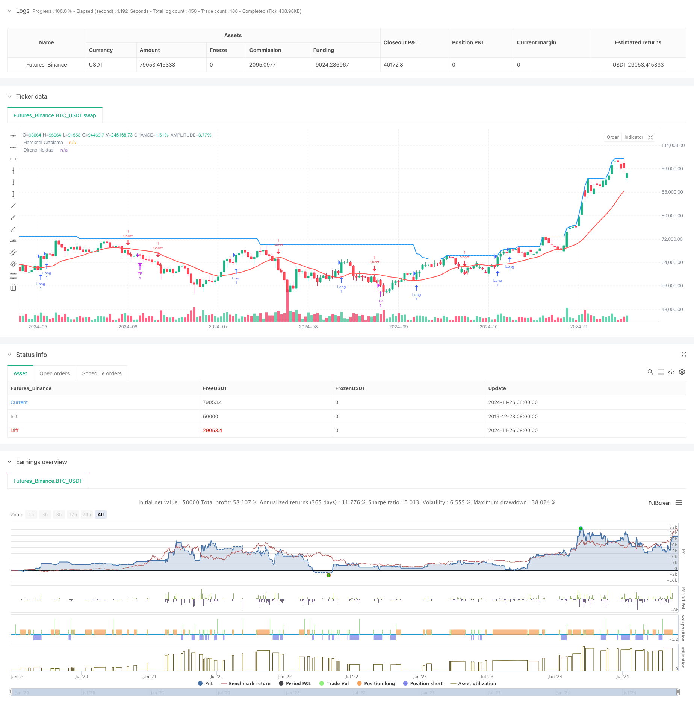

> Name

Adaptive-FVG-Detection-and-MA-Trend-Trading-Strategy-with-Dynamic-Resistance-A dynamic resistance trading strategy based on Adaptive-FVG-Detection-and-MA-Trend-Trading-Strategy-with-Dynamic-Resistance
> Author

ChaoZhang

> Strategy Description



[trans]
#### Overview
This strategy is a comprehensive trading system that combines fair value gap (FVG) detection, moving average trend judgment and dynamic resistance levels. The strategy works by identifying FVG formations on different time frames, combined with the moving average trend direction, to trade when reversal signals occur. The system also includes dynamic stop loss and profit target setting based on historical highs.
#### Strategy Principle
The core logic of the strategy includes the following key parts:
1. FVG Detection: Detects long and short fair value gaps within a specified time frame (default 1 hour)
2. Trend judgment: Use the 20-period moving average to judge the market trend direction.
3. Reversal confirmation: Determine market reversal signals through candlestick patterns
4. Dynamic Resistance: Use recent highs as resistance levels and profit targets
5. Risk management: Use percentage stop loss protection strategy
#### Strategic Advantages
1. Multi-dimensional analysis: combines price patterns, trends and market structure
2. Strong adaptability: able to adjust parameters in different market environments
3. Controllable risk: with clear stop loss and profit settings
4. Visual support: Provide graphic display of FVG area and key price points
5. Logically complete: a complete trading system including entry, exit and risk management
#### Strategy Risk
1. Time frame dependence: Different time frames may produce conflicting signals
2. Market fluctuations: Severe fluctuations may lead to too frequent stop losses
3. Parameter sensitivity: Parameter settings have a greater impact on strategy performance
4. Trend dependence: May perform poorly in volatile markets
5. Signal lag: the moving average has a certain lag
#### Strategy optimization direction
1. Introduce volatility adaptive: adjust stop loss and profit targets according to market fluctuations
2. Add filter conditions: add trading volume or other technical indicators for confirmation
3. Optimize time frames: test the effects of different time frame combinations
4. Improve trend judgment: use multiple moving averages or other trend indicators
5. Improve reversal confirmation: add more pattern recognition methods
#### Summary
This is a comprehensive strategy that combines multiple trading concepts to find high-probability trading opportunities through the combination of FVG, trends and price patterns. The advantage of the strategy is that it is highly systematic and has controllable risks, but it requires attention to parameter optimization and adaptability to the market environment. There is room for further improvement of the strategy through the suggested optimization directions. ||
#### Overview
This strategy is a comprehensive trading system that combines Fair Value Gap (FVG) detection, moving average trend determination, and dynamic resistance levels. The strategy identifies FVG formation across different timeframes, integrates moving average trend direction, and executes trades upon reversal signals. The system also includes dynamic stop-loss and profit targets based on historical highs.

#### Strategy Principles
The core logic includes the following key components:
1. FVG Detection: Identifies bullish and bearish fair value gaps within specified timeframes (default 1 hour)
2. Trend Determination: Uses 20-period moving average to assess market trend direction
3. Reversal Confirmation: Evaluates market reversal signals through candlestick patterns
4. Dynamic Resistance: Utilizes recent highs as resistance levels and profit targets
5. Risk Management: Implements percentage-based stop-loss protection

#### Strategy Advantages
1. Multi-dimensional Analysis: Combines price patterns, trends, and market structure
2. High Adaptability: Can adjust parameters in different market environments
3. Controlled Risk: Features clear stop-loss and profit targets
4. Visual Support: Provides graphical display of FVG zones and key price levels
5. Complete Logic: Includes a comprehensive system for entry, exit, and risk management

#### Strategy Risks
1. Timeframe Dependency: Different timeframes may generate conflicting signals
2. Market Volatility: Severe fluctuations may trigger frequent stop-losses
3. Parameter Sensitivity: Strategy performance heavily depends on parameter settings
4. Trend Dependency: May underperform in ranging markets
5. Signal Lag: Moving averages have inherent lag

#### Strategy Optimization Directions
1. Introduce Volatility Adaptation: Adjust stop-loss and profit targets based on market volatility
2. Add Filtering Conditions: Include volume or other technical indicators for confirmation
3. Optimize Timeframes: Test different timeframe combinations for effectiveness
4. Improve Trend Determination: Use multiple moving averages or other trend indicators
5. Enhance Reversal Confirmation: Incorporate additional pattern recognition methods

#### Summary
This is a comprehensive strategy that integrates multiple trading concepts, seeking high-probability trading opportunities through the combination of FVG, trends, and price patterns. The strategy's strengths lie in its systematic approach and risk control, but attention must be paid to parameter optimization and market environment adaptability. Through the suggested optimization directions, there is room for further strategy improvement.
[/trans]


> Source (PineScript)

``` pinescript
/*backtest
start: 2019-12-23 08:00:00
end: 2024-11-27 08:00:00
period: 1d
basePeriod: 1d
exchanges: [{"eid":"Futures_Binance","currency":"BTC_USDT"}]
*/

//@version=5
strategy("SMC FVG Entry Strategy with Retest", overlay=true)

// Parametreler
stopLossPercent = input(2, title="Stop Loss (%)") / 100
lookbackPeriod = input(50, title="Güçlü Direnç İçin Geriye Dönük Süre")
fvgLength = input.timeframe("60", title="FVG Zaman Dilimi")  // 1 saatlik zaman dilimi
maPeriod = input(20, title="MA Dönemi")  // Trend yönü için MA dönemi

// FVG'leri Hesapla
var float fvgLow = na
var float fvgHigh = na
var bool fvgFilled = false

// Seçilen zaman diliminde FVG'leri kontrol et
if (ta.change(time(fvgLength)))
    bull_fvg = low > high[2] and close[1] > high[2]
    bear_fvg = high < low[2] and close[1] < low[2]
    
    if (bull_fvg)
        fvgLow := low[2]
        fvgHigh := high
        fvgFilled := true
    else if (bear_fvg)
        fvgLow := low
        fvgHigh := high[2]
        fvgFilled := true

// Trend Yönü Kontrolü (MA kullanarak)
ma = ta.sma(close, maPeriod)
trendUp = close > ma
trendDown = close < ma

// Dönüş Mumu Kontrolü
bullishReversal = close > open and close[1] < open[1] and fvgFilled and close > fvgHigh
bearishReversal = close < open and close[1] > open[1] and fvgFilled and close < fvgLow

// İlk güçlü direnç noktası
resistanceLevel = ta.highest(high, lookbackPeriod)

// Giriş Koşulları
if (bullishReversal and trendUp)
    entryPrice = close
    stopLoss = entryPrice * (1 - stopLossPercent)
    takeProfit = resistanceLevel
    strategy.entry("Long", strategy.long)
    strategy.exit("TP", "Long", limit=takeProfit, stop=stopLoss)

if (bearishReversal and trendDown)
    entryPrice = close
    stopLoss = entryPrice * (1 + stopLossPercent)
    takeProfit = resistanceLevel
    strategy.entry("Short", strategy.short)
    strategy.exit("TP", "Short", limit=takeProfit, stop=stopLoss)

// FVG'leri Grafik Üzerinde Göster
// if (fvgFilled)
//     var box fvgBox = na
//     if (na(fvgBox))
//         fvgBox := box.new(left=bar_index[1], top=fvgHigh, bottom=fvgLow, right=bar_index, bgcolor=color.new(color.green, 90), border_color=color.green)
//     else
//         box.set_top(fvgBox, fvgHigh)
//         box.set_bottom(fvgBox, fvgLow)
//         box.set_left(fvgBox, bar_index[1])
//         box.set_right(fvgBox, bar_index)

// Direnç Noktasını Göster
plot(resistanceLevel, color=color.blue, title="Direnç Noktası", linewidth=2)
plot(ma, color=color.red, title="Hareketli Ortalama", linewidth=2)

```

> Detail

https://www.fmz.com/strategy/473346

> Last Modified

2024-11-29 14:50:09
