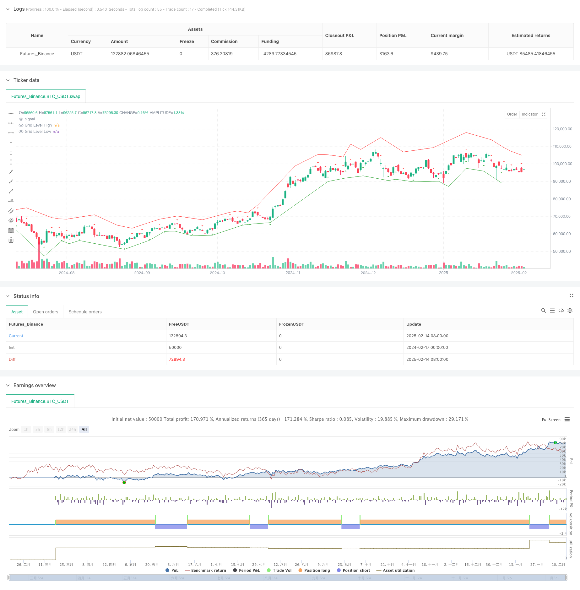

> Name

Adaptive-Fractal-Grid-Scalping-Strategy-with-Volatility-Threshold-Optimization-System
> Author

ChaoZhang

> Strategy Description



[trans]
#### Overview
This strategy is a short-term trading system based on fractal theory and adaptive grid, combined with a volatility threshold to optimize trading timing. By dynamically adjusting grid levels, the system captures changes in market microstructure during periods of high volatility while avoiding over-trading during periods of low volatility. The strategy integrates multiple technical indicators, including average true range (ATR), simple moving average (SMA) and fractal breakout points, to build a comprehensive trading decision-making framework.
#### Strategy Principle
The core of the strategy is to build a dynamic trading grid through fractal identification and volatility clustering. The specific implementation includes the following key steps:
1. Use Pivot High and Pivot Low to identify local extreme points as fractal breakout signals
2. Use the ATR indicator to measure market volatility and set the minimum fluctuation threshold as a trading trigger condition.
3. Dynamically adjust grid levels based on ATR value and user-defined multiplier
4. Use SMA to determine the trend direction and provide directional bias for trading decisions.
5. Set a limit order at the grid level and adjust the stop loss and profit points based on the ATR value
#### Strategic Advantages
1. Strong adaptability - the grid level will automatically adjust according to market volatility to adapt to different market environments
2. Improved risk control - Integrated volatility threshold and trailing stop loss mechanism to effectively control risks
3. Accurate trading opportunities - improve trading quality through double confirmation of fractal breakthroughs and trend directions
4. Visual support - Provides graphical display of fractal points and grid levels for easy monitoring
5. Flexible parameters - allows traders to adjust various parameters according to personal risk preferences and market conditions
#### Strategy Risk
1. Parameter sensitivity - different parameter combinations may lead to large differences in strategy performance, which needs to be fully tested
2. Dependence on market conditions - reduced trading opportunities may occur in markets with extremely low volatility
3. Risk of false breakthrough - Fractal breakthrough signals may have false breakthroughs and need to be confirmed with other indicators
4. Impact of slippage - Slippage may be encountered when executing limit orders, which affects the actual execution effect.
5. Fund management requirements - it is necessary to set up a reasonable amount of funds to avoid excessive risk taking
#### Strategy optimization direction
1. Introduce more technical indicators - consider adding RSI, MACD and other indicators for signal confirmation
2. Optimize the stop loss mechanism - more complex dynamic stop loss algorithms can be developed to improve risk control efficiency
3. Improve volatility models - consider using more advanced volatility prediction models, such as GARCH family models
4. Add market environment filtering - add market environment identification module and use different parameters in different market stages
5. Develop an adaptive parameter system - realize automatic optimization of parameters and improve strategy adaptability
#### Summary
This is a comprehensive strategy system that combines fractal theory, grid trading and volatility filtering. Through the combined use of multiple technical indicators, the market microstructure can be effectively captured. The advantage of the strategy lies in its adaptability and risk control capabilities, but it also requires attention to parameter optimization and market environment adaptability. Through continuous optimization and improvement, this strategy is expected to maintain stable performance in different market environments.
|| 

#### Overview
This strategy is a scalping system based on fractal theory and adaptive grid, combined with volatility threshold for trade timing optimization. The system dynamically adjusts grid levels to capture market microstructure changes during high volatility periods while avoiding overtrading during low volatility periods. The strategy integrates multiple technical indicators, including Average True Range (ATR), Simple Moving Average (SMA), and fractal breakout points, building a comprehensive trading decision framework.

#### Strategy Principles
The core of the strategy lies in establishing dynamic trading grids through fractal identification and volatility clustering. The specific implementation includes the following key steps:
1. Using Pivot High and Pivot Low to identify local extremes as fractal breakout signals
2. Utilizing ATR indicator to measure market volatility and setting minimum volatility threshold as trading trigger
3. Dynamically adjusting grid levels based on ATR values and user-defined multipliers
4. Using SMA to determine trend direction, providing directional bias for trading decisions
5. Setting limit orders at grid levels and adjusting stop-loss and take-profit points based on ATR values

#### Strategy Advantages
1. Strong Adaptability - Grid levels automatically adjust according to market volatility, adapting to different market environments
2. Comprehensive Risk Control - Integrates volatility threshold and trailing stop mechanism for effective risk management
3. Precise Trading Opportunities - Uses dual confirmation of fractal breakouts and trend direction to improve trade quality
4. Visual Support - Provides graphical display of fractal points and grid levels for easy monitoring
5. Parameter Flexibility - Allows traders to adjust parameters according to personal risk preferences and market conditions

#### Strategy Risks
1. Parameter Sensitivity - Different parameter combinations may lead to significant performance variations, requiring thorough testing
2. Market Environment Dependency - May experience reduced trading opportunities in extremely low volatility markets
3. False Breakout Risk - Fractal breakout signals may produce false breakouts, requiring confirmation from other indicators
4. Slippage Impact - May encounter slippage when executing limit orders, affecting actual execution results
5. Capital Management Requirements - Requires appropriate sizing of positions to avoid excessive risk exposure

#### Strategy Optimization Directions
1. Introduce More Technical Indicators - Consider adding RSI, MACD, etc. for signal confirmation
2. Optimize Stop-Loss Mechanism - Develop more sophisticated dynamic stop-loss algorithms to improve risk control efficiency
3. Enhance Volatility Model - Consider using more advanced volatility prediction models, such as GARCH family models
4. Add Market Environment Filters - Implement market environment recognition module to use different parameters in different market phases
5. Develop Adaptive Parameter System - Implement automatic parameter optimization to improve strategy adaptability

#### Summary
This is a comprehensive strategy system combining fractal theory, grid trading, and volatility filtering. Through the coordinated use of multiple technical indicators, it achieves effective capture of market microstructure. The strategy's strengths lie in its adaptability and risk control capabilities, while attention needs to be paid to parameter optimization and market environment adaptability. Through continuous optimization and improvement, the strategy has the potential to maintain stable performance across different market environments.
[/trans]


> Source (PineScript)

``` pinescript
/*backtest
start: 2024-02-17 00:00:00
end: 2025-02-15 08:00:00
period: 1d
basePeriod: 1d
exchanges: [{"eid":"Futures_Binance","currency":"BTC_USDT"}]
*/

//@version=6
strategy("Adaptive Fractal Grid Scalping Strategy", overlay=true)

// Inputs
atrLength = input.int(14, title="ATR Length")
smaLength = input.int(50, title="SMA Length")
gridMultiplierHigh = input.float(2.0, title="Grid Multiplier High")
gridMultiplierLow = input.float(0.5, title="Grid Multiplier Low")
trailStopMultiplier = input.float(0.5, title="Trailing Stop Multiplier")
volatilityThreshold = input.float(1.0, title="Volatility Threshold (ATR)")

// Calculate Fractals
fractalHigh = ta.pivothigh(high, 2, 2)
fractalLow = ta.pivotlow(low, 2, 2)

// Calculate ATR and SMA
atrValue = ta.atr(atrLength)
smaValue = ta.sma(close, smaLength)

// Determine Trend Direction
isBullish = close > smaValue
isBearish = close < smaValue

// Calculate Grid Levels
gridLevelHigh = fractalHigh + atrValue * gridMultiplierHigh
gridLevelLow = fractalLow - atrValue * gridMultiplierLow

// Plot Fractals and Grid Levels
plotshape(not na(fractalHigh), style=shape.triangledown, location=location.abovebar, color=color.red, size=size.small)
plotshape(not na(fractalLow), style=shape.triangleup, location=location.belowbar, color=color.green, size=size.small)
plot(gridLevelHigh, color=color.red, linewidth=1, title="Grid Level High")
plot(gridLevelLow, color=color.green, linewidth=1, title="Grid Level Low")

// Trade Execution Logic with Volatility Threshold
if (atrValue > volatilityThreshold)
    if (isBullish and not na(fractalLow))
        strategy.entry("Buy", strategy.long, limit=gridLevelLow)
    if (isBearish and not na(fractalHigh))
        strategy.entry("Sell", strategy.short, limit=gridLevelHigh)

// Profit-Taking and Stop-Loss
strategy.exit("Take Profit/Stop Loss", "Buy", limit=gridLevelHigh, stop=fractalLow - atrValue * trailStopMultiplier)
strategy.exit("Take Profit/Stop Loss", "Sell", limit=gridLevelLow, stop=fractalHigh + atrValue * trailStopMultiplier)
```

> Detail

https://www.fmz.com/strategy/482240

> Last Modified

2025-02-17 10:47:58
