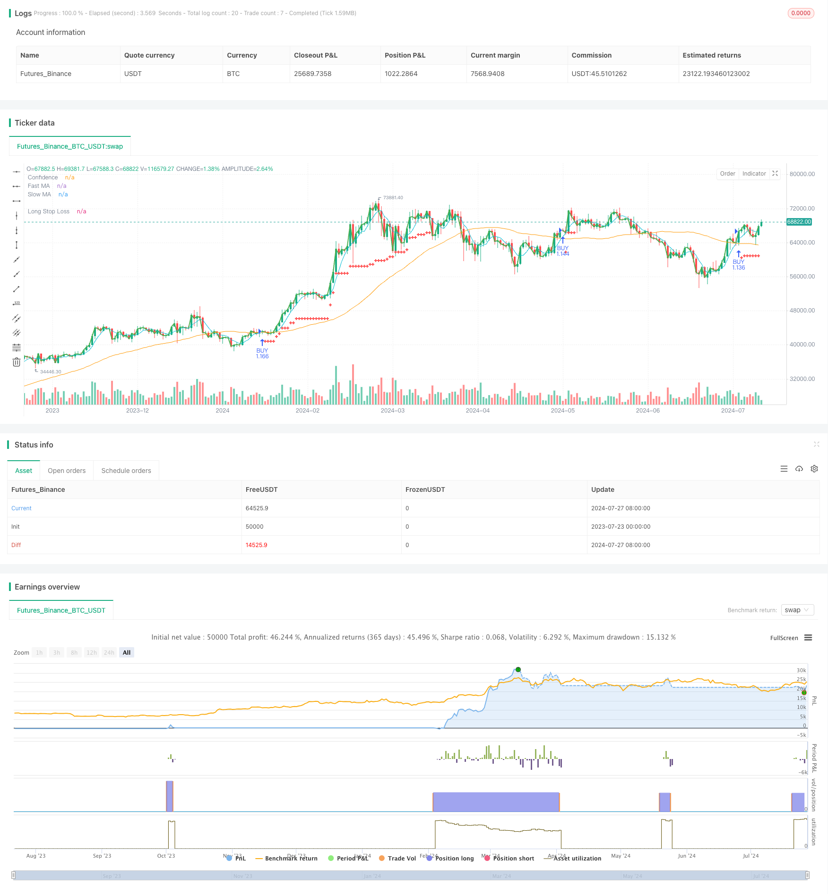

> Name

Adaptive-Moving-Average-Crossover-with-Trailing-Stop-Loss-Strategy
> Author

ChaoZhang

> Strategy Description



[trans]
#### Overview
The adaptive moving average cross-trailing stop-loss strategy is a quantitative trading strategy that combines multiple technical indicators. The strategy is primarily based on trading fast and slow Simple Moving Average (SMA) crossover signals, while utilizing adaptive trailing stops to manage risk. The strategy also incorporates advanced features such as volatility-based position sizing and adaptive stop loss levels to improve its adaptability and robustness under different market conditions.
#### Strategy Principle
The core logic of this strategy includes the following key components:
1. Moving average crossover: Use two simple moving averages (SMA) with different periods, namely fast SMA (default 5 periods) and slow SMA (default 50 periods). When the fast SMA crosses the slow SMA upward, a long signal is triggered.
2. Position sizing: The strategy uses a dynamic position sizing method based on account balance and current price. At the same time, a "confidence" factor is introduced, which can adjust the proportion of investment funds.
3. Trailing Stop: Implement a percentage-based trailing stop mechanism. Stop loss levels move upward as price rises to lock in profits and limit drawdowns.
4. Adaptive feature: If the "fancy_tests" option is enabled, the strategy will use a dynamic stop loss percentage based on standard deviation, allowing the stop loss level to be adaptively adjusted based on market volatility.
5. Exit logic: The strategy mainly relies on trailing stop loss to close positions, and does not set a fixed profit-taking point.
#### Strategic Advantages
1. Trend following: By using moving average crossovers, the strategy can capture medium and long-term trends, which is conducive to obtaining considerable profits in strong trends.
2. Risk management: The use of a trailing stop loss mechanism can not only effectively control downside risks, but also allow profits to grow freely.
3. Adaptability: By incorporating volatility factors to adjust the stop loss level, the strategy can better adapt to different market environments.
4. Fund management: Dynamic position sizing helps increase transaction size as the account grows, while also automatically reducing risk exposure when the account shrinks.
5. Flexibility: The strategy provides multiple adjustable parameters, such as moving average period, stop loss percentage, etc. Users can optimize according to different markets and personal risk preferences.
#### Strategy Risk
1. False breakthroughs: In sideways or volatile markets, false breakthroughs of the moving average may occur frequently, leading to multiple stop-loss exits.
2. Lagging: The moving average is essentially a lagging indicator and may not react quickly enough in a volatile market.
3. Excessive trading: If parameters are set improperly, it may lead to frequent entry and exit and increase transaction costs.
4. Retracement risk: Although there is a trailing stop, you may still face a large retracement in a rapidly reversing market.
5. One-way trading: The strategy is currently only long and not short. You may miss opportunities or suffer losses in a downward trend.
#### Strategy optimization direction
1. Multi-time frame analysis: Introduce longer-term trend judgment indicators, such as longer-period moving averages, to reduce false signals.
2. Add short-selling logic: expand the strategy to support short-selling transactions, improve the comprehensiveness of the strategy and profit opportunities.
3. Optimize entry timing: Consider combining other technical indicators (such as RSI, MACD, etc.) to filter trading signals and improve entry accuracy.
4. Dynamic parameter optimization: Implement an adaptive parameter adjustment mechanism, such as dynamically adjusting the moving average cycle based on market volatility.
5. Add a profit-taking mechanism: In addition to trailing stop loss, you can consider adding profit-taking rules based on technical indicators or fixed targets.
6. Improve position management: implement more complex position sizing strategies, such as based on the Kelly criterion or other risk parity methods.
7. Add fundamental filtering: For stock trading, consider introducing fundamental indicators as additional trading filtering conditions.
#### Summarize
The adaptive moving average cross-tracing stop loss strategy is a comprehensive strategy that combines multiple quantitative trading concepts. It captures trends through moving average crossovers, manages risk with trailing stops, and improves adaptability through dynamic parameter adjustments. Although there are some inherent risks and limitations, with careful parameter optimization and further strategy improvements, it has the potential to become a robust trading system. The modular design of the strategy also provides a good foundation for future expansion and optimization. This strategy provides a great starting point for traders looking to make steady gains in trending markets while focusing on risk management.
|| 

#### Overview

The Adaptive Moving Average Crossover with Trailing Stop-Loss Strategy is a quantitative trading approach that combines multiple technical indicators. This strategy primarily relies on crossover signals between fast and slow Simple Moving Averages (SMA) for trade entries, while employing an adaptive trailing stop-loss for risk management. The strategy also incorporates advanced features such as volatility-based position sizing and adaptive stop-loss levels to enhance its adaptability and robustness across various market conditions.

#### Strategy Principles

The core logic of this strategy includes the following key components:

1. Moving Average Crossover: Utilizes two Simple Moving Averages (SMA) with different periods - a fast SMA (default 5 periods) and a slow SMA (default 50 periods). A long entry signal is triggered when the fast SMA crosses above the slow SMA.

2. Position Sizing: The strategy employs a dynamic position sizing method based on account balance and current price. It also introduces a "confidence" factor that can adjust the proportion of capital invested.

3. Trailing Stop-Loss: Implements a percentage-based trailing stop-loss mechanism. The stop-loss level moves up as the price increases, locking in profits and limiting drawdowns.

4. Adaptive Features: If the "fancy_tests" option is enabled, the strategy uses a dynamic stop-loss percentage based on standard deviation, allowing the stop-loss level to adapt to market volatility.

5. Exit Logic: The strategy primarily relies on the trailing stop-loss for position closure, without setting fixed take-profit points.

#### Strategy Advantages

1. Trend Following: By using moving average crossovers, the strategy can capture medium to long-term trends, beneficial for substantial gains in strong trending markets.

2. Risk Management: The trailing stop-loss mechanism effectively controls downside risk while allowing profits to run.

3. Adaptability: By incorporating volatility factors to adjust stop-loss levels, the strategy can better adapt to different market environments.

4. Capital Management: Dynamic position sizing helps increase trade size as the account grows and automatically reduces risk exposure during account drawdowns.

5. Flexibility: The strategy offers multiple adjustable parameters, such as moving average periods and stop-loss percentages, allowing users to optimize based on different markets and personal risk preferences.

#### Strategy Risks

1. False Breakouts: In ranging or choppy markets, frequent false breakouts of moving averages may occur, leading to multiple stop-loss exits.

2. Lag: Moving averages are inherently lagging indicators, which may not react quickly enough in highly volatile markets.

3. Overtrading: Improper parameter settings may result in frequent entries and exits, increasing transaction costs.

4. Drawdown Risk: Despite the trailing stop-loss, the strategy may still face significant drawdowns in rapidly reversing markets.

5. Unidirectional Trading: The strategy currently only takes long positions, potentially missing opportunities or incurring losses in downtrends.

#### Strategy Optimization Directions

1. Multi-Timeframe Analysis: Introduce longer-term trend indicators, such as longer-period moving averages, to reduce false signals.

2. Add Short Selling Logic: Extend the strategy to support short trades, improving comprehensiveness and profit opportunities.

3. Optimize Entry Timing: Consider combining other technical indicators (e.g., RSI, MACD) to filter trade signals and improve entry accuracy.

4. Dynamic Parameter Optimization: Implement adaptive parameter adjustment mechanisms, such as dynamically adjusting moving average periods based on market volatility.

5. Introduce Profit-Taking Mechanism: In addition to trailing stops, consider adding take-profit rules based on technical indicators or fixed targets.

6. Improve Position Management: Implement more sophisticated position sizing strategies, such as those based on the Kelly Criterion or other risk parity methods.

7. Add Fundamental Filters: For stock trading, consider incorporating fundamental indicators as additional trade filtering conditions.

#### Conclusion

The Adaptive Moving Average Crossover with Trailing Stop-Loss Strategy is a comprehensive approach that integrates multiple quantitative trading concepts. It captures trends through moving average crossovers, manages risk using trailing stops, and enhances adaptability through dynamic parameter adjustments. While inherent risks and limitations exist, careful parameter optimization and further strategy improvements could potentially transform it into a robust trading system. The strategy's modular design also provides a solid foundation for future expansions and optimizations. For traders seeking consistent returns in trending markets while emphasizing risk management, this strategy offers an excellent starting point.

[/trans]


> Source (PineScript)

``` pinescript
/*backtest
start: 2023-07-23 00:00:00
end: 2024-07-28 00:00:00
period: 1d
basePeriod: 1h
exchanges: [{"eid":"Futures_Binance","currency":"BTC_USDT"}]
*/

// This Pine Script™ code is subject to the terms of the Mozilla Public License 2.0 at https://mozilla.org/MPL/2.0/
// © chinmay.hundekari

//@version=5
//@version=5
strategy("test", overlay = true)

// Calculate two moving averages with different lengths.
SLMA = input.int(50,"SMA",minval=10,step=1)
FSMA = input.int(5,"SMA",minval=1,step=1)
fancy_tests = input.bool(true,"Enable Fancy Changes")
longLossPerc = input.float(2, title="Trailing Stop Loss (%)",
     minval=0.0, step=0.1) * 0.01
stdMult = input.float(2.0, title="Standard Deviation Multiplier",
     minval=0.0, step=0.01)

float fastMA = ta.sma(close, FSMA)
float slowMA = ta.sma(close, SLMA)
float closMA = ta.sma(close, 25)

confidence = 1.0
if (fancy_tests)
    longLossPerc := stdMult * ta.stdev(ohlc4, 20)/close
balance = strategy.initial_capital + strategy.netprofit
balanceInContracts = balance* confidence/close

// Enter a long position when `fastMA` crosses over `slowMA`.
if ta.crossover(fastMA, slowMA)
    strategy.entry("BUY", strategy.long, qty=balanceInContracts)
//longStopPrice  = strategy.position_avg_price * (1 - longLossPerc)
//Trailing Stop loss Code
longStopPrice = 0.0
percLoss = longLossPerc
longStopPrice := if strategy.position_size > 0
    //if (strategy.openprofit_percent/100.0 > longLossPerc)
    //    percLoss := math.min(strategy.openprofit_percent/200.0, longLossPerc)
    stopValue = close * (1 - percLoss)
    math.max(stopValue, longStopPrice[1])
else
    0
if strategy.position_size > 0
    strategy.exit("STP", stop=longStopPrice)
plot(strategy.position_size > 0 ? longStopPrice : na,
     color=color.red, style=plot.style_cross,
     linewidth=2, title="Long Stop Loss")
// Enter a short position when `fastMA` crosses under `slowMA`.
//if ta.crossunder(fastMA, closMA)
//    strategy.close_all("SEL")//strategy.entry("sell", strategy.short)

// Plot the moving averages.
plot(fastMA, "Fast MA", color.aqua)
plot(slowMA, "Slow MA", color.orange)
plot((confidence)*(close), "Confidence", color=color.green, linewidth=2)

```

> Detail

https://www.fmz.com/strategy/458043

> Last Modified

2024-07-29 14:27:58
