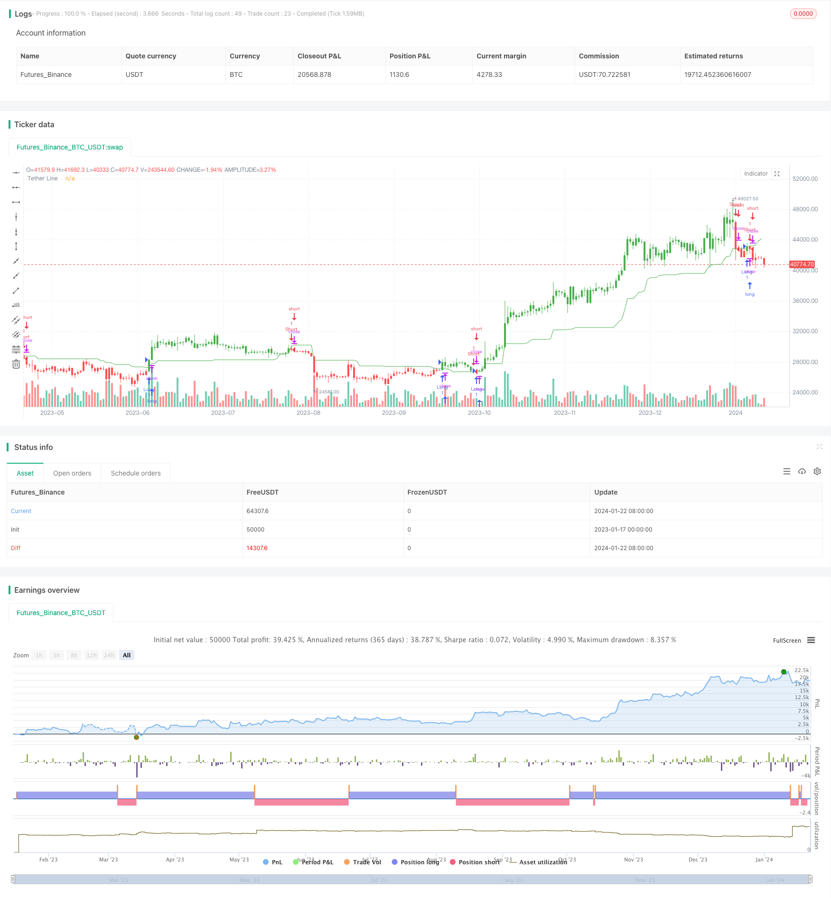

> Name

A trend tracking strategy based on moving average Adaptive-Moving-Average-Tracking-Strategy
> Author

ChaoZhang

> Strategy Description


 [trans]

## Overview
The adaptive moving average tracking strategy is a trend following strategy based on moving averages. This strategy takes advantage of the characteristics of stock prices fluctuating around the average price line, and generates a moving average by calculating the average of the highest and lowest prices in different periods, and uses this moving average as a buy and sell signal. Trading signals are generated when the price is above or below the moving average. This strategy is suitable for medium and long-term trend trading.
## Strategy Principle
The core indicator of the adaptive moving average tracking strategy is the moving average xTether calculated based on the input period Length parameter. This moving average is the average of the highest price upper and the lowest price lower in the past Length period. When the price is below this moving average, it is a bearish signal, and when the price is above this moving average, it is a bullish signal. The strategy determines whether to hold a long or short position based on the relationship between price and the moving average. At the same time, this strategy has the function of switching the long and short directions.
Specifically, this strategy is mainly implemented through the following steps:
1. Enter the period parameter Length, the default is 50 days, which is used to calculate the Lookback period in the moving average;
2. Calculate the highest price upper and lowest price lower in the recent Length period;
3. Calculate the average of the highest price and the lowest price to obtain the moving average xTether;
4. Compare the relationship between the price close and the moving average xTether to determine the long and short signals;
5. Switch the long and short direction according to the reverse input parameter reverse;
6. Hold a long or short position based on the signal and change the K-line color.
## Strategic Advantages
This strategy has several advantages:
1. Using adaptive moving average, you can effectively track market trends;
2. Set the Length cycle parameter, suitable for different cycle operations;
3. The direction of long and short can be switched to adapt to market changes;
4. After holding a position, change the color of the K line to create a visual effect and facilitate identification.
## Strategy Risk
There are also some risks with this strategy:
1. Unable to stop losses in time when the trend reverses;
2. The set Length parameter is inappropriate, and the operation cycle is too short or too long, which will affect the strategy performance;
3. The transaction frequency may be too high and there is a risk of over-fitting.
To prevent these risks, you can set stop loss levels, adjust Length parameters, appropriately limit the number of transactions, etc.
## Optimization direction
This strategy can be optimized from the following aspects:
1. Add a stop loss strategy to reduce losses when the trend reverses;
2. Optimize the Length cycle and find the best parameters;
3. Add filtering conditions to avoid unnecessary transactions and reduce the risk of over-fitting;
4. Combine with other indicators to judge market conditions and improve decision-making accuracy.
## Summarize
The adaptive moving average tracking strategy is overall a feasible trend following strategy. It uses moving averages to track price trends. The Setting Length parameter can adapt to different cycles and can also switch between long and short directions. The advantage of this strategy is that it has strong tracking ability and is suitable for medium and long-term operations, but it also has risks such as being trapped and improper parameter settings. The effect of this strategy can be further improved by adding stop losses, optimizing parameters, reducing transactions, etc.
||

## Overview

The adaptive moving average tracking strategy is a trend following strategy based on moving averages. It utilizes the characteristic that stock prices fluctuate around the moving average line and generates a moving average line by calculating the averages of highest and lowest prices over different periods as trading signals when prices break above or below the line. It is suitable for medium-to-long term trend trading.

## Strategy Logic

The core indicator of the adaptive moving average tracking strategy is the moving average line xTether based on the input parameter Length. This line is the average of the highest price upper and the lowest price lower over the past Length periods. It generates a short signal when the price is below the line and a long signal when the price is above the line. The strategy determines whether to hold a long or a short position based on the relationship between the price and the moving average line. It also has the feature to switch between long and short direction.  

Specifically, the strategy is implemented through the following steps:

1. Input the parameter Length, default to 50 days, used to calculate the Lookback period for the moving average line;  

2. Calculate the highest price upper and lowest price lower over the past Length periods;

3. Compute the average of the highest and lowest prices to get the moving average line xTether;  

4. Compare the closing price close with xTether to determine long and short signals;

5. Switch between long and short direction based on the reverse input parameter; 

6. Take long or short positions based on signals and change bar colors.

## Advantages

The strategy has the following advantages:

1. Adopt adaptive moving average to effectively track market trends;

2. The Length period parameter adapts to different trading horizons;  

3. Switchable long/short direction adapts to market changes;

4. Changing bar colors after taking positions forms visual effect for easy identification.

## Risks 

There are also some risks with this strategy:

1. Fails to timely stop loss when trend reverses;  

2. Improper Length parameter setting can affect strategy performance;

3. Potential overfitting risk from excessive trading.

To mitigate these risks, stop loss, Length parameter tuning, and trading frequency limiting should be utilized.  

## Enhancement Areas

The strategy can be enhanced from the following aspects:

1. Add stop loss mechanism to reduce losses during trend reversal;

2. Optimize the Length parameter to find the best setting; 

3. Add filtering conditions to avoid unnecessary trading and overfitting risk; 

4. Incorporate other indicators to improve decision accuracy.

## Conclusion

In general, the adaptive moving average tracking strategy is a feasible trend following system. It tracks price trends using moving averages, adapts to different periods with the Length parameter, and switches between long and short. The main advantage is strong tracking capability making it suitable for medium-to-long term trading, but risks like being trapped and bad parameter tuning exist. Further improvements on loss control, parameter optimization and trading frequency reduction can enhance the strategy's performance.

[/trans]

> Strategy Arguments


|Argument|Default|Description|
|----|----|----|
|v_input_1|50|Length|
|v_input_2|false|Trade reverse|


> Source (PineScript)

``` pinescript
/*backtest
start: 2023-01-17 00:00:00
end: 2024-01-23 00:00:00
period: 1d
basePeriod: 1h
exchanges: [{"eid":"Futures_Binance","currency":"BTC_USDT"}]
*/

//@version=2
////////////////////////////////////////////////////////////
//  Copyright by HPotter v1.0 06/12/2017
// Tether line indicator is the first component of TFS trading strategy.
// It was named this way because stock prices have a tendency to cluster
// around it. It means that stock prices tend to move away from the midpoint
// between their 50-day highs and lows, then return to that midpoint at some
// time in the future. On a chart, it appears as though the stock price is
// tethered to this line, and hence the name.
//
// You can change long to short in the Input Settings
// WARNING:
// - For purpose educate only
// - This script to change bars colors.
////////////////////////////////////////////////////////////
strategy(title="TFS: Tether Line", shorttitle="Tether Line", overlay = true )
Length = input(50, minval=1)
reverse = input(false, title="Trade reverse")
lower = lowest(Length)
upper = highest(Length)
xTether = avg(upper, lower)
pos = iff(xTether > close, -1,
       iff(xTether < close, 1, nz(pos[1], 0))) 
possig = iff(reverse and pos == 1, -1,
          iff(reverse and pos == -1, 1, pos))	   
if (possig == 1) 
    strategy.entry("Long", strategy.long)
if (possig == -1)
    strategy.entry("Short", strategy.short)	   	    
barcolor(possig == -1 ? red: possig == 1 ? green : blue )  
plot(xTether, color=green, title="Tether Line")
```

> Detail

https://www.fmz.com/strategy/439938

> Last Modified

2024-01-25 10:11:54
