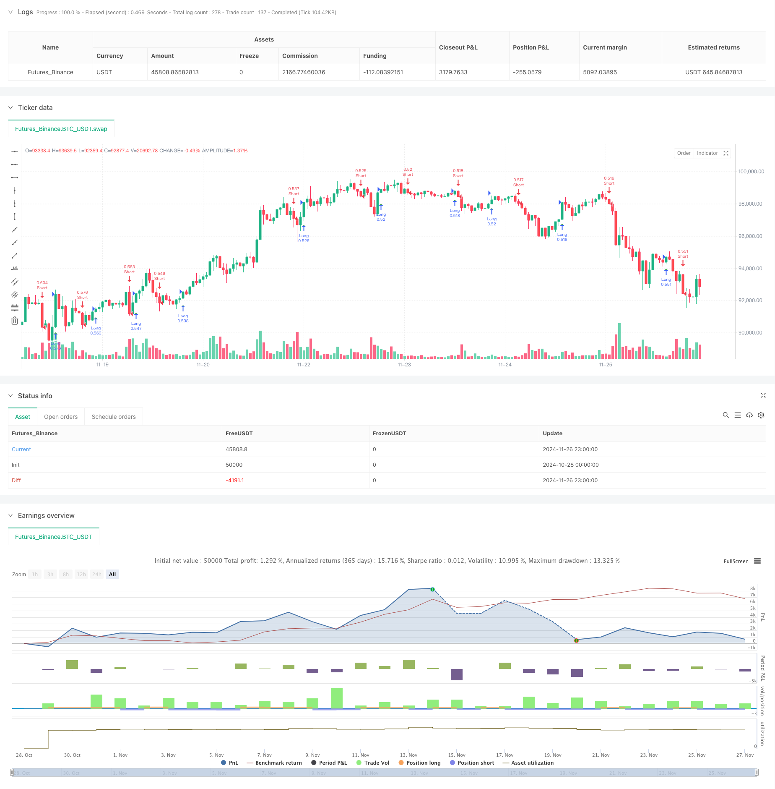

> Name

Adaptive-Range-Volatility-Trend-Following-Trading-Strategy
> Author

ChaoZhang

> Strategy Description



[trans]
#### Overview
This is an adaptive trend following strategy based on a combination of volatility and Williams Percent Range. This strategy adjusts the sensitivity of trend judgment by calculating the price fluctuation range and customizing counters, thereby achieving better adaptability in different market environments. The core of the strategy is to dynamically adjust the parameters of the William indicator by observing the amplitude of price fluctuations, so as to more accurately capture the conversion point of the market trend.
#### Strategy Principle
The strategy first calculates the price fluctuation range (Range) and its moving average (AvgRange) within a period. By comparing the relationship between real-time price changes and the average fluctuation range, two counters (TrueCount and TrueCount2) are established to record the frequency of significant fluctuations. These counters are used to dynamically adjust the calculation parameters of the William indicator, allowing the strategy to automatically adjust its sensitivity according to the state of market fluctuations. When the adjusted William indicator value breaks through the preset upper and lower thresholds, the strategy will generate a corresponding buy or sell signal.
#### Strategic Advantages
1. Strong adaptability - through the volatility adaptive mechanism, the strategy can maintain stable performance in different market environments
2. Improved risk control - the built-in risk parameter RISK allows traders to adjust the aggressiveness of the strategy according to their own risk preferences
3. Clear signals - use clear breakout signaling mechanisms to avoid false signals
4. Good scalability - the strategy framework allows the introduction of other technical indicators for optimization
5. High calculation efficiency - uses simple and efficient calculation methods, suitable for real-time trading
#### Strategy Risk
1. Parameter sensitivity - the choice of ASClength and RISK parameters will significantly affect strategy performance
2. Market environment dependence - too many trading signals may be generated in volatile markets
3. Hysteresis - Using a moving average may result in a certain delay in entry and exit
4. False Breakouts – False signals can occur during periods of high volatility
It is recommended to optimize parameters through backtesting and combine with other confirmation indicators to reduce risks.
#### Strategy optimization direction
1. Introduce trading volume indicator - confirm the effectiveness of trend changes through trading volume
2. Optimize counter logic - consider using more complex statistical methods to evaluate market fluctuations
3. Add a stop loss mechanism - it is recommended to introduce dynamic stop loss to better control risks
4. Market environment filtering - Add a market environment judgment module to avoid transactions under unsuitable market conditions
5. Parameter adaptation - develop automatic parameter optimization mechanism to improve strategy adaptability
#### Summary
This is an innovative strategy that combines volatility analysis and trend tracking, and improves the stability and reliability of the strategy through an adaptive mechanism. Although there are some inherent risks, through reasonable parameter settings and implementation of optimization directions, this strategy is expected to maintain stable performance in various market environments. The framework design of the strategy allows further expansion and optimization, and has good development potential. ||
#### Overview
This is an adaptive trend-following strategy that combines volatility and Williams Percent Range indicators. The strategy adjusts trend determination sensitivity by calculating price range and custom counters, achieving better adaptability in different market conditions. The core mechanism involves dynamically adjusting Williams indicator parameters based on price volatility to more accurately capture market trend transition points.

#### Strategy Principles
The strategy begins by calculating price range and its moving average (AvgRange) within a period. By comparing real-time price changes with average volatility range, it establishes two counters (TrueCount and TrueCount2) to record significant volatility frequency. These counters are used to dynamically adjust Williams indicator calculation parameters, allowing the strategy to automatically adapt its sensitivity based on market volatility conditions. Buy or sell signals are generated when the adjusted Williams indicator values break through preset thresholds.

#### Strategy Advantages
1. Strong Adaptability - Strategy maintains stable performance across different market environments through volatility adaptation mechanism
2. Comprehensive Risk Control - Built-in RISK parameter allows traders to adjust strategy aggressiveness based on risk preference
3. Clear Signals - Uses clear breakthrough signal mechanism to avoid false signals
4. Good Scalability - Strategy framework allows integration of other technical indicators for optimization
5. High Computational Efficiency - Uses simple and efficient calculation methods suitable for real-time trading

#### Strategy Risks
1. Parameter Sensitivity - Choice of ASClength and RISK parameters significantly affects strategy performance
2. Market Environment Dependency - May generate excessive trading signals in oscillating markets
3. Latency - Use of moving averages may cause entry and exit delays
4. False Breakouts - False signals may occur during high volatility periods
Recommend optimizing parameters through backtesting and combining with other confirmation indicators to reduce risks.

#### Optimization Directions
1. Incorporate Volume Indicators - Confirm trend change validity through volume analysis
2. Optimize Counter Logic - Consider using more complex statistical methods to evaluate market volatility
3. Add Stop Loss Mechanism - Suggest implementing dynamic stop loss for better risk control
4. Market Environment Filtering - Add market condition assessment module to avoid trading in unsuitable conditions
5. Parameter Adaptation - Develop parameter auto-optimization mechanism to improve strategy adaptability

#### Summary
This innovative strategy combines volatility analysis and trend following, improving strategy stability and reliability through adaptive mechanisms. While inherent risks exist, the strategy can maintain stable performance across various market conditions through proper parameter settings and optimization implementation. The strategy framework allows for further expansion and optimization, showing good development potential.[/trans]


> Source (PineScript)

``` pinescript
/*backtest
start: 2024-10-28 00:00:00
end: 2024-11-27 00:00:00
period: 1h
basePeriod: 1h
exchanges: [{"eid":"Futures_Binance","currency":"BTC_USDT"}]
*/

//@version=5
strategy("ASCTrend", shorttitle="ASCTrend", overlay=true, default_qty_type=strategy.percent_of_equity, default_qty_value=100)

eternalfg = input(false, title="eternal 確定")
eternal = eternalfg ? 1 : 0
ASClength = input.int(title="ASC Length", minval=4, defval=10)
RISK = input.int(title="RISK", minval=0, defval=3)

// Custom sum function
customSum(source, length) =>
    sum = 0.0
    for i = 0 to length - 1
        sum := sum + source[i]
    sum

x1 = 67 + RISK
x2 = 33 - RISK
Range = ta.highest(ASClength) - ta.lowest(ASClength)
AvgRange = ta.sma(Range, ASClength)
CountFg = math.abs(open - close) >= AvgRange * 2.0 ? 1 : 0
TrueCount = customSum(CountFg, ASClength)
CountFg2 = math.abs(close[3] - close) >= AvgRange * 4.6 ? 1 : 0
TrueCount2 = customSum(CountFg2, ASClength - 3)
wpr3RR = ta.wpr(3 + RISK + RISK)
wpr3 = ta.wpr(3)
wpr4 = ta.wpr(4)
WprAbs = 100 + (TrueCount2 > 0 ? wpr4 : TrueCount > 0 ? wpr3 : wpr3RR)
ASC_Trend = 0
ASC_Trend := WprAbs[eternal] < x2[eternal] ? -1 : WprAbs[eternal] > x1[eternal] ? 1 : ASC_Trend[1]

if (ta.crossover(ASC_Trend, 0))
    strategy.entry("Long", strategy.long)

if (ta.crossunder(ASC_Trend, 0))
    strategy.entry("Short", strategy.short)

plotshape(ta.crossover(ASC_Trend, 0), location=location.belowbar, color=color.green, style=shape.triangleup, size=size.small, text="B", textcolor=color.white)
plotshape(ta.crossunder(ASC_Trend, 0), location=location.abovebar, color=color.red, style=shape.triangledown, size=size.small, text="S", textcolor=color.white)

alertcondition(ta.crossover(ASC_Trend, 0), title="ASC_Trend UP", message="ASC_Trend UP")
alertcondition(ta.crossunder(ASC_Trend, 0), title="ASC_Trend Down", message="ASC_Trend Down")
```

> Detail

https://www.fmz.com/strategy/473271

> Last Modified

2024-11-28 17:24:30
