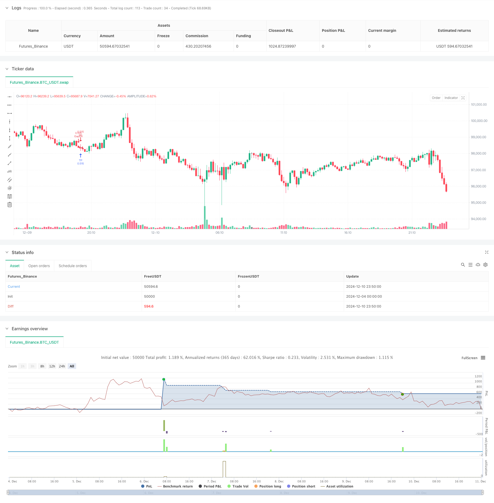

> Name

Adaptive-Trailing-Drawdown-Balanced-Trading-Strategy-with-Take-Profit-and-Stop-Loss
> Author

ChaoZhang

> Strategy Description



[trans]
#### Overview
This strategy is an adaptive trading system based on gaps and price changes. It achieves stable profits by setting flexible entry points and dynamic take-profit and stop-loss. The strategy adopts a pyramid-type position increase method and combines it with the OCA order management system to control risks. The system will automatically adjust the direction of the position according to the market trend, and promptly close the position and stop the loss when a reversal signal occurs.
#### Strategy Principles
The strategy mainly operates through the following core mechanisms:
1. Gap trading mechanism: identify upward and downward gaps, and set a stop loss order at the gap position to enter the market.
2. Trend following: Determine the trend direction based on the relationship between the opening price and the closing price
3. Pyramid position increase: up to 100 orders are allowed in the same direction.
4. Dynamic stop-profit and stop-loss: dynamically set stop-profit and stop-loss levels based on the average position price
5. OCA order management: Use OCA combination orders to ensure that take-profit and stop-loss orders are mutually exclusive.
6. Intraday trading limits: Control risks by setting the maximum number of orders traded within a day
#### Strategic Advantages
1. Strong adaptability: the strategy can automatically adjust the trading direction and positions according to market conditions
2. Risk control: Risks are controlled through multiple mechanisms, including stop loss, OCA orders and intraday trading limits.
3. High flexibility: supports pyramid-style position addition, and can obtain more profits in the trending market
4. High execution efficiency: Use stop-loss orders to enter the market and quickly open positions at key prices.
5. High degree of systematization: trading decisions are completely systematic, reducing the emotional impact caused by human intervention
#### Strategy Risk
1. Slippage risk: You may face serious slippage in rapid market conditions
2. Excessive trading risk: Frequent entry and exit may lead to higher transaction costs
3. Systemic risk: You may suffer large losses in a volatile market
4. Fund management risk: Pyramid-style position addition may lead to excessive fund utilization
5. Technical risk: Interruption of program operation may cause problems in order management
#### Strategy optimization direction
1. Introduce volatility indicators: dynamically adjust stop-profit and stop-loss parameters according to market volatility
2. Optimize the position adding mechanism: design more detailed adding rules to avoid excessive use of funds
3. Improve the risk control system: add more risk control indicators, such as the maximum intraday drawdown limit
4. Improve order execution: optimize the order progression mechanism and reduce the impact of slippage
5. Increase market sentiment judgment: optimize entry timing based on indicators such as trading volume
#### Summary
This is a trading strategy with reasonable design and strict logic, which uses multiple mechanisms to ensure the stability and security of transactions. The core advantage of the strategy lies in its adaptability and risk control capabilities, but at the same time, attention must be paid to the risks caused by market fluctuations. Through continuous optimization and improvement, the strategy is expected to maintain stable performance in different market environments. ||
#### Overview
This strategy is an adaptive trading system based on gaps and price movements, achieving stable returns through flexible entry points and dynamic take-profit/stop-loss settings. The strategy employs pyramiding position sizing combined with an OCA order management system for risk control. The system automatically adjusts position direction and closes positions promptly when reversal signals appear.

#### Strategy Principles
The strategy operates through several core mechanisms:
1. Gap trading mechanism: Identifies upward and downward gaps, placing stop orders at gap levels
2. Trend following: Determines trend direction based on the relationship between opening and closing prices
3. Pyramiding: Allows up to 100 orders in the same direction
4. Dynamic TP/SL: Sets take-profit and stop-loss levels dynamically based on average position price
5. OCA order management: Uses OCA order groups to ensure mutual exclusivity of TP and SL orders
6. Intraday trading limits: Controls risk through maximum intraday filled orders setting

#### Strategy Advantages
1. High adaptability: Strategy automatically adjusts trading direction and position size based on market conditions
2. Controlled risk: Multiple risk control mechanisms including stop-loss, OCA orders, and intraday limits
3. High flexibility: Supports pyramiding to capture more profits in trending markets
4. High execution efficiency: Uses stop orders for quick position building at key price levels
5. High systematization: Fully systematic trading decisions reduce emotional interference

#### Strategy Risks
1. Slippage risk: May face significant slippage in fast-moving markets
2. Overtrading risk: Frequent entries and exits may lead to high transaction costs
3. Systematic risk: May suffer larger losses in highly volatile markets
4. Capital management risk: Pyramiding may lead to excessive capital utilization
5. Technical risk: Program interruptions may cause order management issues

#### Strategy Optimization Directions
1. Incorporate volatility indicators: Dynamically adjust TP/SL parameters based on market volatility
2. Optimize pyramiding mechanism: Design more detailed position sizing rules to avoid excessive capital use
3. Enhance risk control: Add more risk control indicators like maximum intraday drawdown limits
4. Improve order execution: Optimize order progression mechanism to reduce slippage impact
5. Add market sentiment analysis: Optimize entry timing by incorporating volume and other indicators

#### Summary
This is a well-designed trading strategy with rigorous logic, ensuring trading stability and safety through multiple mechanisms. The core advantages lie in its adaptability and risk control capabilities, while attention must be paid to risks from market volatility. Through continuous optimization and improvement, the strategy has the potential to maintain stable performance across different market environments.[/trans]


> Source (PineScript)

``` pinescript
/*backtest
start: 2024-12-04 00:00:00
end: 2024-12-11 00:00:00
period: 10m
basePeriod: 10m
exchanges: [{"eid":"Futures_Binance","currency":"BTC_USDT"}]
*/

//@version=5
strategy("Greedy Strategy - maclaurin", pyramiding = 100, calc_on_order_fills=false, overlay=true, default_qty_type = strategy.percent_of_equity, default_qty_value = 100)
backtestStartDate = input(timestamp("1 Jan 1990"),
     title="Start Date", group="Backtest Time Period",
     tooltip="This start date is in the time zone of the exchange " +
     "where the chart's instrument trades. It doesn't use the time " +
     "zone of the chart or of your computer.")
backtestEndDate = input(timestamp("1 Jan 2023"),
     title="End Date", group="Backtest Time Period",
     tooltip="This end date is in the time zone of the exchange " +
     "where the chart's instrument trades. It doesn't use the time " +
     "zone of the chart or of your computer.")
inTradeWindow = true
tp = input(10)
sl = input(10)
maxidf = input(title="Max Intraday Filled Orders", defval=5)
// strategy.risk.max_intraday_filled_orders(maxidf)
upGap = open > high[1]
dnGap = open < low[1]
dn = strategy.position_size < 0 and open > close
up = strategy.position_size > 0 and open < close
if inTradeWindow and upGap
    strategy.entry("GapUp", strategy.long, stop = high[1])
else
    strategy.cancel("GapUp")
if inTradeWindow and dn
    strategy.entry("Dn", strategy.short, stop = close)
else
    strategy.cancel("Dn")
if inTradeWindow and dnGap
    strategy.entry("GapDn", strategy.short, stop = low[1])
else
    strategy.cancel("GapDn")
if inTradeWindow and up
    strategy.entry("Up", strategy.long, stop = close)
else
    strategy.cancel("Up")
XQty = strategy.position_size < 0 ? -strategy.position_size : strategy.position_size
dir = strategy.position_size < 0 ? -1 : 1
lmP = strategy.position_avg_price + dir*tp*syminfo.mintick
slP = strategy.position_avg_price - dir*sl*syminfo.mintick
float nav = na
revCond = strategy.position_size > 0 ? dnGap : (strategy.position_size < 0 ? upGap : false)
if inTradeWindow and not revCond and XQty > 0
    strategy.order("TP", strategy.position_size < 0 ? strategy.long : strategy.short, XQty, lmP, nav, "TPSL",  "TPSL")
    strategy.order("SL", strategy.position_size < 0 ? strategy.long : strategy.short, XQty, nav, slP, "TPSL", "TPSL")
if XQty == 0 or revCond
    strategy.cancel("TP")
    strategy.cancel("SL")
//plot(strategy.equity, title="equity", color=color.red, linewidth=2, style=plot.style_areabr)

```

> Detail

https://www.fmz.com/strategy/474835

> Last Modified

2024-12-12 14:25:36
