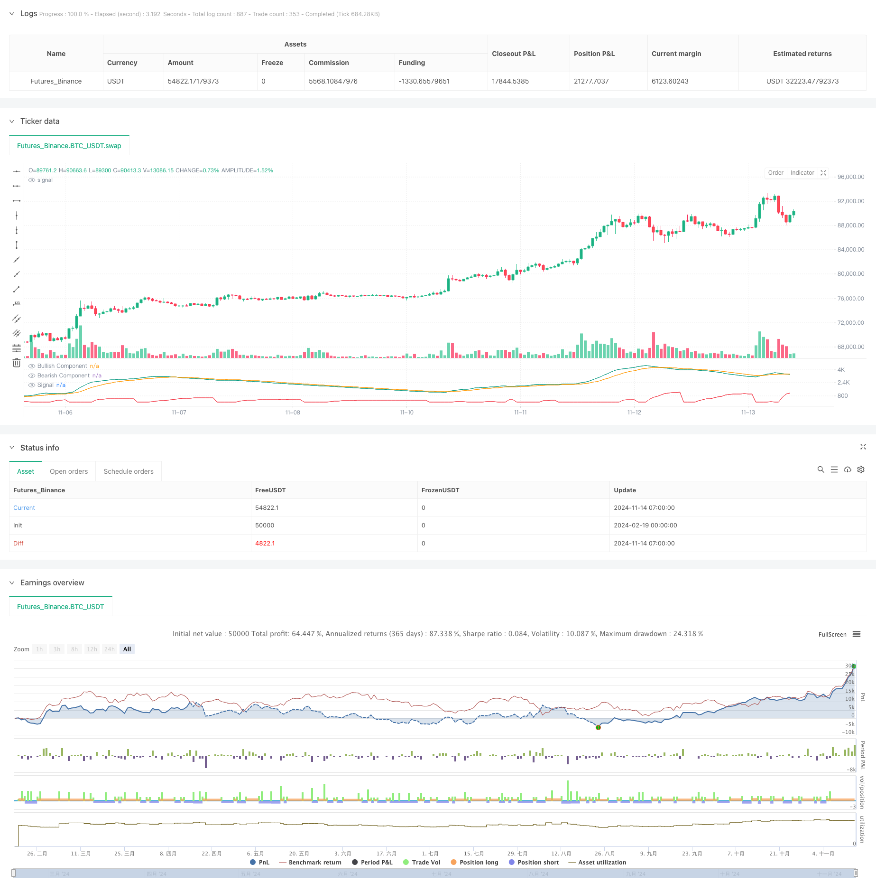

> Name

Adaptive-Trend-Detection-Strategy-with-Dual-Envelope-EMA-System-Adaptive trend detection strategy based on dual-envelope EMA system
> Author

ChaoZhang

> Strategy Description



[trans]
#### Overview
This strategy is an innovative trend detection system based on the calculation method of the Dual Exponential Moving Average (EMA) envelope. It analyzes the multi-dimensional characteristics of price trends and calculates the balance of long and short forces in real time to identify the changes and persistence of market trends. The biggest feature of this strategy is its adaptability, which can dynamically adjust signal strength according to market conditions.
#### Strategy Principle
The core principle of the strategy is to measure the long and short power of the market through complex EMA envelope calculations. Specifically:
1. Use the opening price and closing price to construct upper and lower EMA envelope systems
2. Obtain bull and bear power indicators through mathematical calculations
3. Calculate the signal line as an auxiliary indicator for trend confirmation
4. When the strength of the bulls exceeds the strength of the bears, a long signal is generated, otherwise a short signal is generated.
#### Strategic Advantages
1. Strong adaptability - the strategy can automatically adjust sensitivity according to market fluctuations
2. Signal stability - confirmed by multiple indicators to reduce false signals
3. Perfect risk control - built-in fund management system to limit the proportion of funds used in each transaction
4. Good visualization effect - independent display panel clearly displays various indicators
5. Flexible parameters - cycle parameters can be adjusted according to different market characteristics
#### Strategy Risk
1. Trend reversal risk - Signal lags may occur in highly volatile markets
2. Fund management risk - reasonable initial capital and transaction ratios need to be set
3. Market adaptability risk - parameters need to be adjusted under different market environments
4. Technical implementation risks - the stability and accuracy of the calculation process need to be ensured
#### Strategy optimization direction
1. Add market volatility filter to adjust signal sensitivity during periods of high volatility
2. Introduce trading volume indicators as an auxiliary confirmation system
3. Optimize the fund management system and add dynamic position control
4. Add trend strength filter to improve signal quality
5. Develop adaptive parameter optimization system
#### Summary
This is a trend tracking strategy based on scientific calculation methods, which achieves effective capture of market trends through advanced technical indicator design and strict risk control. The core advantage of the strategy lies in its adaptability and reliability. Through reasonable parameter optimization and risk management, it can maintain stable performance in different market environments. ||
#### Overview
This strategy is an innovative trend detection system based on dual Exponential Moving Average (EMA) envelope calculations. It analyzes multidimensional price characteristics to calculate real-time bull-bear power comparisons, identifying market trend changes and persistence. The strategy's main feature is its adaptability, allowing dynamic adjustment of signal strength based on market conditions.

#### Strategy Principles
The core principle relies on complex EMA envelope calculations to measure market forces. Specifically:
1. Constructs upper and lower EMA envelopes using open and close prices
2. Derives bullish and bearish power indicators through mathematical calculations
3. Computes a signal line as a supplementary trend confirmation indicator
4. Generates long signals when bullish power exceeds bearish power, and vice versa

#### Strategy Advantages
1. Strong Adaptability - Automatically adjusts sensitivity based on market volatility
2. Stable Signals - Multiple indicator confirmation reduces false signals
3. Comprehensive Risk Control - Built-in money management system limits position sizes
4. Excellent Visualization - Separate panel clearly displays all indicators
5. Flexible Parameters - Adjustable cycle parameters for different market characteristics

#### Strategy Risks
1. Trend Reversal Risk - Potential signal lag in highly volatile markets
2. Money Management Risk - Requires proper initial capital and trading ratio settings
3. Market Adaptability Risk - Parameters need adjustment in different market environments
4. Technical Implementation Risk - Requires stable and accurate calculation processes

#### Optimization Directions
1. Add volatility filters to adjust signal sensitivity during high volatility periods
2. Incorporate volume indicators as confirmation systems
3. Optimize money management with dynamic position sizing
4. Add trend strength filters to improve signal quality
5. Develop adaptive parameter optimization systems

#### Summary
This is a scientifically-based trend following strategy that effectively captures market trends through advanced technical indicator design and strict risk control. The strategy's core strengths lie in its adaptability and reliability, maintaining stable performance across different market environments through proper parameter optimization and risk management.[/trans]


> Source (PineScript)

``` pinescript
/*backtest
start: 2024-02-19 00:00:00
end: 2024-11-14 08:00:00
period: 1h
basePeriod: 1h
exchanges: [{"eid":"Futures_Binance","currency":"BTC_USDT"}]
*/

//  This work is licensed under a Attribution-NonCommercial-ShareAlike 4.0 International (CC BY-NC-SA 4.0) 
//  https://creativecommons.org/licenses/by-nc-sa/4.0/
//  © alexgrover
//
//  Original post: 
//  https://alpaca.markets/learn/andean-oscillator-a-new-technical-indicator-based-on-an-online-algorithm-for-trend-analysis/

//@version=5
strategy(title="Andean Oscillator [Strategy]",
     shorttitle="AndeanOsc_Strategy",
     overlay=false,              // Zobraziť sa môže v samostatnom okne
     initial_capital=10000,      // Počiatočný kapitál
     default_qty_type=strategy.percent_of_equity,
     default_qty_value=100,      // Použiť 100% z účtu na jeden obchod
     pyramiding=0)               // Nenavyšovať pozície

//------------------------------------------------------------------------------
//Inputs
//------------------------------------------------------------------------------
length     = input.int(50, "Length")
sig_length = input.int(9, "Signal Length")

//------------------------------------------------------------------------------
//Výpočet Andean Oscillatora
//------------------------------------------------------------------------------
var float alpha = 2.0 / (length + 1)

// Premenné musia byť deklarované ako `var` pre zachovanie stavu
var float up1 = 0.
var float up2 = 0.
var float dn1 = 0.
var float dn2 = 0.

C = close
O = open

// Výpočet EMA obálok
up1 := nz(math.max(C, O, up1[1] - (up1[1] - C) * alpha), C)
up2 := nz(math.max(C * C, O * O, up2[1] - (up2[1] - C * C) * alpha), C * C)

dn1 := nz(math.min(C, O, dn1[1] + (C - dn1[1]) * alpha), C)
dn2 := nz(math.min(C * C, O * O, dn2[1] + (C * C - dn2[1]) * alpha), C * C)

// Býčia zložka a medvedia zložka
bull   = math.sqrt(dn2 - dn1 * dn1)
bear   = math.sqrt(up2 - up1 * up1)

// Signál = EMA z max(bull, bear)
signal = ta.ema(math.max(bull, bear), sig_length)

//------------------------------------------------------------------------------
//Jednoduchá LOGIKA STRATÉGIE (iba demonštrácia)
//------------------------------------------------------------------------------
// Príklad: 
// - Ak je bull > bear, vstúpime do long (býčia sila väčšia ako medvedia)
// - Ak je bear > bull, vstúpime do short (medvedia sila väčšia ako býčia)
//
// S pyramiding=0 sa otvorí vždy iba jedna pozícia – ak príde opačný signál, 
// TradingView zatvorí starú a otvorí novú.

if bull > bear
    strategy.entry("Long", strategy.long, comment="Bull > Bear")

if bear > bull
    strategy.entry("Short", strategy.short, comment="Bear > Bull")

//------------------------------------------------------------------------------
// Plotovanie (na posúdenie v samostatnom paneli)
//------------------------------------------------------------------------------
plot(bull,   "Bullish Component",  color=#089981)
plot(bear,   "Bearish Component",  color=#f23645)
plot(signal, "Signal",             color=#ff9800)

```

> Detail

https://www.fmz.com/strategy/482454

> Last Modified

2025-02-18 15:06:49
