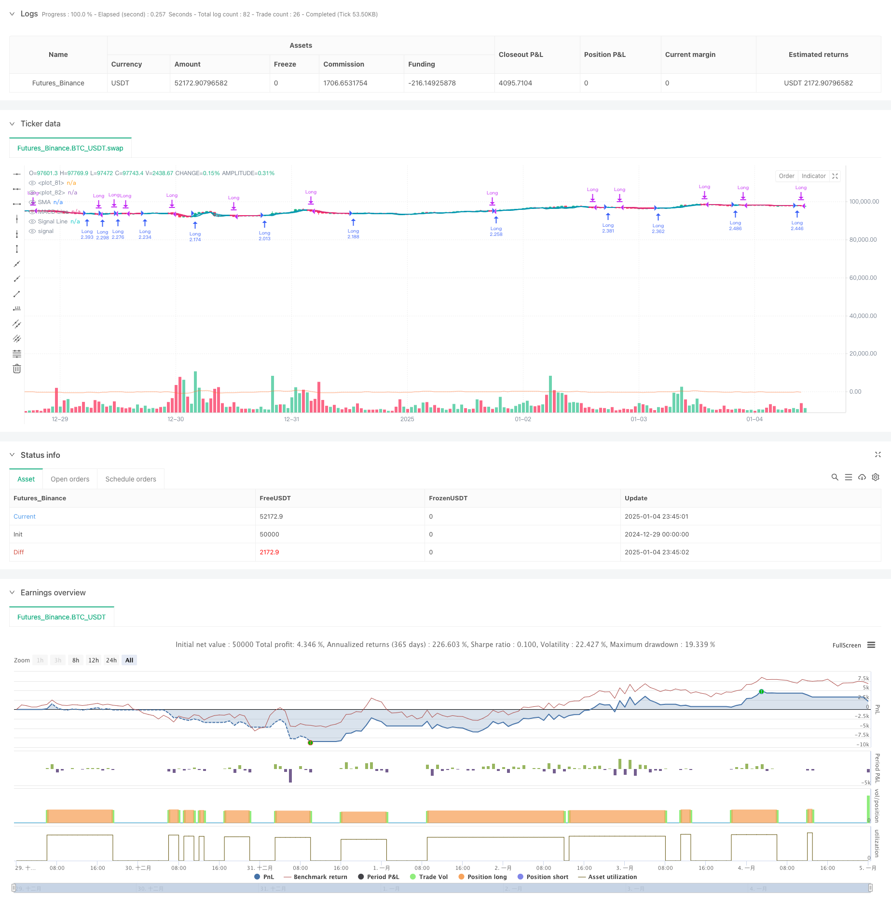

> Name

Adaptive-Trend-Flow-Multiple-Filter-Trading-Strategy
> Author

ChaoZhang

> Strategy Description



[trans]
#### Overview
This strategy is an adaptive trend following system based on multiple technical indicator filters. It combines multiple technical indicators such as exponential moving average (EMA), simple moving average (SMA) and moving average convergence divergence (MACD), and dynamically adjusts parameters to adapt to different market environments to achieve efficient trend capture and risk control. This strategy adopts a layered filtering mechanism and significantly improves the reliability of trading signals through the coordination of multiple technical indicators.
#### Strategy Principle
The core logic of the strategy is based on a three-layer filtering mechanism:
1. Adaptive trend identification layer: Use a combination of fast and slow EMA to calculate the trend baseline, and dynamically adjust the upper and lower track lines based on market volatility.
2. SMA filter layer: Use the simple moving average to ensure that the price movement direction is consistent with the overall trend.
3. MACD confirmation layer: Use the trend confirmation function of the MACD indicator to further verify the validity of trading signals.
The generation of trading signals requires fulfillment of all filters: trend transition, confirmation of SMA direction and support of the MACD signal line. The strategy also includes a dynamic position management system based on account equity, which automatically adjusts the position size through leverage factors.
#### Strategic Advantages
1. Strong adaptability: By dynamically adjusting parameters, the strategy can adapt to different market environments.
2. Improved risk control: Multiple filtering mechanisms significantly reduce the probability of false signals.
3. High customizability: users can adjust various parameters according to their personal trading style.
4. High degree of automation: supports alert messages in JSON format, making it easy to interface with automated trading systems.
5. Good visualization effect: Provides rich visual feedback, including trend bands, signal marks, etc.
#### Strategy Risk
1. Trend dependence: Frequent false signals may occur in volatile markets.
2. Lagging risk: Multiple filtering mechanisms may lead to delayed entry opportunities.
3. Parameter sensitivity: Different parameter combinations may lead to large differences in strategy performance.
4. Leverage risk: Excessive leverage may amplify losses.
#### Strategy optimization direction
1. Volatility adaptation: Add a dynamic stop loss mechanism based on ATR.
2. Market environment identification: Add a market status classification system and use different parameter combinations in different market environments.
3. Signal quality scoring: Establish a signal strength scoring system and dynamically adjust positions based on signal strength.
4. Fund management optimization: Introduce more complex fund management algorithms to achieve more precise position control.
#### Summary
This strategy achieves a more reliable trend tracking effect through multi-layer filtering mechanism and dynamic parameter adjustment. Although there is a certain risk of hysteresis and parameter dependence, through reasonable parameter optimization and risk control measures, stable performance can still be achieved in actual transactions. It is recommended that traders fully conduct backtest verification before using it in real trading, and adjust parameter settings according to personal risk tolerance.
||

#### Overview
This strategy is an adaptive trend following system based on multiple technical indicator filters. It combines various technical indicators including Exponential Moving Average (EMA), Simple Moving Average (SMA), and Moving Average Convergence Divergence (MACD), dynamically adjusting parameters to adapt to different market environments for efficient trend capture and risk control. The strategy employs a layered filtering mechanism, significantly improving the reliability of trading signals through the synergistic combination of multiple technical indicators.

#### Strategy Principle
The core logic is based on a three-layer filtering mechanism:
1. Adaptive Trend Recognition Layer: Uses a combination of fast and slow EMAs to calculate the trend baseline and dynamically adjusts upper and lower channel lines based on market volatility.
2. SMA Filter Layer: Ensures price movement direction aligns with the overall trend using Simple Moving Average.
3. MACD Confirmation Layer: Further validates trading signals using MACD indicator's trend confirmation functionality.

Trade signal generation requires all filter conditions to be met: trend transition, SMA direction confirmation, and MACD signal line support. The strategy also includes a dynamic position management system based on account equity, automatically adjusting position size through a leverage factor.

#### Strategy Advantages
1. Strong Adaptability: Strategy can adapt to different market environments through dynamic parameter adjustment.
2. Comprehensive Risk Control: Multiple filtering mechanisms significantly reduce the probability of false signals.
3. High Customizability: Users can adjust various parameters according to personal trading style.
4. High Automation Level: Supports JSON format alert messages for easy integration with automated trading systems.
5. Good Visualization: Provides rich visual feedback including trend bands and signal markers.

#### Strategy Risks
1. Trend Dependency: May generate frequent false signals in oscillating markets.
2. Lag Risk: Multiple filtering mechanisms may lead to delayed entry timing.
3. Parameter Sensitivity: Different parameter combinations may result in significant strategy performance variations.
4. Leverage Risk: Excessive leverage may amplify losses.

#### Strategy Optimization Directions
1. Volatility Adaptation: Add dynamic stop-loss mechanism based on ATR.
2. Market Environment Recognition: Add market state classification system to use different parameter combinations in different market environments.
3. Signal Quality Scoring: Establish signal strength scoring system to dynamically adjust positions based on signal strength.
4. Capital Management Optimization: Introduce more sophisticated money management algorithms for more precise position control.

#### Summary
The strategy achieves relatively reliable trend following through multi-layer filtering mechanisms and dynamic parameter adjustment. Although there are certain risks of lag and parameter dependency, stable performance can still be achieved in actual trading through reasonable parameter optimization and risk control measures. Traders are recommended to thoroughly backtest and adjust parameter settings according to individual risk tolerance before live trading.[/trans]


> Source (PineScript)

``` pinescript
/*backtest
start: 2024-12-29 00:00:00
end: 2025-01-05 00:00:00
period: 45m
basePeriod: 45m
exchanges: [{"eid":"Futures_Binance","currency":"BTC_USDT"}]
*/

//@version=6
strategy("Adaptive Trend Flow Strategy with Filters for SPX", overlay=true, max_labels_count=500, 
     initial_capital=1000, commission_type=strategy.commission.cash_per_order, commission_value=0.01, slippage=2,
     margin_long=20, margin_short=20, default_qty_type=strategy.percent_of_equity, default_qty_value=100)

// User-defined inputs for trend logic
atr           = input.int(14, "Main Length", minval=2, group = "Find more strategies like this on pineindicators.com")
length        = input.int(2, "Main Length", minval=2)
smooth_len    = input.int(2, "Smoothing Length", minval=2)
sensitivity   = input.float(2.0, "Sensitivity", step=0.1)

// User-defined inputs for SMA filter
use_sma_filter = input.bool(true, "Enable SMA Filter?")
sma_length = input.int(4, "SMA Length", minval=1)

// User-defined inputs for MACD filter
use_macd_filter = input.bool(true, "Enable MACD Filter?")
macd_fast_length = input.int(2, "MACD Fast Length", minval=1)
macd_slow_length = input.int(7, "MACD Slow Length", minval=1)
macd_signal_length = input.int(2, "MACD Signal Length", minval=1)
// User-defined inputs for leverage
leverage_factor = input.float(4.5, "Leverage Factor", minval=1.0, step=0.1)
id           = input("besttrader123", title= "Your TradingView username", group = "Automate this strategy with plugpine.com")
key           = input("nc739ja84gf", title= "Unique identifier (UID)")
ticker        = input("SPX", title= "Ticker/symbol of your broker")
bullcolor     = #0097a7
bearcolor     = #ff195f
showbars      = input.bool(true, "Color Bars?")
showbg        = input.bool(true, "Background Color?")
showsignals   = input.bool(true, "Show Signals?")


// Trend calculation functions
calculate_trend_levels() =>
    typical = hlc3
    fast_ema = ta.ema(typical, length)
    slow_ema = ta.ema(typical, length * 2)
    basis = (fast_ema + slow_ema) / 2
    vol = ta.stdev(typical, length)
    smooth_vol = ta.ema(vol, smooth_len)
    upper = basis + (smooth_vol * sensitivity)
    lower = basis - (smooth_vol * sensitivity)
    [basis, upper, lower]

get_trend_state(upper, lower, basis) =>
    var float prev_level = na
    var int trend = 0
    if na(prev_level)
        trend := close > basis ? 1 : -1
        prev_level := trend == 1 ? lower : upper
    if trend == 1
        if close < lower
            trend := -1
            prev_level := upper
        else
            prev_level := lower
    else
        if close > upper
            trend := 1
            prev_level := lower
        else
            prev_level := upper
    [trend, prev_level]

[basis, upper, lower] = calculate_trend_levels()
[trend, level] = get_trend_state(upper, lower, basis)

// SMA filter
sma_value = ta.sma(close, sma_length)
sma_condition = use_sma_filter ? close > sma_value : true

// MACD filter
[macd_line, signal_line, _] = ta.macd(close, macd_fast_length, macd_slow_length, macd_signal_length)
macd_condition = use_macd_filter ? macd_line > signal_line : true

// Signal detection with filters
long_signal = trend == 1 and trend[1] == -1 and sma_condition and macd_condition
short_signal = trend == -1 and trend[1] == 1

// Plotting visuals
p2 = plot(basis, color=trend == 1 ? bullcolor : bearcolor, linewidth=2)
p1 = plot(level, color=close > level ? bullcolor : bearcolor, linewidth=2, style=plot.style_linebr)
// if showsignals and ta.crossover(close, level)
//     label.new(bar_index, level, "▲", color=bullcolor, textcolor=chart.bg_color, style=label.style_label_upper_right)
// if showsignals and ta.crossunder(close, level)
//     label.new(bar_index, level, "▼", color=bearcolor, textcolor=chart.fg_color, style=label.style_label_lower_right)

qty = strategy.equity / close * leverage_factor

// Automated alerts
if long_signal
    alert('{"AccountID": "' + id + '","Key": "' + key + '", "symbol": "' + ticker + '", "action": "long", "volume": ' + str.tostring(qty) + '}', alert.freq_once_per_bar)
if short_signal
    alert('{"AccountID": "' + id + '","Key": "' + key + '", "symbol": "' + ticker + '", "action": "closelong"}', alert.freq_once_per_bar)

// Strategy entries and exits
if long_signal
    strategy.entry("Long", strategy.long, qty=qty)
if short_signal
    strategy.close("Long")

// Optional SMA and MACD plot
plot(use_sma_filter ? sma_value : na, color=color.new(color.blue, 80), title="SMA")
plot(use_macd_filter ? macd_line : na, color=color.new(color.orange, 80), title="MACD Line")
plot(use_macd_filter ? signal_line : na, color=color.new(color.red, 80), title="Signal Line")

```

> Detail

https://www.fmz.com/strategy/477537

> Last Modified

2025-01-06 11:58:25
