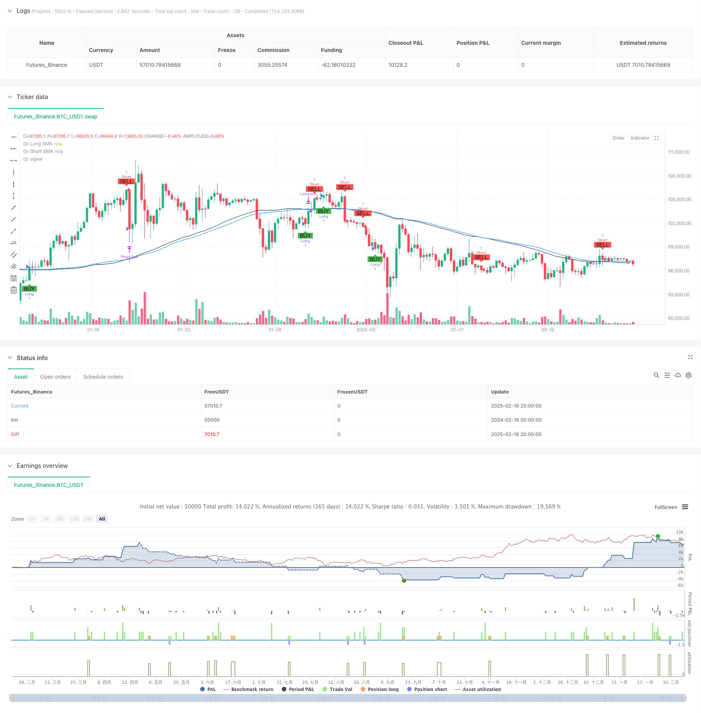

> Name

Adaptive-Trend-Following-Strategy-Based-on-Moving-Average-Crossover
> Author

ChaoZhang

> Strategy Description



[trans]
#### Overview
This strategy is a trend following system based on the intersection of double moving averages. It captures market trends through the intersection of short-term and long-term moving averages, and uses a risk-to-benefit ratio of 1:3 to manage trading risks. The strategy uses fixed stop loss and profit targets, combined with a trailing stop mechanism to protect profits.
#### Strategy Principle
The strategy uses a 74-period short-term moving average (Short SMA) and a 70-period long-term moving average (Long SMA) as the main indicators. When the short-term moving average crosses the long-term moving average upward, the system generates a long signal; when the short-term moving average crosses the long-term moving average downward, the system generates a short signal. The position size for each trade is fixed at 0.002, the stop loss is set at $353, and the profit target is 3 times the stop loss ($1059). The strategy also includes date range restrictions that will only execute trades during the specified backtest period (February 13, 2025 to March 31, 2025).
#### Strategic Advantages
1. Perfect risk management: adopting a fixed risk-to-return ratio of 1:3 helps to obtain stable returns in long-term transactions
2. Clear signals: Using the classic moving average crossover strategy, the trading signals are clear and easy to understand and execute.
3. High degree of automation: including complete entry and exit logic without manual intervention
4. Trailing stop loss protection: Through the trailing stop loss mechanism, realized profits can be effectively locked in
5. Strict position control: fixed position size to avoid excessive risk-taking
#### Strategy Risk
1. Moving average lag: Moving averages are essentially lagging indicators and may produce lagging signals in rapidly fluctuating markets.
2. Not applicable to volatile markets: False signals may frequently occur in sideways volatile markets, resulting in continuous losses.
3. Fixed stop loss risk: fixed dollar stop loss may not be flexible enough when prices fluctuate violently
4. Time frame restriction: The strategy only runs within a specific time frame and may miss important trading opportunities.
#### Strategy optimization direction
1. Dynamically adjust the moving average period: the moving average period can be automatically adjusted according to market volatility to improve strategy adaptability.
2. Introduce volatility filtering: add ATR or other volatility indicators and adjust stop loss during periods of high volatility
3. Optimize position management: realize dynamic position adjustment based on account net value and improve fund utilization efficiency
4. Increase market environment filtering: introduce trend strength indicators to automatically reduce trading frequency in volatile markets
5. Improve the exit mechanism: combine price breakthroughs or momentum indicators to develop a more flexible profit acquisition mechanism
#### Summary
This is a trend following strategy with complete structure and clear logic. Capture trends through moving average crossovers, adopt strict risk management and position control, and are suitable for medium and long-term transactions. Although there are inherent flaws such as moving average lag, the stability and profitability of the strategy are expected to be further improved through the suggested optimization directions, especially the introduction of dynamic parameter adjustment and market environment filtering. ||
#### Overview
This strategy is a trend following system based on dual moving average crossover, which captures market trends through the intersection of short-term and long-term moving averages, using a 1:3 risk-reward ratio for trade risk management. The strategy employs fixed stop-loss and take-profit targets, combined with a trailing stop mechanism to protect profits.

#### Strategy Principle
The strategy utilizes a 74-period Short SMA and a 70-period Long SMA as primary indicators. A long signal is generated when the short-term moving average crosses above the long-term moving average, while a short signal is triggered when the short-term moving average crosses below the long-term moving average. Each trade has a fixed position size of 0.002, with a stop-loss set at $353 and a take-profit target at three times the stop-loss ($1,059). The strategy also includes date range restrictions, executing trades only within the specified backtesting period (February 13, 2025, to March 31, 2025).

#### Strategy Advantages
1. Comprehensive risk management: Uses a fixed 1:3 risk-reward ratio, contributing to stable returns in long-term trading
2. Clear signals: Employs classic moving average crossover strategy, with clear and easy-to-understand trading signals
3. High degree of automation: Includes complete entry and exit logic, requiring no manual intervention
4. Trailing stop protection: Effectively locks in realized profits through trailing stop mechanism
5. Strict position control: Fixed position size prevents excessive risk-taking

#### Strategy Risks
1. Moving average lag: Moving averages are inherently lagging indicators, potentially generating delayed signals in rapidly volatile markets
2. Ineffective in ranging markets: May generate frequent false signals in sideways markets, leading to consecutive losses
3. Fixed stop-loss risk: Dollar-based fixed stops may lack flexibility during extreme price volatility
4. Time range limitation: Strategy operates only within specific time ranges, potentially missing important trading opportunities

#### Strategy Optimization Directions
1. Dynamic adjustment of moving average periods: Automatically adjust periods based on market volatility to improve strategy adaptability
2. Introduction of volatility filters: Add ATR or other volatility indicators to adjust stop-loss levels during high volatility periods
3. Position management optimization: Implement dynamic position sizing based on account equity to improve capital efficiency
4. Market environment filtering: Introduce trend strength indicators to automatically reduce trading frequency in ranging markets
5. Exit mechanism improvement: Develop more flexible profit-taking mechanisms by incorporating price breakouts or momentum indicators

#### Summary
This is a well-structured trend following strategy with clear logic. It captures trends through moving average crossovers, employing strict risk management and position control, suitable for medium to long-term trading. While inherent drawbacks like moving average lag exist, the strategy's stability and profitability can be further enhanced through the suggested optimization directions, particularly by introducing dynamic parameter adjustment and market environment filtering.[/trans]


> Source (PineScript)

``` pinescript
/*backtest
start: 2024-02-18 00:00:00
end: 2025-02-17 00:00:00
period: 4h
basePeriod: 4h
exchanges: [{"eid":"Futures_Binance","currency":"BTC_USDT"}]
*/

//@version=5
strategy("Bitcoin Strategy by Jag", overlay=true)

// Input Parameters
shortSMALength = input.int(74, title="Short SMA Length")
longSMALength = input.int(70, title="Long SMA Length")
trailStopOffset = input.float(353, title="Trailing Stop Offset (USD)")  // Trailing Stop Loss Offset in USD
tradeSize = input.float(1, title="Trade Size")

// Automatically set Take Profit as 3 times Stop Loss
fixedTakeProfit = trailStopOffset * 3

// Backtesting Date Range
startDate = timestamp(2025, 02,13, 0, 0)
endDate = timestamp(2025, 03, 31, 23, 59)
withinDateRange = true

// Indicators
shortSMA = ta.sma(close, shortSMALength)
longSMA = ta.sma(close, longSMALength)

// Crossover Conditions
longCondition = withinDateRange and ta.crossover(shortSMA, longSMA)
shortCondition = withinDateRange and ta.crossunder(shortSMA, longSMA)

// Entry Logic
if (strategy.position_size == 0)  // Only allow new trades if no position is open
    if (longCondition)
        strategy.entry("Long", strategy.long, tradeSize)

    if (shortCondition)
        strategy.entry("Short", strategy.short, tradeSize)

// Exit Logic for Long Position
if (strategy.position_size > 0)
    strategy.exit("Long exit", "Long", stop=strategy.position_avg_price - trailStopOffset, limit=strategy.position_avg_price + fixedTakeProfit)  // Using stop and limit

// Exit Logic for Short Position
if (strategy.position_size < 0)
    strategy.exit("Short Exit", "Short", stop=strategy.position_avg_price + trailStopOffset, limit=strategy.position_avg_price - fixedTakeProfit)  // Using stop and limit

// Plot Moving Averages
plot(shortSMA, color=color.blue, title="Short SMA")
plot(longSMA, color=color.black, title="Long SMA")

// Visual Signals
plotshape(series=longCondition and strategy.position_size == 0, style=shape.labelup, location=location.belowbar, color=color.green, text="BUY", size=size.small)
plotshape(series=shortCondition and strategy.position_size == 0, style=shape.labeldown, location=location.abovebar, color=color.red, text="SELL", size=size.small)

```

> Detail

https://www.fmz.com/strategy/482437

> Last Modified

2025-02-18 14:23:08
