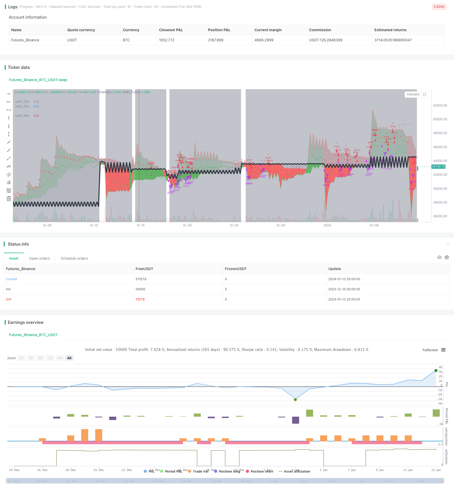

> Name

Adaptive-Trend-Following-Strategy
> Author

ChaoZhang

> Strategy Description


 [trans]

## Overview
The adaptive trend following strategy is a quantitative trading strategy that combines Bollinger Band indicators and moving average indicators to dynamically adjust the trend strength factor to achieve trend following and stop loss. This strategy uses the Bollinger Bands indicator to calculate price volatility, dynamically calculates a reasonable trend intensity based on this, and then combines the ATR indicator to draw an adaptive trend channel to judge and follow the bull and bear trends. At the same time, the strategy has a built-in stop-loss mechanism to effectively control risks.
## Strategy Principle
The core indicator of this strategy is Bollinger Bands. Bollinger Bands are composed of middle track, upper track and lower track. The middle track is an n-day simple moving average, the upper track is the middle track + k times the n-day standard deviation, and the lower track is the middle track -k times the n-day standard deviation. Here, the 20-day mid-track and 2 times the standard deviation are selected to construct the Bollinger Bands.
Then calculate the ratio of the Bollinger Band's bandwidth (upper track - lower track) to the middle track, which is called the "strength factor". This ratio reflects current market volatility and trend strength. We set the maximum and minimum values ​​of the intensity factor to prevent it from being too large or too small.
After obtaining a reasonable strength factor, combined with the ATR indicator, the upper and lower rails move upward and downward respectively by the distance of ATR*strength factor to form an adaptive trend channel. When the closing price breaks through the upper rail from bottom to top, go long; when it breaks through the lower rail from top to bottom, go short.
In addition, the strategy also sets a stop-loss mechanism. After a long position is formed, if the price falls below the lowest point when the position was opened, the position will be stopped and closed; the same is true for short positions.
## Strategic Advantages
This strategy has the following advantages:
1. Strong adaptability. The calculation method of the strength factor allows the strategy to dynamically adjust the channel width according to market volatility. The channel will be widened in a trending bull market and narrowed in a volatile market to achieve adaptation to different types of markets.
2. The operating frequency is moderate. Compared with the simple moving average strategy, the Bollinger Bands strategy adjusts the channel less frequently, avoiding unnecessary frequent opening and closing of positions.
3. Admission is accurate. The entry method of breaking through the upper and lower rails can effectively filter market noise and ensure that the start of the trend is captured with a high probability.
4. There is a stop loss mechanism. The built-in stop loss method can effectively control single losses, which is a major advantage of this strategy.
## Strategy Risk
There are also some risks with this strategy:
1. Parameter sensitivity is large. The period n and multiple k of Bollinger Bands have a great influence on the results, and repeated testing is required to find the best parameter combination.
2. It is impossible to follow the trend when the Bollinger Bands track diverges. When prices fluctuate violently, the Bollinger Bands track will quickly pull apart, making it impossible to follow the trend. At this time, you need to pause the strategy and wait for the trajectory to converge before running it again.
3. Sometimes an error signal is generated. The Bollinger Bands strategy is not perfect, and certain false signals will occur, which requires corresponding losses.
4. The stop loss method is relatively simple. The stop loss of this strategy only considers the highest price and the lowest price after opening the position. It does not incorporate more complex stop loss methods such as volatility. It may be too aggressive or conservative and needs to be optimized.
## Strategy optimization direction
This strategy also needs to be optimized from the following aspects:
1. Test the effects of different currencies and different cycle parameters. The parameters of the strategy can be optimized for different currencies and cycles to improve the adaptability of the strategy.
2. Optimize the stop loss mechanism. Trailing stop loss, oscillating stop loss, trailing stop loss, etc. can be introduced to make the stop loss method more intelligent.
3. Combine with other indicators to filter entry. Indicators such as MACD and KDJ can be added to avoid Bollinger Bands from generating false signals in sideways shock markets.
4. Add a position management mechanism. Implementing management methods such as trailing take-profit, pyramid position addition, and fixed proportion positions can improve strategic profitability.
5. Carry out backtest optimization. By expanding the backtest time range, adjusting parameters, analyzing backtest reports, etc., we comprehensively examine the effect of the strategy and find the optimal parameters.
## Summarize
The adaptive trend following strategy is generally a relatively mature quantitative strategy. It uses the Bollinger Bands indicator to dynamically capture the trend, and cooperates with the ATR indicator to build an adaptive channel to judge the long and short trends. At the same time, a stop-loss mechanism is built in to control risks. The advantages of this strategy include moderate operating frequency, accurate entry, and good risk control. However, there are also some problems that need to be optimized in terms of parameter selection, stop loss methods, signal filtering, etc. to make the strategy more robust and intelligent.
|| 

## Overview

The adaptive trend following strategy is a quantitative trading strategy that combines Bollinger Bands and moving average indicators to dynamically adjust the trend strength factor and achieve trend following and stop loss. This strategy uses Bollinger Bands to calculate price volatility and thereby dynamically calculates a reasonable trend strength. It then uses the ATR indicator to plot an adaptive trend channel to determine and follow bullish and bearish trends. At the same time, the strategy has a built-in stop loss mechanism to effectively control risks.

## Strategy Principles 

The core indicator of this strategy is Bollinger Bands. Bollinger Bands consist of a middle band, an upper band and a lower band. The middle band is the n-day simple moving average, the upper band is the middle band + k times the n-day standard deviation, and the lower band is the middle band - k times the n-day standard deviation. Here we select the 20-day middle band and 2 times standard deviation to construct the Bollinger Bands.

Then we calculate the bandwidth (upper band - lower band) over the middle band ratio, referred to as the "strength factor". This ratio reflects the current market volatility and trend strength. We set the maximum and minimum values of the strength factor to prevent it from being too large or too small.

With a reasonable strength factor, combined with the ATR indicator, the upper and lower bands move up and down by ATR * strength factor distance respectively to form an adaptive trend channel. When the closing price breaks through the upper rail upwards from the bottom, go long; when it breaks through the lower rail downwards from the top, go short.

In addition, the strategy also sets a stop loss mechanism. After a long position is formed, if the price falls below the lowest point when the position was opened, stop loss exit; the same for short positions.

## Strategy Advantages

This strategy has the following advantages:

1. High adaptability. The way the strength factor is calculated allows the strategy to dynamically adjust the channel width based on market volatility, widening the channel in a bull market trend and narrowing the channel in a oscillating market to achieve self-adaptation to different types of markets.

2. Moderate operating frequency. Compared to simple moving average strategies, Bollinger Bands strategies adjust channels less frequently, avoiding unnecessary frequent opening and closing of positions.

3. Accurate entry timing. The breakout of the upper and lower rails can effectively filter market noise and ensure a high probability of capturing the opening of trends.   

4. Stop loss mechanism. The built-in stop loss method can effectively control single loss, which is a major advantage of this strategy.

## Strategy Risks  

This strategy also has some risks:

1. High parameter sensitivity. The period n and multiplier k of the Bollinger Bands have a great influence on the results, requiring repeated testing to find the optimal parameter combination.

2. Inability to track trends when Bollinger Bands diverge. When prices fluctuate violently, Bollinger Bands rails quickly expand, resulting in inability to track trends. The strategy needs to be paused then, waiting for rails to converge before running it again.

3. Occasional false signals. Bollinger Bands strategies are not perfect, there will also be a certain amount of false signals generated, which requires bearing the corresponding losses.  

4. Relatively simple stop loss method. The stop loss of this strategy only considers the highest and lowest prices after opening a position, without incorporating more complex stop loss methods based on volatility etc, which may be too aggressive or conservative, requiring optimization.

## Strategy Optimization Directions

This strategy needs to be optimized in the following aspects:

1. Test the effects of different currencies and cycle parameters. The parameters of the strategy can be optimized for different currencies and cycles to improve the adaptability of the strategy.

2. Optimize the stop loss mechanism. Moving stop loss, oscillating stop loss, trailing stop loss etc. can be introduced to make the stop loss method more intelligent.

3. Incorporate other indicators to filter entry signals. Indicators like MACD, KDJ etc. can be added to avoid false signals from Bollinger Bands in sideways oscillating markets. 

4. Add position management mechanisms. Implement tracking stop profit, pyramid trading, fixed proportion position etc. management methods to improve the profitability of strategies.

5. Conduct backtest optimization. Comprehensively examine strategy results by expanding backtest timeframe, adjusting parameters, analyzing backtest reports etc. to find optimal parameters.  

## Conclusion

Overall, the adaptive trend following strategy is quite a mature quantitative strategy. It uses Bollinger Bands to dynamically capture trends, combined with the ATR indicator to build an adaptive channel for judging long and short trends. Meanwhile it has a built-in stop loss mechanism to control risks. The advantages of this strategy are appropriate operating frequency, accurate entry timing, and good risk control. However, there are some issues that need optimization in areas like parameter selection, stop loss method, signal filtering to make the strategy more robust and intelligent.

[/trans]

> Strategy Arguments


|Argument|Default|Description|
|----|----|----|
|v_input_1|2|Period|
|v_input_2|50|Bandwidth|
|v_input_3|0.5|Minimum Factor|
|v_input_4|3|Maximum Factor|
|v_input_5|true|Plot trend|
|v_input_6|true|Plot losscut|


> Source (PineScript)

``` pinescript
/*backtest
start: 2023-12-15 00:00:00
end: 2024-01-14 00:00:00
period: 4h
basePeriod: 15m
exchanges: [{"eid":"Futures_Binance","currency":"BTC_USDT"}]
*/

//@version=2
strategy("[Th] Adaptive Trend v1", shorttitle="[TH] Adaptive Trend", overlay=true)

Pd=input(2, minval=1,maxval = 100, title="Period")
Bw=input(50, minval=1,maxval = 100, title="Bandwidth")
minFactor = input(0.5, minval=0.1, maxval=1.0, step=0.1, title="Minimum Factor")
maxFactor = input(3.00, minval=0.2, maxval=5.0, step=0.1, title="Maximum Factor")
plot_trend=input(true, title="Plot trend")

plot_losscut = input(true, title="Plot losscut")

/////////////// Calculate the BB's ///////////////
basisBB = ema(close, 20)
devBB     = 2 * stdev(close, 20)
upperBB = basisBB + devBB
lowerBB = basisBB - devBB
//plot(upperBB)
//plot(lowerBB)

///////////// Trend ////////////////////////////

rawFactor = ((upperBB-lowerBB)/basisBB)*Bw
Factor = rawFactor > minFactor ? (rawFactor > maxFactor ? maxFactor : rawFactor) : minFactor

Up=hl2-(Factor*atr(Pd))
Dn=hl2+(Factor*atr(Pd))
TrendUp=close[1]>TrendUp[1]? max(Up,TrendUp[1]) : Up
TrendDown=close[1]<TrendDown[1]? min(Dn,TrendDown[1]) : Dn
TrendUpPlot=plot(plot_trend?TrendUp:na, style=line, color=green, linewidth=1)
TrendDownPlot=plot(plot_trend?TrendDown:na, style=line, color=red, linewidth=1)
Trend = close > TrendDown[1] ? 1: close< TrendUp[1]? -1: nz(Trend[1],1)
fill(TrendUpPlot,TrendDownPlot, color=Trend == 1 ? green : red, transp=80)
sig_trend_long = Trend[1] == -1 and Trend == 1
sig_trend_short = Trend[1] == 1 and Trend == -1

///////////// Loss Cut ////////////////////////////
price_cut = sig_trend_long[1] or sig_trend_short[1] or sig_reentry_long[1] or sig_reentry_short[1] ? open : price_cut[1] 
current_trend = sig_trend_long[1] ? 1 : (sig_trend_short[1] ? -1 : current_trend[1])

sig_loss_cut = sig_trend_long or sig_trend_short ? false : ( current_trend == 1 ? (price_cut > low) : (current_trend == -1 ? (price_cut < high) : false) )
has_position = sig_loss_cut ? false : ((sig_trend_long[1] or sig_trend_short[1] or sig_reentry_long[1] or sig_reentry_short[1]) ? true : has_position[1])
sig_reentry_long = not has_position and current_trend == 1 and low > price_cut
sig_reentry_short = not has_position and current_trend == -1 and high < price_cut

bgcolor(plot_losscut and ( not has_position or sig_loss_cut ) ? silver : white, transp=70)
plotshape(plot_losscut and sig_loss_cut and current_trend == 1? 1 : na, color=green, style=shape.xcross, location=location.belowbar ,size=size.tiny)
plotshape(plot_losscut and sig_loss_cut and current_trend == -1? 1 : na, color=red, style=shape.xcross, location=location.abovebar ,size=size.tiny)

LossCutPlot = plot(plot_losscut ? price_cut : na, linewidth=4, color=black, transp=60)
fill(TrendDownPlot, LossCutPlot, color=silver, transp=90)

plotshape(sig_trend_long or sig_reentry_long ? Trend : na, title="Up Entry Arrow", color=green, style=shape.triangleup, location=location.belowbar, size=size.tiny)
plotshape(sig_trend_short or sig_reentry_short ? Trend : na, title="Down Entry Arrow",color=red, style=shape.triangledown, size=size.tiny)
    
    
///////////// Strategy //////////////////////////// 
if true

    strategy.entry('long', long=strategy.long, comment='Long', when=sig_trend_long or sig_reentry_long)
    strategy.entry('short', long=strategy.short, comment='Short', when=sig_trend_short or sig_reentry_short)
    
    if(current_trend == 1)
        strategy.close('long', when=sig_loss_cut == true) 
        //strategy.exit('lc',from_entry='long', stop=price_cut)
    
    if( current_trend == -1 )
        strategy.close('short', when=sig_loss_cut == true) 
        //strategy.exit('sc',from_entry='short', stop=price_cut)

```

> Detail

https://www.fmz.com/strategy/438799

> Last Modified

2024-01-15 14:20:32
