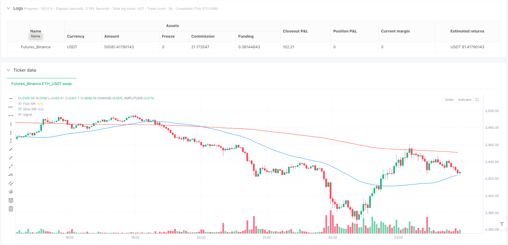
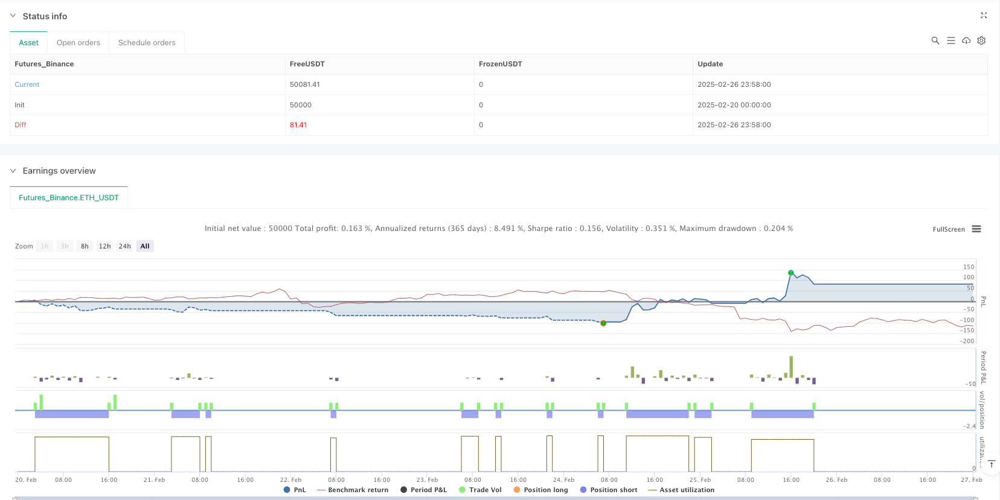

> Name

Adaptive-Volatility-Based-Trend-Following-Short-Strategy-with-Time-Delay-and-Stop-Loss-Protection
> Author

ianzeng123

> Strategy Description





[trans]
# Overview
This article will detail a quantitative trading strategy called "Adaptive Volatility Trend Following Short Strategy with Time Delay and Stop Loss Protection." This strategy focuses on identifying downtrends and executing short trades, optimizing trading performance through multiple filtering mechanisms, time-delayed exits, and stop-loss protection. The core of this strategy uses fast and slow moving average crossovers and price breakouts to confirm the trend direction, while combining volatility filtering and range filtering to improve transaction quality. In addition, the strategy is designed with a time delay mechanism and percentage stop loss to balance profit opportunities and risk management.
# Strategy principle
This short strategy is based on the following core technical principles:
1. **Double Moving Average Trend Confirmation**: The strategy uses the relative positions of the fast moving average (FMA) and the slow moving average (SMA) to determine the trend direction. When the FMA is below the SMA, it indicates a possible downtrend. The strategy further requires price to cross below the FMA as an entry signal, which provides stronger trend confirmation.
2. **Adaptive filtering system**:
   - **Volatility Filter**: Ensure that the market volatility is large enough through the Average True Range (ATR) indicator. The strategy only considers entries when the ATR is above a certain threshold, avoiding trading in low volatility or stagnant markets.
   - **Range Filter**: Calculate the price range within the specified lookback period and avoid entering when the range is too small (indicating that the market is moving sideways), thereby focusing on trending markets.
3. **Time-Based Exit Mechanism**: The strategy implements a time delay before considering cross exit signals, allowing trades to continue for a predetermined period of time, increasing the chance of realizing profit potential. After a delay, close the short position when the price or FMA moves back above the SMA, indicating a potential trend reversal.
4. **Stop loss mechanism**: Use a percentage stop loss based on the entry price. When the price moves in the opposite direction and reaches the stop loss level, the position is automatically closed to limit potential losses.
The specific transaction logic is as follows:
- Entry conditions: FMA is lower than SMA, volatility conditions are met, range conditions are not met, and price falls below FMA
- Exit conditions: After a time delay, the price or FMA crosses the SMA, or triggers a stop loss
#Strategic advantage
After in-depth analysis of the strategy code, we can summarize the following significant advantages:
1. **Multiple confirmation mechanism**: The strategy not only relies on moving average crossovers, but also combines price breakthroughs, volatility conditions and interval analysis to provide multiple confirmations and reduce the possibility of false signals.
2. **Adaptive market conditions**: Through volatility filtering (ATR) and interval filtering, the strategy can adapt to different market environments, only trade under favorable conditions, and avoid entering the market under inappropriate market conditions.
3. **Balance risk and return**: The time delay exit mechanism allows the trend to fully develop and avoids premature exit from potential profit trends, while the percentage stop loss protection provides a clear risk control boundary.
4. **Flexible parameter settings**: The strategy provides multiple adjustable parameters, including moving average length, ATR sensitivity, range percentage, lookback period, delay time and stop loss percentage, allowing traders to adjust according to specific markets and personal risk preferences.
5. **Transparent Logic**: The policy logic is clear and clear, and the role and interaction of each component are clearly defined, making it easy to understand and monitor.
6. **Automated Execution**: The strategy is completely automated, from entry signal recognition to stop loss triggering and time-delay exit, reducing the impact of emotional factors.
#Strategy risk
Although this strategy is well designed, there are still the following potential risks and challenges:
1. **Market reversal risk**: In a strongly reversing market, even with stop-loss protection, the strategy may still suffer large losses, especially when there is a large gap in the market.
   - **Workaround**: Consider adding a volatility-adjusted stop, tightening the stop during periods of high volatility, or adding a trend strength filter.
2. **Parameter Sensitivity**: Strategy performance is highly dependent on parameter settings. Improper parameter selection may lead to over-trading or missed opportunities.
   - **Solution**: Conduct thorough historical backtesting and use stepwise optimization methods to find robust parameter combinations rather than over-optimization.
3. **Time Delay Risk**: Fixed time delays may not apply to all market conditions and may result in delayed exits in rapidly changing markets.
   - **Workaround**: Consider implementing an adaptive time delay that adjusts the delay time based on current market volatility or trend strength.
4. **Range Market Performance**: Despite the range filter, the strategy may not perform well in range markets, especially when the market moves within the range but does not meet the filter criteria.
   - **Workaround**: Add more complex market structure analysis, such as support/resistance identification or volatility pattern identification.
5. **Reliance on Historical Data**: The lookback window for calculating range highs/lows may be less than ideal when market conditions change.
   - **Workaround**: Consider implementing an adaptive lookback window that automatically adjusts based on market cycles or volatility.
# Strategy optimization direction
Based on the existing framework of strategies, the following are several potential optimization directions:
1. **Dynamic Parameter Adjustment**: Implement a parameter system that automatically adjusts based on market conditions, especially the moving average length and ATR sensitivity. This allows the strategy to better adapt to changes in market structure and seamlessly switch between trend and range markets.
2. **Enhanced admission filtering**:
   - Integrated trend strength indicators (such as ADX or Trend Direction Index)
   - Added volume confirmation to verify the reliability of price breakouts
   - Consider support/resistance levels as additional entry conditions
3. **Optimize stop loss strategy**:
   - Implement trailing stops to lock in profits as trades become favorable
   - Added volatility-based adaptive stops to provide broader protection during periods of high volatility
   - Consider adding a partial liquidation mechanism to reduce risk exposure when certain profit targets are reached
4. **Multiple time frame analysis**: Integrate trend confirmation of higher time frames to ensure that the trading direction is consistent with the larger trend, which can improve the winning rate and risk-reward ratio of the strategy.
5. **Market status classification**: Realize the model's ability to automatically identify different market status (strong trend, weak trend, range) based on volatility, trend strength and price structure, and adjust strategy parameters accordingly.
6. **Machine Learning Enhancement**: Consider integrating simple machine learning algorithms to predict optimal parameter settings or market states, which can make the system more adaptable and predictive.
7. **Sentiment Indicator Integration**: Add market sentiment or overbought/oversold indicators (such as RSI or MACD) as entry/exit confirmation to avoid entering the market under extreme market conditions.
# Summarize
"Adaptive Volatility Trend Following Short Strategy with Time Delay and Stop Loss Protection" is a well-designed trend following system for short market scenarios. It combines several key elements of technical analysis: moving average crossovers to identify trend direction, volatility and range filtering to improve entry quality, time-delayed exits and stop-loss protection to provide risk management.
The key advantages of this strategy are its multi-layered filtering system and clear risk management framework, making it suitable for finding trading opportunities in downtrending markets. However, as with all trading systems, successful application requires appropriate parameter tuning and ongoing monitoring.
By implementing the recommended optimizations, especially dynamic parameter adjustments and enhanced entry/exit conditions, the strategy can further improve its adaptability and robustness. Most importantly, traders should remember that even well-designed strategies require regular evaluation and adjustments to adapt to changing market conditions. ||
#Overview
This article presents a detailed examination of the "Adaptive Volatility-Based Trend-Following Short Strategy with Time Delay and Stop-Loss Protection." This quantitative trading strategy focuses on identifying downtrends and executing short positions, optimizing trading performance through multiple filtering mechanisms, time-delayed exits, and stop-loss protection. The strategy's core utilizes fast and slow moving average crossovers along with price breakouts to confirm trend direction, while incorporating volatility filtering and range filtering to enhance trade quality. Additionally, the strategy implements a time delay mechanism and percentage-based stop-loss to balance profit opportunities and risk management.

# Strategy Principles

This short strategy is based on several core technical principles:

1. **Dual Moving Average Trend Confirmation**: The strategy uses the relative position of a Fast Moving Average (FMA) and a Slow Moving Average (SMA) to determine trend direction. When the FMA falls below the SMA, it indicates a potential downtrend. The strategy further requires price to cross below the FMA as an entry signal, providing stronger trend confirmation.

2. **Adaptive Filtering System**:
   - **Volatility Filter**: Uses the Average True Range (ATR) indicator to ensure sufficient market volatility. The strategy only considers entry when ATR is above a specific threshold, avoiding trades in low-volatility or stagnant markets.
   - **Range Filter**: Calculates price range over a specified lookback period and avoids entry when the range is too small (indicating range-bound market), thus focusing on trending markets.

3. **Time-Based Exit Mechanism**: The strategy implements a time delay before considering crossover exit signals, allowing trades to run for a predetermined period, increasing the chance to realize profit potential. After the delay, the short position is closed when price or FMA crosses back above the SMA, indicating a potential trend reversal.

4. **Stop-Loss Mechanism**: Uses a percentage-based stop-loss calculated from the entry price, automatically closing the position when price moves adversely to reach the stop-loss level, limiting potential losses.

Specific trading logic is as follows:
- Entry conditions: FMA below SMA, volatility condition met, range condition not met, price crosses under FMA
- Exit conditions: Price or FMA crosses above SMA after time delay, or stop-loss triggered

# Strategy Advantages

After deep analysis of the strategy code, the following significant advantages can be summarized:

1. **Multiple Confirmation Mechanisms**: The strategy relies not only on moving average crossovers but also combines price breakouts, volatility conditions, and range analysis, providing multiple confirmations and reducing the possibility of false signals.

2. **Adaptive to Market Conditions**: Through volatility filtering (ATR) and range filtering, the strategy can adapt to different market environments, trading only under favorable conditions and avoiding entry during unsuitable market states.

3. **Balance Between Risk and Reward**: The time-delayed exit mechanism allows trends to develop fully, avoiding premature exits from potentially profitable trends, while the percentage-based stop-loss protection provides a clear risk control boundary.

4. **Flexible Parameter Settings**: The strategy offers multiple adjustable parameters, including moving average lengths, ATR sensitivity, range percentage, lookback period, delay time, and stop-loss percentage, enabling traders to adjust according to specific markets and personal risk preferences.

5. **Transparent Logic**: The strategy logic is clear and explicit, with each component's function and interaction clearly defined, facilitating understanding and monitoring.

6. **Automated Execution**: The strategy is fully automated, from entry signal identification to stop-loss triggering and time-delayed exits, reducing the influence of emotional factors.

# Strategy Risks

Despite the well-designed nature of this strategy, several potential risks and challenges exist:

1. **Market Reversal Risk**: In strongly reversing markets, the strategy may suffer significant losses even with stop-loss protection, especially when markets experience large gaps.
   - **Solution**: Consider adding volatility-adjusted stop-loss mechanisms, tightening stops during high-volatility periods, or incorporating trend strength filters.

2. **Parameter Sensitivity**: Strategy performance is highly dependent on parameter settings; inappropriate parameter selection may lead to overtrading or missed opportunities.
   - **Solution**: Conduct thorough historical backtesting, using walk-forward optimization methods to find robust parameter combinations rather than over-optimizing.

3. **Time Delay Risk**: Fixed time delays may not be suitable for all market conditions, potentially causing delayed exits in rapidly changing markets.
   - **Solution**: Consider implementing adaptive time delays, adjusting delay times based on current market volatility or trend strength.

4. **Range-Bound Market Performance**: Despite having a range filter, the strategy may perform poorly in range-bound markets, especially when markets fluctuate within ranges but don't meet filtering conditions.
   - **Solution**: Add more sophisticated market structure analysis, such as support/resistance identification or volatility pattern recognition.

5. **Dependence on Historical Data**: The lookback window for calculating range highs/lows may not be optimal when market conditions change.
   - **Solution**: Consider implementing adaptive lookback windows that automatically adjust according to market cycles or volatility.

# Strategy Optimization Directions

Based on the strategy's existing framework, here are several potential optimization directions:

1. **Dynamic Parameter Adjustment**: Implement a system that automatically adjusts parameters based on market conditions, especially moving average lengths and ATR sensitivity. This would allow the strategy to better adapt to changes in market structure, seamlessly switching between trending and range-bound markets.

2. **Enhanced Entry Filtering**:
   - Integrate trend strength indicators (such as ADX or Directional Movement Index)
   - Add volume confirmation to validate price breakout reliability
   - Consider support/resistance levels as additional entry conditions

3. **Optimized Stop-Loss Strategy**:
   - Implement trailing stops that lock in profits as trades move favorably
   - Add volatility-based adaptive stop-losses that provide wider protection during high-volatility periods
   - Consider adding partial position closing mechanisms to reduce exposure after reaching specific profit targets

4. **Multi-Timeframe Analysis**: Incorporate trend confirmation from higher timeframes to ensure trade direction aligns with larger trends, which can improve win rates and risk-reward ratios.

5. **Market State Classification**: Implement the model's ability to automatically identify different market states (strong trend, weak trend, range-bound) based on volatility, trend strength, and price structure, and adjust strategy parameters accordingly.

6. **Machine Learning Enhancement**: Consider integrating simple machine learning algorithms to predict optimal parameter settings or market states, making the system more adaptive and predictive.

7. **Sentiment Indicator Integration**: Add market sentiment or overbought/oversold indicators (such as RSI or MACD) as entry/exit confirmations, avoiding entries during extreme market conditions.

# Summary

The "Adaptive Volatility-Based Trend-Following Short Strategy with Time Delay and Stop-Loss Protection" is a well-designed trend-following system tailored for short market scenarios. It combines several key elements of technical analysis: moving average crossovers to identify trend direction, volatility and range filtering to improve entry quality, and time-delayed exits and stop-loss protection for risk management.

The main advantages of the strategy lie in its multi-layered filtering system and clear risk management framework, making it suitable for seeking trading opportunities in downtrending markets. However, like all trading systems, successful application requires appropriate parameter adjustments and ongoing monitoring.

By implementing the suggested optimizations, particularly dynamic parameter adjustments and enhanced entry/exit conditions, the strategy can further improve its adaptability and robustness. Most importantly, traders should remember that even well-designed strategies require regular evaluation and adjustment to adapt to ever-changing market conditions.[/trans]


> Source (PineScript)

``` pinescript
/*backtest
start: 2025-02-20 00:00:00
end: 2025-02-27 00:00:00
period: 2m
basePeriod: 2m
exchanges: [{"eid":"Futures_Binance","currency":"ETH_USDT"}]
*/

//@version=5
strategy("Profit Guard Short Strategy with Time Delay & Stop Loss", shorttitle="PGSS", overlay=true)

// Inputs
fastMA_length = input.int(50, title="Fast MA Length")
slowMA_length = input.int(200, title="Slow MA Length")
atrLength = input.int(14, title="ATR Length")
atrSensitivity = input.float(1.0, title="ATR Sensitivity")
rangePercent = input.float(0.03, title="Range Percent (%)")
rangeLookback = input.int(20, title="Range Lookback")
delayMinutes = input.int(10, title="Delay Before Close (Minutes)")
stopLossPercent = input.float(0.5, title="Stop Loss (%)")
shortAlertMsg = input.string("Short", title="Short Alert Message")
closeAlertMsg = input.string("Close", title="Close Alert Message")
stopLossAlertMsg = input.string("Stop loss!", title="Stop Loss Alert Message") // Custom stop loss alert message

// Calculations
fastMA = ta.sma(close, fastMA_length)
slowMA = ta.sma(close, slowMA_length)
atr = ta.atr(atrLength)
atrMA = ta.sma(atr, atrLength * 2)
volatilityCondition = atr > atrMA * atrSensitivity

rangeHigh = ta.highest(high, rangeLookback)
rangeLow = ta.lowest(low, rangeLookback)
rangeSize = (rangeHigh - rangeLow) / ta.sma(close, rangeLookback) * 100
rangeCondition = rangeSize < rangePercent

fmaBelowSma = fastMA < slowMA
crossDownFma = ta.crossunder(close, fastMA)
crossUpSma = ta.crossover(close, slowMA)
smaCrossUp = ta.crossover(fastMA, slowMA)

// Persistent Variables
var bool shortPositionOpen = false
var float shortEntryPrice = na
var int entryTime = na

// Strategy Logic
if (fmaBelowSma and volatilityCondition and not rangeCondition)
    if (crossDownFma and not shortPositionOpen)
        strategy.entry("Short", strategy.short)
        shortPositionOpen := true
        shortEntryPrice := close
        entryTime := time

    if (shortPositionOpen)
        stopLossPrice = shortEntryPrice * (1 + stopLossPercent / 100)
        if (high >= stopLossPrice)
            strategy.close("Short", comment="Stop Loss")
            shortPositionOpen := false
            shortEntryPrice := na
            entryTime := na
        else if (time >= entryTime + delayMinutes * 60 * 1000)
            if (crossUpSma or smaCrossUp)
                strategy.close("Short", comment="Close")
                shortPositionOpen := false
                shortEntryPrice := na
                entryTime := na

// Plotting
plot(fastMA, color=color.blue, title="Fast MA")
plot(slowMA, color=color.red, title="Slow MA")

// Alerts
if (fmaBelowSma and crossDownFma and not shortPositionOpen[1] and volatilityCondition and not rangeCondition)
    alert(shortAlertMsg)

if (shortPositionOpen[1] and high >= shortEntryPrice[1] * (1 + stopLossPercent / 100))
    alert(stopLossAlertMsg) // Use custom stop loss alert message

if (shortPositionOpen[1] and time >= entryTime[1] + delayMinutes * 60 * 1000 and (crossUpSma or smaCrossUp))
    alert(closeAlertMsg)
```

> Detail

https://www.fmz.com/strategy/484090

> Last Modified

2025-02-28 09:42:59
