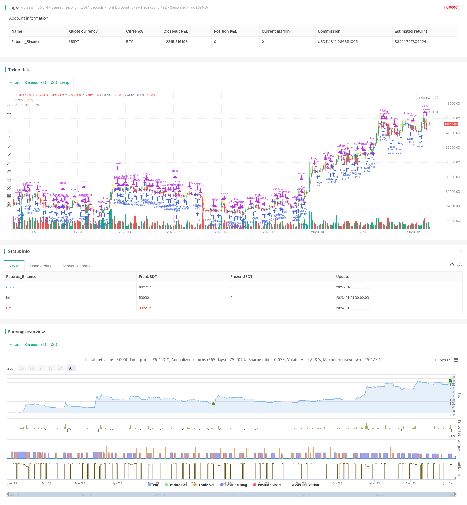

> Name

Adaptive-Volatility-Breakout-Strategy
> Author

ChaoZhang

> Strategy Description


[trans]

## Overview
The adaptive volatility breakout strategy is a trend following strategy. It works by identifying breakout signals of a strong rise above a "certain level", establishing a long position, continuing to track the upward trend, and taking profits at the opening of the next day.
This strategy was developed by Larry R. Williams, a well-known futures and stock trader. This strategy attempts to capture price breakthrough points, which often herald a turning point in the market. By promptly identifying these signals and opening positions, you can track new market trends and gain profits.
## Strategy Principle
The core indicator of this strategy is "certain level", which is calculated by the following formula:
```
一定水平 = 收盘价 + k * (最高价 - 最低价)
```

where k is the empirical coefficient, with a value of 0.6. This formula adds the variability component of the highest price and the lowest price, making the breakthrough point more flexible and able to adapt to market fluctuations.
When the day's highest price exceeds the calculated "certain level", it indicates a price breakthrough, and the strategy will establish a long position at this time. All positions will be closed for profit when the market opens the next day.
The stop loss level is set to the lowest price of the previous day and half of the entry price to prevent losses from expanding.
## Advantage Analysis
This strategy has the following advantages:
1. Capture variability and follow the trend: The strategy adds the highest price and lowest price to calculate breakthrough points, making the breakthrough signal more flexible and able to capture the rhythm of price changes.
2. Enter the market in a timely manner and follow the trend: By calculating breakthrough signals daily, you can identify new trends in a timely manner and keep up with the pace of price increases.
3. Risk control is in place: reasonable stop loss positions are set to effectively control single losses.
## Risk Analysis
This strategy also has the following risks:
1. Breakthrough failure risk: Price breakthroughs may not necessarily continue to rise and may be short-term false breakthroughs. Loss will occur at this time.
2. Extreme market risk: Under extreme market conditions such as stock market crashes and emergencies, prices may experience gaps and gaps, causing stop losses to be triggered and resulting in large losses.
3. Excessive trading risk: Daily opening and closing of positions will increase the frequency of transactions and the burden of handling fees.
## Strategy optimization
This strategy can be optimized from the following perspectives:
1. Add a multiplier: Add a multiplier to the breakthrough calculation formula. When the market volatility increases, adjust the multiplier appropriately. When the market is stable, increase the multiplier appropriately to make the strategy more flexible.
2. Extend the holding time: Extend the holding time to 2 or 3 days to filter out short-term false breakthroughs.
3. Optimize the stop loss position: Set the stop loss position to a deeper support position, such as the lower limit of the Bollinger Bands, the previous day's closing price, etc.
## Summarize
The adaptive volatility breakout strategy enables trend following by tracking price variability and rhythm in real time. Compared with traditional breakthrough strategies, it is more flexible and capable of capturing. But you also need to pay attention to risks. Stop loss may be breached under extreme market conditions. Better results can be obtained through position time and stop loss optimization.
||

## Overview

The Adaptive Volatility Breakout Strategy is a trend-following strategy. It identifies breakout signals when prices rise strongly above a "certain level", establishes long positions, and continues to track the uptrend to profit at the next day's open.

The strategy was proposed by Larry R. Williams, a famous futures and stock trader. It tries to capture price breakout points, which often signify turns in the market. By timely identifying these signals and establishing positions, profits can be obtained by following new trend directions.

## Principle  

The core metric of this strategy is the "certain level", calculated by:

```
Certain level = Close + k * (High - Low) 
```

Where k is an empirical coefficient, valued at 0.6. This formula incorporates the volatility of highest and lowest prices, making the breakout points more flexible to adapt to market fluctuations.

When the day's highest price breaks through the calculated "certain level", it indicates a price breakout. The strategy will then establish a long position. The position will be entirely closed at the next day's open for profit.

The stop loss is set to half of the previous day's lowest price and entry price, preventing the loss from expanding.

## Advantage Analysis

The advantages of this strategy include:

1. Capturing volatility, trend-following: The strategy incorporates highest and lowest prices to calculate flexible breakout points that capture price fluctuation rhythms. 

2. Timely entry, trend tracking: Daily calculation of breakout signals allows timely identification of new trends to follow up price uptrend steps.

3. Proper risk control: Reasonable stop loss setting effectively controls single loss.

## Risk Analysis   

Risks of this strategy include:

1. Failed breakout risk: Price breakouts do not necessarily sustain an uptrend and may be short-term false breakouts, causing losses.

2. Extreme market risk: In extreme market events like market crashes, prices may gap up/down causing stop loss triggers and huge losses.  

3. Excessive trading risk: Daily opening and closing of positions increases trading frequency and commission fees.  

## Optimization

The strategy can be optimized from the following aspects:

1. Adding a multiplier: Adding a multiplier to the breakout formula, properly reducing it when market volatility rises and increasing it when the market stabilizes, making the strategy more elastic.

2. Extending holding period: Extending the holding period to 2 or 3 days to filter out short-term false breakouts.
  
3. Optimizing stop loss: Setting stop loss to deeper support levels like Bollinger lower band or previous day's close.

## Conclusion  

The Adaptive Volatility Breakout Strategy tracks trends by dynamically tracking price volatility and rhythms. Compared to traditional breakout strategies, it is more flexible and capable in capturing price movements. But risks should be noted that stops can be hit in extreme markets. Further optimizations on holding period and stop loss can lead to better results.

[/trans]

> Strategy Arguments


|Argument|Default|Description|
|----|----|----|
|v_input_float_1|0.6|k|


> Source (PineScript)

``` pinescript
/*backtest
start: 2023-01-01 00:00:00
end: 2024-01-07 00:00:00
period: 1d
basePeriod: 1h
exchanges: [{"eid":"Futures_Binance","currency":"BTC_USDT"}]
*/

// This source code is subject to the terms of the Mozilla Public License 2.0 at https://mozilla.org/MPL/2.0/
// © Dicargo_Beam

//@version=5
strategy("Volatility Breakout Strategy", overlay=true, default_qty_type= strategy.percent_of_equity, default_qty_value=100,process_orders_on_close=false)

k = input.float(0.6)


[o,h,l,c] = request.security(syminfo.tickerid,"D",[open,high,low,close])

lp = math.log(c[1])+(math.log(h[1])-math.log(l[1]))*k
_lp = math.pow(2.718,lp)

longcond = _lp < high
exit = hour==0 or  math.log(close) < (math.log(l[1])+lp)/2


plot(_lp,"Entry",color=color.yellow)
//plot(l,"Yesterday's Low")
plot((_lp+l[1])/2,"StopLoss",color=color.red)


strategy.entry("Long", strategy.long,comment = "Long", when = longcond and strategy.opentrades == 0)

strategy.close("Long", comment="Exit", when = exit)


var bg = 0
bg := if hour == 0
    bg + 1
else
    bg[1]

bgcolor(bg/2== math.floor(bg/2) ? color.new(color.blue,95):na)


```

> Detail

https://www.fmz.com/strategy/438036

> Last Modified

2024-01-08 14:38:31
