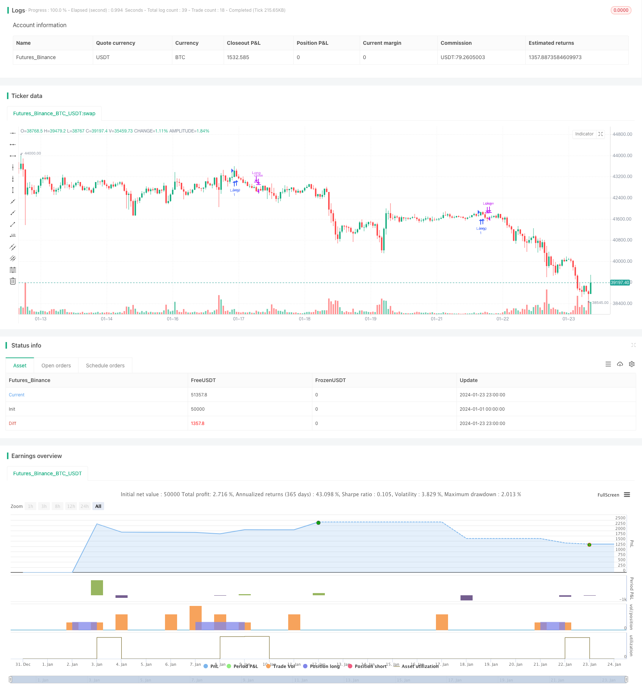

> Name

Adaptive-Volatility-Breakout that takes into account trends and reversals
> Author

ChaoZhang

> Strategy Description


 [trans]

## Overview
This strategy first combines the volume and price indicator VFI and the moving average to determine the trend, and then combines the Bollinger Bands indicator to determine the reversal event, achieving an organic combination of trend trading and shock trading.
## Strategy Principle
This strategy mainly consists of the following parts:
1. The VFI indicator determines the trend. Combine the logarithmic change rate of typical prices and changes in trading volume to determine the price trend and achieve a reasonable matching of volume and price.
2. EMA difference indicator determines the trend. Calculate the difference ratio between the 20-day line and the 50-day line to determine the medium and long-term trend direction.
3. The Bollinger Bands indicator determines reversal. The middle rail of Bollinger Bands is the 20-day simple moving average, and the bandwidth is 1.5 times the standard deviation of the middle rail. A trading signal is issued when the price breaks through the upper and lower bands.
4. The VFI indicator amplitude judgment is reversed. When the VFI value is close to the upper and lower limits (0, 20), it is considered that the trend reversal is more likely.
Under the conditions of meeting the trading time period, when the price breaks through the upper Bollinger Band and the VFI and EMA difference indicators are bullish in the same direction, go long; when the price falls below the lower Bollinger Band or VFI reaches a certain threshold, close the position.
## Strategic Advantages
1. The introduction of the VFI indicator makes the volume-price relationship more reasonable and avoids blindly following prices.
2. The combination of EMA difference judgment and VFI makes trend judgment more stable and reliable.
3. The combination of Bollinger Bands and the reversal judgment of the VFI indicator makes the strategy more suitable for the two-way fluctuations of the market.
## Strategy Risk
1. Volume and price indicators cannot completely avoid the risk of false breakthroughs.
2. There is a certain lag in the EMA difference and it is unable to respond promptly to short-term changes.
3. Improper setting of Bollinger Band parameters may lead to frequent trading or captured market risks.
Solutions corresponding to risks:
1. Combine more indicators to determine trends and avoid relying on a single indicator.
2. The EMA parameters should not be too large or too small, adjust the parameters appropriately.
3. Test the impact of changes in Bollinger Band parameters on strategies under different market conditions.
## Strategy optimization direction
1. Continue to optimize VFI parameters to make it more sensitive.
2. Add breakthrough judgment based on price channels or Envelopes indicators.
3. Test the introduction of more volume and price indicators, such as OBV, PVT, etc.
4. Introduce machine learning and AI technology to achieve dynamic optimization of parameters.
## Summarize
This strategy comprehensively considers trend judgment and reversal judgment, and uses VFI, EMA difference and Bollinger Band indicators to capture two-way market fluctuations. The next step will be to continue to optimize parameter settings, enrich the basis for judgment, expand the scope of application, and improve the stable profitability of the strategy.
||

## Overview

This strategy combines the trend-following metrics VFI and Moving Averages with the reversal indicator Bollinger Bands to adaptively catch trends and reversals in the market.

## Strategy Logic

The main components of this strategy are:

1. VFI indicator to determine the trend. It uses the logarithmic rate of change of typical price and trading volume to reasonably match price and volume.

2. EMA difference indicator to determine trend. It calculates the percentage difference between 20-day EMA and 50-day EMA to judge the mid-long term trend direction.  

3. Bollinger Bands to detect reversals. The middle band is 20-day SMA, and the width of the bands is 1.5 standard deviation of the middle band. Trading signals are generated when price breaks the upper or lower band.

4. VFI amplitude to detect exhaustion. When VFI is approaching its limits (0, 20), the probability of trend reversal is considered to be higher.

When price breaks above the upper Bollinger Band and VFI and EMA difference indicates upward trend, go long. When price breaks below the lower band or VFI reaches a threshold, close position.

## Advantages

1. The introduction of VFI makes the price-volume relationship more reasonable and avoids blindly following prices.

2. The combination of EMA difference and VFI makes trend determination more reliable. 

3. The combination of Bollinger Bands and VFI makes the strategy more adaptable to the two-way fluctuations in the market.

## Risks

1. Volume-price indicators cannot completely avoid the risk of false breakouts.

2. EMA difference has some lag and cannot react timely to short-term turns.

3. Improper parameters of Bollinger Bands may lead to overtrading or capturing the market.

Solutions:

1. Combine more indicators to determine the trend to avoid relying on a single one.  

2. Adjust EMA parameters to proper values.

3. Test the impacts of Bollinger parameters on the strategy in different market conditions.


## Optimization Directions  

1. Continue optimizing VFI parameters to make it more sensitive.

2. Add breakout judgment based on price channels or Envelopes indicator. 

3. Test the introduction of more volume-price indicators like OBV, PVT etc.

4. Introduce machine learning and AI techniques to realize dynamic parameter optimization.

## Conclusion

This strategy comprehensively considers trend following and reversal detection with VFI, EMA difference and Bollinger Bands to catch two-way market fluctuations. The next step is to continue optimizing parameters, enrich judgment metrics, expand applicability, and improve profitability.

[/trans]

> Strategy Arguments


|Argument|Default|Description|
|----|----|----|
|v_input_1|130|VFI length|
|v_input_2|0.2|coef|
|v_input_3|2.5|Max. vol. cutoff|
|v_input_4|5|signalLength|
|v_input_5|0400-0935|pre|
|v_input_6|0945-1700|trade_session|


> Source (PineScript)

``` pinescript
/*backtest
start: 2024-01-01 00:00:00
end: 2024-01-24 00:00:00
period: 1h
basePeriod: 15m
exchanges: [{"eid":"Futures_Binance","currency":"BTC_USDT"}]
*/

// This source code is subject to the terms of the Mozilla Public License 2.0 at https://mozilla.org/MPL/2.0/
// © beststockalert

//@version=4

strategy(title="Super Bollinger Band Breakout", shorttitle = "Super BB-BO", overlay=true)
source = close

length = input(130, title="VFI length")
coef = input(0.2)
vcoef = input(2.5, title="Max. vol. cutoff")
signalLength=input(5)


// session 


pre = input( type=input.session, defval="0400-0935")
trade_session = input( type=input.session, defval="0945-1700")
use_trade_session = true
isinsession = use_trade_session ? not na(time('1', trade_session)) : true


is_newbar(sess) =>
    t = time("D", sess)
    not na(t) and (na(t[1]) or t > t[1])


is_session(sess) =>
    not na(time(timeframe.period, sess))

preNew = is_newbar(pre)
preSession = is_session(pre)

float preLow = na
preLow := preSession ? preNew ? low : min(preLow[1], low) : preLow[1]

float preHigh = na
preHigh := preSession ? preNew ? high : max(preHigh[1], high) : preHigh[1]


//   vfi 9lazybear 
ma(x,y) => 0 ? sma(x,y) : x

typical=hlc3
inter = log( typical ) - log( typical[1] )
vinter = stdev(inter, 30 )
cutoff = coef * vinter * close
vave = sma( volume, length )[1]
vmax = vave * vcoef
vc = iff(volume < vmax, volume, vmax) //min( volume, vmax )
mf = typical - typical[1]
vcp = iff( mf > cutoff, vc, iff ( mf < -cutoff, -vc, 0 ) )

vfi = ma(sum( vcp , length )/vave, 3)
vfima=ema( vfi, signalLength )


//ema diff


ema20 = ema(close,20)
ema50 = ema(close,50)


diff = (ema20-ema50)*100/ema20
ediff = ema(diff,20)

//
basis = sma(source, 20)
dev = 1.5 * stdev(source, 20)

upper = basis + dev
lower = basis - dev


ema9 = ema(source, 9)

if ( ((crossover(source, upper) and diff>ediff and diff>0) or (close>upper and (vfi >0 or vfima>0 or ediff>0.05) and (vfi<14 or vfima<14)) ))
    strategy.entry("Long", strategy.long)


if (crossunder(source, lower) or vfi>19 or vfima>19 or diff<(ediff+0.01) )
    strategy.close("Long")


```

> Detail

https://www.fmz.com/strategy/439961

> Last Modified

2024-01-25 12:43:43
