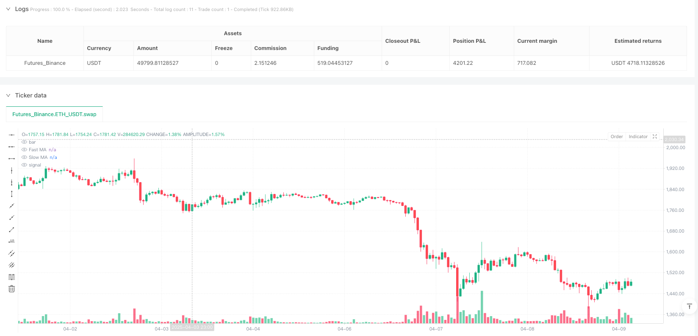
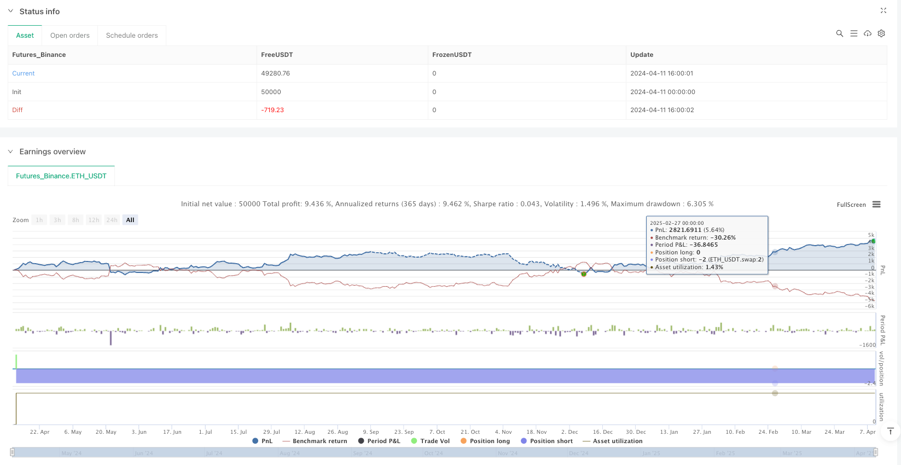

> Name

Adaptive-Volatility-Multi-Indicator-Trend-Following-Trading-System
> Author

ianzeng123

> Strategy Description





[trans]

#### Overview
The adaptive volatility multi-indicator trend following trading system is a quantitative trading strategy designed for highly volatile markets that combines dynamically adjusted technical indicators with advanced risk management mechanisms. The core of this strategy is to dynamically adjust the moving average parameters through ATR (average true range) to achieve adaptation to market fluctuations. At the same time, it integrates functions such as RSI overbought and oversold filtering, candlestick pattern recognition, multi-time period trend confirmation, and progressive position building (DCA) to form a comprehensive trading framework. This strategy is particularly suitable for high-volatility environments such as futures markets, providing a flexible operating mode for intraday trading and swing trading.
#### Strategy Principle
The core principles of the strategy are based on the following key modules:
1. **Adaptive Moving Average System**: The strategy uses fast and slow simple moving averages (SMA), whose length is dynamically adjusted through ATR. In a high-volatility environment, the moving average length is shortened to quickly respond to market changes; in a low-volatility environment, the moving average length is lengthened to reduce noise. The long signal is generated when the fast moving average crosses the slow moving average and is confirmed by price; the short signal is the opposite.
2. **RSI Momentum Filter**: Verify entry signals through RSI (relative strength index) to ensure that the trading direction is consistent with market momentum. This function can be turned on or off, and supports custom RSI parameters (such as length 14, overbought 60, oversold 40).
3. **Candlestick Pattern Recognition**: The system is able to identify strong bullish or bearish engulfing patterns and verify them in combination with volume and range strength. To avoid false signals, the system skips trades when two opposite patterns occur simultaneously.
4. **Multi-time period trend confirmation**: You can selectively align trading signals with the SMA trend of the 15-minute time period, adding a layer of confirmation mechanism to improve transaction quality.
5. **Gradual position building (DCA) mechanism**: Multiple entries are allowed in the trend direction, up to a preset number of entries (such as 4 times), and the entry interval is based on the ATR multiple setting. This mechanism helps optimize average cost in markets where trends continue.
6. **Advanced Risk Management**:
   - Initial Stop Loss: Apply a wider fixed stop loss multiple (e.g. 1.3) on the entry bar based on the ATR setting (usually 2-3.5x).
   - Trailing stop: uses the offset and multiplier of the ATR basis, dynamically adjusting as profits increase (e.g. when profits exceed ATR, the multiplier decreases from 0.5 to 0.3).
   - Take profit target: Set at a specific multiple of the entry price ±ATR (such as 1.2).
   - Cooling down period: a pause period (0-5 minutes) after exit to prevent over-trading.
   - Minimum holding time: ensures that the trade lasts for a certain number of bars (e.g. 2-10).
7. **Trade Execution Logic**: The system prioritizes moving average or candlestick pattern signals (based on user selection) and applies volume, volatility and time filters. In order to ensure the quality of entry, the peak trading volume condition is also added (trading volume >1.2*10 period SMA).
#### Strategic Advantages
1. **Strong market adaptability**: By dynamically adjusting technical indicator parameters through ATR, the strategy can automatically adapt to different market conditions and remain effective in both high-volatility and low-volatility environments.
2. **Signal Quality Screening**: A multi-layer filtering mechanism (RSI, multi-time period trends, trading volume and volatility) effectively reduces false signals and improves transaction quality.
3. **Flexible entry mechanism**: Supports the priority use of moving average or candlestick pattern signals according to user preferences, and optimizes entry points in the trend direction through the DCA function.
4. **Dynamic Risk Management**: The stop loss point and trailing stop loss are dynamically adjusted with market fluctuations and trading profits, protecting capital while giving the trend enough room for development.
5. **Visualization and debugging tools**: The strategy provides rich chart overlays, real-time dashboards and debugging tables to help users optimize parameters and understand trading logic.
6. **Modular design**: Users can turn on or off various functions (such as RSI filtering, candlestick pattern recognition, multi-time period trends, etc.) according to preferences, which is highly customized.
7. **Fine-grained entry control**: Volume spike filters ensure that entries are only made during significant market activity, while a cooling-off period mechanism prevents over-trading.
#### Strategy Risk
1. **Parameter sensitivity**: The strategy uses multiple parameters (such as moving average length, ATR period, RSI threshold, etc.). The settings of these parameters have a significant impact on performance. Improper parameter combinations may lead to over-fitting historical data.
*Solution*: Conduct extensive parameter optimization testing, but avoid over-optimization; use walk-forward testing and out-of-sample testing to verify strategy robustness.
2. **Market transition risk**: When the market model changes rapidly (such as from trend to shock), the strategy may generate continuous losses before adapting to the new environment.
*Solution*: Consider adding a market status recognition mechanism and using different parameter sets in different market environments; implement overall risk limits, such as a maximum daily loss or suspending trading after continuous losses.
3. **Slippage and Liquidity Issues**: High-frequency trading and volatile markets may face the risk of increased slippage and reduced liquidity.
*Solutions*: Include realistic slippage and commission estimates in backtests; avoid trading during periods of low liquidity; consider using limit orders instead of market orders.
4. **System Complexity**: Multiple layers of logic and conditional combinations increase the complexity of the policy, which may be difficult to understand and maintain.
*Solution*: Use the debugging tools provided by the strategy to closely monitor the performance of each component; maintain good code comments; consider the independent effect of each component in modular testing.
5. **Over-trading risk**: The DCA mechanism and frequent signal generation may lead to over-trading and increase transaction costs.
*Solution*: Set the cooling period and minimum holding time appropriately; strictly consider transaction costs in backtesting; regularly review and optimize entry standards.
#### Optimization direction
1. **Machine Learning Enhancement**: Introduce adaptive parameter optimization algorithms, such as Bayesian optimization or genetic algorithms, to automatically find the best parameter combination for different market environments. This will reduce the need for manual optimization and improve the strategy's adaptability to market changes.
2. **Market Environment Classification**: Develop a market status classification system (trend, shock, high volatility, low volatility, etc.), and preset the optimal parameter configuration for each status. This approach allows for faster adjustment of strategic behavior during market transitions and reduces adaptation lag.
3. **Enhanced Position Management**: Introduce more complex position management algorithms, such as dynamic position adjustment based on the Kelly criterion or momentum strength. This optimizes capital utilization, increasing exposure during strong signals and reducing risk during weak signals.
4. **Alternative Indicator Integration**: Test the effectiveness of other technical indicators, such as Bollinger Bands, MACD or Ichimoku Clouds, as a complement or replacement for the existing system. Different indicators may provide more accurate signals under specific market conditions.
5. **Sentiment Data Integration**: Consider adding market sentiment indicators such as the VIX Volatility Index or options market data to identify potential market transitions in advance. These external data sources can provide information that traditional technical indicators cannot capture.
6. **Multi-asset correlation analysis**: Develop correlation analysis across asset classes, using signals from one market to validate or strengthen trading decisions in another related market. For example, use commodity price movements to confirm trends in related stock sectors.
7. **Optimize computational efficiency**: Refactor the code to improve computational efficiency, especially for high-frequency strategies. This includes optimizing ATR calculations, condition evaluation order and reducing unnecessary double calculations.
#### Summary
The adaptive volatility multi-indicator trend following trading system represents a comprehensive and flexible quantitative trading method that effectively responds to different market environments through dynamic parameter adjustment and multi-layer filtering mechanisms. The core strength of the strategy is its adaptive nature and comprehensive risk management framework, making it particularly suitable for the more volatile futures markets.
This strategy integrates a variety of classic technical analysis tools (moving averages, RSI, candlestick patterns), while adding modern quantitative trading elements (adaptive parameters, multi-time period analysis, DCA) to form a balanced system. By carefully controlling the timing of entry, optimizing multiple entry strategies and dynamically adjusting stop loss levels, this strategy can make full use of market trend opportunities while protecting capital.
However, the complexity of the strategy also brings parameter sensitivity and system maintenance challenges. Investors should conduct sufficient backtesting and forward testing before implementing this strategy, and be prepared to adjust parameters according to market changes. Future optimization directions include introducing machine learning technology to automatically optimize parameters, adding market environment classification systems and improving position management algorithms. These improvements will further enhance the robustness and adaptability of the strategy.
Overall, the strategy provides a solid quantitative trading framework that can be customized by experienced traders looking for a consistent trading edge in today's ever-changing financial markets, based on their specific needs and risk appetite. ||

#### Overview
The Adaptive Volatility Multi-Indicator Trend Following Trading System is a quantitative trading strategy designed for high-volatility markets, combining dynamically adjusted technical indicators with advanced risk management mechanisms. The core of this strategy lies in using ATR (Average True Range) to dynamically adjust moving average parameters, achieving adaptability to market volatility, while integrating RSI overbought/oversold filtering, candlestick pattern recognition, multi-timeframe trend confirmation, and dollar-cost averaging (DCA) functions to form a comprehensive trading framework. This strategy is particularly suitable for high-volatility environments such as futures markets, providing flexible operational modes for intraday trading and swing trading.

#### Strategy Principles
The core principles of the strategy are based on the following key modules:

1. **Adaptive Moving Average System**: The strategy uses fast and slow Simple Moving Averages (SMA), with lengths dynamically adjusted through ATR. In high-volatility environments, moving average lengths shorten to quickly react to market changes; in low-volatility environments, lengths extend to reduce noise. Long signals are generated when the fast MA crosses above the slow MA with price confirmation; short signals work in reverse.

2. **RSI Momentum Filter**: Validates entry signals through RSI (Relative Strength Index), ensuring trade direction aligns with market momentum. This feature can be optionally enabled or disabled, and supports customized RSI parameters (such as length 14, overbought 60, oversold 40).

3. **Candlestick Pattern Recognition**: The system identifies strong bullish or bearish engulfing patterns, validated by volume and range strength. To avoid false signals, the system skips trades when both opposing patterns appear simultaneously.

4. **Multi-Timeframe Trend Confirmation**: Optionally aligns trading signals with the 15-minute timeframe SMA trend, adding an additional confirmation layer to improve trade quality.

5. **Dollar-Cost Averaging (DCA) Mechanism**: Allows multiple entries in the trend direction, supporting up to a preset number of entries (e.g., 4), with entry intervals based on ATR multiples. This mechanism helps optimize average cost in trending markets.

6. **Advanced Risk Management**:
   - Initial Stop: Based on ATR settings (typically 2-3.5x), with a wider fixed stop multiplier (e.g., 1.3) applied on the entry bar.
   - Trailing Stop: Uses ATR-based offset and multiplier, dynamically adjusted as profit increases (e.g., multiplier reduces from 0.5 to 0.3 when profit exceeds ATR).
   - Profit Target: Set at entry price ±ATR by a specific multiplier (e.g., 1.2).
   - Cooldown Period: Pause after exit (0-5 minutes) to prevent overtrading.
   - Minimum Hold Time: Ensures trades last a certain number of bars (e.g., 2-10).

7. **Trade Execution Logic**: The system prioritizes moving average or candlestick pattern signals (based on user preference), and applies volume, volatility, and time filters. To ensure entry quality, a volume spike condition is also added (volume > 1.2 * 10-period SMA).

#### Strategy Advantages
1. **Strong Market Adaptability**: By dynamically adjusting technical indicator parameters through ATR, the strategy can automatically adapt to different market conditions, maintaining effectiveness in both high and low volatility environments.

2. **Signal Quality Filtering**: Multi-layer filtering mechanisms (RSI, multi-timeframe trend, volume, and volatility) effectively reduce false signals, improving trade quality.

3. **Flexible Entry Mechanism**: Supports prioritizing moving average or candlestick pattern signals based on user preference, and optimizes entry points in the trend direction through DCA functionality.

4. **Dynamic Risk Management**: Stop-loss points and trailing stops adjust dynamically with market volatility and trade profits, protecting capital while giving trends sufficient room to develop.

5. **Visualization and Debugging Tools**: The strategy provides rich chart overlays, real-time dashboards, and debugging tables to help users optimize parameters and understand trading logic.

6. **Modular Design**: Users can enable or disable various features (such as RSI filtering, candlestick pattern recognition, multi-timeframe trend, etc.) according to preferences, offering high customization.

7. **Fine-tuned Entry Control**: Volume spike filters ensure entries only occur during significant market activity, while cooldown mechanisms prevent overtrading.

#### Strategy Risks
1. **Parameter Sensitivity**: The strategy uses multiple parameters (such as moving average lengths, ATR periods, RSI thresholds, etc.), and these settings significantly impact performance. Inappropriate parameter combinations may lead to overfitting historical data.

   *Solution*: Conduct extensive parameter optimization tests while avoiding over-optimization; use walk-forward testing and out-of-sample testing to verify strategy robustness.

2. **Market Transition Risk**: During rapid market mode transitions (e.g., from trending to ranging), the strategy may generate consecutive losses before adapting to the new environment.

   *Solution*: Consider adding market state recognition mechanisms, using different parameter sets for different market environments; implement overall risk limits, such as maximum daily loss or pausing after consecutive losses.

3. **Slippage and Liquidity Issues**: High-frequency trading and highly volatile markets may face increased slippage and reduced liquidity risks.

   *Solution*: Include realistic slippage and commission estimates in backtesting; avoid trading during low liquidity periods; consider using limit orders instead of market orders.

4. **System Complexity**: Multiple layers of logic and condition combinations increase strategy complexity, potentially making it difficult to understand and maintain.

   *Solution*: Use the strategy's debugging tools to closely monitor component performance; maintain good code comments; consider modular testing of each component's independent effect.

5. **Overtrading Risk**: DCA mechanisms and frequent signal generation may lead to overtrading, increasing transaction costs.

   *Solution*: Set appropriate cooldown periods and minimum holding times; strictly consider trading costs in backtesting; regularly review and optimize entry criteria.

#### Optimization Directions
1. **Machine Learning Enhancement**: Introduce adaptive parameter optimization algorithms, such as Bayesian optimization or genetic algorithms, to automatically find optimal parameter combinations for different market environments. This will reduce the need for manual optimization and improve strategy adaptability to market changes.

2. **Market Environment Classification**: Develop a market state classification system (trending, ranging, high volatility, low volatility, etc.), with preset optimal parameter configurations for each state. This approach can adjust strategy behavior more quickly during market transitions, reducing adaptation lag.

3. **Enhanced Position Management**: Introduce more sophisticated position management algorithms, such as dynamic position adjustment based on the Kelly criterion or momentum strength. This can optimize capital utilization, increasing exposure on strong signals and reducing risk on weak signals.

4. **Alternative Indicator Integration**: Test the effectiveness of other technical indicators, such as Bollinger Bands, MACD, or Ichimoku Cloud, as supplements or alternatives to the existing system. Different indicators may provide more accurate signals under specific market conditions.

5. **Sentiment Data Integration**: Consider incorporating market sentiment indicators, such as the VIX volatility index or options market data, to identify potential market transitions in advance. These external data sources can provide information that traditional technical indicators cannot capture.

6. **Multi-Asset Correlation Analysis**: Develop cross-asset class correlation analysis, using signals from one market to validate or strengthen trading decisions in another related market. For example, using commodity price movements to confirm trends in related stock sectors.

7. **Computational Efficiency Optimization**: Refactor code to improve computational efficiency, especially for high-frequency strategies. This includes optimizing ATR calculations, condition evaluation order, and reducing unnecessary repetitive calculations.

#### Summary
The Adaptive Volatility Multi-Indicator Trend Following Trading System represents a comprehensive and flexible quantitative trading approach, effectively addressing different market environments through dynamic parameter adjustments and multi-layer filtering mechanisms. The core advantages of the strategy lie in its adaptability and comprehensive risk management framework, making it particularly suitable for high-volatility futures markets.

The strategy integrates multiple classic technical analysis tools (moving averages, RSI, candlestick patterns) while incorporating modern quantitative trading elements (adaptive parameters, multi-timeframe analysis, DCA) to form a balanced system. Through fine control of entry timing, optimization of multiple entry strategies, and dynamic adjustment of stop-loss levels, the strategy can fully capitalize on market trend opportunities while protecting capital.

However, the complexity of the strategy also brings challenges in parameter sensitivity and system maintenance. Investors should conduct thorough backtesting and forward testing before implementing this strategy, and be prepared to adjust parameters according to market changes. Future optimization directions include introducing machine learning techniques for automatic parameter optimization, adding market environment classification systems, and improving position management algorithms, which will further enhance the strategy's robustness and adaptability.

Overall, this strategy provides a solid quantitative trading framework, suitable for experienced traders to customize according to specific needs and risk preferences, seeking consistent trading advantages in today's rapidly changing financial markets.[/trans]


> Source (PineScript)

``` pinescript
/*backtest
start: 2024-04-11 00:00:00
end: 2025-04-10 00:00:00
period: 1h
basePeriod: 1h
exchanges: [{"eid":"Futures_Binance","currency":"ETH_USDT"}]
*/

//@version=6
strategy('Dskyz Adaptive Futures Elite (DAFE) - Updated', 
         overlay=true, 
         default_qty_type=strategy.fixed, 
         initial_capital=1000000, 
         commission_value=0, 
         slippage=1, 
         pyramiding=10)

// === INPUTS ===

// Moving Average Settings
fastLength       = input.int(9, '[MA] Fast MA Length', minval=1)
slowLength       = input.int(19, '[MA] Slow MA Length', minval=1)

// RSI Settings
useRSI           = input.bool(false, '[RSI Settings] Use RSI Filter')
rsiLength        = input.int(14, 'RSI Length', minval=1)
rsiOverbought    = input.int(60, 'RSI Overbought', minval=50, maxval=100)
rsiOversold      = input.int(40, 'RSI Oversold', minval=0, maxval=50)
rsiLookback      = input.int(1, 'RSI Lookback', minval=1)

// Pattern Settings
usePatterns      = input.bool(true, '[Pattern Settings] Use Candlestick Patterns')
patternLookback  = input.int(19, 'Pattern Lookback Bars', minval=1)

// Filter Settings
useTrendFilter   = input.bool(true, '[Filter Settings] Use 15m Trend Filter')
minVolume        = input.int(10, 'Minimum Volume', minval=1)
volatilityThreshold = input.float(1.0, 'Volatility Threshold (%)', minval=0.1, step=0.1) / 100
tradingStartHour = input.int(9, 'Trading Start Hour (24h)', minval=0, maxval=23)
tradingEndHour   = input.int(16, 'Trading End Hour (24h)', minval=0, maxval=23)

// DCA Settings
useDCA           = input.bool(false, '[DCA Settings] Use DCA')
maxTotalEntries  = input.int(4, 'Max Total Entries per Direction', minval=1)
dcaMultiplier    = input.float(1.0, 'DCA ATR Multiplier', minval=0.1, step=0.1)

// Signal Settings
signalPriority   = input.string('MA', '[Signal Settings] Signal Priority', options=['Pattern', 'MA'])
minBarsBetweenSignals = input.int(5, 'Min Bars Between Signals', minval=1)
plotMode         = input.string('Potential Signals', 'Plot Mode', options=['Potential Signals', 'Actual Entries'])

// Exit Settings
trailOffset      = input.float(0.5, '[Exit Settings] Trailing Stop Offset ATR Multiplier', minval=0.01, step=0.01)
trailPointsMult  = input.float(0.5, 'Trailing Stop Points ATR Multiplier', minval=0.01, step=0.01)
profitTargetATRMult = input.float(1.2, 'Profit Target ATR Multiplier', minval=0.1, step=0.1)  // Profit target factor
fixedStopMultiplier  = input.float(1.3, 'Fixed Stop Multiplier', minval=0.5, step=0.1)    // Fixed stop multiplier

// General Settings
debugLogging     = input.bool(true, '[General Settings] Enable Debug Logging')
fixedQuantity    = input.int(2, 'Trade Quantity', minval=1)
cooldownMinutes  = input.int(0, 'Cooldown Minutes', minval=0)

// ATR Settings – Use Dynamic ATR or fixed value
useDynamicATR    = input.bool(true, title="Use Dynamic ATR")
userATRPeriod    = input.int(7, title="ATR Period (if not using dynamic)", minval=1)
defaultATR       = timeframe.isminutes and timeframe.multiplier <= 2 ? 5 :
                   timeframe.isminutes and timeframe.multiplier <= 5 ? 7 : 10
atrPeriod        = useDynamicATR ? defaultATR : userATRPeriod

// === TRADE TRACKING VARIABLES ===
var int lastSignalBar   = 0
var int lastSignalType  = 0         // 1 for long, -1 for short
var int entryBarIndex   = 0
var bool inLongTrade    = false
var bool inShortTrade   = false

// DCA Tracking Variables
var int longEntryCount  = 0
var int shortEntryCount = 0
var float longInitialEntryPrice = na
var float shortInitialEntryPrice = na
var float longEntryATR  = na
var float shortEntryATR = na
var float long_stop_price = na
var float short_stop_price = na

// Signal Plotting Variables
var int lastLongPlotBar = 0
var int lastShortPlotBar = 0

// === CALCULATIONS ===

// Volume and Time Filters
volumeOk    = volume >= minVolume
currentHour = hour(time)
timeWindow  = currentHour >= tradingStartHour and currentHour <= tradingEndHour

// Additional Entry Filter: Volume Spike Condition
volumeSpike = volume > 1.2 * ta.sma(volume, 10)

// ATR & Volatility Calculations
atr         = ta.atr(atrPeriod)
volatility  = nz(atr / close, 0)
volatilityOk= volatility <= volatilityThreshold

// Adaptive MA Lengths
fastLengthAdaptive = math.round(fastLength / (1 + volatility))
slowLengthAdaptive = math.round(slowLength / (1 + volatility))
fastLengthSafe     = math.max(1, not na(atr) ? fastLengthAdaptive : fastLength)
slowLengthSafe     = math.max(1, not na(atr) ? slowLengthAdaptive : slowLength)
fastMA             = ta.sma(close, fastLengthSafe)
slowMA             = ta.sma(close, slowLengthSafe)

// RSI Calculation
rsi               = ta.rsi(close, rsiLength)
rsiCrossover      = ta.crossover(rsi, rsiOversold)
rsiCrossunder     = ta.crossunder(rsi, rsiOverbought)
rsiLongOk         = not useRSI or (rsiCrossover and rsi[rsiLookback] < 70)
rsiShortOk        = not useRSI or (rsiCrossunder and rsi[rsiLookback] > 30)

// 15m Trend Filter
[fastMA15m, slowMA15m] = request.security(syminfo.tickerid, '15', [ta.sma(close, fastLength), ta.sma(close, slowLength)])
trend15m = fastMA15m > slowMA15m ? 1 : fastMA15m < slowMA15m ? -1 : 0

// Candlestick Patterns
isBullishEngulfing() =>
    close[1] < open[1] and close > open and open < close[1] and close > open[1] and (close - open) > (open[1] - close[1]) * 0.8

isBearishEngulfing() =>
    close[1] > open[1] and close < open and open > close[1] and close < open[1] and (open - close) > (close[1] - open[1]) * 0.8

// Pattern Strength Calculation
patternStrength(isBull) =>
    bull = isBull ? 1 : 0
    bear = isBull ? 0 : 1
    volumeStrength = volume > ta.sma(volume, 10) ? 1 : 0
    rangeStrength  = (high - low) > ta.sma(high - low, 10) ? 1 : 0
    strength = bull * (volumeStrength + rangeStrength) - bear * (volumeStrength + rangeStrength)
    strength

bullStrength = patternStrength(true)
bearStrength = patternStrength(false)

// Detect Patterns
bullishEngulfingOccurred = ta.barssince(isBullishEngulfing()) <= patternLookback and bullStrength >= 1
bearishEngulfingOccurred = ta.barssince(isBearishEngulfing()) <= patternLookback and bearStrength <= -1
patternConflict          = bullishEngulfingOccurred and bearishEngulfingOccurred

// MA Conditions with Trend & RSI Filters
maAbove      = close > fastMA and fastMA > slowMA and close > close[1]
maBelow      = close < fastMA and fastMA < slowMA and close < close[1]
trendLongOk  = not useTrendFilter or trend15m >= 0
trendShortOk = not useTrendFilter or trend15m <= 0

// Signal Priority Logic
bullPattern  = usePatterns and bullishEngulfingOccurred
bearPattern  = usePatterns and bearishEngulfingOccurred
bullMA       = maAbove and trendLongOk and rsiLongOk
bearMA       = maBelow and trendShortOk and rsiShortOk

longCondition  = false
shortCondition = false

if signalPriority == 'Pattern'
    longCondition  := bullPattern or (not bearPattern and bullMA)
    shortCondition := bearPattern or (not bullPattern and bearMA)
else
    longCondition  := bullMA or (not bearMA and bullPattern)
    shortCondition := bearMA or (not bullMA and bearPattern)

// Apply Filters and require volume spike for quality entries
longCondition  := longCondition and volumeOk and volumeSpike and timeWindow and volatilityOk and not patternConflict
shortCondition := shortCondition and volumeOk and volumeSpike and timeWindow and volatilityOk and not patternConflict

// Update Trade Status
if strategy.position_size > 0
    inLongTrade := true
    inShortTrade := false
else if strategy.position_size < 0
    inShortTrade := true
    inLongTrade := false
else
    inLongTrade := false
    inShortTrade := false

// Entry Checks
canTrade      = strategy.position_size == 0
validQuantity = fixedQuantity > 0
quantity      = fixedQuantity

// Prevent Multiple Alerts Per Bar
var bool alertSent = false
if barstate.isnew
    alertSent := false

// Cooldown Logic
var float lastExitTime = na
if strategy.position_size == 0 and strategy.position_size[1] != 0
    lastExitTime := time
canEnter = na(lastExitTime) or ((time - lastExitTime) / 60000 >= cooldownMinutes)

// === ENTRY LOGIC ===
if canTrade and validQuantity and not alertSent and canEnter and barstate.isconfirmed
    if longCondition and not shortCondition and (lastSignalBar != bar_index or lastSignalType != 1)
        strategy.entry('Long', strategy.long, qty=quantity)
        longInitialEntryPrice := close
        longEntryATR         := atr
        longEntryCount       := 1
        alert('Enter Long', alert.freq_once_per_bar)
        alertSent            := true
        lastSignalBar        := bar_index
        lastSignalType       := 1
        entryBarIndex        := bar_index

    else if shortCondition and not longCondition and (lastSignalBar != bar_index or lastSignalType != -1)
        strategy.entry('Short', strategy.short, qty=quantity)
        shortInitialEntryPrice := close
        shortEntryATR          := atr
        shortEntryCount        := 1
        alert('Enter Short', alert.freq_once_per_bar)
        alertSent             := true
        lastSignalBar         := bar_index
        lastSignalType        := -1
        entryBarIndex         := bar_index


// === DCA LOGIC (IF ENABLED) ===
if useDCA
    if strategy.position_size > 0 and longEntryCount < maxTotalEntries and bullMA and rsi < 70
        nextDCALevel = longInitialEntryPrice - longEntryCount * longEntryATR * dcaMultiplier
        if close <= nextDCALevel
            strategy.entry('Long DCA ' + str.tostring(longEntryCount), strategy.long, qty=quantity)
            longEntryCount := longEntryCount + 1
    if strategy.position_size < 0 and shortEntryCount < maxTotalEntries and bearMA and rsi > 30
        nextDCALevel = shortInitialEntryPrice + shortEntryATR * shortEntryCount * dcaMultiplier
        if close >= nextDCALevel
            strategy.entry('Short DCA ' + str.tostring(shortEntryCount), strategy.short, qty=quantity)
            shortEntryCount := shortEntryCount + 1

// === RESET DCA VARIABLES ON EXIT ===
if strategy.position_size == 0 and strategy.position_size[1] != 0
    longEntryCount := 0
    shortEntryCount := 0
    longInitialEntryPrice := na
    shortInitialEntryPrice := na
    longEntryATR := na
    shortEntryATR := na

// === FIXED STOP-LOSS CALCULATION (WIDER INITIAL STOP) ===
long_stop_price  := strategy.position_avg_price - atr * fixedStopMultiplier
short_stop_price := strategy.position_avg_price + atr * fixedStopMultiplier

// === ADJUST TRAILING POINTS BASED ON PROFIT ===
profitLong  = strategy.position_size > 0 ? close - strategy.position_avg_price : 0
profitShort = strategy.position_size < 0 ? strategy.position_avg_price - close : 0
trailPointsMultAdjusted       = profitLong > atr ? 0.3 : profitLong > atr * 0.66 ? 0.4 : trailPointsMult      // For long positions
trailPointsMultAdjustedShort  = profitShort > atr ? 0.3 : profitShort > atr * 0.66 ? 0.4 : trailPointsMult   // For short positions
trailPointsLong  = atr * trailPointsMultAdjusted
trailPointsShort = atr * trailPointsMultAdjustedShort

// === EXIT LOGIC ===
// On the entry bar, always use the fixed stop; thereafter, use a combination of fixed stop, trailing stop, and a profit target.
// Profit Target: For longs, exit at avg_entry + atr * profitTargetATRMult; for shorts, exit at avg_entry - atr * profitTargetATRMult.
if strategy.position_size > 0
    if bar_index == entryBarIndex
        if debugLogging
            log.info("Long exit on entry bar: fixed stop applied. Price=" + str.tostring(close))
        strategy.exit('Long Exit', 'Long', stop=long_stop_price)
    else
        if debugLogging
            log.info("Long Trade: profit=" + str.tostring(profitLong) + ", ATR=" + str.tostring(atr))
        strategy.exit('Long Exit', 'Long', 
             stop=long_stop_price, 
             limit = strategy.position_avg_price + atr * profitTargetATRMult,
             trail_points=trailPointsLong, 
             trail_offset=atr * trailOffset)
            
if strategy.position_size < 0
    if bar_index == entryBarIndex
        if debugLogging
            log.info("Short exit on entry bar: fixed stop applied. Price=" + str.tostring(close))
        strategy.exit('Short Exit', 'Short', stop=short_stop_price)
    else
        if debugLogging
            log.info("Short Trade: profit=" + str.tostring(profitShort) + ", ATR=" + str.tostring(atr))
        strategy.exit('Short Exit', 'Short', 
             stop=short_stop_price, 
             limit = strategy.position_avg_price - atr * profitTargetATRMult,
             trail_points=trailPointsShort, 
             trail_offset=atr * trailOffset)

// === FORCE CLOSE ON LAST BAR (OPTIONAL) ===
if barstate.islast
    if strategy.position_size > 0
        strategy.close('Long', comment='Forced Exit')
    if strategy.position_size < 0
        strategy.close('Short', comment='Forced Exit')

// === SIGNAL PLOTTING LOGIC ===
plotLongSignal  = longCondition and canTrade and (bar_index - lastLongPlotBar >= minBarsBetweenSignals or lastLongPlotBar == 0)
plotShortSignal = shortCondition and canTrade and (bar_index - lastShortPlotBar >= minBarsBetweenSignals or lastShortPlotBar == 0)

if plotLongSignal
    lastLongPlotBar := bar_index
if plotShortSignal
    lastShortPlotBar := bar_index

// Define plotting conditions based on plotMode
plotLongShape  = plotMode == 'Potential Signals' ? plotLongSignal : strategy.position_size > 0 and strategy.position_size[1] <= 0
plotShortShape = plotMode == 'Potential Signals' ? plotShortSignal : strategy.position_size < 0 and strategy.position_size[1] >= 0

// === VISUALIZATION ===
plot(fastMA, color=color.blue, linewidth=2, title='Fast MA')
plot(slowMA, color=color.red, linewidth=2, title='Slow MA')

var float longSL  = na
var float shortSL = na
if strategy.position_size > 0
    longSL := math.max(longSL, high - trailPointsLong)
else
    longSL := na
plot(longSL, color=color.green, style=plot.style_stepline, title='Long SL')

if strategy.position_size < 0
    shortSL := math.min(shortSL, low + trailPointsShort)
else
    shortSL := na
plot(shortSL, color=color.red, style=plot.style_stepline, title='Short SL')

bgcolor(timeWindow ? color.new(color.blue, 95) : na, title="Trading Hours Highlight")
if plotLongShape
    label.new(bar_index, low, "Buy", yloc=yloc.belowbar, color=color.green, textcolor=color.white, style=label.style_label_up)
if plotShortShape
    label.new(bar_index, high, "Sell", yloc=yloc.abovebar, color=color.red, textcolor=color.white, style=label.style_label_down)

// === DEBUG TABLE ===
var table debugTable = table.new(position.top_right, 3, 10, bgcolor=color.rgb(0, 0, 0, 80), border_color=color.white, border_width=1)
if barstate.islast
    table.cell(debugTable, 0, 0, 'Signal', text_color=color.rgb(168, 168, 168), bgcolor=color.rgb(50, 50, 50))
    table.cell(debugTable, 1, 0, 'Status', text_color=color.rgb(168, 168, 168), bgcolor=color.rgb(50, 50, 50))
    table.cell(debugTable, 2, 0, 'Priority', text_color=color.rgb(168, 168, 168), bgcolor=color.rgb(50, 50, 50))

    table.cell(debugTable, 0, 1, 'MA Long', text_color=color.blue)
    table.cell(debugTable, 1, 1, bullMA ? 'Yes' : 'No', text_color=bullMA ? color.green : color.red)
    table.cell(debugTable, 2, 1, signalPriority == 'MA' ? 'High' : 'Low', text_color=color.white)

    table.cell(debugTable, 0, 2, 'MA Short', text_color=color.blue)
    table.cell(debugTable, 1, 2, bearMA ? 'Yes' : 'No', text_color=bearMA ? color.green : color.red)
    table.cell(debugTable, 2, 2, signalPriority == 'MA' ? 'High' : 'Low', text_color=color.white)

    table.cell(debugTable, 0, 3, 'Bull Pattern', text_color=color.blue)
    table.cell(debugTable, 1, 3, bullPattern ? 'Yes' : 'No', text_color=bullPattern ? color.green : color.red)
    table.cell(debugTable, 2, 3, signalPriority == 'Pattern' ? 'High' : 'Low', text_color=color.white)

    table.cell(debugTable, 0, 4, 'Bear Pattern', text_color=color.blue)
    table.cell(debugTable, 1, 4, bearPattern ? 'Yes' : 'No', text_color=bearPattern ? color.green : color.red)
    table.cell(debugTable, 2, 4, signalPriority == 'Pattern' ? 'High' : 'Low', text_color=color.white)

    table.cell(debugTable, 0, 5, 'Filters', text_color=color.rgb(168, 168, 168), bgcolor=color.rgb(50, 50, 50))
    table.cell(debugTable, 1, 5, 'Status', text_color=color.rgb(168, 168, 168), bgcolor=color.rgb(50, 50, 50))
    table.cell(debugTable, 2, 5, '', text_color=color.white, bgcolor=color.rgb(50, 50, 50))

    table.cell(debugTable, 0, 6, 'Time Window', text_color=color.blue)
    table.cell(debugTable, 1, 6, timeWindow ? 'OK' : 'Closed', text_color=timeWindow ? color.green : color.red)
    table.cell(debugTable, 2, 6, str.tostring(currentHour) + 'h', text_color=color.white)

    table.cell(debugTable, 0, 7, 'Volume', text_color=color.blue)
    table.cell(debugTable, 1, 7, volumeOk ? 'OK' : 'Low', text_color=volumeOk ? color.green : color.red)
    table.cell(debugTable, 2, 7, str.tostring(volume, '#'), text_color=color.white)

    table.cell(debugTable, 0, 8, 'Volatility', text_color=color.blue)
    table.cell(debugTable, 1, 8, volatilityOk ? 'OK' : 'High', text_color=volatilityOk ? color.green : color.red)
    table.cell(debugTable, 2, 8, str.tostring(volatility * 100, '#.##') + '%', text_color=color.white)

    table.cell(debugTable, 0, 9, 'Signals', text_color=color.blue)
    table.cell(debugTable, 1, 9, longCondition and not shortCondition ? 'LONG' : shortCondition and not longCondition ? 'SHORT' : longCondition and shortCondition ? 'CONFLICT' : 'NONE', text_color=longCondition and not shortCondition ? color.green : shortCondition and not longCondition ? color.red : color.yellow)
    table.cell(debugTable, 2, 9, canEnter ? alertSent ? 'Sent' : 'Ready' : 'Cooldown', text_color=canEnter ? alertSent ? color.yellow : color.green : color.gray)

// === PERFORMANCE DASHBOARD ===
var table dashboard = table.new(position.bottom_left, 3, 3, bgcolor=color.rgb(0, 0, 0, 80), border_color=color.white, border_width=1)
if barstate.islast
    table.cell(dashboard, 0, 0, 'Position', text_color=color.rgb(168, 168, 168), bgcolor=color.rgb(50, 50, 50))
    table.cell(dashboard, 1, 0, 'P/L', text_color=color.rgb(168, 168, 168), bgcolor=color.rgb(50, 50, 50))
    table.cell(dashboard, 2, 0, 'Statistics', text_color=color.rgb(168, 168, 168), bgcolor=color.rgb(50, 50, 50))

    table.cell(dashboard, 0, 1, strategy.position_size > 0 ? 'Long' : strategy.position_size < 0 ? 'Short' : 'Flat', text_color=strategy.position_size > 0 ? color.green : strategy.position_size < 0 ? color.red : color.blue)
    table.cell(dashboard, 1, 1, str.tostring(strategy.netprofit, '#.##'), text_color=strategy.netprofit >= 0 ? color.green : color.red)
    table.cell(dashboard, 2, 1, 'Win Rate', text_color=color.white)

    table.cell(dashboard, 0, 2, strategy.position_size != 0 ? 'Bars: ' + str.tostring(bar_index - entryBarIndex) : '', text_color=color.white)
    table.cell(dashboard, 1, 2, strategy.position_size != 0 ? 'Cooldown: ' + str.tostring(cooldownMinutes) + 'm' : '', text_color=color.white)
    table.cell(dashboard, 2, 2, strategy.closedtrades > 0 ? str.tostring(strategy.wintrades / strategy.closedtrades * 100, '#.##') + '%' : 'N/A', text_color=color.white)

// === CHART TITLE ===
var table titleTable = table.new(position.bottom_right, 1, 1, bgcolor=color.rgb(0, 0, 0, 80), border_color=color.rgb(0, 50, 137), border_width=1)
table.cell(titleTable, 0, 0, "Dskyz - DAFE Trading Systems", text_color=color.rgb(159, 127, 255, 80), text_size=size.large)

```

> Detail

https://www.fmz.com/strategy/490074

> Last Modified

2025-04-11 13:41:56
