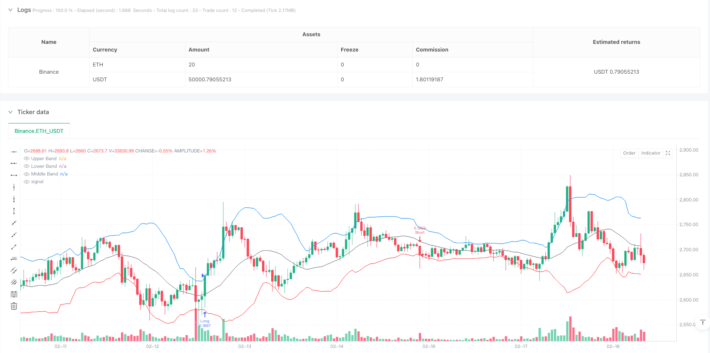
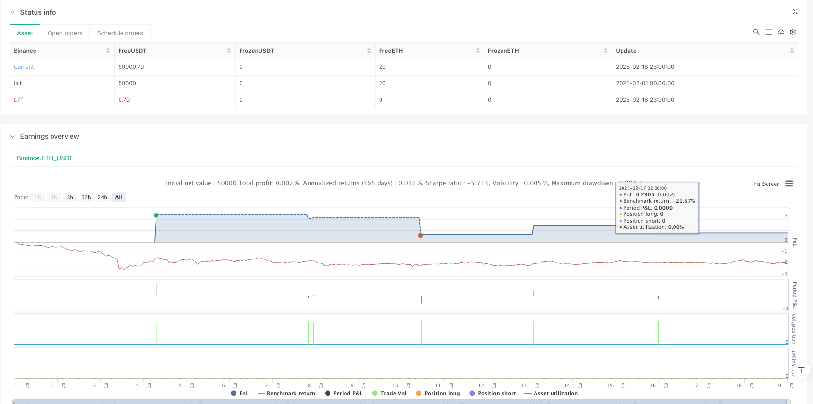

> Name

Advanced-Bollinger-Bands-Multi-Indicator-Dynamic-Trend-Breakout-Trading-Strategy
> Author

ianzeng123

> Strategy Description





[trans]
#### Overview
This strategy is an advanced trend tracking system based on Bollinger Band breakthroughs, which combines multiple technical indicators such as RSI and ADX as filter conditions, and adopts dynamic stop loss and trailing take profit mechanisms based on ATR. The strategy adopts strict risk management methods and uses multiple indicators to improve the accuracy and stability of transactions.
#### Strategy Principle
The core logic of the strategy is based on the following key elements:
1. Use the 20-period Bollinger Band as the main trend judgment indicator, with a bandwidth of 2 times the standard deviation.
2. Filter false breakthroughs through the neutral range (40-60) of RSI (14)
3. Use manually calculated ADX(14)>25 to confirm trend strength
4. Entry signals:
   - Long: The price breaks through the upper track and meets the RSI and ADX filter conditions
   - Short: The price breaks through the lower track and meets the RSI and ADX filter conditions
5. Risk Management:
   - Set initial stop loss based on 1.5x ATR
   - Use a trailing stop of 1x ATR
   - The stop loss following distance is 0.5 times ATR
#### Strategic Advantages
1. The combination of multiple technical indicators improves the reliability of trading signals
2. Dynamic stop loss and trailing take profit mechanisms can effectively protect profits
3. RSI neutral range filtering avoids over-buying and over-selling
4. ADX filtering ensures only trading in strong trends
5. Manually calculated ADX provides a more accurate measure of trend strength
6. Dynamic position management based on ATR adapts to different market fluctuation environments
#### Strategy Risk
1. Multiple filtering conditions may lead to missing some potentially good opportunities.
2. Frequent false breakthrough signals may occur in volatile markets
3. ATR stops may be triggered prematurely when volatility suddenly expands
4. Large price fluctuations are required to generate effective trading signals
5. Large retracements may occur at trend turning points
#### Strategy optimization direction
1. Introduce adaptive Bollinger Band period and multiplier
2. Dynamically adjust the RSI filter range based on market volatility
3. Add volume indicators as additional confirmation
4. Develop a more intelligent trailing stop loss algorithm
5. Add time filtering to avoid transactions during important news releases
6. Implement dynamic position management based on market volatility
#### Summary
This is a well-structured trend following strategy that improves trading stability through the synergy of multiple technical indicators. The strategic risk management system is complete and can effectively control downside risks. Although there is some room for optimization, the overall design concept meets the requirements of modern quantitative trading. The strategy is suitable for applications in volatile markets and is a good choice for traders who pursue steady returns.  ||
#### Overview
This strategy is an advanced trend-following system based on Bollinger Bands breakouts, incorporating multiple technical indicators such as RSI and ADX as filtering conditions, along with ATR-based dynamic stop-loss and trailing profit mechanisms. The strategy employs strict risk management methods and uses multiple indicators in combination to improve trading accuracy and stability.

#### Strategy Principles
The core logic of the strategy is based on the following key elements:
1. Uses 20-period Bollinger Bands as the primary trend identification indicator with 2 standard deviations
2. Filters false breakouts through RSI(14) neutral zone (40-60)
3. Confirms trend strength using manually calculated ADX(14)>25
4. Entry signals:
   - Long: price breaks above upper band and meets RSI and ADX filtering conditions
   - Short: price breaks below lower band and meets RSI and ADX filtering conditions
5. Risk management:
   - Initial stop-loss set at 1.5 times ATR
   - Trailing stop at 1 times ATR
   - Trail offset at 0.5 times ATR

#### Strategy Advantages
1. Multiple technical indicators combination improves trading signal reliability
2. Dynamic stop-loss and trailing profit mechanisms effectively protect profits
3. RSI neutral zone filtering prevents overbought and oversold entries
4. ADX filtering ensures trading only in strong trends
5. Manually calculated ADX provides more precise trend strength measurement
6. ATR-based dynamic position management adapts to different market volatility environments

#### Strategy Risks
1. Multiple filtering conditions may cause missing some potential opportunities
2. May generate frequent false breakout signals in ranging markets
3. ATR stops might be triggered prematurely during sudden volatility expansion
4. Requires significant price movement to generate valid trading signals
5. May experience larger drawdowns at trend reversal points

#### Strategy Optimization Directions
1. Introduce adaptive Bollinger Bands period and multiplier
2. Dynamically adjust RSI filter zones based on market volatility
3. Add volume indicators as additional confirmation
4. Develop more intelligent trailing stop algorithms
5. Add time filters to avoid trading during major news releases
6. Implement volatility-based dynamic position sizing

#### Summary
This is a well-structured trend-following strategy that enhances trading stability through the synergy of multiple technical indicators. The strategy's risk management system is comprehensive and effectively controls downside risk. While there is room for optimization, the overall design philosophy aligns with modern quantitative trading requirements. The strategy is suitable for markets with higher volatility and is a good choice for traders seeking stable returns.[/trans]


> Source (PineScript)

``` pinescript
/*backtest
start: 2025-02-01 00:00:00
end: 2025-02-19 00:00:00
period: 1h
basePeriod: 1m
exchanges: [{"eid":"Binance","currency":"ETH_USDT"}]
*/

//@version=5
strategy("Optimized Bollinger Bands Breakout Strategy", overlay=true, default_qty_type=strategy.percent_of_equity, default_qty_value=1)

// ? Bollinger Bands Settings
length = input(20, title="Bollinger Length")
mult = input(2.0, title="Bollinger Multiplier")
basis = ta.sma(close, length)
dev = mult * ta.stdev(close, length)
upperBand = basis + dev
lowerBand = basis - dev

// ? ADX Calculation (Manually Calculated)
adxLength = input(14, title="ADX Length")
dmiLength = input(14, title="DMI Length")
upMove = high - ta.highest(high[1], 1)
downMove = ta.lowest(low[1], 1) - low
plusDM = upMove > downMove and upMove > 0 ? upMove : 0
minusDM = downMove > upMove and downMove > 0 ? downMove : 0
plusDI = ta.sma(plusDM, dmiLength) / ta.atr(dmiLength) * 100
minusDI = ta.sma(minusDM, dmiLength) / ta.atr(dmiLength) * 100
dx = math.abs(plusDI - minusDI) / (plusDI + minusDI) * 100
adx = ta.sma(dx, adxLength)

// ? Additional Filters
rsi = ta.rsi(close, 14)

// ✅ Entry Conditions
longCondition = ta.crossover(close, upperBand) and rsi > 40 and rsi < 60 and adx > 25
shortCondition = ta.crossunder(close, lowerBand) and rsi > 40 and rsi < 60 and adx > 25

// ? ATR-based Stop Loss
stopLossMultiplier = input(1.5, title="Stop Loss (ATR Multiplier)") 
atrValue = ta.atr(14)
longSL = close - (atrValue * stopLossMultiplier)
shortSL = close + (atrValue * stopLossMultiplier)

// ✅ Trailing Stop
trailMultiplier = input(1, title="Trailing Stop Multiplier")
longTrailStop = close - (atrValue * trailMultiplier)
shortTrailStop = close + (atrValue * trailMultiplier)

// ? Executing Trades
if (longCondition)
    strategy.entry("Long", strategy.long)
    strategy.exit("Exit Long", from_entry="Long", stop=longSL, trail_price=longTrailStop, trail_offset=atrValue * 0.5)

if (shortCondition)
    strategy.entry("Short", strategy.short)
    strategy.exit("Exit Short", from_entry="Short", stop=shortSL, trail_price=shortTrailStop, trail_offset=atrValue * 0.5)

// ? Plot Bollinger Bands
plot(upperBand, title="Upper Band", color=color.blue)
plot(lowerBand, title="Lower Band", color=color.red)
plot(basis, title="Middle Band", color=color.gray)

```

> Detail

https://www.fmz.com/strategy/482824

> Last Modified

2025-02-20 14:52:06
