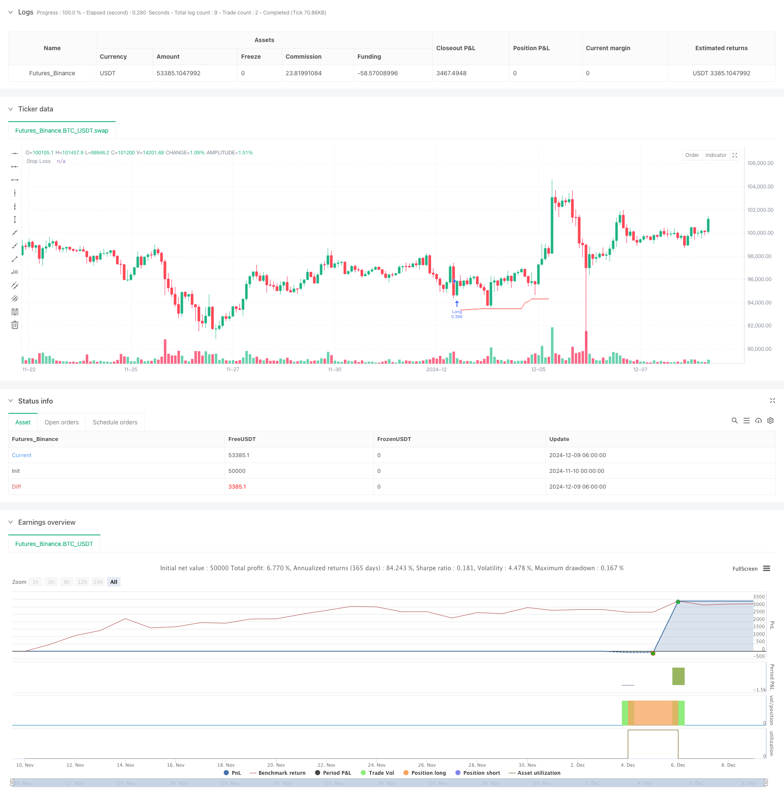

> Name

Advanced-Dynamic-Trailing-Stop-with-Risk-Reward-Targeting-Strategy
> Author

ChaoZhang

> Strategy Description



[trans]
#### Overview
This strategy is an advanced trading system that combines dynamic trailing stop loss, risk-reward ratio and RSI extreme value exit. The strategy trades by identifying specific patterns in the market (parallel K-line patterns and needle K-line patterns), while using ATR and recent lows to set dynamic stop loss levels, and determine profit targets based on a preset risk-reward ratio. The system also integrates a market overheating/undercooling judgment mechanism based on the RSI indicator, which can promptly close positions when the market reaches extreme values.
#### Strategy Principle
The core logic of the strategy includes the following key parts:
1. The entry signal is based on two forms: parallel K-line pattern (big positive line follows big negative line) and double-pin K-line pattern.
2. Dynamic trailing stop loss uses the ATR multiplier to adjust the lowest price of the recent N K lines to ensure that the stop loss position can dynamically adapt to market fluctuations.
3. The profit target is set based on a fixed risk-reward ratio and is determined by calculating the risk value (R) of each transaction.
4. The position size is dynamically calculated based on the fixed risk amount and the risk value of each transaction.
5. The RSI extreme value exit mechanism triggers a closing signal when the market is too hot or too cold.
#### Strategic Advantages
1. Dynamic risk management: Through the combination of ATR and recent lows, the stop loss level can be dynamically adjusted according to market fluctuations.
2. Precise position control: The position calculation method based on a fixed risk amount ensures that the risk of each transaction is consistent.
3. Multi-dimensional exit mechanism: Combined with trailing stop loss, fixed profit target and RSI extreme value triple exit mechanism.
4. Flexible trading direction selection: You can choose only long, only short or two-way trading.
5. Clear risk-reward settings: Clear profit targets for each transaction through preset risk-reward ratios.
#### Strategy Risk
1. Risks in the accuracy of pattern recognition: There may be misjudgments in the recognition of parallel K lines and needle K lines.
2. Slippage risk of stop loss setting: You may face larger slippage in a volatile market.
3. RSI extreme value exit may be premature: In a strong trending market, it may lead to early exit and miss more profits.
4. Limitations of a fixed risk-return ratio: The optimal risk-return ratio may be different under different market environments.
5. Risk of over-fitting in parameter optimization: The combination of multiple parameters may lead to over-optimization.
#### Strategy optimization direction
1. Optimization of entry signals: more form confirmation indicators can be added, such as trading volume, trend indicators, etc.
2. Dynamic risk-return ratio: Dynamically adjust the risk-return ratio based on market volatility.
3. Intelligent parameter adaptation: Introduce machine learning algorithms to dynamically optimize parameters.
4. Multi-time period confirmation: Add more time period signal confirmation mechanisms.
5. Market environment classification: Different parameter combinations are adopted according to different market environments.
#### Summary
This is a well-designed trading strategy that combines multiple mature technical analysis concepts to build a complete trading system. The advantage of the strategy lies in its comprehensive risk management system and flexible trading rules, but it also requires attention to parameter optimization and market adaptability. There is room for further improvement of the strategy through the suggested optimization directions. ||
#### Overview
This strategy is an advanced trading system that combines dynamic trailing stops, risk-reward ratios, and RSI extreme exits. It identifies specific patterns (parallel bar patterns and pin bar patterns) for trade entry, while utilizing ATR and recent lows for dynamic stop loss placement, and determines profit targets based on preset risk-reward ratios. The system also incorporates an RSI-based market overbought/oversold exit mechanism.

#### Strategy Principles
The core logic includes several key components:
1. Entry signals based on two patterns: parallel bar pattern (big bullish bar following a big bearish bar) and double pin bar pattern.
2. Dynamic trailing stops using ATR multiplier adjusted to recent N-bar lows, ensuring stop loss levels adapt to market volatility.
3. Profit targets set based on fixed risk-reward ratios, calculated using the risk value (R) for each trade.
4. Position sizing dynamically calculated based on fixed risk amount and per-trade risk value.
5. RSI extreme exit mechanism triggers position closure at market extremes.

#### Strategy Advantages
1. Dynamic Risk Management: Stop loss levels dynamically adjust to market volatility through ATR and recent lows combination.
2. Precise Position Control: Position sizing based on fixed risk amount ensures consistent risk per trade.
3. Multi-dimensional Exit Mechanism: Combines trailing stops, fixed profit targets, and RSI extremes.
4. Flexible Trading Direction: Options for long-only, short-only, or bi-directional trading.
5. Clear Risk-Reward Setup: Predetermined risk-reward ratios define clear profit targets for each trade.

#### Strategy Risks
1. Pattern Recognition Accuracy Risk: Potential false identification of parallel bars and pin bars.
2. Slippage Risk in Stop Loss: May face significant slippage in volatile markets.
3. Premature RSI Exit: Could lead to early exits in strong trend markets.
4. Fixed Risk-Reward Ratio Limitations: Optimal risk-reward ratios may vary across market conditions.
5. Parameter Optimization Overfitting Risk: Multiple parameter combinations may lead to over-optimization.

#### Strategy Optimization Directions
1. Entry Signal Enhancement: Add more pattern confirmation indicators like volume and trend indicators.
2. Dynamic Risk-Reward Ratio: Adjust risk-reward ratios based on market volatility.
3. Intelligent Parameter Adaptation: Introduce machine learning algorithms for dynamic parameter optimization.
4. Multi-timeframe Confirmation: Add signal confirmation mechanisms across multiple timeframes.
5. Market Environment Classification: Apply different parameter sets for different market conditions.

#### Summary
This is a well-designed trading strategy that combines multiple mature technical analysis concepts to build a complete trading system. The strategy's strengths lie in its comprehensive risk management system and flexible trading rules, while attention needs to be paid to parameter optimization and market adaptability. Through the suggested optimization directions, there is room for further improvement of the strategy.
[/trans]


> Source (PineScript)

``` pinescript
/*backtest
start: 2024-11-10 00:00:00
end: 2024-12-09 08:00:00
period: 2h
basePeriod: 2h
exchanges: [{"eid":"Futures_Binance","currency":"BTC_USDT"}]
*/

// This Pine Script™ code is subject to the terms of the Mozilla Public License 2.0 at https://mozilla.org/MPL/2.0/
// © ZenAndTheArtOfTrading | www.TheArtOfTrading.com
// @version=5
strategy("Trailing stop 1", overlay=true)

// Get user input 
int     BAR_LOOKBACK    = input.int(10, "Bar Lookback")
int     ATR_LENGTH      = input.int(14, "ATR Length")
float   ATR_MULTIPLIER  = input.float(1.0, "ATR Multiplier")
rr                      = input.float(title="Risk:Reward", defval=3)

// Basic definition
var float shares=na
risk = 1000
var float R=na
E = strategy.position_avg_price

// Input option to choose long, short, or both
side = input.string("Long", title="Side", options=["Long", "Short", "Both"])

// RSI exit option
RSIexit = input.string("Yes", title="Exit at RSI extreme?", options=["Yes", "No"])
RSIup = input(75)
RSIdown = input(25)

// Get indicator values 
float atrValue = ta.atr(ATR_LENGTH)

// Calculate stop loss values
var float trailingStopLoss = na 
float longStop  = ta.lowest(low, BAR_LOOKBACK) - (atrValue * ATR_MULTIPLIER)
float shortStop = ta.highest(high, BAR_LOOKBACK) + (atrValue * ATR_MULTIPLIER)

// Check if we can take trades 
bool canTakeTrades = not na(atrValue)
bgcolor(canTakeTrades ? na : color.red)

//Long pattern
    //Two pin bar
onepinbar = (math.min(close,open)-low)/(high-low)>0.6 and math.min(close,open)-low>ta.sma(high-low,14)
twopinbar = onepinbar and onepinbar[1]
notatbottom = low>ta.lowest(low[1],10)
    // Parallel
bigred = (open-close)/(high-low)>0.8 and high-low>ta.sma(high-low,14)
biggreen = (close-open)/(high-low)>0.8 and high-low>ta.sma(high-low,14)
parallel = bigred[1] and biggreen  
atbottom = low==ta.lowest(low,10)

// Enter long trades (replace this entry condition)
longCondition = parallel 
if (longCondition and canTakeTrades and  strategy.position_size == 0 and (side == "Long" or side == "Both"))
    R:= close-longStop
    shares:= risk/R
    strategy.entry("Long", strategy.long,qty=shares)

// Enter short trades (replace this entry condition)
shortCondition = parallel
if (shortCondition and canTakeTrades and strategy.position_size == 0 and (side == "Short" or side == "Both"))
    R:= shortStop - close
    shares:= risk/R
    strategy.entry("Short", strategy.short,qty=shares)

// Update trailing stop
if (strategy.position_size > 0)
    if (na(trailingStopLoss) or longStop > trailingStopLoss)
        trailingStopLoss := longStop
else if (strategy.position_size < 0)
    if (na(trailingStopLoss) or shortStop < trailingStopLoss)
        trailingStopLoss := shortStop
else
    trailingStopLoss := na

// Exit trades with trailing stop
strategy.exit("Long Exit",  "Long",  stop=trailingStopLoss, limit = E + rr*R )
strategy.exit("Short Exit", "Short", stop=trailingStopLoss, limit = E - rr*R)

//Close trades at RSI extreme
if ta.rsi(high,14)>RSIup and RSIexit == "Yes"
    strategy.close("Long")
if ta.rsi(low,14)<RSIdown and RSIexit == "Yes"
    strategy.close("Short")

// Draw stop loss 
plot(trailingStopLoss, "Stop Loss", color.red, 1, plot.style_linebr)
```

> Detail

https://www.fmz.com/strategy/474670

> Last Modified

2024-12-11 14:57:09
