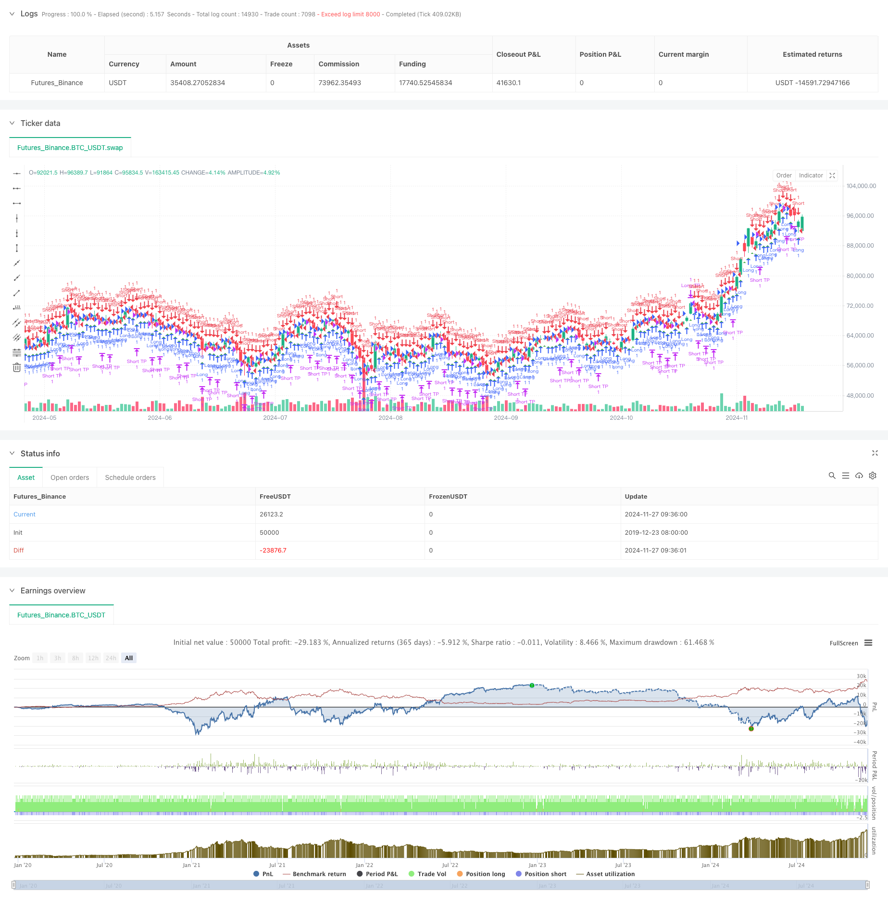

> Name

Advanced-Fair-Value-Gap-Detection-Strategy-with-Dynamic-Risk-Management-and-Fixed-Take-Profit-Advanced fair value gap detection strategy based on dynamic risk management and fixed profit
> Author

ChaoZhang

> Strategy Description



[trans]
#### Overview
This is a fair value gap (FVG) based trading strategy that combines dynamic risk management with a fixed profit target. This strategy operates on a 15-minute timeframe and captures potential trading opportunities by identifying price gaps in the market. According to backtest data, between November 2023 and August 2024, the strategy achieved a net return rate of 284.40%, with a total of 153 transactions completed, of which the profitability rate reached 71.24% and the profit factor was 2.422.
#### Strategy Principle
The core of the strategy is to identify fair value gaps by monitoring the price relationship between three consecutive K-lines. Specifically:
1. Conditions for the formation of long FVG: the highest price of the current K line is lower than the lowest price of the previous two K lines
2. Conditions for the formation of short FVG: the lowest price of the current K line is higher than the highest price of the previous two K lines
3. The entry signal is controlled by the FVG threshold parameter and is only triggered when the gap size exceeds a certain percentage of the price.
4. Risk control uses a fixed proportion of account equity (1%) as the stop loss standard.
5. The profit target is set with a fixed number of points (50 points)
#### Strategic Advantages
1. Scientific and reasonable risk management: dynamic risk control can be achieved by using account equity ratio stop loss
2. Clear trading rules: use fixed profit targets and avoid subjective judgments
3. Excellent performance: higher profitability and profitability factors indicate that the strategy has good stability
4. Simple implementation: the code logic is clear and easy to understand and maintain.
5. Strong adaptability: can adapt to different market environments through parameter adjustment
#### Strategy Risk
1. Market volatility risk: In a highly volatile market, a fixed-point profit target may not be flexible enough.
2. Slippage risk: Frequent transactions may lead to higher slippage costs
3. Parameter dependence: Strategy performance strongly depends on the setting of the FVG threshold
4. Risk of false breakthrough: Some FVG signals may be false breakthroughs and require additional confirmation indicators.
5. Fund management risk: Fixed ratio stop loss may cause funds to shrink rapidly when losing money continuously.
#### Strategy optimization direction
1. Introduce market volatility indicators and dynamically adjust profit targets
2. Add trend filter to avoid trading in sideways market
3. Develop multiple time period confirmation mechanisms
4. Optimize the position management algorithm and introduce a floating position system
5. Add trading time filtering to avoid high volatility periods
6. Develop a signal strength scoring system to screen high-quality trading opportunities
#### Summary
This strategy shows good trading results by combining fair value gap theory and scientific risk management methods. The strategy's high profitability and stable profitability factors indicate its practical value. Through the suggested optimization directions, there is room for further improvement of the strategy. It is recommended that traders conduct sufficient parameter optimization and backtest verification before using it in real trading. ||
#### Overview
This is a trading strategy based on Fair Value Gap (FVG) detection, combining dynamic risk management with fixed take profit targets. Operating on a 15-minute timeframe, the strategy identifies potential trading opportunities by detecting price gaps in the market. According to backtest data from November 2023 to August 2024, the strategy achieved a net profit of 284.40% with 153 total trades, maintaining a win rate of 71.24% and a profit factor of 2.422.

#### Strategy Principle
The core mechanism revolves around detecting Fair Value Gaps by monitoring price relationships across three consecutive candles:
1. Bullish FVG: When the high of the middle candle is below the low of the first candle
2. Bearish FVG: When the low of the middle candle is above the high of the first candle
3. Entry signals are controlled by an FVG threshold parameter
4. Risk control uses a fixed percentage (1%) of account equity as stop loss
5. Take profit is set at a fixed 50 points

#### Strategy Advantages
1. Scientific risk management: Uses account equity percentage for stop loss
2. Clear trading rules: Fixed take profit targets eliminate subjective judgment
3. Excellent performance: High win rate and profit factor indicate strategy stability
4. Simple implementation: Clear code logic, easy to understand and maintain
5. High adaptability: Can be adjusted for different market conditions

#### Strategy Risks
1. Market volatility risk: Fixed point take profit may be inflexible in highly volatile markets
2. Slippage risk: Frequent trading may lead to higher slippage costs
3. Parameter dependency: Performance heavily relies on FVG threshold settings
4. False breakout risk: Some FVG signals might be false breakouts
5. Money management risk: Fixed percentage stop loss might lead to quick drawdowns

#### Optimization Directions
1. Introduce volatility indicators for dynamic take profit adjustment
2. Add trend filters to avoid ranging market trades
3. Develop multiple timeframe confirmation mechanism
4. Optimize position sizing algorithm with floating position system
5. Add trading time filters to avoid high volatility periods
6. Develop signal strength scoring system for high-quality trade selection

#### Summary
This strategy demonstrates impressive results by combining Fair Value Gap theory with scientific risk management. The high win rate and stable profit factor indicate its practical value. Through the suggested optimization directions, there is potential for further improvement. Traders are advised to conduct thorough parameter optimization and backtesting before live implementation.[/trans]


> Source (PineScript)

``` pinescript
/*backtest
start: 2019-12-23 08:00:00
end: 2024-11-28 00:00:00
period: 1d
basePeriod: 1d
exchanges: [{"eid":"Futures_Binance","currency":"BTC_USDT"}]
*/

//@version=5
strategy("Fair Value Gap Strategy with % SL and Fixed TP", overlay=true, initial_capital=500, default_qty_type=strategy.fixed, default_qty_value=1)

// Parameters
fvgThreshold = input.float(0.5, "FVG Threshold (%)", minval=0.1, step=0.1)

// Fixed take profit in pips
takeProfitPips = 50

// Function to convert pips to price
pipsToPriceChange(pips) =>
    syminfo.mintick * pips * 10

// Function to detect Fair Value Gap
detectFVG(dir) =>
    gap = 0.0
    if dir > 0  // Bullish FVG
        gap := low[2] - high[1]
    else  // Bearish FVG
        gap := low[1] - high[2]
    math.abs(gap) > (close * fvgThreshold / 100)

// Detect FVGs
bullishFVG = detectFVG(1)
bearishFVG = detectFVG(-1)

// Entry conditions
longCondition = bullishFVG
shortCondition = bearishFVG

// Calculate take profit level
longTakeProfit = strategy.position_avg_price + pipsToPriceChange(takeProfitPips)
shortTakeProfit = strategy.position_avg_price - pipsToPriceChange(takeProfitPips)

// Calculate stop loss amount (5% of capital)
stopLossAmount = strategy.equity * 0.01

// Execute trades
if (longCondition)
    strategy.entry("Long", strategy.long)

if (shortCondition)
    strategy.entry("Short", strategy.short)

// Set exit conditions
if (strategy.position_size > 0)
    strategy.exit("Long TP", "Long", limit=longTakeProfit)
    strategy.close("Long SL", when=strategy.openprofit < -stopLossAmount)
else if (strategy.position_size < 0)
    strategy.exit("Short TP", "Short", limit=shortTakeProfit)
    strategy.close("Short SL", when=strategy.openprofit < -stopLossAmount)

// Plot signals
plotshape(longCondition, "Buy Signal", location = location.belowbar, color = color.green, style = shape.triangleup, size = size.small)
plotshape(shortCondition, "Sell Signal", location = location.abovebar, color = color.red, style = shape.triangledown, size = size.small)
```

> Detail

https://www.fmz.com/strategy/473391

> Last Modified

2024-11-29 16:22:10
