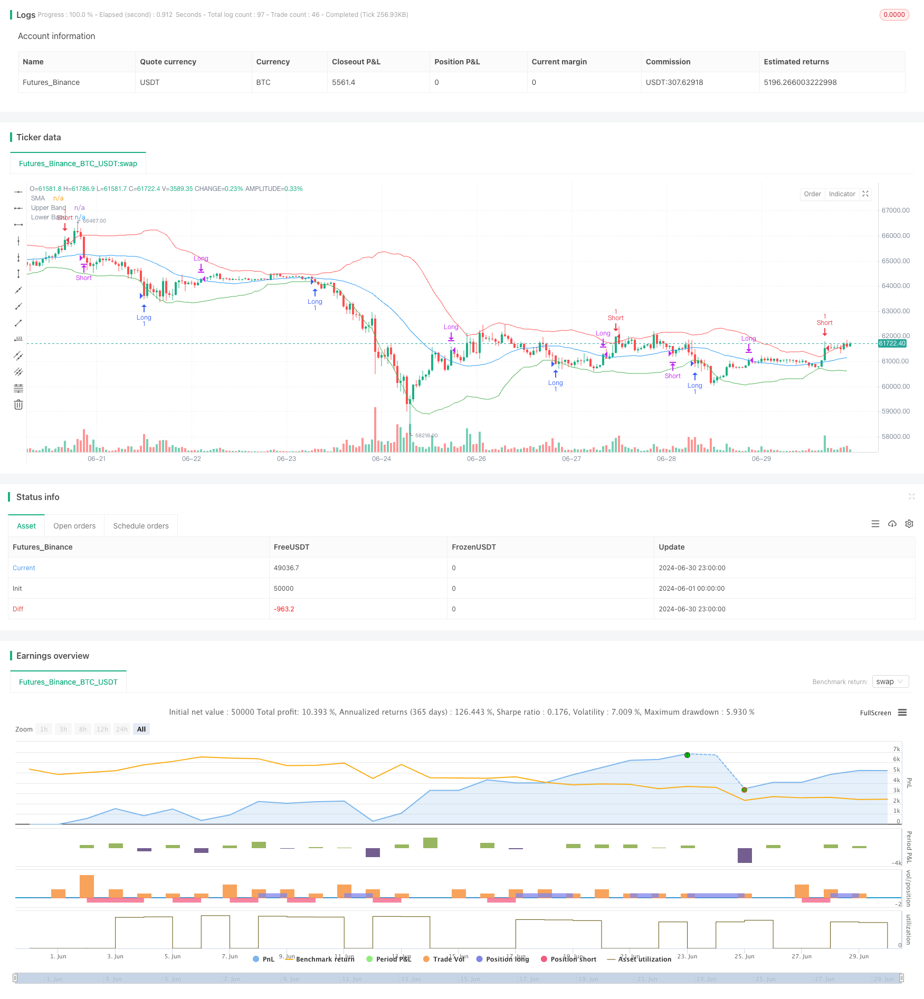

> Name

Advanced-Mean-Reversion-Trading-Strategy-Dynamic-Range-Breakout-System-Based-on-Standard-Deviation
> Author

ChaoZhang

> Strategy Description



[trans]

#### Overview
This article introduces an advanced trading strategy based on the principle of mean reversion. This strategy uses the simple moving average (SMA) and standard deviation (SD) to construct a dynamic trading range and capture potential reversal opportunities by identifying extreme price deviations from the mean. The core idea of ​​the strategy is that when the price deviates significantly from its historical mean, there is a high probability that it will return to the mean level. Through carefully designed entry and exit rules, this strategy aims to exploit this statistical property of the market to gain potential trading profits.
#### Strategy Principle
Here’s how the strategy works:
1. Calculate the simple moving average (SMA) of the specified period (default 30 periods) as the central trend indicator of the price.
2. Use the closing prices of the same period to calculate the standard deviation (SD), which is used to measure price volatility.
3. Based on the SMA, extend upward and downward by 2 standard deviations each to form the Upper Band and Lower Band. These two tracks form a dynamic trading range.
4. Transaction logic:
   - Open a long position when the closing price touches or falls below the lower band. This shows that the price has deviated from the mean and reached an extreme level, and there is a high probability that it will rebound.
   - Open a short position when the closing price touches or breaks the upper band. This indicates that the price has deviated from the mean to an extreme level, and there is a high probability that it will fall back.
5. Position closing logic:
   - When a long position is established, if the closing price crosses above the SMA, the position will be closed. This shows that prices have returned to the mean level.
   - When a short position is established, if the closing price falls below the SMA, the position will be closed. This also indicates that prices have returned to the mean.
6. The strategy plots the SMA, upper band, and lower band on the chart to visually demonstrate the trading range and potential trading opportunities.
#### Strategic Advantages
1. Solid theoretical foundation: Mean reversion is a widely recognized market phenomenon, and this strategy cleverly takes advantage of this statistical property.
2. Strong adaptability: By using standard deviation to construct trading ranges, the strategy can automatically adjust its sensitivity according to changes in market volatility. In markets with greater volatility, the trading range will expand accordingly; in markets with less volatility, the trading range will narrow accordingly.
3. Reasonable risk management: The strategy only enters the market when the price reaches a statistically extreme level, which reduces the possibility of false signals to a certain extent. At the same time, using the average as the closing point can help lock in reasonable profits.
4. Good visualization effect: The strategy clearly marks the trading range and mean line on the chart, allowing traders to intuitively understand the market status and potential trading opportunities.
5. Flexible and adjustable parameters: The strategy allows users to customize the SMA cycle and standard deviation multiples, which provides the possibility of adapting to different markets and different trading styles.
6. The logic is simple and clear: Although the theoretical basis of the strategy is relatively profound, its actual execution logic is very clear, which is conducive to traders' understanding and execution.
#### Strategy Risk
1. Trend market risk: In a strong trend market, the price may continue to break through the trading range without returning to the mean, resulting in continuous losing transactions.
2. Excessive trading risk: In a highly volatile market, prices may frequently touch the upper and lower rails, triggering too many trading signals and increasing transaction costs.
3. False breakthrough risk: The price may briefly break through the trading range and then quickly return. This "false breakthrough" may lead to unnecessary transactions.
4. Parameter sensitivity: The performance of the strategy may be highly sensitive to parameters such as SMA period and standard deviation multiple. Improper parameter settings may cause the strategy to fail.
5. Lagging risk: SMA and standard deviation are lagging indicators and may not be able to capture market turning points in time in a rapidly changing market.
6. Black swan event risk: Sudden major events may cause violent price fluctuations, far beyond the normal statistical range, making the strategy ineffective and may cause heavy losses.
#### Strategy optimization direction
1. Introduce a trend filter: You can consider adding a long-term trend indicator (such as a longer period moving average) and only open positions in the direction consistent with the main trend to reduce counter-trend transactions.
2. Dynamically adjust the multiple of the standard deviation: The multiple of the standard deviation can be dynamically adjusted according to the volatility of the market, narrowing the trading range in periods of low volatility, and expanding the trading range in periods of high volatility.
3. Increase trading volume confirmation: You can combine trading volume indicators to confirm entry signals only when trading volume is abnormally enlarged to reduce the risk of false breakthroughs.
4. Optimize the closing strategy: You can consider using trailing stop loss or dynamic stop loss based on ATR (average true range), instead of simply closing the position when the price returns to the mean, to better control risks and lock in profits.
5. Add time filtering: You can set a minimum position time to avoid frequent transactions due to rapid price fluctuations near the trading range.
6. Consider multiple time frames: SMA and standard deviation can be calculated on longer time frames to filter short-term trading signals and improve the stability of the strategy.
7. Introducing machine learning algorithms: Machine learning technology can be used to dynamically optimize strategy parameters, or predict whether prices will indeed reverse after hitting the boundary of a trading range.
#### Summarize
This dynamic range breakout system based on standard deviation is a mean reversion strategy that cleverly uses statistical principles. It constructs an adaptive trading range using a simple moving average and standard deviation to capture potential reversal opportunities when prices reach statistical extremes. The advantages of the strategy lie in its solid theoretical foundation, good adaptability and intuitive visualization. However, it also faces challenges such as trending market risk, over-trading risk and parameter sensitivity.
By introducing trend filters, dynamically adjusting parameters, increasing trading volume confirmation and other optimization measures, the robustness and profitability of the strategy can be further improved. At the same time, traders need to fully understand its limitations when using this strategy, combine market experience and risk management principles, and apply it prudently.
Overall, this strategy provides a solid framework for mean reversion trading, with great application potential and room for optimization. It can not only be used as an independent trading system, but can also be combined with other technical analysis tools or fundamental analysis to build a more comprehensive and powerful trading strategy.
|| 

#### Overview

This article introduces an advanced trading strategy based on the principle of mean reversion. The strategy utilizes a Simple Moving Average (SMA) and Standard Deviation (SD) to construct a dynamic trading range, aiming to capture potential reversal opportunities by identifying extreme deviations from the mean. The core idea is that when prices significantly deviate from their historical average, there's a high probability they will revert to the mean. Through carefully designed entry and exit rules, this strategy aims to exploit this statistical property of markets to generate potential trading profits.

#### Strategy Principle

The operational principle of this strategy is as follows:

1. Calculate a Simple Moving Average (SMA) over a specified period (default 30 periods) as an indicator of the price's central tendency.

2. Calculate the Standard Deviation (SD) of closing prices over the same period to measure price volatility.

3. Extend 2 standard deviations above and below the SMA to form an Upper Band and a Lower Band. These two bands constitute a dynamic trading range.

4. Trading logic:
   - Enter a long position when the closing price touches or falls below the Lower Band. This indicates that the price has deviated from the mean to an extreme level and has a high probability of rising.
   - Enter a short position when the closing price touches or breaks above the Upper Band. This indicates that the price has deviated from the mean to an extreme level and has a high probability of falling.

5. Exit logic:
   - Close a long position when the closing price crosses above the SMA. This indicates that the price has reverted to the mean level.
   - Close a short position when the closing price crosses below the SMA. This similarly indicates that the price has reverted to the mean level.

6. The strategy plots the SMA, Upper Band, and Lower Band on the chart for a visual representation of the trading range and potential trading opportunities.

#### Strategy Advantages

1. Solid Theoretical Foundation: Mean reversion is a widely recognized market phenomenon, and this strategy cleverly exploits this statistical property.

2. Strong Adaptability: By using standard deviation to construct the trading range, the strategy can automatically adjust its sensitivity based on market volatility changes. In highly volatile markets, the trading range expands; in less volatile markets, it contracts.

3. Reasonable Risk Management: The strategy only enters trades when prices reach statistically extreme levels, which to some extent reduces the possibility of false signals. Using the mean as an exit point helps secure reasonable profits.

4. Good Visualization: The strategy clearly marks the trading range and mean line on the chart, allowing traders to intuitively understand market conditions and potential trading opportunities.

5. Flexible Parameters: The strategy allows users to customize the SMA period and the standard deviation multiplier, providing adaptability for different markets and trading styles.

6. Simple and Clear Logic: Although the theoretical basis of the strategy is relatively sophisticated, its actual execution logic is very clear, which is beneficial for traders to understand and implement.

#### Strategy Risks

1. Trend Market Risk: In strong trending markets, prices may continuously break through the trading range without reverting to the mean, leading to consecutive losing trades.

2. Overtrading Risk: In highly volatile markets, prices may frequently touch the upper and lower bands, triggering too many trading signals and increasing transaction costs.

3. False Breakout Risk: Prices may briefly break through the trading range and then quickly revert, potentially leading to unnecessary trades.

4. Parameter Sensitivity: The strategy's performance may be highly sensitive to parameters such as the SMA period and standard deviation multiplier. Improper parameter settings could cause the strategy to fail.

5. Lag Risk: Both SMA and standard deviation are lagging indicators, which may not capture market turning points in time in rapidly changing markets.

6. Black Swan Event Risk: Sudden major events may cause dramatic price fluctuations far beyond normal statistical ranges, rendering the strategy ineffective and potentially causing significant losses.

#### Strategy Optimization Directions

1. Introduce a Trend Filter: Consider adding a long-term trend indicator (such as a longer-period moving average) to only open positions in the direction consistent with the main trend, reducing counter-trend trades.

2. Dynamically Adjust Standard Deviation Multiplier: The standard deviation multiplier could be dynamically adjusted based on market volatility conditions, narrowing the trading range in low volatility periods and widening it in high volatility periods.

3. Add Volume Confirmation: Incorporate volume indicators to confirm entry signals only when volume abnormally increases, reducing the risk of false breakouts.

4. Optimize Exit Strategy: Consider using a trailing stop or a dynamic stop based on ATR (Average True Range) instead of simply exiting when price reverts to the mean, for better risk control and profit locking.

5. Add Time Filters: Set a minimum holding time to avoid frequent trading due to rapid price fluctuations near the trading range boundaries.

6. Consider Multiple Timeframes: Calculate SMA and standard deviation on longer timeframes to filter short-term trading signals and improve strategy stability.

7. Incorporate Machine Learning Algorithms: Use machine learning techniques to dynamically optimize strategy parameters or predict whether prices will indeed reverse after touching the trading range boundaries.

#### Conclusion

This dynamic range breakout system based on standard deviation is a clever mean reversion strategy that applies statistical principles. It constructs an adaptive trading range using simple moving averages and standard deviation, capturing potential reversal opportunities when prices reach statistical extremes. The strategy's strengths lie in its solid theoretical foundation, good adaptability, and intuitive visualization. However, it also faces challenges such as trend market risk, overtrading risk, and parameter sensitivity.

The strategy's robustness and profitability can be further enhanced through optimization measures such as introducing trend filters, dynamically adjusting parameters, and adding volume confirmation. At the same time, traders need to fully recognize its limitations when using this strategy, combining market experience and risk management principles for prudent application.

Overall, this strategy provides a solid framework for mean reversion trading with significant potential for application and optimization. It can be used not only as an independent trading system but also in combination with other technical analysis tools or fundamental analysis to build a more comprehensive and powerful trading strategy.

[/trans]


> Source (PineScript)

``` pinescript
/*backtest
start: 2024-06-01 00:00:00
end: 2024-06-30 23:59:59
period: 1h
basePeriod: 15m
exchanges: [{"eid":"Futures_Binance","currency":"BTC_USDT"}]
*/

//@version=5
strategy("Simple Mean Reversion Strategy [nn1]", overlay=true)

// Input parameters
length = input.int(30, "SMA Length", minval=1)
std_dev_threshold = input.float(2, "Standard Deviation Threshold", minval=0.1, step=0.1)

// Calculate SMA and Standard Deviation
sma = ta.sma(close, length)
std_dev = ta.stdev(close, length)

// Calculate upper and lower bands
upper_band = sma + std_dev * std_dev_threshold
lower_band = sma - std_dev * std_dev_threshold

// Plot SMA and bands
plot(sma, "SMA", color.blue)
plot(upper_band, "Upper Band", color.red)
plot(lower_band, "Lower Band", color.green)

// Trading logic
if (close <= lower_band)
    strategy.entry("Long", strategy.long)
else if (close >= upper_band)
    strategy.entry("Short", strategy.short)

// Exit logic
if (ta.crossover(close, sma))
    strategy.close("Long")
if (ta.crossunder(close, sma))
    strategy.close("Short")

```

> Detail

https://www.fmz.com/strategy/458079

> Last Modified

2024-07-29 17:16:43
