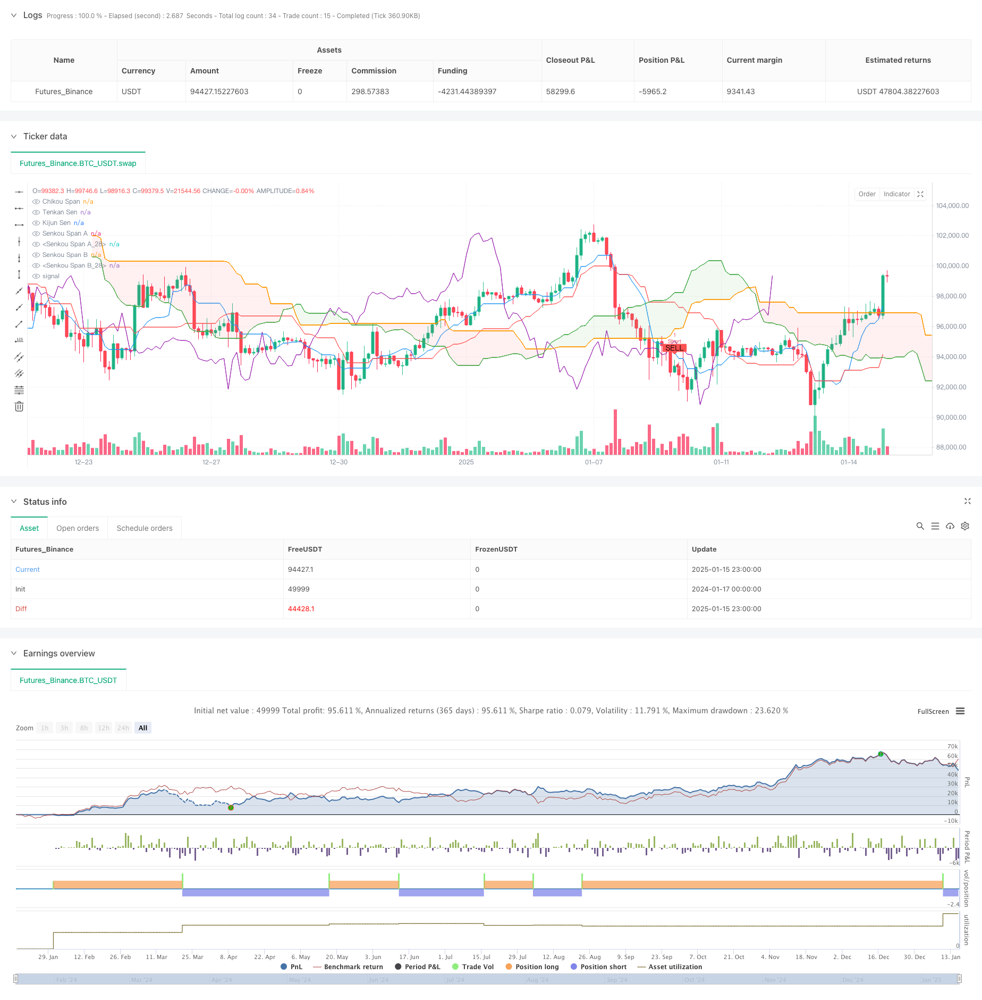

> Name

Advanced-Multi-Indicator-Multi-Dimensional-Trend-Cross-Quantitative-Strategy
> Author

ChaoZhang

> Strategy Description



[trans]
#### Overview
This strategy is a comprehensive trading system that combines multiple technical indicators, mainly including multi-dimensional analysis methods such as Ichimoku, relative strength indicator (RSI), moving average convergence divergence indicator (MACD), high time period (HTF) divergence, and exponential moving average (EMA) crossover. The strategy improves the accuracy of trading through multiple signal confirmations, while using market information in different time periods to capture more reliable trading opportunities.
#### Strategy Principle
The core principle of the strategy is to confirm trading signals through comprehensive analysis of multiple layers of technical indicators. First, use the cloud chart component of the Ichimoku chart to determine the overall market trend, combine it with the RSI indicator to determine the overbought and oversold state of the market, use the MACD indicator to identify the momentum changes of the trend, and capture potential trend reversal signals through the high time period RSI and MACD divergence. In addition, the strategy also introduces cross-confirmation of EMA50 and EMA100, as well as EMA200 as the main trend filter, thus building a multi-level trade confirmation system.
#### Strategic Advantages
1. Multi-dimensional signal confirmation greatly reduces the risk of false breakthroughs and improves the accuracy of transactions.
2. Enhance the ability to predict market turning points through high time cycle divergence analysis
3. It integrates the characteristics of trend following and reversal trading, and has strong adaptability.
4. EMA crossover provides additional trend confirmation and improves the accuracy of entry timing.
5. The complete technical indicator system enables strategies to comprehensively analyze market conditions.
#### Strategy Risk
1. Multiple indicator confirmations may lead to missing some rapid market opportunities.
2. More false signals may be generated in a volatile market
3. Parameter optimization is highly complex and prone to overfitting.
4. The calculation of multiple indicators may cause a certain lag.
5. Under extreme market conditions, the multiple confirmation mechanism may fail
#### Strategy optimization direction
1. Introduce an adaptive parameter mechanism so that the strategy can dynamically adjust each indicator parameter according to the market status.
2. Add volatility filter to adjust strategy parameters in high volatility environment
3. Develop a more intelligent stop-loss and stop-profit mechanism to improve fund management efficiency
4. Add a market status classification module and adopt different trading logic for different market status.
5. Optimize the recognition algorithm for high time period divergence and improve the timeliness of signals
#### Summary
This strategy builds a relatively complete trading system through the coordination of multiple technical indicators. The advantage of the strategy lies in its multi-dimensional signal confirmation mechanism, but it also faces the challenge of parameter optimization and market adaptability. Through the proposed optimization direction, the strategy is expected to further improve its performance in different market environments while maintaining its robustness.
|| 

#### Overview
This strategy is a comprehensive trading system that combines multiple technical indicators, including Ichimoku Cloud, Relative Strength Index (RSI), Moving Average Convergence Divergence (MACD), Higher Time Frame (HTF) divergence, and Exponential Moving Average (EMA) crossovers. The strategy utilizes multiple signal confirmations to improve trading accuracy while leveraging market information from different time frames to capture more reliable trading opportunities.

#### Strategy Principles
The core principle of the strategy is to confirm trading signals through multi-layer technical analysis. It uses the Ichimoku Cloud components to determine overall market trends, combines RSI to judge market overbought/oversold conditions, utilizes MACD to identify trend momentum changes, and captures potential trend reversal signals through HTF RSI and MACD divergences. Additionally, the strategy incorporates EMA50 and EMA100 crossovers for confirmation, along with EMA200 as a primary trend filter, creating a multi-layered trading confirmation system.

#### Strategy Advantages
1. Multi-dimensional signal confirmation significantly reduces false breakout risks and improves trading accuracy
2. HTF divergence analysis enhances the ability to predict market turning points
3. Integration of trend-following and reversal trading characteristics provides strong adaptability
4. EMA crossovers provide additional trend confirmation, improving entry timing accuracy
5. Comprehensive technical indicator system enables all-round market state analysis

#### Strategy Risks
1. Multiple indicator confirmations may cause missed opportunities in rapid market movements
2. May generate numerous false signals in ranging markets
3. High complexity in parameter optimization increases the risk of overfitting
4. Multiple indicators may introduce certain latency in signal generation
5. Multiple confirmation mechanisms may fail under extreme market conditions

#### Strategy Optimization Directions
1. Introduce adaptive parameter mechanisms to dynamically adjust indicator parameters based on market conditions
2. Add volatility filters to adjust strategy parameters in high-volatility environments
3. Develop more intelligent stop-loss and take-profit mechanisms to improve money management efficiency
4. Add market state classification modules to apply different trading logic for different market conditions
5. Optimize HTF divergence identification algorithms to improve signal timeliness

#### Summary
This strategy constructs a relatively complete trading system through the coordination of multiple technical indicators. Its strength lies in its multi-dimensional signal confirmation mechanism, while also facing challenges in parameter optimization and market adaptability. Through the proposed optimization directions, the strategy has the potential to further enhance its performance across different market environments while maintaining its robustness.[/trans]


> Source (PineScript)

``` pinescript
/*backtest
start: 2024-01-17 00:00:00
end: 2025-01-16 00:00:00
period: 3h
basePeriod: 3h
exchanges: [{"eid":"Futures_Binance","currency":"BTC_USDT","balance":49999}]
*/

//@version=6
strategy("Ichimoku + RSI + MACD + HTF Divergence + EMA Cross Strategy", overlay=true)

// تنظیمات تایم‌فریم بالاتر
htf_timeframe = input.timeframe("D", title="تایم‌فریم بالاتر")

// تنظیمات پارامترهای ایچیموکو
tenkan_period = input(9, title="Tenkan Sen Period")
kijun_period = input(26, title="Kijun Sen Period")
senkou_span_b_period = input(52, title="Senkou Span B Period")
displacement = input(26, title="Displacement")

// محاسبه خطوط ایچیموکو
tenkan_sen = (ta.highest(high, tenkan_period) + ta.lowest(low, tenkan_period)) / 2
kijun_sen = (ta.highest(high, kijun_period) + ta.lowest(low, kijun_period)) / 2
senkou_span_a = (tenkan_sen + kijun_sen) / 2
senkou_span_b = (ta.highest(high, senkou_span_b_period) + ta.lowest(low, senkou_span_b_period)) / 2
chikou_span = close  // قیمت بسته شدن فعلی

// رسم خطوط ایچیموکو
plot(tenkan_sen, color=color.blue, title="Tenkan Sen")
plot(kijun_sen, color=color.red, title="Kijun Sen")
plot(senkou_span_a, offset=displacement, color=color.green, title="Senkou Span A")
plot(senkou_span_b, offset=displacement, color=color.orange, title="Senkou Span B")
plot(chikou_span, offset=-displacement, color=color.purple, title="Chikou Span")

// رنگ‌آمیزی ابر ایچیموکو
fill(plot(senkou_span_a, offset=displacement, color=color.green, title="Senkou Span A"), plot(senkou_span_b, offset=displacement, color=color.orange, title="Senkou Span B"), color=senkou_span_a > senkou_span_b ? color.new(color.green, 90) : color.new(color.red, 90), title="Cloud")

// تنظیمات RSI
rsi_length = input(14, title="RSI Length")
rsi_overbought = input(70, title="RSI Overbought Level")
rsi_oversold = input(30, title="RSI Oversold Level")

// محاسبه RSI
rsi_value = ta.rsi(close, rsi_length)

// تنظیمات MACD
fast_length = input(12, title="MACD Fast Length")
slow_length = input(26, title="MACD Slow Length")
signal_smoothing = input(9, title="MACD Signal Smoothing")

// محاسبه MACD
[macd_line, signal_line, hist_line] = ta.macd(close, fast_length, slow_length, signal_smoothing)

// شناسایی واگرایی‌ها در تایم‌فریم بالاتر
f_find_divergence(src, lower, upper) =>
    var int divergence = na  // تعریف نوع متغیر به‌صورت صریح
    if (src >= upper and src[1] < upper)
        divergence := 1  // واگرایی نزولی
    else if (src <= lower and src[1] > lower)
        divergence := -1  // واگرایی صعودی
    divergence

// محاسبه RSI و MACD در تایم‌فریم بالاتر
htf_rsi_value = request.security(syminfo.tickerid, htf_timeframe, rsi_value)
htf_macd_line = request.security(syminfo.tickerid, htf_timeframe, macd_line)

// شناسایی واگرایی‌ها در تایم‌فریم بالاتر
htf_rsi_divergence = f_find_divergence(htf_rsi_value, rsi_oversold, rsi_overbought)
htf_macd_divergence = f_find_divergence(htf_macd_line, 0, 0)

// فیلتر روند با EMA 200
ema_200 = ta.ema(close, 200)

// اضافه کردن EMA 50 و 100
ema_50 = ta.ema(close, 50)
ema_100 = ta.ema(close, 100)

// کراس‌های EMA
ema_cross_up = ta.crossover(ema_50, ema_100)  // کراس صعودی EMA 50 و 100
ema_cross_down = ta.crossunder(ema_50, ema_100)  // کراس نزولی EMA 50 و 100

// شرایط ورود و خروج
long_condition = (close > senkou_span_a and close > senkou_span_b) and  // قیمت بالای ابر
                 (rsi_value > 50) and  // RSI بالای 50
                 (macd_line > signal_line) and  // MACD خط سیگنال را قطع کرده
                 (htf_rsi_divergence == -1 or htf_macd_divergence == -1) and  // واگرایی صعودی در تایم‌فریم بالاتر
                 (close > ema_200) and  // قیمت بالای EMA 200
                 (ema_cross_up)  // کراس صعودی EMA 50 و 100

short_condition = (close < senkou_span_a and close < senkou_span_b) and  // قیمت زیر ابر
                  (rsi_value < 50) and  // RSI زیر 50
                  (macd_line < signal_line) and  // MACD خط سیگنال را قطع کرده
                  (htf_rsi_divergence == 1 or htf_macd_divergence == 1) and  // واگرایی نزولی در تایم‌فریم بالاتر
                  (close < ema_200) and  // قیمت زیر EMA 200
                  (ema_cross_down)  // کراس نزولی EMA 50 و 100

// نمایش نقاط ورود در چارت
plotshape(series=long_condition, title="Buy Signal", location=location.belowbar, color=color.green, style=shape.labelup, text="BUY", size=size.small)
plotshape(series=short_condition, title="Sell Signal", location=location.abovebar, color=color.red, style=shape.labeldown, text="SELL", size=size.small)

// اجرای استراتژی
if (long_condition)
    strategy.entry("Long", strategy.long)

if (short_condition)
    strategy.entry("Short", strategy.short)
```

> Detail

https://www.fmz.com/strategy/478724

> Last Modified

2025-01-17 16:00:03
