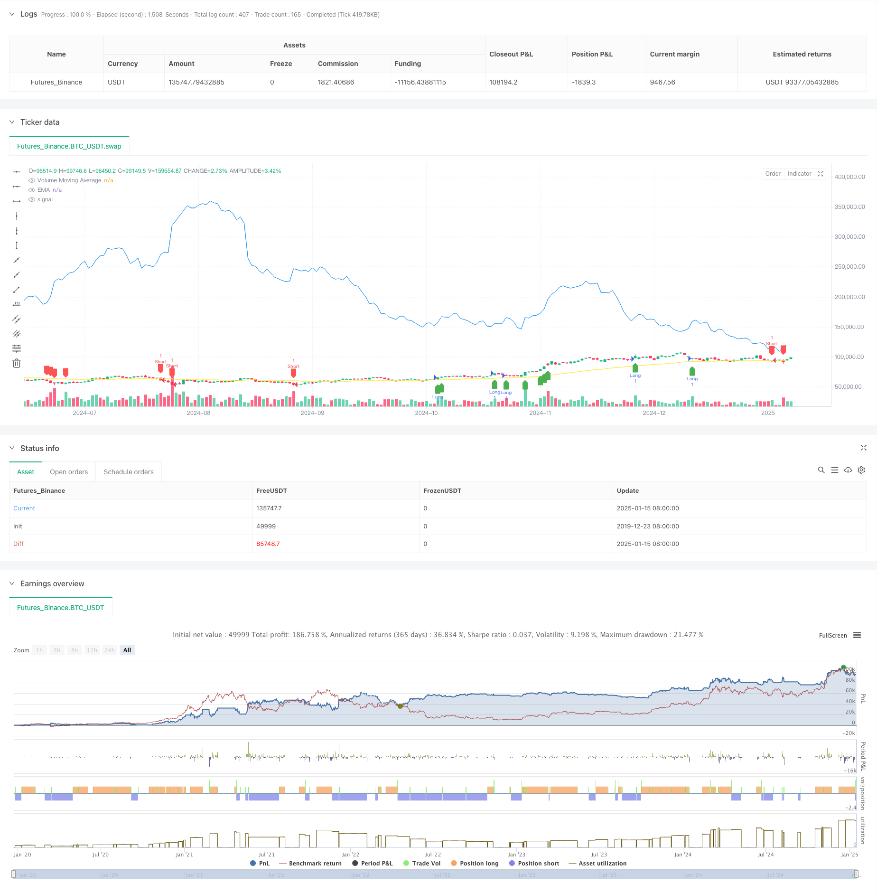

> Name

Advanced-Multi-Indicator-Trend-Confirmation-Trading-Strategy
> Author

ChaoZhang

> Strategy Description



[trans]
#### Overview
This is an advanced quantitative trading strategy that combines exponential moving averages (EMA), volume confirmation, and volatility indicators (ATR). Through the combined use of multiple technical indicators, this strategy can not only accurately grasp market trends, but also improve the reliability of transactions through volume confirmation. At the same time, it uses ATR to dynamically adjust the stop loss and profit positions, realizing a comprehensive risk management system.
#### Strategy Principle
The core logic of the strategy consists of three main parts:
1. Trend judgment: Use EMA (50) as the main indicator for trend judgment. When the price is above the EMA, it is judged to be an upward trend, and vice versa.
2. Trading volume confirmation: By calculating the 20-period volume moving average (Volume MA), the current trading volume is required to be not only 1.5 times higher than the moving average, but also greater than the previous period's trading volume to ensure sufficient market participation.
3. Risk management: Dynamically set stop loss and take profit positions based on 14-period ATR. The stop loss is set to 2 times ATR, and the take profit is set to 3 times ATR. This setting not only protects the safety of funds, but also gives room for the trend to fully develop.
#### Strategic Advantages
1. Multiple confirmation mechanism: Through double confirmation of trend and trading volume, the reliability of trading signals is greatly improved.
2. Dynamic risk management: Using ATR for dynamic stop-loss and take-profit settings can better adapt to changes in market volatility.
3. Strong flexibility: The strategy parameters can be adjusted according to different market conditions, and the adaptability is strong.
4. Clear visualization: The strategy provides clear graphical signal display to facilitate traders' intuitive judgment.
#### Strategy Risk
1. Trend reversal risk: In violent market fluctuations, EMA may produce lagging reactions, resulting in signal delays.
2. False breakthrough in trading volume: Under certain special market conditions, high trading volume may be a sign of a false breakthrough.
3. Stop loss width: In some cases, the stop loss setting of 2 times ATR may be larger and needs to be considered for adjustment.
#### Strategy optimization direction
1. Introduce trend strength indicators: You can consider adding trend strength indicators such as ADX to further improve the accuracy of trend judgment.
2. Optimize volume filtering: More complex volume analysis methods can be introduced, such as OBV or volume-weighted moving average.
3. Improve the stop loss mechanism: You can consider adding a trailing stop loss or a stop loss method based on support and resistance levels.
4. Add time filtering: Add trading time period filtering to avoid false signals during periods of low market activity.
#### Summary
This strategy establishes a logically rigorous trading system by comprehensively using multiple technical indicators. The core advantage of the strategy lies in the multiple confirmation mechanism and dynamic risk management, but at the same time, you need to pay attention to risks such as trend reversal and false breakthroughs in trading volume. Through continuous optimization and improvement, this strategy is expected to achieve better performance in actual transactions.
|| 

#### Overview
This is an advanced quantitative trading strategy that combines Exponential Moving Average (EMA), volume confirmation, and Average True Range (ATR). The strategy achieves accurate market trend capture through multiple technical indicators, enhances trade reliability through volume confirmation, and implements a comprehensive risk management system using dynamic ATR-based stop-loss and take-profit levels.

#### Strategy Principles
The core logic consists of three main components:
1. Trend Determination: Uses EMA(50) as the primary trend indicator. An uptrend is identified when price is above EMA, and vice versa.
2. Volume Confirmation: Calculates a 20-period Volume Moving Average, requiring current volume to exceed both 1.5 times the moving average and the previous period's volume to ensure sufficient market participation.
3. Risk Management: Dynamically sets stop-loss and take-profit levels based on 14-period ATR. Stop-loss is set at 2x ATR and take-profit at 3x ATR, balancing capital protection with trend development potential.

#### Strategy Advantages
1. Multiple Confirmation Mechanism: Dual confirmation through trend and volume significantly improves signal reliability.
2. Dynamic Risk Management: ATR-based dynamic stop-loss and take-profit settings better adapt to market volatility changes.
3. High Flexibility: Strategy parameters can be adjusted for different market conditions, providing strong adaptability.
4. Clear Visualization: Strategy provides clear graphical signal display for intuitive judgment.

#### Strategy Risks
1. Trend Reversal Risk: EMA may produce delayed signals during severe market fluctuations.
2. False Volume Breakouts: High volume might indicate false breakouts under certain market conditions.
3. Stop-Loss Range: The 2x ATR stop-loss setting might be too wide in some cases and may need adjustment.

#### Strategy Optimization Directions
1. Introduce Trend Strength Indicator: Consider adding ADX or similar indicators to improve trend determination accuracy.
2. Optimize Volume Filtering: Implement more sophisticated volume analysis methods like OBV or volume-weighted moving averages.
3. Enhance Stop-Loss Mechanism: Consider adding trailing stops or support/resistance-based stop-loss methods.
4. Add Time Filtering: Implement trading time filters to avoid false signals during low market activity periods.

#### Summary
This strategy establishes a logically rigorous trading system through the comprehensive use of multiple technical indicators. Its core strengths lie in its multiple confirmation mechanisms and dynamic risk management, while attention must be paid to risks such as trend reversals and false volume breakouts. Through continuous optimization and refinement, this strategy shows promise for improved performance in actual trading.[/trans]


> Source (PineScript)

``` pinescript
/*backtest
start: 2019-12-23 08:00:00
end: 2025-01-16 00:00:00
period: 1d
basePeriod: 1d
exchanges: [{"eid":"Futures_Binance","currency":"BTC_USDT","balance":49999}]
*/

//@version=5
strategy("Enhanced Volume + Trend Strategy", overlay=true)

// Inputs
emaLength = input.int(50, title="EMA Length")
atrLength = input.int(14, title="ATR Length")
atrMultiplierSL = input.float(2.0, title="ATR Multiplier for Stop Loss")
atrMultiplierTP = input.float(3.0, title="ATR Multiplier for Take Profit")
volLength = input.int(20, title="Volume Moving Average Length")
volMultiplier = input.float(1.5, title="Volume Multiplier (Relative to Previous Volume)")

// Trend Detection using EMA
ema = ta.ema(close, emaLength)

// ATR Calculation for Stop Loss/Take Profit
atr = ta.atr(atrLength)

// Volume Moving Average
volMA = ta.sma(volume, volLength)

// Additional Volume Condition (Current Volume > Previous Volume + Multiplier)
volCondition = volume > volMA * volMultiplier and volume > volume[1]

// Entry Conditions based on Trend (EMA) and Volume (Volume Moving Average)
longCondition = close > ema and volCondition
shortCondition = close < ema and volCondition

// Stop Loss and Take Profit Levels
longStopLoss = close - (atr * atrMultiplierSL)
longTakeProfit = close + (atr * atrMultiplierTP)
shortStopLoss = close + (atr * atrMultiplierSL)
shortTakeProfit = close - (atr * atrMultiplierTP)

// Strategy Execution
if (longCondition)
    strategy.entry("Long", strategy.long)
    strategy.exit("Take Profit/Stop Loss", "Long", stop=longStopLoss, limit=longTakeProfit)

if (shortCondition)
    strategy.entry("Short", strategy.short)
    strategy.exit("Take Profit/Stop Loss", "Short", stop=shortStopLoss, limit=shortTakeProfit)

// Plotting EMA
plot(ema, color=color.yellow, title="EMA")

// Plot Volume Moving Average
plot(volMA, color=color.blue, title="Volume Moving Average")

// Signal Visualizations
plotshape(series=longCondition, color=color.green, style=shape.labelup, location=location.belowbar, title="Buy Signal")
plotshape(series=shortCondition, color=color.red, style=shape.labeldown, location=location.abovebar, title="Sell Signal")

```

> Detail

https://www.fmz.com/strategy/478745

> Last Modified

2025-01-17 16:33:07
