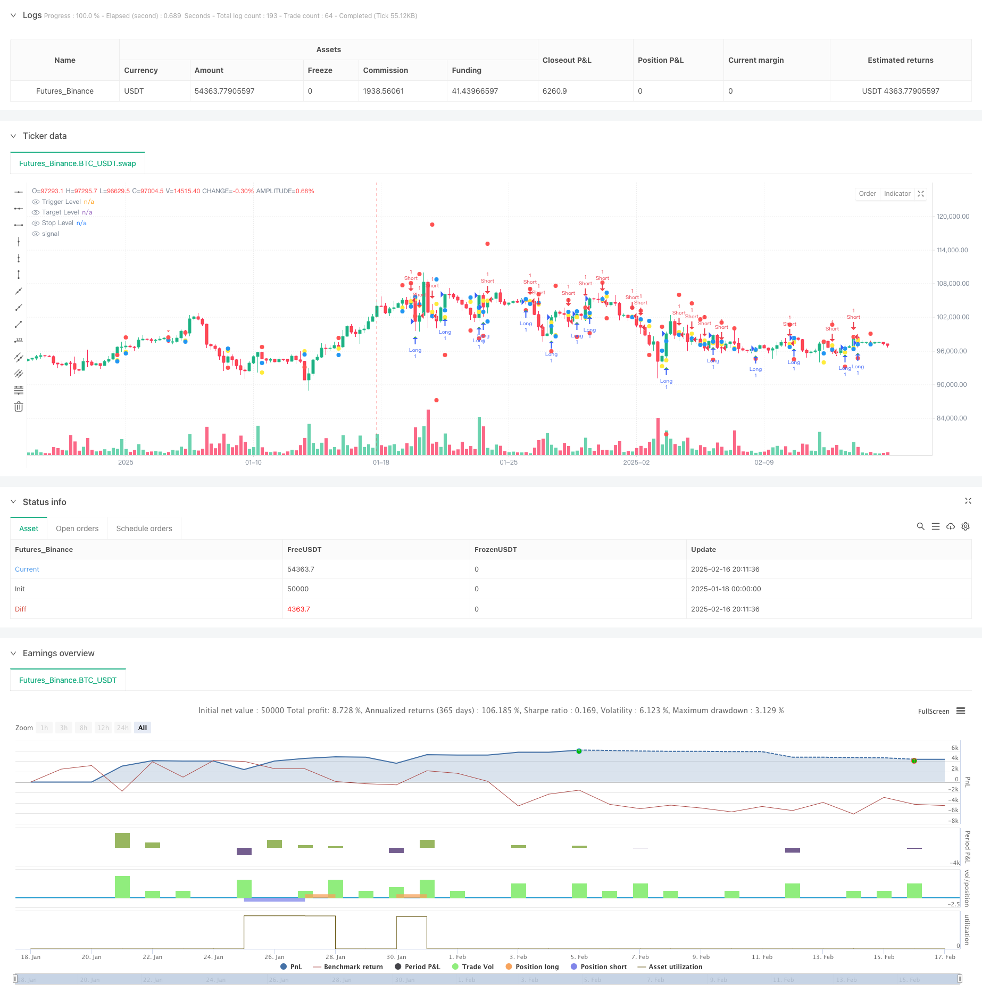

> Name

Advanced-Multi-Timeframe-Range-Breakout-Trading-Strategy
> Author

ChaoZhang

> Strategy Description



[trans]
#### Overview
This is a multi-time period trading strategy based on candlestick range theory. This strategy primarily identifies potential trading opportunities by analyzing higher timeframe candlestick patterns and price ranges. The strategy integrates volume filters and dynamic stop-loss mechanisms to capture trend opportunities through breakthroughs in previous highs and lows.
#### Strategy Principle
The core of the strategy is to monitor the price breaking through the previous range on a higher time period (default 4 hours). Specifically:
1. The strategy will continue to track and store the high and low point data of the first two high time period K lines
2. When the closing price of the previous K line is lower than the previous high and the current K line reaches a new high, a short signal is formed.
3. When the closing price of the previous K line is higher than the previous low and the current K line reaches a new low, a long signal is formed.
4. The entry price is set at the high and low points that trigger the K line
5. Set the profit target at the corresponding high and low points in the previous period
6. The stop loss distance is dynamically adjusted according to the interval size
#### Strategic Advantages
1. Multi-time period analysis provides more reliable signals
2. Dynamic stop loss setting, adaptive adjustment according to market volatility
3. Optional volume filtering mechanism to increase transaction confirmation
4. Clear visual interface, including trigger price, target price and stop loss mark
5. The strategy logic is simple and clear, easy to understand and implement
6. Applicable to various trading varieties and market environments
#### Strategy Risk
1. The market may produce frequent false breakthrough signals during range oscillations.
2. Larger stop loss multiples may result in excessive single losses.
3. Reliance on historical price data may result in delayed responses in rapidly changing market environments.
4. Failure to consider the impact of fundamental factors
5. May be difficult to execute effectively in less liquid markets
#### Strategy optimization direction
1. Introduce trend filters such as moving averages or ADX indicators
2. Add more market environment judgment conditions
3. Optimize the stop loss strategy and consider introducing a trailing stop loss
4. Add transaction volume management module
5. Consider adding more time periods to coordinate analysis
6. Introduce volatility indicators to optimize interval judgment
#### Summary
This is a multi-time period trading strategy with complete structure and clear logic. Look for potential trend opportunities by analyzing price behavior on higher time periods, while integrating risk management and filtering mechanisms. The core advantage of the strategy lies in its adaptability and scalability, which can be adapted to different market environments through simple parameter adjustments. Although there are some inherent risks, the stability and reliability of the strategy can be further improved through the suggested optimization directions. ||
#### Overview
This is a multi-timeframe trading strategy based on candlestick range theory. The strategy identifies potential trading opportunities by analyzing candlestick patterns and price ranges in higher timeframes. It incorporates a volume filter and dynamic stop-loss mechanism, capturing trend opportunities through breakouts of previous high and low points.

#### Strategy Principles
The core of the strategy is monitoring price breakouts from previous ranges in a higher timeframe (default 4-hour). Specifically:
1. The strategy continuously tracks and stores high and low data from the previous two higher timeframe candles
2. A short signal forms when the previous candle closes below the prior high and the current candle makes a new high
3. A long signal forms when the previous candle closes above the prior low and the current candle makes a new low
4. Entry prices are set at the trigger candle's high/low points
5. Profit targets are set at previous corresponding high/low points
6. Stop-loss distances are dynamically adjusted based on range size

#### Strategy Advantages
1. Multi-timeframe analysis provides more reliable signals
2. Dynamic stop-loss settings adapt to market volatility
3. Optional volume filter increases trade confirmation
4. Clear visualization interface with marked trigger, target, and stop levels
5. Simple and clear strategy logic, easy to understand and execute
6. Applicable to various trading instruments and market conditions

#### Strategy Risks
1. May generate frequent false breakout signals in ranging markets
2. Larger stop-loss multipliers can lead to significant individual losses
3. Reliance on historical price data may result in delayed reactions to rapidly changing markets
4. Does not consider fundamental factors
5. May be difficult to execute effectively in low-liquidity markets

#### Strategy Optimization Directions
1. Introduce trend filters like moving averages or ADX indicator
2. Add more market condition judgment criteria
3. Optimize stop-loss strategy, consider implementing trailing stops
4. Add position sizing module
5. Consider incorporating more timeframe analyses
6. Introduce volatility indicators to optimize range judgment

#### Summary
This is a well-structured, logically sound multi-timeframe trading strategy. It seeks trend opportunities by analyzing price action in higher timeframes while integrating risk management and filtering mechanisms. The strategy's core strength lies in its adaptability and scalability, allowing adjustment to different market conditions through simple parameter modifications. While inherent risks exist, the suggested optimization directions can further enhance the strategy's stability and reliability.[/trans]


> Source (PineScript)

``` pinescript
/*backtest
start: 2025-01-18 00:00:00
end: 2025-02-17 00:00:00
period: 6h
basePeriod: 6h
exchanges: [{"eid":"Futures_Binance","currency":"BTC_USDT"}]
*/

//@version=6
strategy("Candle Range Theory Strategy", overlay=true)

// Input parameters
var string HTF = input.timeframe("240", "Higher Timeframe (Minutes)")  // 4H default
var float stopLossMultiplier = input.float(1.5, "Stop Loss Multiplier", minval=0.5)
var bool useVolFilter = input.bool(false, "Use Volume Filter")
var float volThreshold = input.float(1.5, "Volume Threshold Multiplier", minval=1.0)

// Function to get higher timeframe data
getHtfData(src) =>
    request.security(syminfo.tickerid, HTF, src)

// Calculate volume condition once per bar
var bool volCondition = true
if useVolFilter
    float vol = getHtfData(volume)
    float avgVol = ta.sma(vol, 20)
    volCondition := vol > avgVol * volThreshold

// Get HTF candle data
htf_open = getHtfData(open)
htf_high = getHtfData(high)
htf_low = getHtfData(low)
htf_close = getHtfData(close)

// Store previous candle data
var float h1 = na  // High of Candle 1
var float l1 = na  // Low of Candle 1
var float h2 = na  // High of Candle 2
var float l2 = na  // Low of Candle 2
var float prevClose = na

// Track setup conditions
var string setupType = na
var float triggerLevel = na
var float targetLevel = na
var float stopLevel = na

// Update candle data - fixed time function usage
var bool isNewBar = false
isNewBar := ta.change(request.security(syminfo.tickerid, HTF, time)) != 0

if isNewBar
    h1 := h2
    l1 := l2
    h2 := htf_high[1]
    l2 := htf_low[1]
    prevClose := htf_close[1]

    // Identify setup conditions
    if not na(h1) and not na(h2) and not na(prevClose)
        if (h2 > h1 and prevClose < h1)  // Short setup
            setupType := "short"
            triggerLevel := l2
            targetLevel := l1
            stopLevel := h2 + (h2 - l1) * stopLossMultiplier
        else if (l2 < l1 and prevClose > l1)  // Long setup
            setupType := "long"
            triggerLevel := h2
            targetLevel := h1
            stopLevel := l2 - (h1 - l2) * stopLossMultiplier
        else
            setupType := na
            triggerLevel := na
            targetLevel := na
            stopLevel := na

// Entry conditions using pre-calculated volume condition - fixed line breaks
bool longCondition = setupType == "long" and high > triggerLevel and not na(triggerLevel) and volCondition
bool shortCondition = setupType == "short" and low < triggerLevel and not na(triggerLevel) and volCondition

// Execute trades
if longCondition
    strategy.entry("Long", strategy.long, comment="Long Entry")
    strategy.exit("Long Exit", "Long", limit=targetLevel, stop=stopLevel)

if shortCondition
    strategy.entry("Short", strategy.short, comment="Short Entry")
    strategy.exit("Short Exit", "Short", limit=targetLevel, stop=stopLevel)

// Plot signals - fixed plotshape parameters
plotshape(series=longCondition, title="Long Signal", location=location.belowbar, color=color.green, style=shape.triangleup)
plotshape(series=shortCondition, title="Short Signal", location=location.abovebar, color=color.red, style=shape.triangledown)

plot(triggerLevel, "Trigger Level", color=color.yellow, style=plot.style_circles)
plot(targetLevel, "Target Level", color=color.blue, style=plot.style_circles)
plot(stopLevel, "Stop Level", color=color.red, style=plot.style_circles)

```

> Detail

https://www.fmz.com/strategy/482507

> Last Modified

2025-02-18 18:08:09
