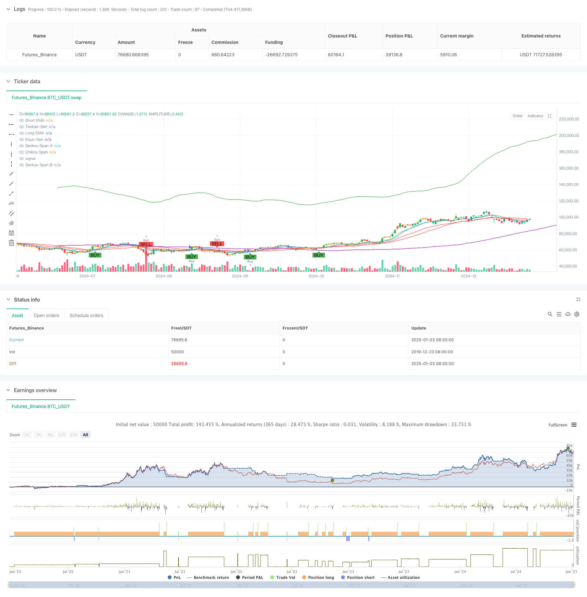

> Name

Advanced-Quantitative-Trend-Following-and-Cloud-Reversal-Composite-Trading-Strategy
> Author

ChaoZhang

> Strategy Description



[trans]
#### Overview
This strategy is a composite trading system that combines the Exponential Moving Average (EMA) crossover and the Ichimoku Cloud. The EMA crossover is mainly used to capture the trend start signal and confirm the buying opportunity, while the Ichimoku cloud chart is used to identify the market turn and determine the selling opportunity. Through the coordination of multi-dimensional technical indicators, this strategy can not only effectively grasp the trend, but also avoid risks in a timely manner.
#### Strategy Principle
The strategy operating mechanism mainly consists of two core parts:
1. EMA cross buy signal: Use the intersection of short-period (9-day) and long-period (21-day) exponential moving averages to confirm the trend direction. When the short-term EMA crosses the long-term EMA upward, it indicates that short-term momentum has increased and a buy signal is generated.
2. Ichimoku cloud chart sell signal: judge the trend direction through the position relationship between price and cloud chart and the internal structure of the cloud chart. When the price falls below the lower boundary of the cloud chart or the leading band A falls below the leading band B, a sell signal is triggered. The strategy also sets a stop-loss and profit-taking mechanism, with the stop-loss set at 1.5% and the profit target at 3%.
#### Strategic Advantages
1. Multi-dimensional signal confirmation: Through the combined use of EMA cross and Ichimoku cloud chart, the reliability of trading signals can be verified from different angles.
2. Improved risk control: Fixed percentage stop loss and profit targets are set, which can effectively control the risk of each transaction.
3. Strong trend grasping ability: EMA crossover can catch the start of the trend in time, while Ichimoku Cloud Chart can better identify the end of the trend.
4. Signals are clear and objective: Trading signals are automatically generated by technical indicators, reducing the interference of subjective judgments.
#### Strategy Risk
1. Risk of volatile market: Frequent false signals may occur in a volatile market, resulting in continuous stop losses.
2. Lagging risk: Both the moving average and the Ichimoku Cloud Chart have a certain degree of lag, and may miss the best entry point in rapid market conditions.
3. Parameter sensitivity: The strategy effect is more sensitive to parameter settings, and different market environments may require adjusting parameters.
#### Strategy optimization direction
1. Add market environment filtering: You can add volatility indicators or trend strength indicators to adjust strategy parameters under different market environments.
2. Optimize the stop loss mechanism: You can consider using dynamic stop loss, such as trailing stop loss or ATR-based stop loss setting.
3. Improve the signal confirmation mechanism: auxiliary indicators such as trading volume and momentum can be added to improve signal reliability.
4. Introduce position management: dynamically adjust position size based on signal strength and market volatility.
#### Summary
This strategy builds a trading system with both trend tracking and reversal capturing capabilities through the organic combination of EMA crossover and Ichimoku cloud chart. The strategy design is reasonable, risk control is in place, and it has good practical application value. There is room for further improvement of the strategy through the suggested optimization directions. When applying in real market, it is recommended to determine the appropriate parameter combination through backtesting first, and make dynamic adjustments according to the actual market conditions.
||
#### Overview
This strategy is a composite trading system combining Exponential Moving Average (EMA) crossover and Ichimoku Cloud. EMA crossover is primarily used to capture trend initiation signals and confirm buying opportunities, while the Ichimoku Cloud is used to identify market reversals and determine selling points. Through the coordination of multi-dimensional technical indicators, the strategy can effectively capture trends while timely avoiding risks.
#### Strategy Principle
The strategy operates through two core components:
1. EMA Crossover Buy Signal: Uses the crossover of short-period (9-day) and long-period (21-day) exponential moving averages to confirm trend direction. A buy signal is generated when the short-term EMA crosses above the long-term EMA, indicating strengthening short-term momentum.
2. Ichimoku Cloud Sell Signal: Determines trend reversals through price position relative to the cloud and internal cloud structure. Sell signals are triggered when price breaks below the cloud or when Leading Span A crosses below Leading Span B. The strategy includes stop-loss at 1.5% and take-profit at 3%.

#### Strategy Advantages
1. Multi-dimensional Signal Confirmation: The combination of EMA crossover and Ichimoku Cloud validates trading signals from different perspectives.
2. Comprehensive Risk Control: Fixed percentage stop-loss and profit targets effectively control risk for each trade.
3. Strong Trend Capture Capability: EMA crossover captures trend initiation while Ichimoku Cloud effectively identifies trend endings.
4. Clear and Objective Signals: Trading signals are automatically generated by technical indicators, reducing subjective judgment interference.

#### Strategy Risks
1. Ranging Market Risk: May generate frequent false signals in sideways markets, leading to consecutive stops.
2. Lag Risk: Both moving averages and Ichimoku Cloud have inherent lag, potentially missing optimal entry points in rapid market moves.
3. Parameter Sensitivity: Strategy performance is sensitive to parameter settings, requiring adjustment in different market conditions.

#### Strategy Optimization
1. Add Market Environment Filters: Include volatility or trend strength indicators to adjust strategy parameters based on market conditions.
2. Optimize Stop-Loss Mechanism: Consider implementing dynamic stops, such as trailing stops or ATR-based stops.
3. Enhance Signal Confirmation: Add volume and momentum indicators to improve signal reliability.
4. Implement Position Sizing: Dynamically adjust position size based on signal strength and market volatility.

#### Summary
This strategy builds a trading system capable of both trend following and reversal capture through the organic combination of EMA crossover and Ichimoku Cloud. The strategy design is rational with proper risk control, showing good practical application value. Through the suggested optimization directions, there is room for further improvement. For live trading, it is recommended to first determine suitable parameter combinations through backtesting and make dynamic adjustments based on actual market conditions.[/trans]


> Source (PineScript)

``` pinescript
/*backtest
start: 2019-12-23 08:00:00
end: 2025-01-04 08:00:00
period: 1d
basePeriod: 1d
exchanges: [{"eid":"Futures_Binance","currency":"BTC_USDT"}]
*/

//@version=5
strategy("EMA Crossover Buy + Ichimoku Cloud Sell Strategy", overlay=true)

// Input Parameters for the EMAs
shortEmaPeriod = input.int(9, title="Short EMA Period", minval=1)
longEmaPeriod = input.int(21, title="Long EMA Period", minval=1)

// Input Parameters for the Ichimoku Cloud
tenkanPeriod = input.int(9, title="Tenkan-Sen Period", minval=1)
kijunPeriod = input.int(26, title="Kijun-Sen Period", minval=1)
senkouSpanBPeriod = input.int(52, title="Senkou Span B Period", minval=1)
displacement = input.int(26, title="Displacement", minval=1)

// Calculate the EMAs
shortEma = ta.ema(close, shortEmaPeriod)
longEma = ta.ema(close, longEmaPeriod)

// Ichimoku Cloud Calculations
tenkanSen = ta.sma(close, tenkanPeriod)
kijunSen = ta.sma(close, kijunPeriod)
senkouSpanA = ta.sma(tenkanSen + kijunSen, 2)
senkouSpanB = ta.sma(close, senkouSpanBPeriod)
chikouSpan = close[displacement]

// Plot the EMAs on the chart
plot(shortEma, color=color.green, title="Short EMA")
plot(longEma, color=color.red, title="Long EMA")

// Plot the Ichimoku Cloud
plot(tenkanSen, color=color.blue, title="Tenkan-Sen")
plot(kijunSen, color=color.red, title="Kijun-Sen")
plot(senkouSpanA, color=color.green, title="Senkou Span A", offset=displacement)
plot(senkouSpanB, color=color.purple, title="Senkou Span B", offset=displacement)
plot(chikouSpan, color=color.orange, title="Chikou Span", offset=-displacement)

// Buy Condition: Short EMA crosses above Long EMA
buyCondition = ta.crossover(shortEma, longEma)

// Sell Condition: Tenkan-Sen crosses below Kijun-Sen, and price is below the cloud
sellCondition = ta.crossunder(tenkanSen, kijunSen) and close < senkouSpanA and close < senkouSpanB

// Plot Buy and Sell signals
plotshape(series=buyCondition, title="Buy Signal", location=location.belowbar, color=color.green, style=shape.labelup, text="BUY")
plotshape(series=sellCondition, title="Sell Signal", location=location.abovebar, color=color.red, style=shape.labeldown, text="SELL")

// Execute Buy and Sell Orders
if (buyCondition)
    strategy.entry("Buy", strategy.long)

if (sellCondition)
    strategy.entry("Sell", strategy.short)

// Optional: Add Stop Loss and Take Profit (risk management)
stopLossPercentage = input.float(1.5, title="Stop Loss Percentage", minval=0.1) / 100
takeProfitPercentage = input.float(3.0, title="Take Profit Percentage", minval=0.1) / 100

longStopLoss = close * (1 - stopLossPercentage)
longTakeProfit = close * (1 + takeProfitPercentage)

shortStopLoss = close * (1 + stopLossPercentage)
shortTakeProfit = close * (1 - takeProfitPercentage)

strategy.exit("Take Profit/Stop Loss", "Buy", stop=longStopLoss, limit=longTakeProfit)
strategy.exit("Take Profit/Stop Loss", "Sell", stop=shortStopLoss, limit=shortTakeProfit)

```

> Detail

https://www.fmz.com/strategy/477513

> Last Modified

2025-01-06 10:56:42
