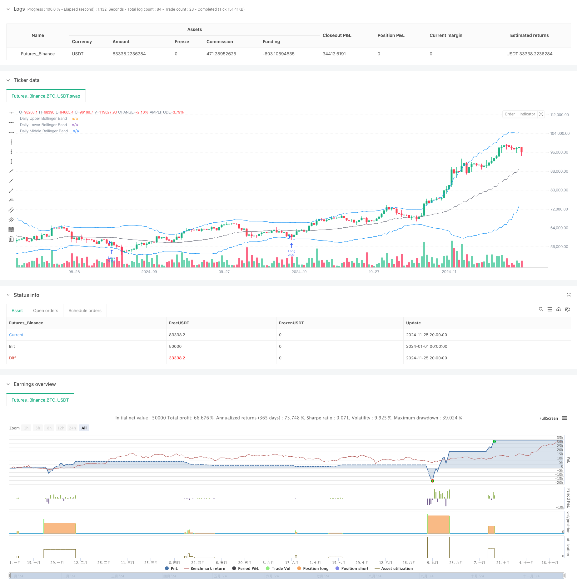

> Name

Advanced-Trend-Trading-Strategy-Based-on-Bollinger-Bands-and-Candlestick-Patterns
> Author

ChaoZhang

> Strategy Description



[trans]
#### Overview
This is a trend following strategy based on analysis of Bollinger Bands and candlestick patterns. The strategy mainly determines the possible reversal point of the market by observing the morphological characteristics of the candle chart when the price touches the Bollinger Band, combined with the ratio relationship between the upper and lower leads and the entity. At the same time, the strategy adopts a fixed risk model to control the risk exposure of each transaction, and improves the accuracy of transactions through multiple time period analysis.
#### Strategy Principle
The core logic of the strategy is based on the following key elements: first, determine the range of price fluctuations by calculating the 20-period Bollinger Band; second, when the price touches the Bollinger Band, analyze the ratio of the upper and lower leads of the candle chart to the entity. When the ratio exceeds the set threshold, it is regarded as a potential reversal signal; third, set the stop loss point by calculating the key support and resistance levels; finally, calculate the position of each transaction based on a fixed proportion of the total account amount (1%) to achieve dynamic management of risk. This strategy also provides a variety of entry timing options, including closing price, opening price, the highest price and lowest price within the day, etc.
#### Strategic Advantages
1. Precise risk control: adopt a fixed proportion risk management model to ensure that the risk exposure of each transaction is within the controllable range
2. Flexible entry points: Provides a variety of entry price options to adapt to different trading styles
3. Combining technical indicators: Combining Bollinger Bands with candle chart morphological analysis to improve the reliability of signals
4. Reasonable stop loss setting: Set stop loss through key support and resistance levels, in line with market operation rules
5. Improved transaction management: including order expiration mechanism to avoid misoperations caused by expired signals
#### Strategy Risk
1. Risk of rapid market fluctuations: In violently volatile markets, lead ratios may produce false signals
2. Fund management risk: The fixed proportion risk model may lead to positions that are too small under continuous losses.
3. Stop loss setting risk: The calculation of support and resistance levels may not be accurate enough under certain market conditions.
4. Time cycle dependence: The strategy is mainly based on the daily level and may miss opportunities in smaller time frames.
#### Strategy optimization direction
1. Introducing trading volume indicators: The reliability of signals can be improved by adding trading volume analysis when the signal is confirmed.
2. Optimize the stop loss mechanism: consider introducing dynamic stop loss and automatically adjust the stop loss distance according to market volatility
3. Add market environment filtering: add trend strength indicators and adjust strategy parameters under different market environments
4. Improve position management: Consider introducing a dynamic position management mechanism to adjust risk exposure according to market volatility
5. Add time filter: You can add time filter to avoid trading during periods of large market fluctuations
#### Summary
This strategy builds a relatively complete trading system by combining classic technical analysis tools with modern risk management methods. The core advantage of the strategy lies in its strict risk control and flexible entry mechanism, but it also requires attention to changes in the market environment and verification of signal reliability in practical applications. With the suggested optimization directions, there is room for further improvement of the strategy, especially in terms of signal filtering and risk management. ||
#### Overview
This is a trend-following strategy based on Bollinger Bands and candlestick pattern analysis. The strategy primarily identifies potential market reversal points by observing candlestick patterns when price touches Bollinger Bands, combined with the ratio relationship between wicks and body. Additionally, the strategy employs a fixed risk model to control exposure per trade and utilizes multiple timeframe analysis to enhance trading accuracy.

#### Strategy Principles
The core logic of the strategy is based on several key elements: First, it calculates Bollinger Bands over 20 periods to determine price volatility range; Second, when price touches the Bollinger Bands, it analyzes the ratio between upper/lower wicks and body of the candlestick, considering it as a potential reversal signal when the ratio exceeds the set threshold; Third, it calculates key support and resistance levels for stop-loss placement; Finally, it calculates position size for each trade based on a fixed percentage (1%) of the account balance, implementing dynamic risk management. The strategy also offers various entry timing options, including closing price, opening price, daily high, and daily low.

#### Strategy Advantages
1. Precise risk control: Uses fixed percentage risk management model, ensuring controlled risk exposure per trade
2. Flexible entry points: Provides multiple entry price options to accommodate different trading styles
3. Technical indicator combination: Combines Bollinger Bands with candlestick pattern analysis for improved signal reliability
4. Rational stop-loss placement: Sets stop-losses based on key support and resistance levels, aligning with market dynamics
5. Comprehensive trade management: Includes order expiration mechanism to avoid false signals

#### Strategy Risks
1. Rapid market fluctuation risk: Wick ratios may generate false signals in volatile markets
2. Money management risk: Fixed percentage risk model might lead to undersized positions after consecutive losses
3. Stop-loss placement risk: Support and resistance calculations may not be accurate under certain market conditions
4. Timeframe dependency: Strategy primarily based on daily timeframe may miss opportunities in smaller timeframes

#### Strategy Optimization Directions
1. Incorporate volume indicators: Add volume analysis for signal confirmation to improve reliability
2. Optimize stop-loss mechanism: Consider implementing dynamic stop-loss that adjusts based on market volatility
3. Add market environment filters: Include trend strength indicators to adjust strategy parameters in different market conditions
4. Improve position management: Consider implementing dynamic position sizing based on market volatility
5. Add time filters: Include time filters to avoid trading during highly volatile market sessions

#### Summary
This strategy combines classical technical analysis tools with modern risk management methods to build a relatively comprehensive trading system. The core advantages lie in its strict risk control and flexible entry mechanisms, while attention needs to be paid to market environment changes and signal reliability verification in practical applications. Through the suggested optimization directions, there is room for further improvement, particularly in signal filtering and risk management aspects.
[/trans]


> Source (PineScript)

``` pinescript
/*backtest
start: 2024-01-01 00:00:00
end: 2024-11-26 00:00:00
period: 12h
basePeriod: 12h
exchanges: [{"eid":"Futures_Binance","currency":"BTC_USDT"}]
*/

//@version=5
strategy("Trade Entry Detector, based on Wick to Body Ratio when price tests Bollinger Bands", overlay=true, default_qty_type=strategy.fixed)

// Input for primary analysis time frame
timeFrame = "D"  // Daily time frame

// Bollinger Band settings
length = input.int(20, title="Bollinger Band Length", minval=1)
mult = input.float(2.0, title="Standard Deviation Multiplier", minval=0.1)
source = input(close, title="Source")

// Entry ratio settings
wickToBodyRatio = input.float(1.0, title="Minimum Wick-to-Body Ratio", minval=0)

// Order Fill Timing Option
fillOption = input.string("Daily Close", title="Order Fill Timing", options=["Daily Close", "Daily Open", "HOD", "LOD"])

// Account and risk settings
accountBalance = 100000  // Account balance in dollars
riskPercentage = 1.0     // Risk percentage per trade
riskAmount = (riskPercentage / 100) * accountBalance // Fixed 1% risk amount

// Request daily data for calculations
dailyHigh = request.security(syminfo.tickerid, timeFrame, high)
dailyLow = request.security(syminfo.tickerid, timeFrame, low)
dailyClose = request.security(syminfo.tickerid, timeFrame, close)
dailyOpen = request.security(syminfo.tickerid, timeFrame, open)

// Calculate Bollinger Bands on the daily time frame
dailyBasis = request.security(syminfo.tickerid, timeFrame, ta.sma(source, length))
dailyDev = mult * request.security(syminfo.tickerid, timeFrame, ta.stdev(source, length))
dailyUpperBand = dailyBasis + dailyDev
dailyLowerBand = dailyBasis - dailyDev

// Calculate the body and wick sizes on the daily time frame
dailyBodySize = math.abs(dailyOpen - dailyClose)
dailyUpperWickSize = dailyHigh - math.max(dailyOpen, dailyClose)
dailyLowerWickSize = math.min(dailyOpen, dailyClose) - dailyLow

// Conditions for a candle with an upper wick or lower wick that touches the Bollinger Bands
upperWickCondition = (dailyUpperWickSize / dailyBodySize >= wickToBodyRatio) and (dailyHigh > dailyUpperBand)
lowerWickCondition = (dailyLowerWickSize / dailyBodySize >= wickToBodyRatio) and (dailyLow < dailyLowerBand)

// Define the swing high and swing low for stop loss placement
var float swingLow = na
var float swingHigh = na

if (ta.pivothigh(dailyHigh, 5, 5))
    swingHigh := dailyHigh[5]

if (ta.pivotlow(dailyLow, 5, 5))
    swingLow := dailyLow[5]

// Determine entry price based on chosen fill option
var float longEntryPrice = na
var float shortEntryPrice = na

if lowerWickCondition
    longEntryPrice := fillOption == "Daily Close" ? dailyClose :
                      fillOption == "Daily Open" ? dailyOpen :
                      fillOption == "HOD" ? dailyHigh : dailyLow

if upperWickCondition
    shortEntryPrice := fillOption == "Daily Close" ? dailyClose :
                       fillOption == "Daily Open" ? dailyOpen :
                       fillOption == "HOD" ? dailyHigh : dailyLow

// Execute the long and short entries with expiration
var int longOrderExpiry = na
var int shortOrderExpiry = na

if not na(longEntryPrice)
    longOrderExpiry := bar_index + 2  // Order expires after 2 days

if not na(shortEntryPrice)
    shortOrderExpiry := bar_index + 2  // Order expires after 2 days

// Check expiration and execute orders
if (longEntryPrice and bar_index <= longOrderExpiry and high >= longEntryPrice)
    longStopDistance = close - nz(swingLow, close)
    longPositionSize = longStopDistance > 0 ? riskAmount / longStopDistance : na
    if (not na(longPositionSize))
        strategy.entry("Long", strategy.long, qty=longPositionSize)
    longEntryPrice := na  // Reset after entry

if (shortEntryPrice and bar_index <= shortOrderExpiry and low <= shortEntryPrice)
    shortStopDistance = nz(swingHigh, close) - close
    shortPositionSize = shortStopDistance > 0 ? riskAmount / shortStopDistance : na
    if (not na(shortPositionSize))
        strategy.entry("Short", strategy.short, qty=shortPositionSize)
    shortEntryPrice := na  // Reset after entry

// Exit logic: hit the opposing Bollinger Band
if (strategy.position_size > 0) // Long position
    strategy.exit("Exit Long", "Long", limit=dailyUpperBand)
else if (strategy.position_size < 0) // Short position
    strategy.exit("Exit Short", "Short", limit=dailyLowerBand)

if (strategy.position_size > 0) // Long position
    strategy.exit("Stop Loss Long", "Long", stop=swingLow)
else if (strategy.position_size < 0) // Short position
    strategy.exit("Stop Loss Short", "Short", stop=swingHigh)

// Plot daily Bollinger Bands and levels on the chosen time frame
plot(dailyUpperBand, color=color.blue, linewidth=1, title="Daily Upper Bollinger Band")
plot(dailyLowerBand, color=color.blue, linewidth=1, title="Daily Lower Bollinger Band")
plot(dailyBasis, color=color.gray, linewidth=1, title="Daily Middle Bollinger Band")

```

> Detail

https://www.fmz.com/strategy/473122

> Last Modified

2024-11-27 14:18:33
