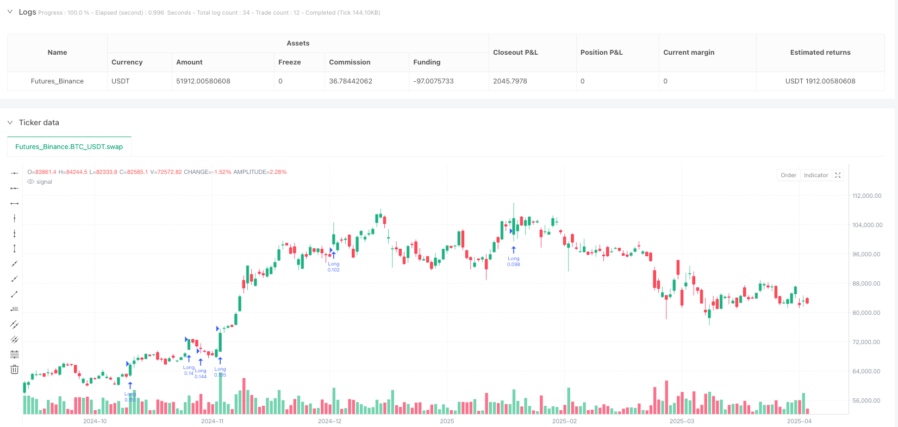
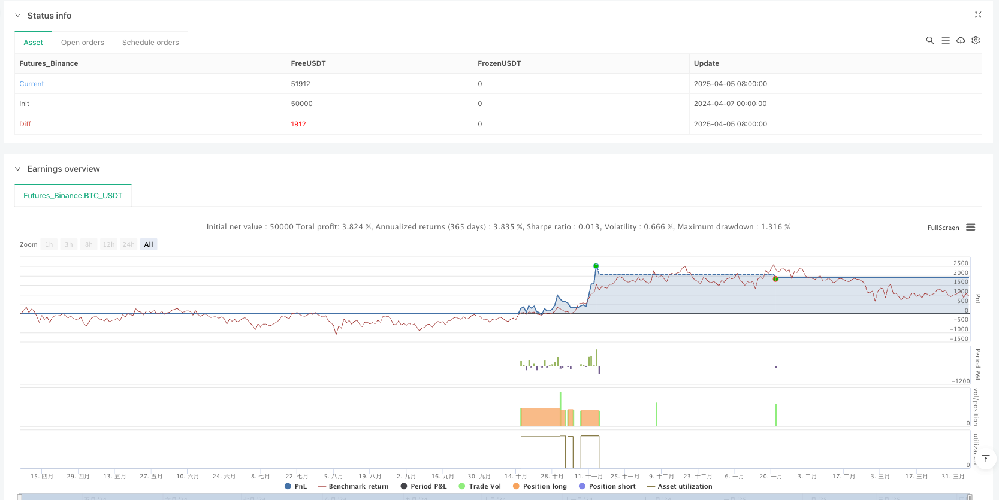

> Name

Alpha-Beast-Advanced-Quantitative-Trading-Strategy-Multi-Indicator-Synergistic-Dynamic-Risk-Control-System
> Author

ianzeng123

> Strategy Description





[trans]

# **Overview**
Alpha Beast Advanced Quantitative Trading Strategy is a comprehensive trading system that combines multiple technical indicators and is designed to capture strong trends in the market. The core of this strategy is to integrate the Supertrend indicator, Relative Strength Index (RSI) and volume breakthrough judgment to form a multi-dimensional entry signal confirmation mechanism. At the same time, the strategy adopts dynamic stop loss based on true fluctuation range (ATR) and target profit setting based on risk reward ratio (RR) to ensure that each transaction is executed within a strict risk management framework. The strategy uses 20% of the total account value as trading capital by default, balancing profit potential and risk exposure.
# **Strategy Principle**
The operation of Alpha Beast advanced quantitative trading strategies is based on the following key components and logical processes:
1. **Indicator Calculation**:
   - RSI(14): measures the relative strength of price movements
   - ATR(14): measures market volatility
   - Super Trend (3.0, 10): Determine the market trend direction
   - Volume analysis: Use the 20-day volume moving average to compare with current volume to identify volume pushes
2. **Admission conditions**:
   - Bull conditions: Super trend up (directional indicator below closing price) + RSI > 60 + volume breakout (current volume > 20-day average volume * 1.5)
   - Short conditions: Super trend down (directional indicator above closing price) + RSI < 40 + volume breakout (current volume > 20-day average volume * 1.5)
3. **Risk Management**:
   - Stop loss setting: calculated based on ATR value, long position is the current price minus ATR*1.2, short position is the current price plus ATR*1.2
   - Take profit setting: calculated based on risk-reward ratio, default is 2.5 times stop loss distance
   - Fund Management: Each transaction uses 20% of the total account value
The core logic of the strategy is to require multiple conditions to be met simultaneously to trigger a trading signal. This "confirmation mechanism" effectively reduces false signals, and at the same time adapts to changes in market volatility through dynamically calculated stop-loss and take-profit levels.
# **Strategic Advantage**
1. **Multiple confirmation mechanism**: Combines indicators from the three dimensions of trend, momentum and trading volume to significantly reduce the risk of false signals. Transactions will only be executed when the market meets the conditions of trend, strength and trading volume at the same time.
2. **Dynamic Risk Management**: The stop loss and take profit points are dynamically adjusted according to the actual market volatility (ATR) instead of using fixed points, which allows the strategy to adapt to different market environments and fluctuation cycles.
3. **Effective capture of trending market**: Through the combination of super trend indicator and RSI threshold, the strategy is particularly suitable for capturing strong market trends with clear directions.
4. **Trading volume confirmation**: Introduce trading volume analysis as transaction confirmation to ensure that the entry point has sufficient market participation and momentum support, and reduce unnecessary transactions in a low-liquidity environment.
5. **Optimization of risk-reward ratio**: The risk-reward ratio setting of 2.5:1 is used by default, so that even if the winning rate is not high, the strategy can maintain profitability in the long term.
6. **Built-in mechanism for fund management**: Control the amount of funds for each transaction through percentages to avoid excessive risk exposure and contribute to the long-term stable growth of the account.
# **Strategic Risk**
1. **RSI threshold sensitivity**: The fixed RSI threshold (60/40) may perform differently in different market environments, may produce too many false signals in long-term range-bound markets, and may miss continued opportunities in strong trending markets.
2. **Trading volume dependence risk**: The strategy has a strong dependence on trading volume breakthroughs. In certain trading types or periods, trading volume data may be inaccurate or lagging, affecting signal quality.
3. **Super trend parameter fixed problem**: Using fixed super trend parameters (3.0, 10) may not be suitable for all market environments, and parameter optimization lacks an adaptive mechanism.
4. **Stop loss setting may be too tight**: In a highly volatile market, an ATR multiple of 1.2 may cause the stop loss to be too close to the current price, increasing the risk of being triggered by market noise.
5. **Fixed Funding Allocation**: Using a fixed proportion (20%) of account funds each time may not be flexible enough to dynamically adjust position sizes based on signal strength and market conditions.
**Solution**:
-Introducing adaptive RSI threshold, dynamically adjusted according to market volatility
- Add a trading volume data quality inspection mechanism, or use multi-period trading volume confirmation
- Implement adaptive optimization of super trend parameters
- Dynamically adjust ATR multiples during periods of high volatility
- Introducing a dynamic adjustment algorithm for position size based on signal strength
# **Strategy Optimization Direction**
1. **Adaptive optimization of indicator parameters**:
   - Realize adaptive adjustment of RSI threshold, super trend factor and trading volume multiple, and dynamically optimize parameters according to market fluctuation cycle and historical performance
   - Reason: Fixed parameters are difficult to adapt to all market environments. Adaptive parameters can improve the universality and robustness of the strategy.
2. **Introduction of time filter**:
   - Add intraday trading time filtering or market period analysis functions to avoid inefficient trading periods
   - Reason: There are significant differences in market efficiency and signal reliability in different time periods, and time filtering can improve the overall signal quality.
3. **Multi-cycle confirmation system**:
   - Add trend confirmation for multiple time periods to ensure that the trading direction is consistent with the trend of the larger period
   - Reason: Single-period analysis is susceptible to short-term market noise, while multi-period analysis can provide a more comprehensive market perspective.
4. **Machine Learning Signal Optimization**:
   - Introduce machine learning algorithms to perform secondary screening of existing signals to identify trading opportunities with a higher winning rate
   - Reason: It is difficult for traditional technical indicator combinations to capture the complex non-linear relationships in the market. Machine learning can significantly improve pattern recognition capabilities.
5. **Dynamic adjustment of risk management**:
   - Dynamically adjust the risk-reward ratio and capital allocation ratio based on historical volatility and current market conditions
   - Reason: The optimal risk parameters under different market environments vary greatly, and dynamic risk management can better adapt to market changes.
6. **Add market sentiment indicator**:
   - Integrate VIX or other market sentiment indicators to adjust strategic behavior in extreme market environments
   - Reason: During periods of market panic or extreme greed, the effectiveness of conventional technical analysis is reduced, and market sentiment indicators can provide an additional dimension of decision support.
# **Summarize**
Alpha Beast advanced quantitative trading strategy represents a modern trading system that integrates the synergy of multiple indicators, achieving multi-dimensional identification of market opportunities by combining trend analysis, momentum indicators and volume confirmation. Its core advantage lies in its strict signal screening mechanism and dynamic risk management system, which enable the strategy to maintain stable performance in volatile markets.
Despite the limitations of RSI threshold fixation and parameter optimization, the strategy has the potential to develop into a more comprehensive and robust trading system through the proposed optimization direction, especially the introduction of adaptive parameter systems, multi-period confirmations and machine learning-assisted decision-making. Most importantly, its risk management framework design concept—combining ATR dynamic stop loss and fixed risk-reward ratio—provides a worthy template for the development of quantitative trading strategies.
For traders who pursue a systematic trading approach based on technical analysis, the Alpha Beast strategy provides a practical framework that balances signal quality and risk control, and can be adapted to various market environments and trading styles through further optimization and personalized adjustments. ||
# **Overview**

The Alpha Beast Advanced Quantitative Trading Strategy is a comprehensive trading system that combines multiple technical indicators, designed to capture strong trends in the market. The core of this strategy lies in integrating the Supertrend indicator, Relative Strength Index (RSI), and volume breakthrough confirmation to form a multi-dimensional entry signal confirmation mechanism. Additionally, the strategy employs dynamic stop-loss based on Average True Range (ATR) and target profit setting based on risk-reward ratio (RR), ensuring that each trade is executed within a strict risk management framework. The strategy defaults to using 20% of the account equity as trading capital, balancing profit potential with risk exposure.

# **Strategy Principles**

The Alpha Beast Advanced Quantitative Trading Strategy operates based on the following key components and logical flow:

1. **Indicator Calculations**:
   - RSI(14): Measures the relative strength of price movements
   - ATR(14): Measures market volatility
   - Supertrend(3.0, 10): Determines market trend direction
   - Volume Analysis: Compares current volume with 20-day moving average to identify volume-driven moves

2. **Entry Conditions**:
   - Long Condition: Upward Supertrend (direction indicator below closing price) + RSI > 60 + Volume Breakthrough (current volume > 20-day average volume * 1.5)
   - Short Condition: Downward Supertrend (direction indicator above closing price) + RSI < 40 + Volume Breakthrough (current volume > 20-day average volume * 1.5)

3. **Risk Management**:
   - Stop-Loss Setting: Calculated based on ATR value, for long positions it's current price minus ATR*1.2, for short positions it's current price plus ATR*1.2
   - Take-Profit Setting: Calculated based on risk-reward ratio, default is 2.5 times the stop-loss distance
   - Capital Management: Each trade uses 20% of account equity

The core logic of the strategy requires multiple conditions to be simultaneously satisfied to trigger a trading signal. This "confirmation mechanism" effectively reduces false signals, while dynamically calculated stop-loss and take-profit levels adapt to changes in market volatility.

# **Strategy Advantages**

1. **Multiple Confirmation Mechanism**: Combines indicators from three dimensions: trend, momentum, and volume, significantly reducing the risk of false signals. Trades are only executed when the market simultaneously satisfies trend, strength, and volume conditions.

2. **Dynamic Risk Management**: Stop-loss and take-profit levels are dynamically adjusted according to actual market volatility (ATR), rather than using fixed levels. This allows the strategy to adapt to different market environments and volatility cycles.

3. **Effective Capture of Trending Markets**: Through the combination of the Supertrend indicator and RSI threshold, the strategy is particularly suitable for capturing strong market movements with clear direction.

4. **Volume Confirmation**: Incorporates volume analysis as trade confirmation, ensuring entry points have sufficient market participation and momentum support, reducing unnecessary trades in low liquidity environments.

5. **Risk-Reward Ratio Optimization**: Uses a default 2.5:1 risk-reward ratio setting, enabling the strategy to maintain profitability in the long term even with a moderate win rate.

6. **Built-in Capital Management Mechanism**: Controls the amount of capital for each trade through percentage allocation, avoiding excessive risk exposure and contributing to long-term stable account growth.

# **Strategy Risks**

1. **RSI Threshold Sensitivity**: Fixed RSI thresholds (60/40) may perform differently in various market environments. They might generate too many false signals in long-term range-bound markets, while potentially missing sustained opportunities in strong trending markets.

2. **Volume Dependency Risk**: The strategy has a strong dependence on volume breakouts. In certain trading instruments or time periods, volume data may not be accurate enough or may have latency, affecting signal quality.

3. **Fixed Supertrend Parameter Issue**: Using fixed Supertrend parameters (3.0, 10) may not be suitable for all market environments, and parameter optimization lacks an adaptive mechanism.

4. **Potentially Tight Stop-Loss Setting**: In highly volatile markets, an ATR multiplier of 1.2 may cause stop-losses to be too close to the current price, increasing the risk of being triggered by market noise.

5. **Fixed Capital Allocation**: Using a fixed percentage (20%) of account equity for each trade may not be flexible enough, unable to dynamically adjust position sizes based on signal strength and market conditions.

**Solutions**:
- Introduce adaptive RSI thresholds that adjust dynamically based on market volatility
- Add volume data quality verification mechanisms, or use multi-period volume confirmation
- Implement adaptive optimization of Supertrend parameters
- Dynamically adjust ATR multipliers during high volatility periods
- Introduce dynamic position sizing algorithms based on signal strength

# **Strategy Optimization Directions**

1. **Indicator Parameter Adaptive Optimization**:
   - Implement adaptive adjustment of RSI thresholds, Supertrend factors, and volume multipliers, dynamically optimizing parameters based on market volatility cycles and historical performance
   - Rationale: Fixed parameters struggle to adapt to all market environments; adaptive parameters can enhance strategy universality and robustness

2. **Time Filter Introduction**:
   - Add intraday trading time filters or market session analysis functionality to avoid inefficient trading periods
   - Rationale: Different time periods show significant differences in market efficiency and signal reliability; time filtering can improve overall signal quality

3. **Multi-Timeframe Confirmation System**:
   - Add trend confirmation across multiple timeframes to ensure trade direction aligns with larger timeframe trends
   - Rationale: Single timeframe analysis is easily affected by short-term market noise; multi-timeframe analysis provides a more comprehensive market perspective

4. **Machine Learning Signal Optimization**:
   - Introduce machine learning algorithms to filter existing signals, identifying trading opportunities with higher win rates
   - Rationale: Traditional technical indicator combinations struggle to capture complex non-linear relationships in markets; machine learning can significantly improve pattern recognition capabilities

5. **Dynamic Risk Management Adjustment**:
   - Dynamically adjust risk-reward ratios and capital allocation percentages based on historical volatility and current market states
   - Rationale: Optimal risk parameters vary greatly across different market environments; dynamic risk management can better adapt to market changes

6. **Market Sentiment Indicator Integration**:
   - Integrate VIX or other market sentiment indicators to adjust strategy behavior in extreme market environments
   - Rationale: In periods of market panic or extreme greed, conventional technical analysis effectiveness decreases; market sentiment indicators can provide additional decision support dimensions

# **Conclusion**

The Alpha Beast Advanced Quantitative Trading Strategy represents a modern trading system that fuses multiple indicators' synergistic effects, achieving multi-dimensional identification of market opportunities through the combination of trend analysis, momentum indicators, and volume confirmation. Its core advantages lie in strict signal screening mechanisms and dynamic risk management systems, allowing the strategy to maintain stable performance even in volatile markets.

Despite limitations such as fixed RSI thresholds and parameter optimization, through the proposed optimization directions—especially introducing adaptive parameter systems, multi-timeframe confirmation, and machine learning-assisted decision making—this strategy has the potential to develop into a more comprehensive and robust trading system. Most importantly, its risk management framework design concept—combining ATR dynamic stop-loss with fixed risk-reward ratios—provides a template worth referencing for quantitative trading strategy development.

For traders seeking to build systematic trading methods based on technical analysis, the Alpha Beast strategy offers a practical framework that balances signal quality and risk control. Through further optimization and personalized adjustments, it can adapt to various market environments and trading styles.[/trans]


> Source (PineScript)

``` pinescript
/*backtest
start: 2024-04-07 00:00:00
end: 2025-04-06 00:00:00
period: 1d
basePeriod: 1d
exchanges: [{"eid":"Futures_Binance","currency":"BTC_USDT"}]
*/

// This Pine Script® code is subject to the terms of the Mozilla Public License 2.0 at https://mozilla.org/MPL/2.0/
// © ErayPala

//@version=6
strategy("Alpha Beast – Max Performance Mode", overlay=true, default_qty_type=strategy.percent_of_equity, default_qty_value=20)

// === Inputs
rsiLen = input.int(14, title="RSI Length")
rsiThreshold = input.int(60, title="RSI Entry Threshold")
atrLen = input.int(14, title="ATR Length")
atrMultSL = input.float(1.2, title="ATR SL Multiplier")
rr = input.float(2.5, title="Risk-Reward Ratio")
supertrendFactor = input.float(3.0, title="Supertrend Factor")
supertrendLen = input.int(10, title="Supertrend Length")
volMult = input.float(1.5, title="Volumen-Multiplikator")

// === Indicators
rsi = ta.rsi(close, rsiLen)
atr = ta.atr(atrLen)
vol = volume
volSMA = ta.sma(volume, 20)

// === Supertrend Calc
[_, direction] = ta.supertrend(supertrendFactor, supertrendLen)
isUpTrend = direction < close
isDownTrend = direction > close

// === Volumen-Push
volBoost = vol > volSMA * volMult

// === Entry Conditions
longCond = isUpTrend and rsi > rsiThreshold and volBoost
shortCond = isDownTrend and rsi < (100 - rsiThreshold) and volBoost

// === SL & TP
longSL = close - atr * atrMultSL
longTP = close + atr * atrMultSL * rr
shortSL = close + atr * atrMultSL
shortTP = close - atr * atrMultSL * rr

// === Strategy Entries/Exits
if (longCond)
    strategy.entry("Long", strategy.long)
    strategy.exit("Long Exit", from_entry="Long", stop=longSL, limit=longTP)

if (shortCond)
    strategy.entry("Short", strategy.short)
    strategy.exit("Short Exit", from_entry="Short", stop=shortSL, limit=shortTP)

```

> Detail

https://www.fmz.com/strategy/489633

> Last Modified

2025-04-07 11:30:29
