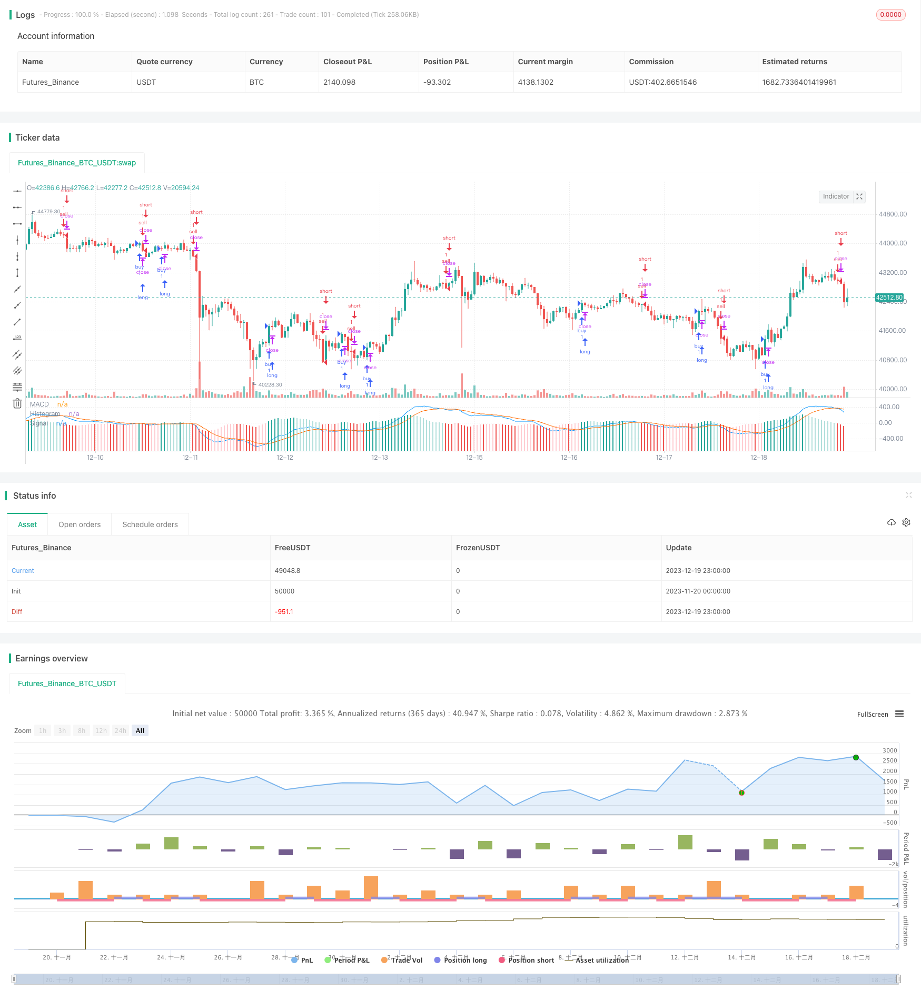

> Name

An-Oscillating-Momentum-Reversal-Moving-Average-Crossover-Strategy
> Author

ChaoZhang

> Strategy Description


[trans]

## Overview
This strategy is a momentum reversal trading strategy based on the MACD indicator. It generates the MACD indicator by calculating the difference between the fast moving average and the slow moving average. When the MACD indicator turns from positive to negative, a sell signal is generated; when the MACD indicator turns from negative to positive, a buy signal is generated. This strategy also combines the signal line smoothing of the MACD indicator to filter out some noisy trading signals.
## Strategy Principle
The core indicator of this strategy is MACD, which consists of fast moving average, slow moving average and signal line. First calculate the fast EMA and slow EMA, set the fast EMA parameter to 12 days, and set the slow EMA parameter to 26 days, and then calculate the difference between the two as the MACD indicator. The MACD indicator reflects the stock price trend through the concept of momentum. When the fast EMA rises more than the slow EMA, it means that the stock is in an upward trend and the MACD is positive; otherwise, the stock is in a downward trend and the MACD is negative.
In order to filter out the noise, this strategy introduces the signal line indicator and performs additional smoothing on the MACD. The signal line parameters are set to the 9-day EMA. Finally, calculate the difference between MACD and the signal line as a trading signal. When the difference changes from positive to negative, a sell signal is generated; when the difference changes from negative to positive, a buy signal is generated.
## Advantage Analysis
This strategy mainly has the following advantages:
1. Use the MACD indicator to determine the stock price reversal point and capture short-term reversal opportunities in stock prices.
2. Combined with signal line smoothing, filter out some noisy trading signals and reduce false signals.
3. Strategy parameters can be set freely. Traders can adjust parameters according to actual conditions and respond flexibly to market changes.
4. The calculation logic is simple and clear, easy to understand and implement, and is suitable for beginners to study and research.
5. The combination of indicators and signals is diverse, the space for strategy optimization is large, and it has strong scalability.
## Risk Analysis
This strategy also has certain risks:
1. Due to tracking the short-term reversal of stock prices, trading frequency and transaction costs may increase.
2. The MACD indicator is prone to produce false signals during long-term unilateral rise or fall in stock prices.
3. If the parameters are improper, the signal will lag and the best entry point may be missed.
4. This strategy is relatively simple, and the trading effect will be compromised under complex market conditions.
In response to the above risks, improvements can be made in the following ways:
1. Optimize parameters and reduce transaction frequency. For example, increase the signal line period parameter.
2. Add filter conditions to avoid getting stuck in long-term trends. For example, combined with other tracking indicators to determine long-term and short-term trends.
3. Use limit orders to track the best price.
4. Add more factors to judge the market status and avoid trading in abnormal markets.
## Optimization direction
This strategy can be optimized from the following aspects:
1. Optimize MACD parameters and signal line parameters to find the best parameter combination.
2. Add other auxiliary indicators to judge long-term and short-term trends to avoid contrarian trading. For example, add moving average indicators, Bollinger Bands indicators, etc.
3. Combine with trading volume indicators, such as energy tide indicators, to avoid false breakthroughs.
4. Group and set parameters according to different stock characteristics to make the strategy more adaptable.
5. Add stop loss and take profit price settings to control single loss and profit levels.
6. Evaluate stock quality, such as financial indicators, rating changes, etc., and select high-quality stock pools.
These optimization measures can enhance the stability, win rate and profitability of the strategy. It also lays the foundation for the continued development and improvement of strategies.
## Summarize
This strategy is a typical short-term reversal trading strategy. It uses the simple and clear MACD indicator to reflect changes in stock momentum, and is supplemented by signal lines to determine specific entry points. With appropriate parameter settings, you can seize the opportunity of short-term price reversal and obtain excess returns.
Of course, it is difficult for any single indicator and simple strategy to perfectly adapt to various complex market conditions. Investors should pay attention to risks and choose strategies based on their own circumstances and risk preferences. They should also continue to pay attention to market conditions and optimize strategy parameters and trading rules. Only by continuous learning and continuous improvement can we obtain long-term and stable investment returns.
|| 

## Overview

This strategy is a momentum reversal trading strategy based on the MACD indicator. It generates the MACD indicator by calculating the difference between fast and slow moving average lines. When the MACD indicator turns from positive to negative, a sell signal is generated. When the MACD indicator turns from negative to positive, a buy signal is generated. This strategy also incorporates the signal line of the MACD indicator for additional smoothing to filter out some noisy trading signals.

## Strategy Principle  

The core indicator of this strategy is the MACD, which consists of fast moving average, slow moving average and signal line. First, fast EMA with a period of 12 days and slow EMA with a period of 26 days are calculated, then the difference between them is computed as the MACD indicator. The MACD indicator reflects the trend of price changes based on the momentum concept. When the fast EMA rises faster than the slow EMA, it indicates an upward trend of the price, and the MACD is positive. On the contrary, when the stock price is in a downward trend, the MACD is negative.

To filter noise, this strategy introduces a signal line indicator to smooth the MACD additionally. The signal line parameter is set to 9-day EMA. Finally, the difference between the MACD and signal line is calculated as trading signals. When the difference changes from positive to negative, a sell signal is generated. When the difference changes from negative to positive, a buy signal is generated.

## Advantage Analysis

The main advantages of this strategy are:

1. Using the MACD indicator to determine price reversal points, it can capture short-term reversal opportunities of stock prices.

2. Incorporating signal line smoothing filters out some noisy trading signals and reduces false signals.  

3. Flexible parameter settings allow traders to adjust parameters according to actual market conditions.

4. The logic is simple and clear, easy to understand and implement, suitable for beginners to learn and research. 

5. Diverse combinations of indicators and signals provide large room for strategy optimization and strong scalability.

## Risk Analysis

There are also some risks in this strategy:

1. Tracking short-term reversals may increase trading frequency and transaction costs.

2. MACD indicator can easily generate false signals during long term unilateral rises or falls in prices.

3. Delayed signal generation due to improper parameter settings may miss the best entry point.  

4. This relatively simple strategy may underperform in complex market conditions.

To mitigate the above risks, improvements can be made in the following ways:

1. Optimize parameters to reduce trading frequency, e.g. increase signal line cycle. 

2. Add filtering conditions to avoid being trapped during long term trends, e.g. combine other tracking indicators to determine long and short term trends.

3. Use limit orders to track optimal pricing.  

4. Add more factors to determine market conditions and avoid trading in abnormal markets.

## Optimization Directions

The strategy can be optimized in the following aspects:

1. Optimize MACD parameters and signal line parameters to find the best parameter combination.

2. Add other auxiliary indicators to determine long and short term trends and avoid trading against trends, e.g. Moving Average, Bollinger Bands etc.

3. Incorporate trading volume indicators such as On Balance Volume to avoid false breakouts.  

4. Set parameters according to different stock characteristics to make the strategy more adaptive.

5. Add stop loss and take profit price settings to control single loss and profit levels.

6. Evaluate stock quality factors like financial metrics, rating changes etc. and select the optimal stock pool.

These optimization measures can enhance the stability, win rate and profit level of the strategy. It also lays the foundation for continued strategy development and improvement.  

## Summary

This is a typical short-term reversal trading strategy. It uses simple and clear MACD indicators to reflect changes in stock momentum and signal lines to determine specific entry points. With proper parameter settings, it can seize short-term price reversal opportunities to obtain excess returns.

Of course, any single indicator and simple strategy can hardly perfectly adapt to various complex market conditions. Investors should pay attention to risks and choose strategies according to their own conditions and risk appetite. Meanwhile, they should also keep an eye on market conditions, optimize strategy parameters and trading rules. Only through continuous learning and improvement can one obtain long-term stable investment returns.

[/trans]

> Strategy Arguments


|Argument|Default|Description|
|----|----|----|
|v_input_1|2017|Year|
|v_input_2|12|Fast Length|
|v_input_3|26|Slow Length|
|v_input_4|false|Buy histogram value|
|v_input_5|false|Sell histogram value|
|v_input_6_close|0|Source: close|high|low|open|hl2|hlc3|hlcc4|ohlc4|
|v_input_7|9|Signal Smoothing|
|v_input_8|false|Simple MA(Oscillator)|
|v_input_9|false|Simple MA(Signal Line)|


> Source (PineScript)

``` pinescript
/*backtest
start: 2023-11-20 00:00:00
end: 2023-12-20 00:00:00
period: 1h
basePeriod: 15m
exchanges: [{"eid":"Futures_Binance","currency":"BTC_USDT"}]
*/

//@version=4
//study(title="MACD Strategy by Sedkur", shorttitle="MACD Strategy by Sedkur")
strategy (title="MACD Strategy by Sedkur", shorttitle="MACD Strategy by Sedkur")


// Getting inputs
dyear = input(title="Year", type=input.integer, defval=2017, minval=1950, maxval=2500)
fast_length = input(title="Fast Length", type=input.integer, defval=12)
slow_length = input(title="Slow Length", type=input.integer, defval=26)
buyh = input(title="Buy histogram value", type=input.float, defval=0.0, minval=-1000, maxval=1000, step=0.1)
sellh = input(title="Sell histogram value", type=input.float, defval=0.0, minval=-1000, maxval=1000, step=0.1)
src = input(title="Source", type=input.source, defval=close)
signal_length = input(title="Signal Smoothing", type=input.integer, minval = 1, maxval = 50, defval = 9)
sma_source = input(title="Simple MA(Oscillator)", type=input.bool, defval=false)
sma_signal = input(title="Simple MA(Signal Line)", type=input.bool, defval=false)

// Plot colors
col_grow_above = #26A69A
col_grow_below = #FFCDD2
col_fall_above = #B2DFDB
col_fall_below = #EF5350
col_macd = #0094ff
col_signal = #ff6a00

// Calculating
fast_ma = sma_source ? sma(src, fast_length) : ema(src, fast_length)
slow_ma = sma_source ? sma(src, slow_length) : ema(src, slow_length)
macd = fast_ma - slow_ma
signal = sma_signal ? sma(macd, signal_length) : ema(macd, signal_length)
hist = macd - signal

plot(hist, title="Histogram", style=plot.style_columns, color=(hist>=0 ? (hist[1] < hist ? col_grow_above : col_fall_above) : (hist[1] < hist ? col_grow_below : col_fall_below) ), transp=0 )
plot(macd, title="MACD", color=col_macd, transp=0)
plot(signal, title="Signal", color=col_signal, transp=0)

strategy.entry("buy", strategy.long, comment="buy", when = hist[1] <= hist and buyh<=hist and year>=dyear)
strategy.entry("sell", strategy.short, comment="sell", when = hist[1] >= hist and sellh>=hist and year>=dyear)

```

> Detail

https://www.fmz.com/strategy/436098

> Last Modified

2023-12-21 11:21:49
