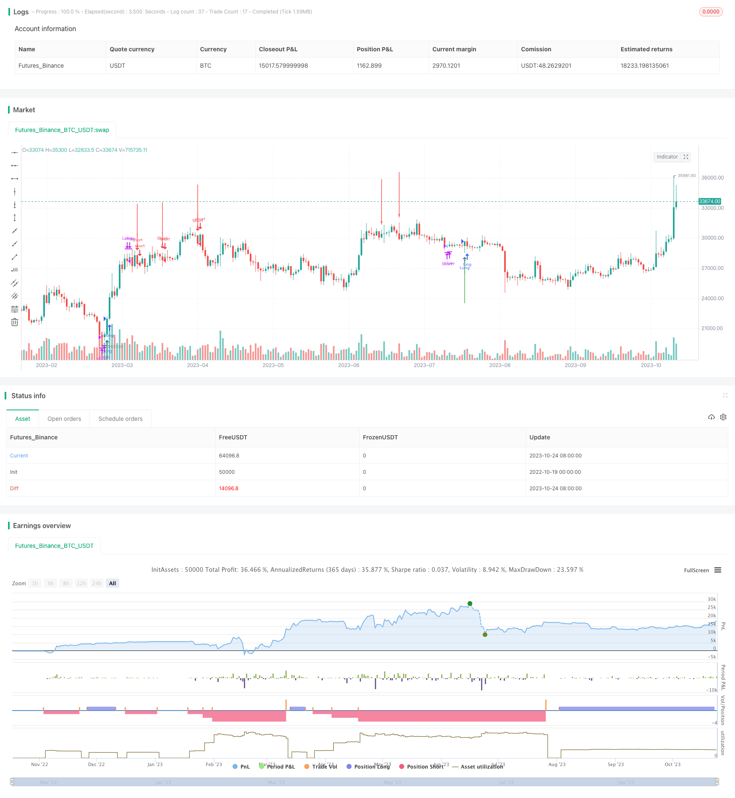

> Name

Average-Stochastic-Trading-Strategy
> Author

ChaoZhang

> Strategy Description



[trans]


## Overview
This strategy is based on the average stochastic indicator to judge trading signals and is a trend following strategy. This strategy calculates the moving average of the average stochastic indicators %K and %D, and goes long when a golden cross occurs, and goes short when a dead cross occurs. It is a typical trend following strategy.
## Strategy Principle
1. Calculate the values ​​of the average stochastic indicators %K and %D. Among them, %K is a moving average of random values ​​calculated based on the closing price within a certain period, reflecting the relative position of the current price to the highest and lowest prices within a certain period. %D is the moving average of %K and is used to confirm trends.
2. Perform exponential smoothing moving average (EMA) on %K and %D respectively to obtain the average \_avg\_k and \_avg\_d of the average stochastic indicator.
3. Determine trading signals:
- Buy signal: When \_avg\_k crosses \_avg\_d and \_avg\_d \< 20, go long
- Sell signal: When \_avg\_k crosses \_avg\_d and \_avg\_d > 80, go short
4. Position management:
- Stop loss for long orders: close the position when \_avg\_d \> 80
- Short stop loss: close the position when \_avg\_d \< 20
5. A maximum of 3 orders in the same direction are allowed, which is a position-adding strategy.
## Strategic Advantages
1. Using dual moving averages to judge golden crosses and dead crosses can effectively filter out false breakthroughs and improve signal quality.
2. Apply the average stochastic indicator to effectively track price trends
3. Combined with the judgment of overbought and oversold ranges, frequent trading in volatile market conditions can be avoided.
4. Adding positions is allowed, and you can get more profits in the trending market.
5. Stop loss strategy can control single loss
## Strategy Risk
1. The double moving average trading strategy is prone to frequent transactions. If the transaction fees are too high, profits will be affected.
2. Using a fixed stop may end the trend prematurely
3. Adding too many positions may lead to larger losses
4. Unable to effectively judge the trend reversal point, and large losses may occur when the trend reverses.
5. The parameter cycle needs to be optimized, and the effects of different cycles vary greatly.
## Optimization direction
1. You can consider introducing trend judgment indicators to avoid contrarian trading.
2. Dynamically adjust the stop loss point to make the stop loss more in line with the trend.
3. Optimize the strategy of adding positions, such as increasing the number of positions per order incrementally
4. Combine with other indicators to determine trend reversal and exit profits early
5. Test parameter optimization for different varieties to improve parameter adaptability
## Summarize
Overall, this strategy is a typical trend following strategy, using the average stochastic indicator to determine the direction of the trend, and adding positions when the trend appears. The advantage of the strategy is that it has strong tracking ability and is suitable for trending market conditions, but care must be taken to prevent counter-trend trading. It can be further optimized by introducing trend judgment, optimizing stop loss strategies, and controlling the number of positions added. Under the premise of appropriate parameter selection, good tracking effects can be obtained.
||


## Overview 

This strategy is based on the Average Stochastic Oscillator for trading signal judgment and belongs to a trend following strategy. It calculates the moving average values of %K and %D of the Average Stochastic Oscillator. When the golden cross occurs, go long. When the death cross occurs, go short. It is a typical trend following strategy.

## Strategy Logic

1. Calculate the values of %K and %D of the Average Stochastic Oscillator. %K is the moving average of random values calculated based on closing prices over a certain period, reflecting the relative position of the current price to the highest and lowest prices over a certain period. %D is the moving average of %K used to confirm the trend.

2. Exponentially smooth moving average (EMA) is applied to %K and %D respectively to obtain the average values _avg_k and _avg_d of the Average Stochastic Oscillator. 

3. Determine trading signals:

   - Buy signal: when _avg_k crosses over _avg_d and _avg_d < 20, go long.

   - Sell signal: when _avg_k crosses below _avg_d and _avg_d > 80, go short.
   
4. Position management:

   - Long stop loss: close long when _avg_d > 80

   - Short stop loss: close short when _avg_d < 20
   
5. Allow maximum 3 orders in the same direction, which is a pyramiding strategy.

## Advantages

1. Using double moving averages to determine golden cross and death cross can effectively filter false breakouts and improve signal quality.

2. Applying Average Stochastic Oscillator can effectively track price trends. 

3. Combining overbought and oversold zones helps avoid frequent trading in range-bound market.

4. Allowing pyramiding can gain more profit in trending market. 

5. Stop loss strategy controls single loss.

## Risks

1. Dual moving average trading strategies tend to generate frequent trading, which will affect profitability if transaction costs are too high.

2. Using fixed stop loss points may stop loss too early exiting the trend.

3. Too many pyramiding may enlarge the loss. 

4. It cannot effectively determine trend reversal points and may lead to large losses when trend reverses.

5. Parameter periods need to be optimized because different periods can lead to very different results.

## Optimization

1. Consider introducing trend judgment indicators to avoid counter trend trading.

2. Dynamically adjust stop loss points to fit the trend better.

3. Optimize pyramiding strategy, for example, increase position size progressively. 

4. Incorporate other indicators to judge trend reversal and exit profit early.

5. Test parameter optimization separately for different products to improve adaptability.

## Summary

In summary, this is a typical trend following strategy. It uses Average Stochastic Oscillator to determine trend direction and pyramids when trend occurs. The advantage is strong tracking ability suitable for trending market. But it is important to avoid counter trend trading. Further optimization can be done by introducing trend judgment, optimizing stop loss strategy, controlling pyramiding times, etc. With proper parameter selection, good tracking results can be achieved.

[/trans]

> Strategy Arguments


|Argument|Default|Description|
|----|----|----|
|v_input_int_1|21|%K Length|
|v_input_int_2|3|%K Smoothing|
|v_input_int_3|3|%D Smoothing|


> Source (PineScript)

``` pinescript
/*backtest
start: 2022-10-19 00:00:00
end: 2023-10-25 00:00:00
period: 1d
basePeriod: 1h
exchanges: [{"eid":"Futures_Binance","currency":"BTC_USDT"}]
*/

//@version=5
//1. AVG Stochastic Calculate
//1.1 AVG %K is calculated by apply EMA with smooth K period on Average of Original Stochastic %k & %d
//+ avg_k=ema((%k+%d)/2,smoothK)
//1.2 AVG %D is calculated by apply EMA with %d period on AVG %K
//+ avg_d=ema(avg_k,periodD)
//2. Parameter
//+ %K Length: 21
//+ %K Smoothing: 3
//+ %D Smoothing: 3
//+ Symbol: BTC/USDT
//+ Timeframe: M30
//+ Pyramiding: Maximum 3 orders at the same direction.
//3. Signal
//3.1 Buy Signal
//+ Entry: AVG %K crossover AVG %D and AVG %D < 20
//+ Exit: AVG %D > 80 
//3.2 Sell Signal
//+ Entry: AVG %K crossunder AVG %D and AVG %D > 80
//+ Exit: AVG %D < 20 
strategy(title="AVG Stochastic Strategy [M30 Backtesting]", overlay=true, pyramiding=3)
periodK = input.int(21, title="%K Length", minval=1)
smoothK = input.int(3, title="%K Smoothing", minval=1)
periodD = input.int(3, title="%D Smoothing", minval=1)
k = ta.sma(ta.stoch(close, high, low, periodK), smoothK)
d = ta.sma(k, periodD)
_avg_k=ta.ema(math.avg(k,d),smoothK)
_avg_d=ta.ema(_avg_k,periodD)
up=
   _avg_k[1]<_avg_d[1]
   and _avg_k>_avg_d
   and _avg_d<20
dn=
   _avg_k[1]>_avg_d[1]
   and _avg_k<_avg_d
   and _avg_d>80
var arr_val=0
if up
    arr_val:=1
    strategy.entry("Long", strategy.long)
if dn
    arr_val:=-1
    strategy.entry("Short", strategy.short)
if up[1] or dn[1]
    arr_val:=0
plotarrow(arr_val,title="Signal",colorup=color.green,colordown=color.red)
if _avg_d>80 
    strategy.close("Long")
if _avg_d<20 
    strategy.close("Short")
//EOF
```

> Detail

https://www.fmz.com/strategy/430262

> Last Modified

2023-10-26 16:20:33
