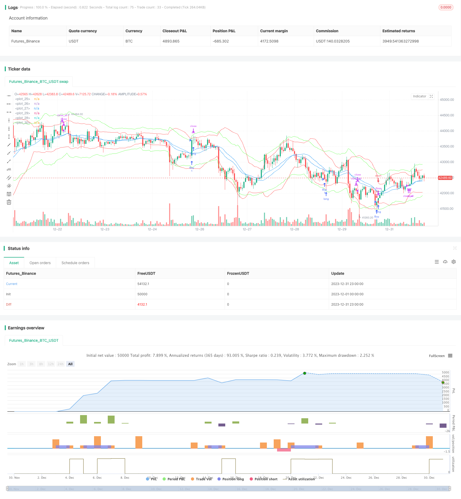

> Name

Gradual-BB-KC-Trend-StrategyGradual-BB-KC-Trend-Strategy
> Author

ChaoZhang

> Strategy Description


 [trans]

## Overview
This strategy uses a combination of Bollinger Bands and Kate Line signals to identify market trends. Bollinger Bands is a technical analysis tool that defines channels based on price fluctuation ranges; Kate Line signals are technical indicators that combine price volatility with trend to determine support or pressure. This strategy comprehensively utilizes the advantages of the two indicators to find long and short opportunities by judging whether the golden cross of Bollinger Bands and Kate Line occurs. At the same time, it combines the trading volume to verify the signal, which can effectively identify the beginning of the trend and compress invalid signals to the greatest extent.
## Strategy Principle
1. Calculate the 20-period Bollinger middle track, upper track and lower track, and the bandwidth is specified by 2 times the standard deviation.
2. Calculate the 20-period Kate middle track, upper track and lower track, and the bandwidth is specified by 2.2 times the true fluctuation range.
3. When the upper limit of the Kate line crosses the upper limit of the Bollinger Band and the trading volume is greater than the 10-period average volume, go long.
4. When the lower track of the Kate line crosses the lower track of the Bollinger Bands and the trading volume is greater than the 10-period average volume, go short.
5. If there is no exit after 20 K lines after opening the position, stop profit and stop loss will be forced to exit.
6. Set a 1.5% stop loss after going long, and set a -1.5% stop loss after going short; set a 2% trailing stop after going long, and set a -2% trailing stop after going short.
This strategy mainly relies on Bollinger Bands to judge the range and strength of fluctuations, and uses Kate Line to assist verification. The joint use of two indicators with different parameters but similar properties can improve the accuracy of signals, and the introduction of trading volume can also effectively reduce invalid signals.
## Advantage Analysis
1. Comprehensively utilize the advantages of Bollinger Bands and Kate Line to improve the accuracy of trading signals.
2. Combined with trading volume indicators, it can effectively reduce invalid signals that frequently hit the market line.
3. Set up stop-loss and trailing stop-loss mechanisms to effectively control risks.
4. The mandatory stop-profit and stop-loss setting after invalid signal can quickly stop loss and stop-profit.
## Risk Analysis
1. Both Bollinger Bands and Kate Line are indicators based on moving averages and calculated in conjunction with volatility, which can easily produce false signals in volatile markets. 
2. There is no compound interest mechanism, and being trapped multiple times may lead to excessive losses.
3. Reversal signals are common, and trend opportunities are easily lost after adjusting parameters.
You can appropriately relax the stop loss range, or add auxiliary indicators such as MACD to screen signals to reduce the risk of false signals.
## Optimization direction
1. You can test the impact of different parameters on strategy returns, such as adjusting parameters such as moving average length and standard deviation multiples.
2. Other indicators can be added to determine the signal, such as the assistance of KDJ indicator or MACD indicator.
3. Parameters can be automatically optimized through machine learning methods.
## Summary
This strategy comprehensively uses Bollinger Bands and Kate Line indicators to identify market trends, and is supplemented by volume indicators to verify signals. This strategy can be further strengthened through parameter optimization and the addition of other technical indicators to make it adaptable to a wider range of market conditions. This strategy has strong overall feasibility and is one of the quantitative trading strategies that is easy to master and adjust.
||

## Overview 
This strategy uses a combination of Bollinger Bands and Keltner Channel signals to identify market trends. Bollinger Bands are a technical analysis tool that defines channels based on price volatility ranges. The Keltner Channel signal combines price volatility and trending to determine support or resistance levels. This strategy utilizes the advantages of both indicators by judging if a golden cross occurs between the Bollinger Bands and Keltner Channels to find long and short opportunities. It also incorporates trading volume to verify the validity of signals, which can effectively identify the beginning of trends and maximize the filtering of invalid signals.

## Strategy Principles
1. Calculate the middle, upper, and lower Bollinger Bands over 20 periods. The band width is defined as 2 standard deviations. 
2. Calculate the middle, upper, and lower Keltner Channels over 20 periods. The channel width is defined as 2.2 times the true range.
3. When the Keltner Channel upper line crosses above the Bollinger Band upper line and the volume is greater than its 10 period moving average, go long.
4. When the Keltner Channel lower line crosses below the Bollinger Band lower line and the volume is greater than its 10 period moving average, go short.  
5. Close all positions if no exit signals trigger after 20 bars since entry.  
6. Set a 1.5% stop loss for long trades and -1.5% stop loss for short trades. Set a 2% trailing stop for long trades and -2% trailing stop for short trades.

This strategy mainly relies on the Bollinger Bands to judge volatility ranges and momentum. The Keltner Channel serves as a verification tool due to its similar characteristics but differing parameters. Using these two indicators together improves signal accuracy. Incorporating trading volume also helps filter out invalid signals.  

## Strength Analysis
1. Utilizes the combined advantages of Bollinger Bands and Keltner Channels to improve signal accuracy. 
2. Filtering by trading volume reduces invalid signals from frequent line touches.
3. Effective risk control from programmed stop loss and trailing stop mechanisms.  
4. Quick exits and loss limiting from forced profit taking after invalid signals.

## Risk Analysis
1. Both Bollinger Bands and Keltner Channels are based on moving averages and volatility. They can produce false signals in ranging markets.  
2. No compounding mechanism means multiple stop outs may lead to oversized losses. 
3. Reversal signals occur frequently. Parameter tweaks may cause trend opportunities to be missed.  

Widening stop loss ranges or adding confirming indicators like MACD can reduce risks from false signals. 

## Optimization Directions
1. Test parameter impacts on strategy return, like lengths, standard deviation multiples etc. 
2. Add other indicators for signal confirmation, e.g. KDJ, MACD. 
3. Use machine learning for automated parameter optimization.

## Summary  
This strategy combines Bollinger Bands and Keltner Channels to identify trends, verified by trading volume. Further enhancements like parameter optimization and adding indicators will strengthen it for more market regimes. It has strong feasibility as an easy to grasp and customizable trading strategy.

[/trans]

> Strategy Arguments


|Argument|Default|Description|
|----|----|----|
|v_input_int_1|20|KC Length|
|v_input_float_1|2.2|KC StdDev|
|v_input_int_2|20|BB Length|
|v_input_float_2|2|BB StdDev|
|v_input_int_3|10|Volume MA Length|
|v_input_float_3|1.5|Stop Loss (%)|
|v_input_float_4|2|Trail Stop (%)|
|v_input_int_4|20|Bars in trade before exit|


> Source (PineScript)

``` pinescript
/*backtest
start: 2023-12-01 00:00:00
end: 2023-12-31 23:59:59
period: 1h
basePeriod: 15m
exchanges: [{"eid":"Futures_Binance","currency":"BTC_USDT"}]
*/

// This source code is subject to the terms of the Mozilla Public License 2.0 at https://mozilla.org/MPL/2.0/
// © jensenvilhelm

//@version=5
strategy("BB and KC Strategy", overlay=true)

// Define the input parameters for the strategy, these can be changed by the user to adjust the strategy
kcLength = input.int(20, "KC Length", minval=1) // Length for Keltner Channel calculation
kcStdDev = input.float(2.2, "KC StdDev") // Standard Deviation for Keltner Channel calculation
bbLength = input.int(20, "BB Length", minval=1) // Length for Bollinger Bands calculation
bbStdDev = input.float(2, "BB StdDev") // Standard Deviation for Bollinger Bands calculation
volumeLength = input.int(10, "Volume MA Length", minval=1) // Length for moving average of volume calculation
stopLossPercent = input.float(1.5, "Stop Loss (%)") // Percent of price for Stop loss 
trailStopPercent = input.float(2, "Trail Stop (%)") // Percent of price for Trailing Stop
barsInTrade = input.int(20, "Bars in trade before exit", minval = 1) // Minimum number of bars in trade before considering exit

// Calculate Bollinger Bands and Keltner Channel
[bb_middle, bb_upper, bb_lower] = ta.bb(close, bbLength, bbStdDev) // Bollinger Bands calculation
[kc_middle, kc_upper, kc_lower] = ta.kc(close, kcLength, kcStdDev) // Keltner Channel calculation

// Calculate moving average of volume
vol_ma = ta.sma(volume, volumeLength) // Moving average of volume calculation

// Plotting Bollinger Bands and Keltner Channels on the chart
plot(bb_upper, color=color.red) // Bollinger Bands upper line
plot(bb_middle, color=color.blue) // Bollinger Bands middle line
plot(bb_lower, color=color.red) // Bollinger Bands lower line
plot(kc_upper, color=color.rgb(105, 255, 82)) // Keltner Channel upper line
plot(kc_middle, color=color.blue) // Keltner Channel middle line
plot(kc_lower, color=color.rgb(105, 255, 82)) // Keltner Channel lower line

// Define entry conditions: long position if upper KC line crosses above upper BB line and volume is above MA of volume
// and short position if lower KC line crosses below lower BB line and volume is above MA of volume
longCond = ta.crossover(kc_upper, bb_upper) and volume > vol_ma // Entry condition for long position
shortCond = ta.crossunder(kc_lower, bb_lower) and volume > vol_ma // Entry condition for short position

// Define variables to store entry price and bar counter at entry point
var float entry_price = na // variable to store entry price
var int bar_counter = na // variable to store bar counter at entry point

// Check entry conditions and if met, open long or short position
if (longCond)
    strategy.entry("Buy", strategy.long) // Open long position
    entry_price := close // Store entry price
    bar_counter := 1 // Start bar counter
if (shortCond)
    strategy.entry("Sell", strategy.short) // Open short position
    entry_price := close // Store entry price
    bar_counter := 1 // Start bar counter

// If in a position and bar counter is not na, increment bar counter
if (strategy.position_size != 0 and na(bar_counter) == false)
    bar_counter := bar_counter + 1 // Increment bar counter

// Define exit conditions: close position if been in trade for more than specified bars
// or if price drops by more than specified percent for long or rises by more than specified percent for short
if (bar_counter > barsInTrade) // Only consider exit after minimum bars in trade
    if (bar_counter >= barsInTrade)
        strategy.close_all() // Close all positions
    // Stop loss and trailing stop
    if (strategy.position_size > 0)
        strategy.exit("Sell", "Buy", stop=entry_price * (1 - stopLossPercent/100), trail_points=entry_price * trailStopPercent/100) // Set stop loss and trailing stop for long position
    else if (strategy.position_size < 0)
        strategy.exit("Buy", "Sell", stop=entry_price * (1 + stopLossPercent/100), trail_points=entry_price * trailStopPercent/100) // Set stop loss and trailing stop for short position

```

> Detail

https://www.fmz.com/strategy/440086

> Last Modified

2024-01-26 15:10:41
