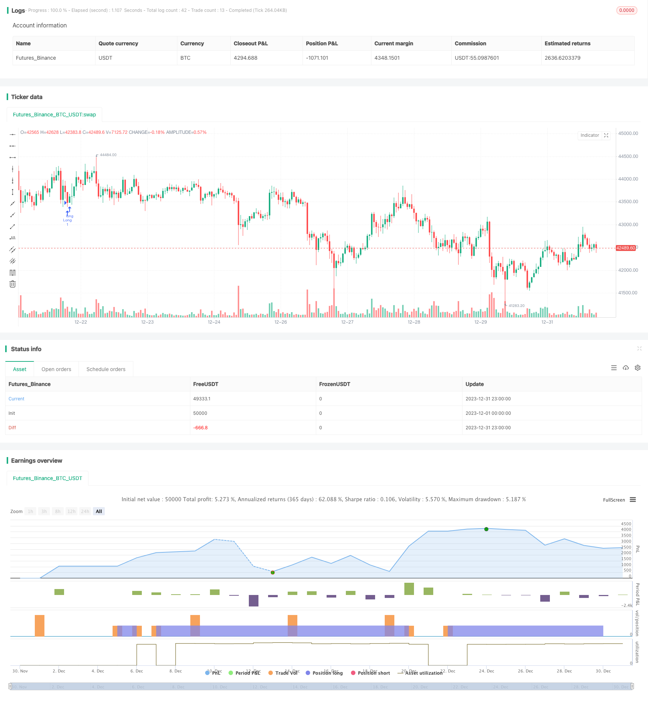

> Name

Flawless-Victory-Quantitative-Trading-Strategy-Based-on-Double-BB-Indicators-and-RSI
> Author

ChaoZhang

> Strategy Description


 [trans]

### Overview
This strategy is a quantitative trading strategy based on the Bollinger Bands indicator and the Relative Strength Index (RSI) indicator. This strategy uses machine learning methods to backtest and optimize the historical data of the past year through Python language to find the optimal parameter combination.
### Strategy Principles
The trading signals of this strategy are derived from the comprehensive judgment of dual Bollinger Bands and RSI indicators. Among them, the Bollinger Bands indicator is a fluctuation channel calculated based on the standard deviation band of the price. Trading signals are generated when price approaches or touches a volatility channel. The RSI indicator determines whether the price is overbought or oversold.
Specifically, a buy signal is generated when the closing price is below the 1.0 standard deviation lower band and the RSI is greater than 42. A sell signal is generated when the closing price is above the 1.0 standard deviation upper band and the RSI is greater than 70. In addition, this strategy also sets two sets of BB and RSI parameters, which are used for entry and stop-loss closing respectively. These parameters are optimal values ​​obtained through extensive backtesting and machine learning.
### Advantage Analysis
The biggest advantage of this strategy is the accuracy of the parameters. Through machine learning methods, each parameter is fully back-tested to obtain the best Sharpe ratio. This not only ensures the rate of return of the strategy, but also controls the risk. In addition, the dual indicator combination also improves the signal accuracy and winning rate.
### Risk Analysis
The risk of this strategy mainly comes from the setting of stop loss points. If the stop loss point is set too large, the loss cannot be effectively controlled. In addition, if stop loss points, handling fees, transaction slippage and other transaction costs are not calculated properly, risks will also increase. In order to reduce risks, it is recommended to adjust the stop loss width parameters, reduce the trading frequency, and calculate a reasonable stop loss position.
### Optimization direction
There is room for further optimization of this strategy. For example, you can try changing the length parameters of Bollinger Bands, or adjusting the overbought and oversold thresholds of RSI. In addition, you can also try to introduce other indicators and build a multi-index combination. This may improve the profitability and stability of the strategy.
### Summary
This strategy combines dual BB indicators and RSI indicators, obtains optimal parameters through machine learning methods, and achieves high yields and controllable risk levels. It has two advantages: indicator combination judgment and parameter optimization. Through continuous improvement, this strategy is expected to become an excellent quantitative trading strategy.
||

### Overview
This strategy is a quantitative trading strategy based on the Bollinger Bands indicator and the Relative Strength Index (RSI) indicator. This strategy uses machine learning methods to backtest and optimize parameters over nearly 1 year of historical data using Python language, finding the optimal parameter combination.  

### Strategy Principles  
The trading signals of this strategy come from the combined judgement of double Bollinger Bands and RSI indicators. Among them, the Bollinger Bands indicator is the volatility channel calculated based on the price standard deviation. It generates trading signals when the price approaches or touches the channel. The RSI indicator judges the overbought and oversold situation of the price.   

Specifically, a buy signal is generated when the closing price is below the lower rail of 1.0 standard deviations and RSI is greater than 42 at the same time. A sell signal is generated when the closing price is above the upper rail of 1.0 standard deviations and RSI is greater than 70 at the same time. In addition, this strategy also sets two sets of BB and RSI parameters, which are used for entry and stop loss closing positions respectively. These parameters are optimal values obtained through extensive backtesting and machine learning.

### Advantage Analysis
The biggest advantage of this strategy is the accuracy of parameters. Through machine learning methods, each parameter is obtained through comprehensive backtesting to achieve the best Sharpe ratio. This ensures both the return rate of the strategy and controls risks. In addition, the combination of double indicators also improves the accuracy and win rate of signals.   

### Risk Analysis  
The main risk of this strategy comes from the setting of stop loss points. If the stop loss point is set too large, it will not effectively control losses. In addition, if the stop loss point does not properly calculate other trading costs such as commissions and slippage, it will also increase risks. To reduce risks, it is recommended to adjust the stop loss magnitude parameter to reduce trading frequency, while calculating a reasonable stop loss position.

### Optimization Directions
There is still room for further optimization of this strategy. For example, you can try to change the length parameters of Bollinger Bands, or adjust the overbought and oversold thresholds of RSI. You can also try to introduce other indicators to build a multi-indicator combination. This may increase the profit space and stability of the strategy.

### Summary  
This strategy combines double BB indicators and RSI indicators, and obtains optimal parameters through machine learning methods to achieve high returns and controllable risk levels. It has the advantages of combined indicator judgement and parameter optimization. With continuous improvement, this strategy has the potential to become an excellent quantitative trading strategy.

[/trans]

> Strategy Arguments


|Argument|Default|Description|
|----|----|----|
|v_input_1|true|Version 1 - Doesn't Use SL/TP|
|v_input_2|false|Version 2 - Uses SL/TP|
|v_input_3|6.604|Stop Loss %|
|v_input_4|2.328|Take Profit %|


> Source (PineScript)

``` pinescript
/*backtest
start: 2023-12-01 00:00:00
end: 2023-12-31 23:59:59
period: 1h
basePeriod: 15m
exchanges: [{"eid":"Futures_Binance","currency":"BTC_USDT"}]
*/

// @version=4
// This source code is subject to the terms of the Mozilla Public License 2.0 at https://mozilla.org/MPL/2.0/
// © Bunghole 2020
strategy(overlay=true, shorttitle="Flawless Victory Strategy" )

// Stoploss and Profits Inputs
v1 = input(true, title="Version 1 - Doesn't Use SL/TP")
v2 = input(false, title="Version 2 - Uses SL/TP")
stoploss_input = input(6.604, title='Stop Loss %', type=input.float, minval=0.01)/100
takeprofit_input = input(2.328, title='Take Profit %', type=input.float, minval=0.01)/100
stoploss_level = strategy.position_avg_price * (1 - stoploss_input)
takeprofit_level = strategy.position_avg_price * (1 + takeprofit_input)

//SL & TP Chart Plots
plot(v2 and stoploss_input and stoploss_level ? stoploss_level: na, color=color.red, style=plot.style_linebr, linewidth=2, title="Stoploss")
plot(v2 and takeprofit_input ? takeprofit_level: na, color=color.green, style=plot.style_linebr, linewidth=2, title="Profit")

// Bollinger Bands 1
length = 20
src1 = close
mult = 1.0
basis = sma(src1, length)
dev = mult * stdev(src1, length)
upper = basis + dev
lower = basis - dev

// Bollinger Bands 2
length2 = 17
src2 = close
mult2 = 1.0
basis2 = sma(src1, length2)
dev2 = mult2 * stdev(src2, length2)
upper2 = basis2 + dev2
lower2 = basis2 - dev2

// RSI
len = 14
src = close
up = rma(max(change(src), 0), len)
down = rma(-min(change(src), 0), len)
rsi = down == 0 ? 100 : up == 0 ? 0 : 100 - 100 / (1 + up / down)

// Strategy Parameters
RSILL= 42
RSIUL= 70
RSILL2= 42
RSIUL2= 76

rsiBuySignal = rsi > RSILL
rsiSellSignal = rsi > RSIUL
rsiBuySignal2 = rsi > RSILL2
rsiSellSignal2 = rsi > RSIUL2

BBBuySignal = src < lower
BBSellSignal = src > upper
BBBuySignal2 = src2 < lower2
BBSellSignal2 = src2 > upper2

// Strategy Long Signals
Buy = rsiBuySignal and BBBuySignal
Sell = rsiSellSignal and BBSellSignal
Buy2 = rsiBuySignal2 and BBBuySignal2
Sell2 = rsiSellSignal2 and BBSellSignal2

if v1 == true
    strategy.entry("Long", strategy.long, when = Buy, alert_message = "v1 - Buy Signal!")
    strategy.close("Long", when = Sell, alert_message = "v1 - Sell Signal!")

if v2 == true
    strategy.entry("Long", strategy.long, when = Buy2, alert_message = "v2 - Buy Signal!")
    strategy.close("Long", when = Sell2, alert_message = "v2 - Sell Signal!")
    strategy.exit("Stoploss/TP", "Long", stop = stoploss_level, limit = takeprofit_level)

```

> Detail

https://www.fmz.com/strategy/440303

> Last Modified

2024-01-29 10:33:43
