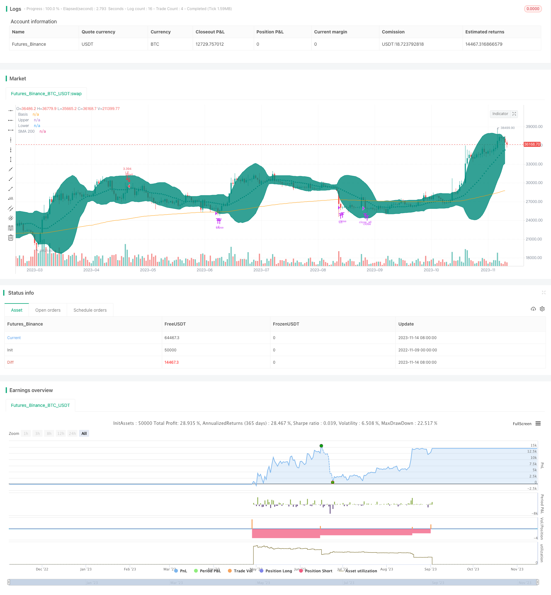

> Name

Trend following strategy for crossing the BB channel and breaking through the SMA200 moving average BB21_SMA200-Trend-Following-Strategy
> Author

ChaoZhang

> Strategy Description


[trans]


## Overview
This strategy combines Bollinger Bands and moving averages to design a trend-tracking trading system. When the price breaks through the upper Bollinger Band and the lower track is higher than SMA200, go long. When the price falls below the lower Bollinger Band, partially close the position. When the price falls below the SMA200, all positions will be closed. This strategy tracks the trend and stops losses promptly when the trend changes.
## Strategy Principle
1. Calculate SMA200Exponential Moving Average as an indicator to determine the general trend
2. Calculate the Bollinger Bands, including the upper track, middle track, and lower track, and fill them with color as the profit area
3. When the upper and lower rails of the Bollinger Bands are higher than SMA200, it means that it is in an upward trend.
4. When the price breaks through the middle track of the Bollinger Bands upwards, enter the market long
5. When the price falls below the Bollinger Band, partially close the position
6. When the price falls below SMA200, it means that the general trend has reversed and all positions have been closed.
7. Set a stop loss point to prevent excessive losses
8. Calculate the number of transactions based on account funds and risk tolerance
The premise for this strategy to determine the existence of a trend is that the Bollinger Bands need to be completely above SMA200, and only in a clear upward trend will the bullish direction be chosen to enter the market. When the downward trend comes, control risks through key point share stop loss and full position stop loss.
## Advantage Analysis
1. Use Bollinger Bands to determine the existence of a clear trend, rather than judging based on a single indicator.
2. SMA200 determines the direction of the general trend and avoids unnecessary trading in volatile markets.
3. Partial stop loss and profit, follow the trend
4. Stop the loss at key points and stop the loss in time to avoid the expansion of losses to the greatest extent
5. Calculate the number of transactions and introduce the concept of risk management to prevent excessive losses in a single transaction
## Risk Analysis
1. The trading signals generated by the upper and lower Bollinger Bands may have a high false signal rate.
2. Some stop loss point settings need to be optimized to prevent premature stop loss.
3. The stop loss point is too small, and the stop loss may be too frequent.
4. SMA cycle parameters need to be tested and optimized to balance delay and sensitivity
5. The transaction quantity calculation method may need to be optimized to prevent a single transaction from being too large
These risks can be reduced by carefully testing Bollinger Band parameters, optimizing some stop loss strategies, adjusting SMA cycle parameters, and introducing more scientific risk management methods.
## Optimization direction
1. Test and optimize Bollinger Band parameters to reduce signal misjudgment rate
2. Study how to set a more appropriate partial stop loss point
3. Test the optimal value of SMA cycle parameters
4. Consider introducing adaptive stop loss to replace fixed stop loss point
5. Study the introduction of volatility quotas to calculate transaction sizes more scientifically
6. Add transaction costs to the backtest for simulation
7. Consider using it in combination with other indicators to improve strategy stability
## Summarize
This strategy integrates Bollinger Bands channel and SMA moving average indicators to design a more complete trend following strategy. It is more reliable in judging the existence of trends and has strong trend tracking capabilities. By continuously optimizing the stop loss strategy, reducing the signal misjudgment rate, and introducing scientific risk management methods, this strategy can become a trend strategy worthy of long-term real-time tracking. It provides an idea for integrating multiple indicators for the design of quantitative trading strategies.
|| 
****
## Overview

This strategy combines Bollinger Bands and Moving Average to design a trend following trading system. It goes long when price breaks through the upper band of Bollinger Bands and the lower band is above SMA200, closes partial position when price breaks through the lower band, and exits all when price crosses below SMA200. The strategy follows the trend and cuts loss in time when trend changes.

## Strategy Logic

1. Calculate SMA200 as Exponential Moving Average to determine the major trend 
2. Calculate Bollinger Bands, including upper band, middle band and lower band, and fill color as profit range
3. When both upper and lower bands are above SMA200, it indicates an uptrend
4. When price breaks through the middle band of Bollinger Bands upwards, go long
5. When price breaks through the lower band downwards, close partial position
6. When price crosses below SMA200, it indicates a reversal of the major trend, close all positions
7. Set stop loss point to prevent excessive loss
8. Calculate trade size based on account capital and acceptable risk

The premise of this strategy to identify a trend is that the Bollinger Bands should be completely above SMA200, only going long when a clear uptrend presents. When downtrend comes, risk is controlled by partial stop loss and full stop loss.

## Advantage Analysis

1. Use Bollinger Bands instead of a single indicator to identify a clear trend
2. SMA200 determines major trend direction, avoids unnecessary trading in range-bound market
3. Partial stop loss to follow trend runs
4. Timely stop loss on key points to minimize loss
5. Calculate trade size introduces risk management to prevent excessive loss on a single trade

## Risk Analysis

1. Breakout signals generated from Bollinger Bands may have relatively high false signals
2. Partial stop loss points need to be optimized to prevent premature stop loss
3. If stop loss point is too tight, stop loss may be triggered too frequently 
4. SMA period needs to be tested and optimized to balance lagging and sensitivity
5. Trade size calculation method may need optimization to prevent excessive size on single trades

These risks could be reduced by carefully testing Bollinger Bands parameters, optimizing partial stop loss strategy, adjusting SMA period, and introducing more scientific risk management methods.

## Optimization Directions

1. Test and optimize Bollinger Bands parameters to lower false signals
2. Research how to set proper partial stop loss points
3. Test optimal SMA period  
4. Consider adaptive stops instead of fixed stop loss points
5. Study using volatility-based position sizing for more scientific trade size calculation
6. Backtest with trading costs to simulate real trading
7. Consider combining with other indicators to improve strategy robustness

## Conclusion

This strategy integrates Bollinger Bands and SMA to design a relatively complete trend following system. It is reliable in identifying trend existence and has strong trend tracking capability. By continuously optimizing stop loss strategy, reducing signal errors, and introducing scientific risk management techniques, this strategy can become a worthwhile system to track in live trading. It provides an approach of combining multiple indicators for quantitative trading strategy design.

[/trans]

> Strategy Arguments


|Argument|Default|Description|
|----|----|----|
|v_input_1|200|MA Length|
|v_input_2|21|BB Length|
|v_input_3_close|0|BB Source: close|high|low|open|hl2|hlc3|hlcc4|ohlc4|
|v_input_4|2|StdDev|
|v_input_5|5|Stop Loss%|
|v_input_6|10|Risk % of capital  == Based on this trade size is claculated    numberOfShares = (AvailableCapital*risk/100) / stopLossPoints|
|v_input_7|false|Offset|


> Source (PineScript)

``` pinescript
/*backtest
start: 2022-11-09 00:00:00
end: 2023-11-15 00:00:00
period: 1d
basePeriod: 1h
exchanges: [{"eid":"Futures_Binance","currency":"BTC_USDT"}]
*/

// This source code is subject to the terms of the Mozilla Public License 2.0 at https://mozilla.org/MPL/2.0/
// © mohanee

//@version=4
strategy(title="BB9_MA200_Strategy", overlay=true, pyramiding=1,     default_qty_type=strategy.cash,  initial_capital=10000, currency=currency.USD)  //default_qty_value=10, default_qty_type=strategy.fixed, 


var stopLossVal=0.00

//variables BEGIN
smaLength=input(200,title="MA Length")
bbLength=input(21,title="BB Length")  

bbsrc = input(close, title="BB Source")
mult = input(2.0, minval=0.001, maxval=50, title="StdDev")


stopLoss = input(title="Stop Loss%", defval=5, minval=1)

riskCapital = input(title="Risk % of capital  == Based on this trade size is claculated    numberOfShares = (AvailableCapital*risk/100) / stopLossPoints", defval=10, minval=1)


sma200=ema(close,smaLength)

plot(sma200, title="SMA 200", color=color.orange)


//bollinger calculation
basis = sma(bbsrc, bbLength)
dev = mult * stdev(bbsrc, bbLength)
upperBand = basis + dev
lowerBand = basis - dev
offset = input(0, "Offset", type = input.integer, minval = -500, maxval = 500)

//plot bb
plot(basis, "Basis", color=color.teal, style=plot.style_circles , offset = offset)
p1 = plot(upperBand, "Upper", color=color.teal, offset = offset)
p2 = plot(lowerBand, "Lower", color=color.teal, offset = offset)
fill(p1, p2, title = "Background", color=color.teal, transp=95)


strategy.initial_capital = 50000

//Entry---

strategy.entry(id="LE", comment="LE capital="+tostring(strategy.initial_capital + strategy.netprofit ,"######.##"), qty=( (strategy.initial_capital + strategy.netprofit ) * riskCapital / 100)/(close*stopLoss/100) , long=true,  when=strategy.position_size<1 and upperBand>sma200 and lowerBand > sma200 and crossover(close, basis) )     //  // aroonOsc<0  //(strategy.initial_capital * 0.10)/close


barcolor(color=strategy.position_size>=1? color.blue: na)

//partial Exit
tpVal=strategy.position_size>1 ? strategy.position_avg_price * (1+(stopLoss/100) ) : 0.00
strategy.close(id="LE", comment="Partial points="+tostring(close - strategy.position_avg_price, "####.##"),  qty_percent=30 , when=abs(strategy.position_size)>=1 and close>tpVal and crossunder(lowerBand, sma200)   )   //close<ema55 and rsi5Val<20 //ema34<ema55


//close All on stop loss
//stoploss
stopLossVal:=   strategy.position_size>1 ? strategy.position_avg_price * (1-(stopLoss/100) ) : 0.00

strategy.close_all( comment="SL Exit points="+tostring(close - strategy.position_avg_price, "####.##"),  when=abs(strategy.position_size)>=1 and close < stopLossVal  )  //close<ema55 and rsi5Val<20 //ema34<ema55  //close<ema89//

strategy.close_all( comment="BB9 X SMA200 points="+tostring(close - strategy.position_avg_price, "####.##"),  when=abs(strategy.position_size)>=1 and  crossunder(basis, sma200)  )  //close<ema55 and rsi5Val<20 //ema34<ema55  //close<ema89
    
```

> Detail

https://www.fmz.com/strategy/432308

> Last Modified

2023-11-16 11:04:42
