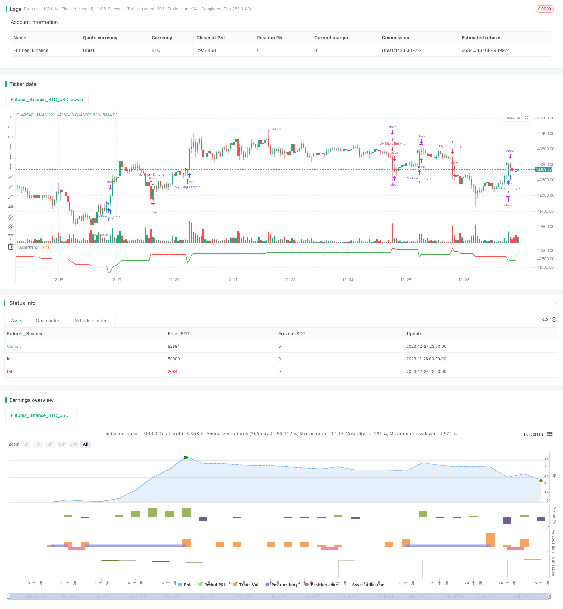

> Name

BankNifty Super Trend Trading StrategyBankNifty-Supertrend-Trading-Strategy
> Author

ChaoZhang

> Strategy Description


[trans]

## Overview
This is a super trend indicator trading strategy based on BankNifty 5-minute K-line. This strategy mainly uses the super trend indicator to identify trends and combines trading periods and risk management rules for trading.
## Strategy Principle
The strategy starts by defining input variables such as trading period and date range. The trading session is set for India trading session, from 9:15 am to 3:10 pm.
Then calculate the supertrend indicator and its direction. The Super Trend indicator identifies the direction of the trend.
At the beginning of each trading session, the strategy waits for 3 K lines to form before considering entering the market. This is to filter out false breakouts.
The long signal is when the direction of the super trend indicator changes from bottom to upward; the short signal is when the direction of the super trend indicator changes from top to bottom.
A stop loss will be set after entering the market. Both the fixed stop loss points and the trailing stop loss percentage can be adjusted by inputting variables.
At the end of the trading session, the strategy will close all open positions.
## Strategic Advantages
This is a simple trading strategy that uses indicators to identify trends. It has the following advantages:
1. Use the super trend indicator to determine the trend direction, which can effectively identify the trend.
2. Combined with trading hours, you can avoid the opening and closing periods when the market is most volatile.
3. Set a trailing stop to lock in profits
4. There are many parameters that can be adjusted freely through input variables, which is highly adaptable.
## Strategy Risk
There are also some risks with this strategy:
1. There is a lag in the super trend indicator and you may miss the best opportunity to enter the market.
2. Judgment based on a single indicator is easily affected by false breakthroughs, and the winning rate may not be high.
3. Failure to consider the market trend and may deviate from the market trend
4. Improper setting of stop loss points may cause losses beyond expectations.
These risks can be reduced by optimizing the parameters of the Super Trend indicator or adding other indicator judgments.
## Strategy optimization direction
This strategy can also be optimized from the following aspects:
1. Adding other indicators to judge and form a combined trading strategy can improve the stability of the strategy
2. Add judgment on the trend of the market to avoid deviation from the market
3. Optimize the parameters of the super trend indicator and find the most suitable length and factor
4. Adjust the stop loss strategy, such as gradually adjusting the stop loss point according to the trend.
5. Test different trading varieties to find the one that best matches the strategy
## Summarize
This strategy is a super trend indicator trading strategy based on the BankNifty 5-minute line. It uses super trend indicators to determine the trend direction and combines trading sessions and risk management rules for trading. Compared with complex quantitative strategies, the rules of this strategy are simple and clear, easy to understand and implement. As an example strategy, it provides a basis and direction for future optimization and improvement. Through continuous improvement and improvement, we hope that this strategy can become a reliable, stable and profitable quantitative trading strategy.
||

## Overview

This is a trading strategy based on the 5-minute K-line of BankNifty using the Supertrend indicator. The strategy mainly utilizes the Supertrend indicator to identify trends and combines trading sessions and risk management rules to trade.  

## Strategy Principle  

The strategy first defines input variables such as trading sessions and date ranges. The trading session is set to the Indian trading session from 9:15 am to 3:10 pm.

It then calculates the Supertrend indicator and its direction. The Supertrend indicator can identify the direction of the trend.  

At the beginning of each trading session, the strategy waits for 3 candles to form before considering entering a trade. This is to filter false breakouts.  

The long signal is when the Supertrend indicator direction changes from down to up; the short signal is when the Supertrend direction changes from up to down.

After entering, stop loss will be set. Both fixed stop loss points and trailing stop loss percentage can be adjusted through input variables.  

At the end of the trading session, the strategy will close all open positions.

## Advantages of the Strategy

This is a simple trading strategy that uses indicators to identify trends. It has the following advantages:

1. Use Supertrend indicator to judge trend direction, which can effectively identify trends  
2. Combining trading sessions can avoid the most volatile opening and closing session  
3. Set trailing stop loss to lock in profits  
4. Many parameters can be adjusted freely through input variables, high adaptability  

## Risks of the Strategy

The strategy also has some risks:  

1. Supertrend indicator has lagging, may miss the best entry point  
2. Single indicator judgment is prone to be affected by false breakouts, win rate may be low
3. Does not consider market trend, may diverge from the overall market
4. Improper stop loss setting may lead to larger than expected losses  

These risks can be reduced by optimizing parameters of the Supertrend indicator or adding other indicator judgments.

## Optimization Directions  

The strategy can also be optimized in the following aspects:

1. Add other indicator judgments to form a combined strategy, improve stability  
2. Add overall market trend judgment to avoid divergence from the market
3. Optimize parameters of Supertrend indicator, find the best length and factor  
4. Adjust stop loss strategy, like trailing stop loss along with the trend  
5. Test on different products, find the best match  

## Conclusion  

In summary, this is a Supertrend indicator trading strategy based on the BankNifty 5-minute chart. It utilizes the Supertrend indicator to determine the trend direction and combines trading sessions and risk management rules to trade. Compared to complex quantitative strategies, this strategy has simple and clear rules that are easy to understand and implement. As a sample strategy, it provides a foundation and direction for future optimization and improvement. Through continuous refinement and enhancement, it is hoped that the strategy can become a reliable and profitable quantitative trading strategy.

[/trans]

> Strategy Arguments


|Argument|Default|Description|
|----|----|----|
|v_input_3|timestamp(01 Dec 2023 23:59:59)|End Date|
|v_input_float_1|3|Factor|
|v_input_1|0915-1510|(?Indian Session Time)Session|
|v_input_2|timestamp(01 Jan 2022 00:00:00)|(?Backtest Specific Range)Start Date|
|v_input_4|50|(?SuperTrend Setting)ATR Length|
|v_input_5|true|(?Delay at Session Start)Use Delay?|
|v_input_6|10|Delay N numbers of candle|
|v_input_7|true|(?Risk Management)Use Stoploss Points?|
|v_input_8|100|Stop Loss Points|
|v_input_9|true|Use Stoploss Trail?|
|v_input_float_2|0.1|Stop Loss Trail%|


> Source (PineScript)

``` pinescript
/*backtest
start: 2023-11-28 00:00:00
end: 2023-12-28 00:00:00
period: 1h
basePeriod: 15m
exchanges: [{"eid":"Futures_Binance","currency":"BTC_USDT"}]
*/

//@version=5
strategy("BankNifty 5min Supertrend Based Strategy, 09:15 Entry with Date Range and Risk Management")

// Session and date range input variables
session = input("0915-1510", "Session", group="Indian Session Time")
start_date = input(title="Start Date", defval=timestamp("01 Jan 2022 00:00:00"), group="Backtest Specific Range")
end_date = input(title="End Date", defval=timestamp("01 Dec 2023 23:59:59"))
atrPeriod = input(50, "ATR Length", group="SuperTrend Setting")
factor = input.float(3.0, "Factor", step=0.1)

useDelay = input(true, "Use Delay?", group="Delay at Session Start")
Delay = useDelay ? input(10, title="Delay N numbers of candle", group="Delay at Session Start") : na

useDelay_stopLoss = input(true, "Use Stoploss Points?", group="Risk Management")
stopLoss = useDelay_stopLoss ? input(100, "Stop Loss Points", group="Risk Management"): na

useDelay_stopLossPerc1 = input(true, "Use Stoploss Trail?", group="Risk Management")
stopLossPerc1 =useDelay_stopLossPerc1 ? input.float(0.1, "Stop Loss Trail%", step=0.1,maxval = 1, group="Risk Management"): na
// Check if current time is within the specified session and date range
inSession = true

[supertrend, direction] = ta.supertrend(factor, atrPeriod)

// Wait for 3 candles to form at the start of every session
var candlesFormed = 0
if inSession and not inSession[1]
    candlesFormed := 1
else if inSession and candlesFormed > 0
    candlesFormed := candlesFormed + 1
else
    candlesFormed := 0


//

// Only enter trades if 3 candles have formed at the start of the session
entryce = (ta.change(direction) < 0) or (candlesFormed >= Delay and direction < 0)
exitce = ta.change(direction) > 0
entrype = (ta.change(direction) > 0) or (candlesFormed >= Delay and direction > 0)
exitpe = ta.change(direction) < 0
var entryPrice = 0.0
if entryce and inSession
    // Enter long trade
    onePercent = strategy.position_avg_price *stopLossPerc1
    entryPrice := close
    strategy.entry("My Long Entry Id", strategy.long, comment="long" )
    // Set stop loss at x% below entry price
    strategy.exit("My Long Exit Id", "My Long Entry Id", stop=(entryPrice - stopLoss),trail_points=onePercent )
    
if entrype and inSession
    onePercent1 = strategy.position_avg_price *stopLossPerc1
    entryPrice := close
    // Enter short trade
    strategy.entry("My Short Entry Id", strategy.short, comment="short")
    // Set stop loss at x% above entry price
    strategy.exit("My Short Exit Id", "My Short Entry Id", stop=(entryPrice + stopLoss),trail_points=onePercent1)

// Close all trades at end of session
if not inSession and strategy.opentrades > 0
    strategy.close_all()

// Plot Supertrend with changing colors
plot(supertrend, title="Supertrend", color=direction == 1 ? color.red : color.green, linewidth=2)


```

> Detail

https://www.fmz.com/strategy/437044

> Last Modified

2023-12-29 17:09:57
