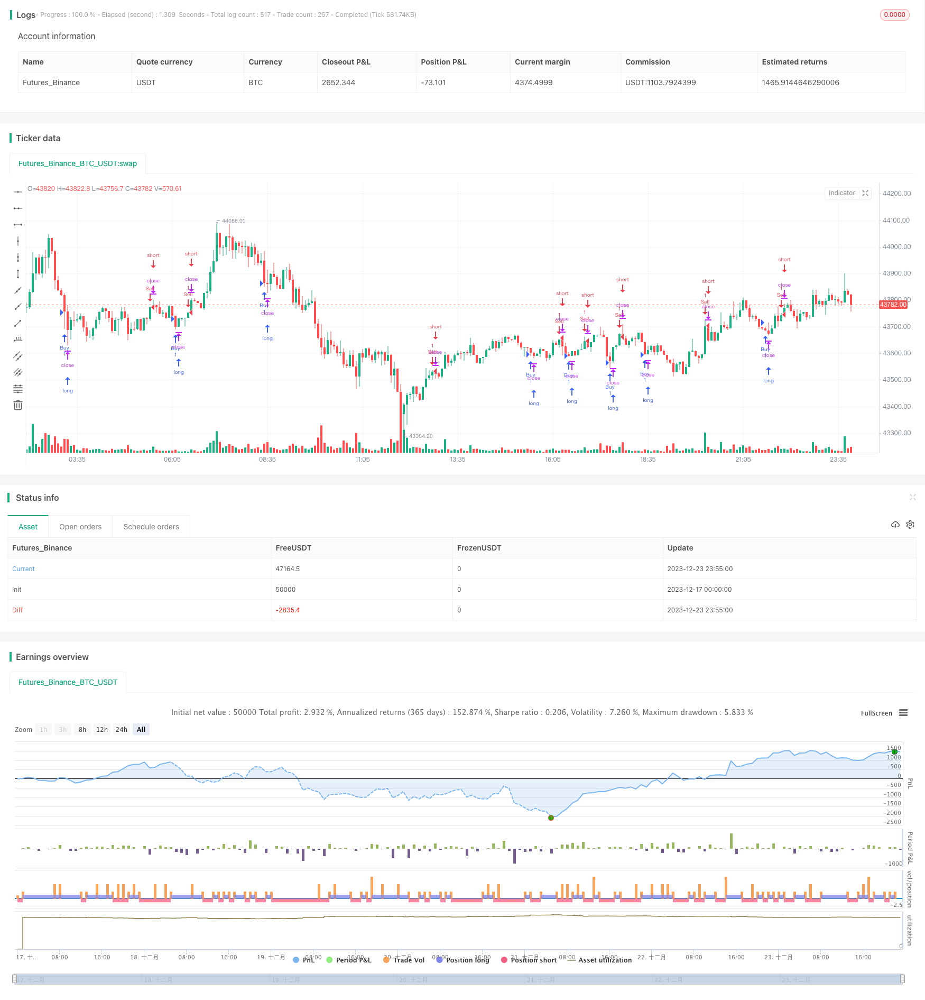

> Name

Based-on-Weighted-Moving-Average-Strategy
> Author

ChaoZhang

> Strategy Description




[trans]

## Overview
This strategy is a 15-minute scalping strategy for the AUD/NZD currency pair. This strategy uses multiple weighted moving averages of different periods to construct trading signals and achieve high-frequency trading. Its advantage is that it can capture short-term price changes and is suitable for traders who are keen-eyed and good at making quick decisions. However, this strategy also faces certain risks and requires traders to use it with caution.
## Strategy Principle
This strategy uses 5 weighted moving averages with different periods, specifically 29-period, 5-period, 3-period, 2-period and 1-period WMA. The trading principle of the strategy is: when the short-period WMA line crosses the longer-period WMA line in turn, a buy signal is generated; when the short-period WMA line crosses the longer-period WMA line in turn, a sell signal is generated. This captures trends in price movements over a shorter period of time.
When entering a long position, the strategy will set a fixed stop loss at the latest price to control risks; it will also set a profit stop point to lock in profits. The same goes for setting up stop loss and take profit when entering a short position.
## Strategic Advantages
The biggest advantage of this strategy is that through high-frequency trading, you can capture opportunities for price changes in the short term and achieve higher profit margins. Specific advantages include:
1. Short cycle and quick decision-making. 15 minutes is a short time period that reduces uncertainty by making quick decisions.
2. Use the weighted moving average to judge the situation. WMA gives higher weight to recent prices and can capture price trend changes faster.
3. Use multiple WMAs in combination to make the judgment more accurate. The joint decision-making of 5 WMAs can reduce false signals and improve the accuracy of judgment.
4. Strict stop-loss and stop-profit management to control risks. Ensure that the risks and profits of each transaction are properly controlled through pre-set stop loss and take profit.
## Risk Analysis
Although this strategy has many advantages, there are also certain risks that need to be noted:
1. The time and energy consumption caused by high-frequency trading. Frequent trading requires traders to pay close attention to the market and invest a lot of time and energy, which places high demands on traders.
2. The error rate of short-term judgment is higher. Using a 15-minute period to judge trends can easily produce more false signals, leading to erroneous trading decisions.
3. A stop loss point that is too small may increase losses. If the stop loss point is set too small, legitimate signals may be stopped out quickly and cause losses.
4. The impact of robot trading. The large amount of bot trading in the current market increases short-term price instability and uncertainty.
Faced with these risks, traders need to adjust their stop loss points and relax appropriately; at the same time, they need to pay attention to the trend judgment of a longer period to avoid the interference of short-term noise; they also need to improve their ability to identify robot trading.
## Strategy optimization
This strategy also has room for further optimization:
1. Adjust moving average parameters and optimize judgment. You can try more WMA line combinations with different parameters to find WMA parameters that better match the characteristics of the currency pair.
2. Add other indicator filters to improve judgment accuracy. Based on this strategy, momentum indicators, volatility indicators, etc. can be introduced to conduct secondary verification of trading signals.
3. Optimize stop-loss and stop-profit strategies to fully control risks and returns. You can use adaptive stop loss, trailing stop loss, progressive take profit, etc. to optimize the settings of stop loss and take profit.
4. Add algorithmic trading elements to resist human errors. On the basis of manual judgment, an algorithmic automatic decision-making module is introduced to automatically place orders and stop loss and profit management when conditions are met, thereby reducing the probability of traders' incorrect operations.
## Summarize
Overall, this strategy is a short-period market capture strategy based on weighted moving averages. It has the advantages of high operating frequency and timely capture of short-term price trends, making it particularly suitable for intraday high-frequency scalping transactions. But at the same time, traders also need to be sufficiently sensitive to market judgment and invest a lot of time and energy to achieve the best results. There is still a lot of room for optimization of this strategy in the future, and it is worthy of further exploration to improve the comprehensiveness of the strategy.
||

## Overview

This is a 15-minute scalping strategy for the AUDNZD currency pair. The strategy uses multiple weighted moving averages (WMA) of different timeframes to construct trading signals and make high-frequency trades. Its advantage lies in the ability to capture short-term price fluctuations, suitable for agile traders who are good at making quick decisions. But the strategy also carries certain risks and needs to be applied cautiously by traders.

## Strategy Logic

The strategy employs 5 WMAs of varying periods, specifically 29-, 5-, 3-, 2- and 1-period WMAs. The trading logic is: when shorter-period WMAs successively cross above longer-period WMAs, a buy signal is generated; when shorter-period WMAs successively cross below longer-period WMAs, a sell signal is triggered. This catches trend changes over shorter time horizons.

Upon entering long positions, stop loss and take profit are set based on fixed input parameters to control risk and profit for each trade. The same applies for short positions.

## Advantage Analysis 

The biggest advantage of this strategy lies in its ability to capitalize on short-term price moves through high-frequency trading, thus leading to higher profit potential. Specific benefits include:

1. Short timeframe allows swift decisions. 15-minute is a short enough timeframe to reduce uncertainty through quick decisions.  

2. Trend identification with WMA. WMA gives more weight to recent prices, catching trend changes faster.

3. More accurate signals using multiple WMAs. Combining signals across 5 WMAs reduces false signals and improves accuracy.  

4. Strict risk control with stop loss and take profit. Pre-set levels ensure appropriate loss and profit control for every trade.

## Risk Analysis

Despite the advantages, there are also risks to note:

1. Time and focus required for active trading. Frequent trading demands trader's time and full attention to the market.

2. Higher false signals with short timeframes. 15-minute changes can be prone to noise and false signals. 

3. Small stop loss may increase losses. If set too tight, valid signals may hit stop loss prematurely.  

4. Impact of algorithmic trading. Increased machine trading now adds to short-term instability and unpredictability.

Facing these risks, traders should consider relaxing stop loss, referring to longer timeframes, identifying algorithmic trades, etc.

## Improvement Areas

There remains room for further enhancements:

1. Optimize WMA parameters for best fit. Experiment with more WMA combinations to find the best set for this currency pair.

2. Add filters to validate signals. Combine with momentum, volatility metrics, etc. to double check signals.

3. Refine stop loss and take profit mechanisms for risk control. Adaptive stop loss, moving stop loss, incremental profit taking etc. can be explored. 

4. Introduce algorithm to assist trading and risk management. Automated modules supplemented by human discretion can help avoid manual errors.  

## Conclusion
In conclusion, this WMA-based strategy specializes in capturing short-term price moves, suiting intraday scalping style trading. It demands focus and quick responses from traders to maximize performance. There remains extensive room for optimizing various aspects of this strategy to improve its well-roundedness.

[/trans]


> Source (PineScript)

``` pinescript
/*backtest
start: 2023-12-17 00:00:00
end: 2023-12-24 00:00:00
period: 5m
basePeriod: 1m
exchanges: [{"eid":"Futures_Binance","currency":"BTC_USDT"}]
*/

//@version=5
strategy(title="AUDNZD Scalp 15 minutes", overlay=true)

// Moving Averages
len1 = 29
len2 = 5
len3 = 3
len4 = 2
len5 = 1
src = close

wma1 = ta.wma(src, len1)
wma2 = ta.wma(src, len2)
wma3 = ta.wma(src, len3)
wma4 = ta.wma(src, len4)
wma5 = ta.wma(src, len5)

// Strategy
wma_signal = wma1 > wma2 and wma2 > wma3 and wma3 > wma4 and wma4 > wma5
wma_sell_signal = wma1 < wma2 and wma2 < wma3 and wma3 < wma4 and wma4 < wma5

// Position Management
risk = 5.30
stop_loss = 0
take_profit = 0

// Long Position
if wma_signal
    strategy.entry("Buy", strategy.long)
    
    if stop_loss > 0
        strategy.exit("Sell", from_entry="Buy", loss=stop_loss)
    
    if take_profit > 0
        strategy.exit("Sell", from_entry="Buy", profit=take_profit)

// Short Position
if wma_sell_signal
    strategy.entry("Sell", strategy.short)
    
    if stop_loss > 0
        strategy.exit("Cover", from_entry="Sell", loss=stop_loss)
    
    if take_profit > 0
        strategy.exit("Cover", from_entry="Sell", profit=take_profit)

```

> Detail

https://www.fmz.com/strategy/436529

> Last Modified

2023-12-25 15:32:08
