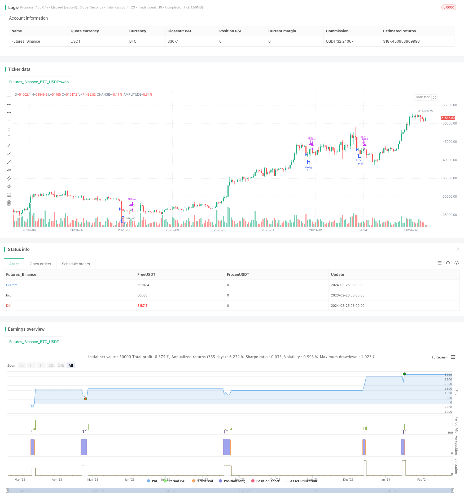

> Name

Based-on-the-Moving-Average-Reversion-Strategy
> Author

ChaoZhang

> Strategy Description


[trans]

## Overview
The Moving Average Average Recovery Strategy is a very simple trend trading strategy. Its core idea is to go long when the short-term moving average is lower than the long-term moving average by a certain percentage, and to close the position when the short-term moving average crosses the long-term moving average. This strategy first calculates a short-term and a long-term moving average, and then generates trading signals based on the relationship between the two moving averages.
## Strategy Principle
This strategy mainly relies on two moving averages, a short-term moving average and a long-term moving average. The short-term moving average parameter is smallMAPeriod, and the long-term moving average parameter is bigMAPeriod. The strategy first calculates the two moving averages, and then compares the size relationship between the two moving averages.
When the short-term moving average falls from above below a certain percentage of the long-term moving average (set by the percentBelowToBuy parameter), a buy signal is generated to enter the market long. When the short-term moving average subsequently rises and crosses the long-term moving average again, a sell signal is generated and the position is closed.
This strategy captures mean reversion opportunities between the short-term moving average and the long-term moving average. When the short-term moving average is lower than the long-term moving average to a certain extent, it means that the asset may be undervalued and should have the opportunity to return to the mean. Going long can earn rebound profits.
## Advantage Analysis
The moving average recovery strategy has the following advantages:
1. Simple idea, easy to understand and implement
2. Capture the turning points of short-term and long-term trends and accurately judge market trends.
3. Flexible parameter settings, you can obtain more trading signals by adjusting the moving average period and concession percentage
4. The backtesting process is simple and suitable for simulation optimization of quantitative trading.
This strategy can achieve good results with simple Parameters optimization. By adjusting the moving average parameters and concession percentage parameters, you can backtest different market assets such as stocks, foreign exchange, cryptocurrencies, etc., and screen out the best parameter combinations.
## Risk Analysis
The moving average recovery strategy also has some risks:
1. There are few signals and cannot be traded frequently.
2. It is easy to miss the price reversal
3. Improper parameters may lead to too frequent transactions and higher transaction costs and slippage losses.
Risks can be reduced by:
1. Appropriately adjust parameters to achieve appropriate trading signals
2. Use the method of breaking through to leave and then breaking through to enter to avoid false breakthroughs
3. Optimize the parameter combination and select the moving average period and concession percentage
## Optimization direction
The moving average recovery strategy can be optimized from the following aspects:
1. Test different price data, such as closing price, highest price, lowest price, typical price, etc. as strategy signal sources
2. Try different types of moving averages, such as exponential moving average, linear weighted moving average, Hull moving average, etc.
3. Add filter conditions to avoid unnecessary transactions in non-trending markets
4. Combined with trading volume indicators, avoid false breakthroughs where the price rises but the volume is insufficient.
5. Use machine learning or genetic algorithms to automatically optimize parameters
## Summarize
The moving average recovery strategy captures the return opportunities after short-term prices deviate from the long-term trend by comparing the relationship between short-term and long-term moving averages. The strategy is simple in idea, easy to understand and implement, and can achieve better results through parameter optimization. However, there are also risks such as fewer trading signals and easy to miss price turns. Parameters and filtering conditions need to be tested and optimized to maximize the benefits of the strategy.
||

## Overview

The Jaws mean reversion strategy is a very simple trend trading strategy. Its core idea is to go long when the short-term moving average falls below the long-term moving average by a certain percentage, and close the position when the short-term moving average crosses above the long-term moving average. The strategy first calculates a short-term and a long-term moving average, and then generates trading signals based on the relationship between the two moving averages.  

## Strategy Logic

The strategy mainly relies on two moving averages, one short-term and one long-term. The short-term moving average parameter is smallMAPeriod, and the long-term moving average parameter is bigMAPeriod. The strategy first calculates these two moving averages, and then compares the size relationship between them.

When the short-term moving average falls from above and breaks through a certain percentage (set by the percentBelowToBuy parameter) of the long-term moving average, a buy signal is generated to go long. When the short-term moving average subsequently rises and crosses above the long-term moving average, a sell signal is generated to close the position.

The strategy captures mean reversion opportunities between the short-term and long-term moving averages. When the short-term moving average is below the long-term moving average to a certain extent, it means the asset may be undervalued and should have a chance to revert to the mean, so going long can obtain a rebound profit.

## Advantage Analysis  

The Jaws mean reversion strategy has the following advantages:

1. The logic is simple and easy to understand and implement
2. Captures the turning points of short-term and long-term trends for precise judgment of market trends  
3. Flexible parameter settings that can obtain more trading signals by adjusting the moving average periods and concession percentage
4. Simple backtesting process suitable for quantitative trading simulation and optimization

The strategy can achieve good results through simple parameter optimization. By adjusting the moving average and concession percentage parameters, backtesting can be performed on different market assets like stocks, forex, and cryptocurrencies to screen out the optimal parameter combinations.  

## Risk Analysis

The Jaws mean reversion strategy also has some risks:  

1. Fewer signals unable to trade frequently
2. Prone to missing price reversal situations
3. Improper parameters can lead to excessively frequent trading, higher trading costs and slippage losses

The following methods can be used to mitigate risks:

1. Appropriately adjust parameters for an adequate amount of trading signals  
2. Adopt breakout pullback entry method to avoid false breakouts
3. Optimize parameter combinations by selecting moving average periods and concession percentages  

## Optimization Directions

The Jaws mean reversion strategy can be optimized from the following aspects:

1. Test different price data like close, high, low, typical price as strategy signal source
2. Try different types of moving averages like exponential, weighted, Hull moving averages etc 
3. Add filter conditions to avoid unnecessary trading in non-trending markets
4. Incorporate volume indicators to avoid false breakouts with increasing price but insufficient momentum
5. Employ machine learning or genetic algorithms for automated parameter optimization

## Conclusion

The Jaws mean reversion strategy captures the mean reversion opportunities after short-term prices deviate from long-term trends by comparing short and long-term moving averages. The strategy has simple logic that is easy to understand and implement. Through parameter optimization it can achieve good results. But risks like fewer signals and missing reversals still exist, requiring testing and optimization of parameters and filters to maximize strategy returns.

[/trans]

> Strategy Arguments


|Argument|Default|Description|
|----|----|----|
|v_input_1_close|0|Source: close|high|low|open|hl2|hlc3|hlcc4|ohlc4|
|v_input_2|2|Small Moving Average|
|v_input_3|5|Big Moving Average|
|v_input_4|3|Percent below to buy %|


> Source (PineScript)

``` pinescript
/*backtest
start: 2023-02-20 00:00:00
end: 2024-02-26 00:00:00
period: 1d
basePeriod: 1h
exchanges: [{"eid":"Futures_Binance","currency":"BTC_USDT"}]
*/

// @version=4
//
// This source code is subject to the terms of the Mozilla Public License 2.0 at https://mozilla.org/MPL/2.0/
//
// @author Sunil Halai
//
// This very simple strategy is an implementation of PJ Sutherlands' Jaws Mean reversion algorithm. It simply buys when a small moving average period (e.g. 2) is below
// a longer moving average period (e.g. 5) by a certain percentage, and closes when the small period average crosses over the longer moving average. 
// 
// If you are going to use this, you may wish to apply this to a range of investment assets, as the amount signals is low. Alternatively you may wish to tweak the settings to provide more
// signals.


strategy("Jaws Mean Reversion [Strategy]", overlay = true)

//Strategy inputs
source = input(title = "Source", defval = close)
smallMAPeriod = input(title = "Small Moving Average", defval = 2)
bigMAPeriod = input(title = "Big Moving Average", defval = 5)
percentBelowToBuy = input(title = "Percent below to buy %", defval = 3)


//Strategy calculation
smallMA = sma(source, smallMAPeriod)
bigMA =  sma(source, bigMAPeriod) 
buyMA = ((100 - percentBelowToBuy) / 100) * sma(source, bigMAPeriod)[0]

if(crossunder(smallMA, buyMA))
    strategy.entry("BUY", strategy.long)

if(crossover(smallMA, bigMA))
    strategy.close("BUY")
```

> Detail

https://www.fmz.com/strategy/442975

> Last Modified

2024-02-27 17:51:43
