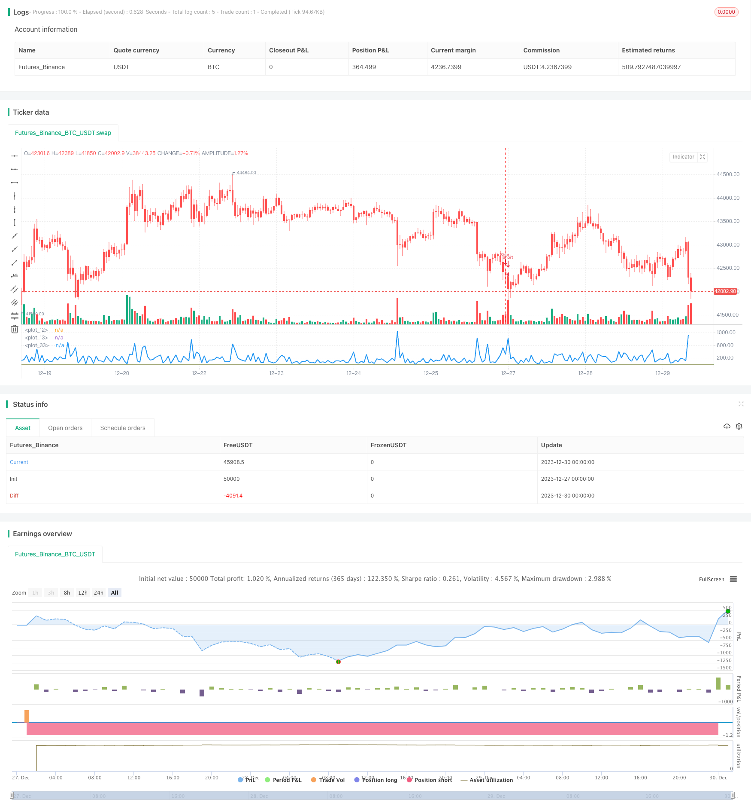

> Name

Quantitative trading strategy Bear-Power-Strategy based on the Bear Power indicator
> Author

ChaoZhang

> Strategy Description


[trans]

## Overview
The Bear Power strategy is a quantitative trading strategy based on the Bear Power indicator. This strategy generates trading signals by calculating the strength of the daily closing price relative to the opening price to determine the current long-short status of the market. When the bear power exceeds the set sell level, go short; when the bear power falls below the set buy level, go long. This strategy is suitable for short to medium term trading.
## Strategy Principle
The core indicator of the Bear Power strategy is the Bear Power Indicator. This indicator calculates the market's long and short strength based on the difference between the closing price and the opening price. The specific calculation formula is as follows:
If closing price < opening price:
    If the previous day's closing price > the previous day's opening price:
        Bear power = max(closing price - opening price, highest price - lowest price)
    Otherwise:
        Bear Power = Highest Price - Lowest Price
If closing price >= opening price:
    If the previous day's closing price > the previous day's opening price:
        Bear power = max (previous day's closing price - lowest price, highest price - closing price)
    Otherwise:
        Bear power = max (opening price - lowest price, highest price - closing price)
The basic idea of ​​this formula is that if the closing price of the day < the opening price, it means that there is downward force in the market that day, which is a sign of a bear market; if the closing price >= the opening price, it means that there is upward force or consolidation in the market that day, which is a bull market. The previous day's data is included in the formula to ensure continuity of strength.
After calculating the Bear Power indicator, the strategy sets a sell and buy line. When bear power crosses the sell line, go short; when bear power crosses the buy line, go long.
## Advantage Analysis
The bear power strategy has several advantages:
1. The source of strategic signals is unique and has certain foresight. The Bear Power indicator is rarely used in traditional technical analysis and provides a new perspective to judge market structure.
2. The strategy retracement is controllable and has certain risk management functions. Compared with strategies that follow the market significantly, the bear power strategy only issues trading orders when clear long and short signals appear in the market, which can effectively avoid unnecessary losses.
3. It is not difficult to implement and easy to apply in practice. This strategy only requires the closing price and opening price to be implemented, and the code logic is not complicated.
4. Can be flexibly optimized according to needs. The position of the buying and selling lines can be adjusted according to different markets, and reversal trading logic can be set to optimize the strategy.
## Risk Analysis
The Bear Power strategy also has the following risks:
1. The market may be in a volatile situation for a long time, and the strategy cannot effectively capture the huge profits generated by the trend. At this time, the profit of the strategy may mainly come from the bid-ask spread.
2. The Bear Power indicator is not a 100% reliable judgment indicator, and the buy and sell signals may be invalid. At this time, it needs to be verified in combination with other indicators.
3. The strategy only generates signals based on one or two indicators, which is prone to over-optimization. In actual transactions, a single strategy is prone to failure, and multiple strategies need to be combined for asset allocation and risk management.
4. The strategy does not consider the impact of transaction costs and slippage. The influence of these two factors cannot be ignored in actual trading, and simulation of these two factors needs to be introduced when implementing strategies.
## Optimization direction
The bear power strategy can be optimized from the following directions:
1. Add stop loss logic. When the market trend does not match the strategy signals, timely stop loss can reduce losses.
2. Add verification of other indicators. For example, combining moving averages, volatility and other indicators to verify the signal of the bear power indicator to prevent failure.
3. Introduce machine learning model. Use neural networks, SVM, etc. to train the bear power indicator and establish a more reliable long-short judgment model.
4. Optimize the position of the buying and selling lines. The best parameter combination can be found through backtesting. You can also set adaptive buying and selling lines and dynamically adjust them according to the market profile.
5. Add trend tracking mechanism. After identifying a trending market, change to a trend following strategy for higher profits.
## Summarize
The bear power strategy is based on the unique bear power indicator to determine the market structure and gain profits by shorting in the bear market. This strategy has controllable drawdowns, is not difficult to implement, and is suitable for short- and medium-term transactions. We can also optimize this strategy from multiple dimensions such as introducing stop loss, adding signal verification, and machine learning to make it a stable and reliable quantitative strategy.
||

## Overview  

The Bear Power strategy is a quantitative trading strategy based on the Bear Power indicator. This strategy generates trading signals by calculating the power of daily closing prices relative to opening prices to determine the current long/short status of the market. It goes short when the bear power exceeds a set sell level, and goes long when the bear power falls below a set buy level. This strategy is suitable for medium-term trading.

## Strategy Principle  

The core indicator of the Bear Power strategy is the Bear Power Indicator. This indicator calculates the long/short power of the market based on the difference between the closing price and the opening price. The specific calculation formula is as follows:  

If Close < Open:  
    If Prev Close > Prev Open:  
        Bear Power = max(Close - Open, High - Low)
    Else:
        Bear Power = High - Low
        
If Close >= Open:
    If Prev Close > Prev Open: 
        Bear Power = max(Prev Close - Low, High - Close)
    Else:
        Bear Power = max(Open - Low, High - Close)

The basic idea behind this formula is that if the closing price < the opening price today, it indicates a downward force in the market today, which is characteristic of a bear market; if the closing price >= the opening price, it indicates an upward force or consolidation in the market today, characteristic of a bull market. The formula contains previous day's data to ensure continuity of power.  

After calculating the Bear Power indicator, the strategy will set a sell line and a buy line. It goes short when the bear power crosses above the sell line, and goes long when the bear power crosses below the buy line.

## Advantage Analysis   

The Bear Power strategy has the following advantages:

1. The source of the trading signals is unique and has some leading capability. The Bear Power indicator is rarely used in traditional technical analysis, providing a new perspective to judge market structure.  

2. The strategy has controllable drawdowns and some risk management functionality. Compared to strategies that aggressively track the market, the Bear Power strategy only issues trading orders when clear long/short signals appear in the market, which can effectively avoid unnecessary losses.

3. The strategy has low implementation difficulty and is easy to apply in practice. It only relies on closing and opening prices to function, with uncomplicated logic.

4. It can be flexibly optimized according to needs. For example, the buy/sell line positions can be adjusted for different markets, reverse trading logic can be added, etc.

## Risk Analysis  

The Bear Power strategy also has some risks:  

1. The market may stay range-bound for long periods, and the strategy will fail to capture huge profits generated by trends. In such cases, the strategy's profit may mainly come from bid-ask spreads.

2. The Bear Power Indicator is not 100% reliable for judgments, and its signals may fail. Other indicators are needed to verify its signals in such cases.

3. The strategy relies solely on one or two indicators for signals, making it prone to overfitting. Single strategies tend to fail in actual trading. Multiple strategies should be combined for asset allocation and risk management.  

4. Trading costs and slippage are not considered in the strategy. In practical trading their impact is non-negligible and needs to be introduced in simulations.

## Optimization Directions   

The Bear Power strategy can be optimized in the following aspects:

1. Add stop loss logic. Timely stop loss when market movements conflict signals can reduce losses. 

2. Add validation from other indicators. Combine indicators like moving averages and volatility to validate Bear Power signals and prevent failures.

3. Introduce machine learning models. Use neural networks, SVM etc. to train the Bear Power indicator and establish more reliable long/short judgment models.  

4. Optimize buy/sell line positions. Find optimal parameter combinations via backtesting. Adaptive lines can also be used based on market profile.

5. Add trend following mechanisms. Identify trending markets and switch to trend following strategies for higher profits.


## Conclusion  

The Bear Power strategy identifies market structures and profits from short positions in bear markets based on the unique Bear Power indicator. This strategy has controllable drawdowns and is easy to implement, suitable for medium-term trading. We can further optimize it in aspects like adding stops, signal verification, machine learning etc., to make it a robust quantitative strategy.

[/trans]

> Strategy Arguments


|Argument|Default|Description|
|----|----|----|
|v_input_1|10|SellLevel|
|v_input_2|true|BuyLevel|
|v_input_3|false|Trade reverse|


> Source (PineScript)

``` pinescript
/*backtest
start: 2023-12-27 00:00:00
end: 2023-12-30 01:00:00
period: 1h
basePeriod: 15m
exchanges: [{"eid":"Futures_Binance","currency":"BTC_USDT"}]
*/

//@version=2
////////////////////////////////////////////////////////////
//  Copyright by HPotter v1.0 26/01/2017
//  Bear Power Indicator
//  To get more information please see "Bull And Bear Balance Indicator" 
//  by Vadim Gimelfarb. 
///////////////////////////////////////////////////////////
strategy(title = "Bear Power Strategy")
SellLevel = input(10, step=0.01)
BuyLevel = input(1, step=0.01)
reverse = input(false, title="Trade reverse")
hline(SellLevel, color=red, linestyle=line)
hline(BuyLevel, color=green, linestyle=line)
value =  iff (close < open ,  
             iff (close[1] > open ,  max(close - open, high - low), high - low), 
                 iff (close > open, 
                     iff(close[1] > open, max(close[1] - low, high - close), max(open - low, high - close)), 
                         iff(high - close > close - low, 
                             iff (close[1] > open, max(close[1] - open, high - low), high - low), 
                              iff (high - close < close - low, 
                               iff(close > open, max(close - low, high - close),open - low), 
                                 iff (close > open, max(close[1] - open, high - close),
                                  iff(close[1] < open, max(open - low, high - close), high - low))))))
pos = iff(value > SellLevel, -1,
	   iff(value <= BuyLevel, 1, nz(pos[1], 0))) 
possig = iff(reverse and pos == 1, -1,
          iff(reverse and pos == -1, 1, pos))
if (possig == -1) 
    strategy.entry("Short", strategy.short)
if (possig == 1)
    strategy.entry("Long", strategy.long)
barcolor(possig == -1 ? red: possig == 1 ? green : blue )
plot(value, style=line, linewidth=2, color=blue)
```

> Detail

https://www.fmz.com/strategy/437644

> Last Modified

2024-01-04 15:13:16
