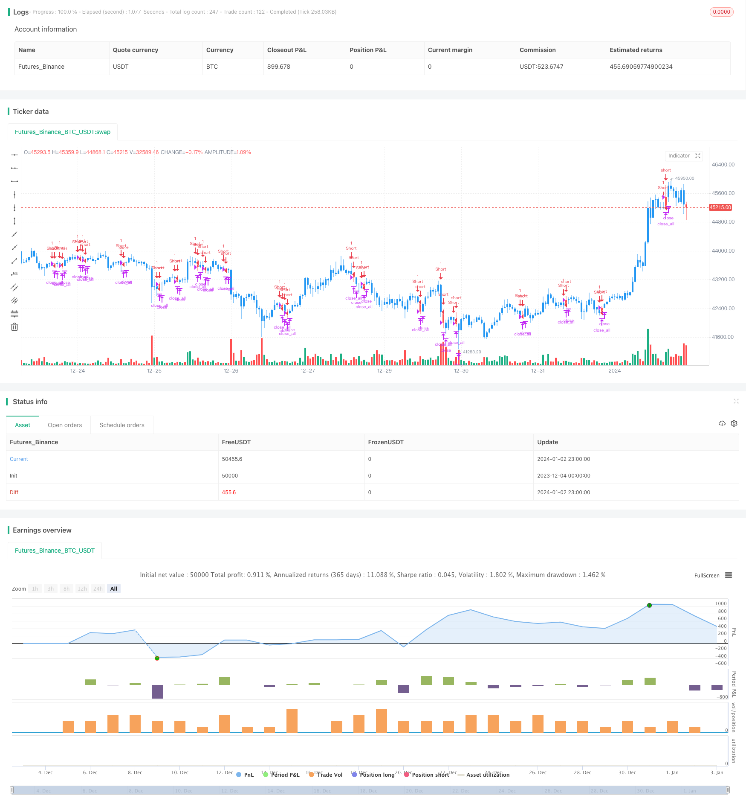

> Name

Bearish-Engulfing-Reversal-Strategy Bearish-Engulfing-Reversal-Strategy
> Author

ChaoZhang

> Strategy Description



[trans]

### Overview
This strategy is a strategy that determines market reversal signals based on the bearish turn pattern in the K-line. When a bearish reversal pattern occurs, go short and close the position after making a profit.
### Strategy Principles
The core judgment logic of this strategy is to identify whether a bearish turn pattern appears in the K-line. The bearish turn pattern refers to an upward K-line followed by a negative line with a closing price lower than the previous day's closing price, and the physical part of the negative line completely wraps the previous day's positive physical entity. According to technical analysis theory, this pattern usually indicates an imminent reversal in the current upward trend.
Therefore, the specific trading logic of this strategy is:
1. When a bearish reversal pattern is detected (the previous day was a positive line and the real body met the size requirements, the current one is a negative line and the real body completely covers the previous day's positive real body), go short and enter the market.
2. If the loss exceeds the set stop loss point, stop the loss and exit the position.
3. If the profit exceeds the set profit-taking point, the position will be exited by taking profit.
In this way, price reversal opportunities can be captured when judged has a bearish signal.
### Advantage Analysis
The biggest advantage of this strategy is that it can judge the market trend reversal early. It uses the bear turn pattern, a relatively effective reversal signal, and has a high success rate. The strategic ideas are simple, clear, easy to understand and easy to implement.
In addition, the strategy incorporates a stop-loss and stop-profit mechanism to control risks and lock in profits, which can effectively prevent excessive losses from occurring.
### Risk Analysis
The main risk with this strategy is that reversal signals from bearish reversal patterns are not always reliable. Although it is accurate in most cases, misjudgments may also occur. This will result in losses that cannot be completely avoided in actual transactions.
In addition, setting fixed stop-loss and stop-profit points is also blind and not flexible enough. You may be caught in sharp market fluctuations, resulting in losses or missing out on greater profits.
### Optimization direction
This strategy can be further optimized through the following aspects:
1. Increase the selection of trading periods. Only operating strategies during active trading periods can reduce the probability of misjudgment.
2. Increase the judgment of breakthrough intensity. Combined with trading volume or average true volatility to determine the reliability of a bearish turn signal
3. Adopt dynamic stop-loss and take-profit methods, and combine with volatility indicators to set stop-loss and take-profit points more flexibly
4. Increase the judgment of the overall market trend to avoid unnecessary losses during consolidation
### Summarize
The Bear Magic Candle Reversal Strategy identifies bear reversal patterns to time market reversals. The strategic ideas are clear and easy to operate, and the success rate is high. But there is also a certain risk of misjudgment. The strategy effect can be improved and risks reduced through further optimization.
||

### Overview 

This is a strategy that uses the bearish engulfing pattern in candlesticks to determine market reversal signals for shorting. It goes short when the bearish engulfing pattern appears and closes position after reaching take profit target.

### Strategy Logic

The core logic of this strategy is to identify the bearish engulfing pattern in the candlestick chart. The bearish engulfing pattern refers to a down candlestick which completely engulfs the real body of the previous up candlestick after an upward trend. According to technical analysis theory, this pattern usually implies that the current upward trend is going to be reversed soon. 

Therefore, the specific trading logic of this strategy is:

1. When the bearish engulfing pattern is detected (previous candlestick is a up candle with satisfying size of the real body, current candlestick gaps down and its real body fully engulfs the previous one's), go short.  
2. If loss exceeds the set stop loss level, close position.
3. If profit exceeds the set take profit level, close position.  

By doing so, the opportunity of reversal can be captured after the bearish engulfing signal appears.

### Advantage Analysis

The biggest advantage of this strategy is that it can determine the market reversal relatively early based on the bearish engulfing pattern, which is a quite effective reversal signal with high success rate. Also, the strategy logic is simple and easy to understand and implement. 

In addition, the stop loss and take profit mechanisms help control the risk and lock in profit, thus preventing excessive loss effectively.

### Risk Analysis  

The major risk of this strategy is that the bearish engulfing reversal signal is not always reliable. Although in most cases it's accurate, misjudgement can happen sometimes. This may lead to unavoidable losses in actual trading.

Also, using fixed levels for stop loss and take profit lacks flexibility to some extent. It may lead to being trapped in or missing greater profits when market fluctuates violently.  

### Optimization Directions

This strategy can be further optimized in the following aspects:

1. Add selection rules for trading sessions. Only running strategy during active sessions can reduce misjudgement probability.
2. Add judgments on strength of breakout. Use metrics like trading volume or average true range to determine reliability of the signal.   
3. Adopt dynamic stop loss and take profit, and use volatility indicators to set the levels more flexibly.  
4. Add overall market trend judgments to avoid unnecessary losses during market consolidation.

### Conclusion

This bearish engulfing reversal strategy captures market reversal timing by identifying the bearish engulfing pattern. The strategy logic is simple and easy to follow with relatively high success rate. But certain misjudgement risks still exist. Further optimizations can be done to improve strategy performance and reduce risks.

[/trans]

> Strategy Arguments


|Argument|Default|Description|
|----|----|----|
|v_input_1|40|Take Profit pip|
|v_input_2|20|Stop Loss pip|
|v_input_3|2|Min. Size Body pip|


> Source (PineScript)

``` pinescript
/*backtest
start: 2023-12-04 00:00:00
end: 2024-01-03 00:00:00
period: 1h
basePeriod: 15m
exchanges: [{"eid":"Futures_Binance","currency":"BTC_USDT"}]
*/

//@version=3
////////////////////////////////////////////////////////////
//  Copyright by HPotter v1.0 30/10/2018
//
//    This is a bearish candlestick reversal pattern formed by two candlesticks. 
//    Following an uptrend, the first candlestick is a up candlestick which is 
//    followed by a down candlestick which has a long real body that engulfs or 
//    contains  the real body of the prior bar. The Engulfing pattern is the reverse 
//    of the Harami pattern. 
//
// WARNING:
// - For purpose educate only
// - This script to change bars colors.
////////////////////////////////////////////////////////////

strategy(title = "Bearish Engulfing Backtest", overlay = true)
input_takeprofit = input(40, title="Take Profit pip")
input_stoploss = input(20, title="Stop Loss pip")
input_minsizebody = input(2, title="Min. Size Body pip")
barcolor(abs(close[1] - open[1]) >= input_minsizebody? close[1] > open[1] ? open > close ? open >= close[1] ? open[1] >= close ? open - close > close[1] - open[1] ? yellow :na :na : na : na : na: na)
pos = 0.0
barcolor(nz(pos[1], 0) == -1 ? red: nz(pos[1], 0) == 1 ? green : blue ) 
posprice = 0.0
posprice := abs( close[1] - open[1]) >= input_minsizebody? close[1] > open[1] ? open > close ? open >= close[1] ? open[1] >= close ? open - close > close[1] - open[1] ? close :nz(posprice[1], 0) :nz(posprice[1], 0) : nz(posprice[1], 0) : nz(posprice[1], 0) : nz(posprice[1], 0): nz(posprice[1], 0)
pos := iff(posprice > 0, -1, 0)
if (pos == 0) 
    strategy.close_all()
if (pos == -1)
    strategy.entry("Short", strategy.short)	   	    
posprice := iff(low <= posprice - input_takeprofit and posprice > 0, 0 ,  nz(posprice, 0))
posprice := iff(high >= posprice + input_stoploss and posprice > 0, 0 ,  nz(posprice, 0))
```

> Detail

https://www.fmz.com/strategy/437682

> Last Modified

2024-01-04 17:35:18
