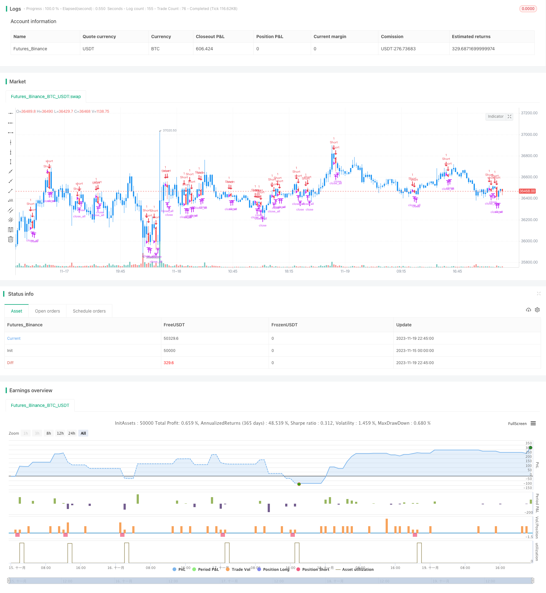

> Name

Bearish-Harami-Reversal-Backtest-Strategy
> Author

ChaoZhang

> Strategy Description



[trans]

## Overview
The Bear Reversal Harami backtesting strategy enables automated trading by identifying Bear Reversal Harami patterns in candlestick charts. When the bear market reversal Harami pattern is recognized, this strategy will enter a short position; when the stop loss or take profit is taken, the position will be closed.
## Strategy Principle
The core identification indicators of this strategy are: the previous K-line is a long positive line, and the closing price of the second K-line is included in the entity of the previous K-line and is a negative line, which may form a bear market reversal Harami pattern. When this pattern is met, the strategy will enter a short position.
The specific judgment logic is:
1. Calculate whether the previous K-line body size ABS (Close1 - Open1) is greater than the set minimum entity size
2. Determine whether the previous K line is a positive line Close1 > Open1
3. Determine whether the current K line is a negative line Open > Close
4. Determine whether the opening price of the current K line is less than or equal to the closing price of the previous K line Open <= Close1
5. Determine whether the opening price of the previous K line is less than or equal to the closing price of the current K line Open1 <= Close
6. Determine whether the current K-line entity is smaller than the previous K-line Open - Close < Close1 - Open1
7. If the above conditions are met, a bear market reversal will occur and a short position will be entered.
## Advantage Analysis
This strategy has the following advantages:
1. Use the bear market reversal Harami’s strong reversal signal to increase the probability of profit
2. Sufficient backtest data and excellent simulated trading results
3. The strategy logic is simple and clear, easy to understand and optimize
4. Customizable stop-profit and stop-loss points to control risks
## Risk Analysis
There are also some risks with this strategy:
1. There may be a false breakthrough in the market, causing positions to be trapped. The stop loss point can be appropriately relaxed or filtering conditions can be added.
2. The price of the underlying security may fluctuate too much, making it impossible to stop losses. Trading varieties with lower volatility should be chosen. 
3. Insufficient backtest data may not reflect the real market conditions. The amount of backtest data should be increased and real-time verification should be done.
## Optimization direction
This strategy can also be optimized from the following aspects:
1. Add Volume, MACD and other indicator filters to improve signal quality
2. Optimize the stop-profit and stop-loss strategy and dynamically adjust the points
3. Improve the efficiency of position holdings, combine trends and other factors, and reduce invalid transactions
4. Try different trading varieties and choose the one with a more suitable volatility
## Summary
The overall logic of the bear market reversal Harami backtest strategy is clear, easy to understand and optimize, and the backtest results are good. Risks are controllable and there is room for firm adjustment. Overall, the trading signals formed by this strategy are relatively reliable and worthy of further verification and optimization.
||

## Overview
The Bearish Harami Reversal Backtest Strategy identifies bearish Harami reversal patterns in candlestick charts and automatically trades them. It goes short when detecting a bearish Harami pattern and closes the position when the stop loss or take profit is triggered.

## Strategy Logic
The core pattern recognition indicator of this strategy is: the close of the first candle is a long bullish candle and the second candle's close is inside the first candle's body, forming a bearish candle. This indicates a potential Bearish Harami reversal pattern. When this pattern forms, the strategy goes short. 

The specific logic is:

1. Calculate if the body size of the first candle ABS(Close1 - Open1) is greater than the set minimum body size
2. Check if the first candle is bullish Close1 > Open1  
3. Check if the current candle is bearish Open > Close
4. Check if current candle's open is less than or equal to previous close Open <= Close1
5. Check if previous candle's open is less than or equal to current candle's close Open1 <= Close
6. Check if current candle's body is less than previous body Open - Close < Close1 - Open1
7. If all conditions pass, a Bearish Harami has formed and the strategy goes short.

## Advantage Analysis 
The advantages of this strategy are:

1. Utilizes the strong bearish reversal signal of Harami for higher profit probability
2. Extensive backtest data results are positive
3. Simple clear logic that is easy to understand and optimize  
4. Customizable stop loss and take profit for risk control

## Risk Analysis
There are also some risks:

1. Market may have false breakouts leading to losing positions. Can widen stop loss or add filters.
2. High volatility may trigger stop loss prematurely. Should choose lower volatility products.  
3. Insufficient backtest data may not reflect real market conditions. Should increase test data size and verify in live trading.

## Optimization Directions
The strategy can be further optimized in the following areas:

1. Add Volume, MACD and other filters to improve signal quality
2. Optimize stop loss and take profit strategies, adjust levels dynamically
3. Increase position holding efficiency, combine with trend and other factors to reduce ineffective trades  
4. Test different trading products to find lower volatility alternatives 

## Conclusion
The Bearish Harami Reversal Backtest Strategy has clear, easy to understand logic, good backtest results and controllable risks. It has room for live trading adjustments and optimizations. Overall the trading signals are reliable and worth further optimizations and verification in live trading.  

[/trans]

> Strategy Arguments


|Argument|Default|Description|
|----|----|----|
|v_input_1|20|Take Profit pip|
|v_input_2|10|Stop Loss pip|
|v_input_3|3|Min. Size Body pip|


> Source (PineScript)

``` pinescript
/*backtest
start: 2023-11-15 00:00:00
end: 2023-11-19 23:00:00
period: 15m
basePeriod: 5m
exchanges: [{"eid":"Futures_Binance","currency":"BTC_USDT"}]
*/

//@version=3
////////////////////////////////////////////////////////////
//  Copyright by HPotter v1.0 16/01/2019 
//    This is a bearish reversal pattern formed by two candlesticks in which a short 
//    real body is contained within the prior session's long real body. Usually the 
//    second real body is the opposite color of the first real body. The Harami pattern 
//    is the reverse of the Engulfing pattern. 
//
// WARNING:
// - For purpose educate only
// - This script to change bars colors.
////////////////////////////////////////////////////////////
strategy(title = "Bearish Harami Backtest", overlay = true)
input_takeprofit = input(20, title="Take Profit pip")
input_stoploss = input(10, title="Stop Loss pip")
input_minsizebody = input(3, title="Min. Size Body pip")
barcolor(abs(close- open) >= input_minsizebody ? close[1] > open[1] ? open > close ? open <= close[1] ? open[1] <= close ? open - close < close[1] - open[1] ? yellow :na :na : na : na : na : na)
pos = 0.0
barcolor(nz(pos[1], 0) == -1 ? red: nz(pos[1], 0) == 1 ? green : blue )
posprice = 0.0
posprice := abs( close - open) >= input_minsizebody? close[1] > open[1] ? open > close ? open <= close[1] ? open[1] <= close ? open - close < close[1] - open[1] ? close :nz(posprice[1], 0) :nz(posprice[1], 0) : nz(posprice[1], 0) : nz(posprice[1], 0) : nz(posprice[1], 0): nz(posprice[1], 0)
pos := iff(posprice > 0, -1, 0)
if (pos == 0) 
    strategy.close_all()
if (pos == -1)
    strategy.entry("Short", strategy.short)
posprice := iff(low <= posprice - input_takeprofit and posprice > 0, 0 ,  nz(posprice, 0))
posprice := iff(high >= posprice + input_stoploss and posprice > 0, 0 ,  nz(posprice, 0))

```

> Detail

https://www.fmz.com/strategy/432977

> Last Modified

2023-11-23 11:47:10
