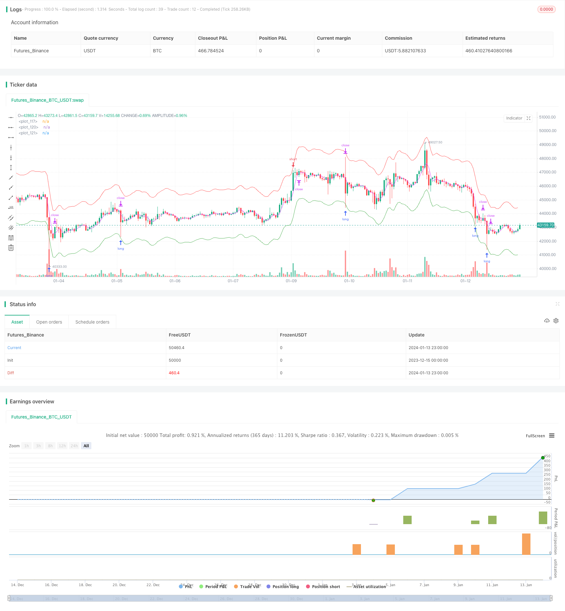

> Name

Bidirectional-Moving-Average-Reversion-Trading-Strategy
> Author

ChaoZhang

> Strategy Description


 [trans]

## Overview
Bidirectional Moving Average Reversion Trading Strategy (Bidirectional Moving Average Reversion Trading Strategy) is a quantitative trading strategy constructed using the principle of price average reversion. This strategy captures price reversal opportunities by setting multiple sets of moving averages, enters the market after the price deviates from the moving average by a certain extent, and waits for the price to return to the moving average to close the arbitrage.
## Strategy Principle
This strategy is mainly based on the price average reversion theory. It believes that prices always fluctuate around an average value, and when prices deviate significantly from the average value, they are more likely to return to the mean. Specifically, this strategy sets three sets of moving averages at the same time: opening moving average, closing moving average and limit moving average. When the price touches the opening moving average, the corresponding long or short position will be opened. When the price reaches the closing moving average, the previous position will be closed. Finally, if the price continues to run without regression, the limit moving average can control losses.
From the code logic point of view, the opening moving average is divided into long line and short line, which are composed of long line and short line respectively. How far they deviate from the price determines the position size. In addition, the closing moving average is a separate moving average used to determine the timing of closing positions. When the price moves to this moving average, the position will be closed.
## Advantage Analysis
The advantages of the two-way moving average regression strategy are mainly reflected in:
1. Capture price reversal, suitable for trend consolidation market
2. Control risks by limiting losses
3. Customizable parameter combinations, strong adaptability
4. Easy to understand and facilitate parameter optimization
This strategy is suitable for varieties with low volatility and small price fluctuation range, especially those entering the consolidation stage. It can effectively capture the opportunity of temporary price reversal. At the same time, its risk control measures are also relatively complete, and losses can be controlled within a certain range even if the price does not return.
## Risk Analysis
The two-way moving average reversion strategy also has some risks:
1. The risk of chasing the rise and killing the fall. When the price experiences a violent trend, this strategy may continuously open positions and eventually liquidate the position.
2. Risk of excessive price fluctuations. If the price fluctuation range is too large, the position may reach the limit loss and be forced to close.
3. Parameter optimization risks. The parameter setting of this strategy has an important impact on its profitability. If the parameters are set improperly, the profit probability will be greatly reduced.
In view of the above risks, optimization can be carried out from the following aspects:
1. Increase the limit on opening positions to avoid opening positions too frequently
2. Reduce the position size appropriately to prevent the risk of liquidation
3. Optimize the settings of moving average period, closing line parameters, etc.
## Optimization direction
This strategy also has a lot of room for optimization, which can be mainly carried out from the following perspectives:
1. Add the logic of opening conditions to prevent chasing the rise and killing the fall under the trend market.
2. Add position reduction logic to prevent risks caused by sharp price fluctuations
3. Try different types of moving average indicators to find better parameter combinations
4. Use machine learning methods to automatically optimize parameters
5. Add automatic stop loss strategy to better control risks
## Summarize
The two-way moving average reversion trading strategy makes profits by capturing the reversion opportunities after the price deviates from the moving average. It effectively controls risks and can obtain better returns through parameter optimization. Although there are some risks in this strategy, they can be controlled by improving the position opening logic and reducing the position size. This strategy is simple and easy to understand and deserves further research and optimization by quantitative traders.
||

## Overview

The Bidirectional Moving Average Reversion Trading Strategy is a quantitative trading strategy built on the theory of price mean reversion. This strategy captures price reversal opportunities by setting up multiple moving averages and entering the market when the price deviates significantly from the moving averages, and exiting when it reverts back.  

## Strategy Logic

The core idea of this strategy is price mean reversion, which suggests that prices tend to fluctuate around an average value, and have a higher chance of reverting back when they deviate too far from the average. Specifically, this strategy sets up three groups of moving averages: entry moving averages, exit moving averages, and stop-loss moving averages. It will open corresponding long or short positions when prices hit the entry moving averages; close positions when prices hit the exit moving averages; and control losses with stop-loss moving averages in case prices continue to trend without reverting back.  

From the code logic perspective, there are two entry moving averages - long and short - consisting of fast and slow moving averages respectively. The deviation between them and the price determines the position size. In addition, the exit moving average is a separate moving average that signals when to close the positions. When prices hit this line, existing positions will be flattened.

## Advantage Analysis  

The main advantages of the bidirectional moving average reversion strategy include:

1. Capturing price reversals, suitable for range-bound markets
2. Controlling risks through stop losses
3. Highly customizable parameters for adaptability  
4. Easy to understand, convenient for parameter optimization

This strategy works well with low volatility instruments that have relatively small price swings, especially when entering range-bound cycles. It can effectively capture opportunities from temporary price reversals. Meanwhile, the risk control measures are quite comprehensive, capping losses within reasonable ranges even if prices do not revert back.  

## Risk Analysis

There are also some risks associated with this strategy:

1. Chasing trends risk. Consecutive new positions may lead to liquidation during strong trending moves. 
2. Excessive price swings risk. Stop losses could be hit by increased volatility.
3. Parameter optimization risk. Inappropriate parameter settings may lead to significant underperformance.  

Some ways to mitigate the above risks include: 

1. Limiting new entries to avoid overtrading
2. Reducing position sizes to limit liquidation risks 
3. Optimizing parameters like moving average periods and exit line multipliers  

## Optimization Directions

There is also ample room to further optimize this strategy:

1. Add additional entry logic to prevent trend chasing 
2. Incorporate adaptive position sizing against volatility
3. Experiment with different types of moving averages  
4. Machine learning for automated parameter optimization
5. Incorporate trailing stops for more dynamic risk management  

## Conclusion

The bidirectional moving average reversion trading strategy aims to profit from price reversals after significant deviations from its moving average levels. With proper risk control measures, it can achieve consistent profits through parameter tuning. While risks like chasing trends and excessive volatility still exist, they can be addressed through improving entry logic, reducing position sizes and more. This easy-to-understand strategy deserves further research and optimization from quantitative traders.

[/trans]

> Strategy Arguments


|Argument|Default|Description|
|----|----|----|
|v_input_2|true|long1on|
|v_input_float_1|0.96|Long|
|v_input_int_4|10|Lot 1|
|v_input_3|true|short1on|
|v_input_float_2|1.04|short|
|v_input_int_6|10|Lot 1|
|v_input_4|timestamp(01 Jan 2010 00:00 +0000)|Start date|
|v_input_5|timestamp(31 Dec 2030 23:59 +0000)|Final date|
|v_input_1|false|(?Options)Entry on close|
|v_input_int_1|false|| Offset View|
|v_input_int_2|false|Trade|
|v_input_bool_1|false|Use Kalman filter|
|v_input_string_1|0|(?MA Opening Long)maopeningtyp_l: SMA|EMA|TEMA|DEMA|ZLEMA|WMA|Hma|Thma|Ehma|H|L|DMA|
|v_input_source_1_ohlc4|0|maopeningsrc_l: ohlc4|high|low|open|hl2|hlc3|hlcc4|close|
|v_input_int_3|3|maopeninglen_l|
|v_input_string_2|0|(?MA Opening Short)maopeningtyp_s: SMA|EMA|TEMA|DEMA|ZLEMA|WMA|Hma|Thma|Ehma|H|L|DMA|
|v_input_source_2_ohlc4|0|maopeningsrc_s: ohlc4|high|low|open|hl2|hlc3|hlcc4|close|
|v_input_int_5|3|maopeninglen_s|
|v_input_string_3|0|(?MA Closing)maclosingtyp: SMA|EMA|TEMA|DEMA|ZLEMA|WMA|Hma|Thma|Ehma|H|L|DMA|
|v_input_source_3_ohlc4|0|maclosingsrc: ohlc4|high|low|open|hl2|hlc3|hlcc4|close|
|v_input_int_7|3|maclosinglen|
|v_input_float_3|true|mul|


> Source (PineScript)

``` pinescript
/*backtest
start: 2023-12-15 00:00:00
end: 2024-01-14 00:00:00
period: 1h
basePeriod: 15m
exchanges: [{"eid":"Futures_Binance","currency":"BTC_USDT"}]
*/

//@version=5
strategy(title = "hamster-bot MRS 2", overlay = true, default_qty_type = strategy.percent_of_equity, initial_capital = 100, default_qty_value = 30, pyramiding = 1, commission_value = 0.1, backtest_fill_limits_assumption = 1)
info_options = "Options"

on_close = input(false, title = "Entry on close", inline=info_options, group=info_options)
OFFS = input.int(0, minval = 0, maxval = 1, title = "| Offset View", inline=info_options, group=info_options)
trade_offset = input.int(0, minval = 0, maxval = 1, title = "Trade", inline=info_options, group=info_options)
use_kalman_filter = input.bool(false, title="Use Kalman filter", group=info_options)

//MA Opening
info_opening = "MA Opening Long"
maopeningtyp_l = input.string("SMA", title="Type", options=["SMA", "EMA", "TEMA", "DEMA", "ZLEMA", "WMA", "Hma", "Thma", "Ehma", "H", "L", "DMA"], title = "", inline=info_opening, group=info_opening)
maopeningsrc_l = input.source(ohlc4, title = "", inline=info_opening, group=info_opening)
maopeninglen_l = input.int(3, minval = 1, title = "", inline=info_opening, group=info_opening)
long1on    = input(true, title = "", inline = "long1")
long1shift = input.float(0.96, step = 0.005, title = "Long", inline = "long1")
long1lot   = input.int(10, minval = 0, maxval = 10000, step = 10, title = "Lot 1", inline = "long1")

info_opening_s = "MA Opening Short"
maopeningtyp_s = input.string("SMA", title="Type", options=["SMA", "EMA", "TEMA", "DEMA", "ZLEMA", "WMA", "Hma", "Thma", "Ehma", "H", "L", "DMA"], title = "", inline=info_opening_s, group=info_opening_s)
maopeningsrc_s = input.source(ohlc4, title = "", inline=info_opening_s, group=info_opening_s)
maopeninglen_s = input.int(3, minval = 1, title = "", inline=info_opening_s, group=info_opening_s)
short1on    = input(true, title = "", inline = "short1")
short1shift = input.float(1.04, step = 0.005, title = "short", inline = "short1")
short1lot   = input.int(10, minval = 0, maxval = 10000, step = 10, title = "Lot 1", inline = "short1")


//MA Closing
info_closing = "MA Closing"
maclosingtyp = input.string("SMA", title="Type", options=["SMA", "EMA", "TEMA", "DEMA", "ZLEMA", "WMA", "Hma", "Thma", "Ehma", "H", "L", "DMA"], title = "", inline=info_closing, group=info_closing)
maclosingsrc = input.source(ohlc4, title = "", inline=info_closing, group=info_closing)
maclosinglen = input.int(3, minval = 1, maxval = 200, title = "", inline=info_closing, group=info_closing)
maclosingmul = input.float(1, step = 0.005, title = "mul", inline=info_closing, group=info_closing)

startTime = input(timestamp("01 Jan 2010 00:00 +0000"), "Start date", inline = "period")
finalTime = input(timestamp("31 Dec 2030 23:59 +0000"), "Final date", inline = "period")

HMA(_src, _length) =>  ta.wma(2 * ta.wma(_src, _length / 2) - ta.wma(_src, _length), math.round(math.sqrt(_length)))
EHMA(_src, _length) =>  ta.ema(2 * ta.ema(_src, _length / 2) - ta.ema(_src, _length), math.round(math.sqrt(_length)))
THMA(_src, _length) =>  ta.wma(ta.wma(_src,_length / 3) * 3 - ta.wma(_src, _length / 2) - ta.wma(_src, _length), _length)
tema(sec, length)=>
    tema1= ta.ema(sec, length)
    tema2= ta.ema(tema1, length)
    tema3= ta.ema(tema2, length)
    tema_r = 3*tema1-3*tema2+tema3
donchian(len) => math.avg(ta.lowest(len), ta.highest(len))
ATR_func(_src, _len)=>
    atrLow = low - ta.atr(_len)
    trailAtrLow = atrLow
    trailAtrLow := na(trailAtrLow[1]) ? trailAtrLow : atrLow >= trailAtrLow[1] ? atrLow : trailAtrLow[1]
    supportHit = _src <= trailAtrLow
    trailAtrLow := supportHit ? atrLow : trailAtrLow
    trailAtrLow
f_dema(src, len)=>
    EMA1 = ta.ema(src, len)
    EMA2 = ta.ema(EMA1, len)
    DEMA = (2*EMA1)-EMA2
f_zlema(src, period) =>
    lag = math.round((period - 1) / 2)
    ema_data = src + (src - src[lag])
    zl= ta.ema(ema_data, period)
f_kalman_filter(src) =>
    float value1= na
    float value2 = na
    value1 := 0.2 * (src - src[1]) + 0.8 * nz(value1[1])
    value2 := 0.1 * (ta.tr) + 0.8 * nz(value2[1])
    lambda = math.abs(value1 / value2)
    alpha = (-math.pow(lambda, 2) + math.sqrt(math.pow(lambda, 4) + 16 * math.pow(lambda, 2)))/8
    value3 = float(na)
    value3 := alpha * src + (1 - alpha) * nz(value3[1])
//SWITCH
ma_func(modeSwitch, src, len, use_k_f=true) =>
      modeSwitch == "SMA"   ? use_kalman_filter and use_k_f ? f_kalman_filter(ta.sma(src, len))  : ta.sma(src, len) :
      modeSwitch == "RMA"   ? use_kalman_filter and use_k_f ? f_kalman_filter(ta.rma(src, len))  : ta.rma(src, len) :
      modeSwitch == "EMA"   ? use_kalman_filter and use_k_f ? f_kalman_filter(ta.ema(src, len))  : ta.ema(src, len) :
      modeSwitch == "TEMA"  ? use_kalman_filter and use_k_f ? f_kalman_filter(tema(src, len))    : tema(src, len):
      modeSwitch == "DEMA"  ? use_kalman_filter and use_k_f ? f_kalman_filter(f_dema(src, len))  : f_dema(src, len):
      modeSwitch == "ZLEMA" ? use_kalman_filter and use_k_f ? f_kalman_filter(f_zlema(src, len)) : f_zlema(src, len):
      modeSwitch == "WMA"   ? use_kalman_filter and use_k_f ? f_kalman_filter(ta.wma(src, len))  : ta.wma(src, len):
      modeSwitch == "VWMA"  ? use_kalman_filter and use_k_f ? f_kalman_filter(ta.vwma(src, len)) : ta.vwma(src, len):
      modeSwitch == "Hma"   ? use_kalman_filter and use_k_f ? f_kalman_filter(HMA(src, len))     : HMA(src, len):
      modeSwitch == "Ehma"  ? use_kalman_filter and use_k_f ? f_kalman_filter(EHMA(src, len))    : EHMA(src, len):
      modeSwitch == "Thma"  ? use_kalman_filter and use_k_f ? f_kalman_filter(THMA(src, len/2))  : THMA(src, len/2):
      modeSwitch == "ATR"   ? use_kalman_filter and use_k_f ? f_kalman_filter(ATR_func(src, len)): ATR_func(src, len) :
      modeSwitch == "L"   ? use_kalman_filter and use_k_f ? f_kalman_filter(ta.lowest(len)): ta.lowest(len) :
      modeSwitch == "H"   ? use_kalman_filter and use_k_f ? f_kalman_filter(ta.highest(len)): ta.highest(len) :
      modeSwitch == "DMA"   ? donchian(len) : na

//Var
sum = 0.0
maopening_l = 0.0
maopening_s = 0.0
maclosing = 0.0
pos = strategy.position_size
p = 0.0
p := pos == 0 ? (strategy.equity / 100) / close : p[1]
truetime = true
loss = 0.0
maxloss = 0.0
equity = 0.0

//MA Opening
maopening_l := ma_func(maopeningtyp_l, maopeningsrc_l, maopeninglen_l)
maopening_s := ma_func(maopeningtyp_s, maopeningsrc_s, maopeninglen_s)

//MA Closing
maclosing := ma_func(maclosingtyp, maclosingsrc, maclosinglen) * maclosingmul

long1 = long1on == false ? 0 : long1shift == 0 ? 0 : long1lot == 0 ? 0 : maopening_l == 0 ? 0 : maopening_l * long1shift
short1 = short1on == false ? 0 : short1shift == 0 ? 0 : short1lot == 0 ? 0 : maopening_s == 0 ? 0 : maopening_s * short1shift
//Colors
long1col = long1 == 0 ? na : color.green
short1col = short1 == 0 ? na : color.red
//Lines
// plot(maopening_l, offset = OFFS, color = color.new(color.green, 50))
// plot(maopening_s, offset = OFFS, color = color.new(color.red, 50))
plot(maclosing, offset = OFFS, color = color.fuchsia)
long1line = long1 == 0 ? close : long1
short1line = short1 == 0 ? close : short1
plot(long1line, offset = OFFS, color = long1col)
plot(short1line, offset = OFFS, color = short1col)

//Lots
lotlong1 = p * long1lot
lotshort1 = p * short1lot

//Entry
if truetime
    //Long
    sum := 0
    strategy.entry("L", strategy.long, lotlong1, limit = on_close ? na : long1, when = long1 > 0 and pos <= sum and (on_close ? close <= long1[trade_offset] : true))
    sum := lotlong1

    //Short
    sum := 0
    pos := -1 * pos
    strategy.entry("S", strategy.short, lotshort1, limit = on_close ? na : short1, when = short1 > 0 and pos <= sum and (on_close ? close >= short1[trade_offset] : true))
    sum := lotshort1

strategy.exit("Exit", na, limit = maclosing)
if time > finalTime
    strategy.close_all()
```

> Detail

https://www.fmz.com/strategy/438778

> Last Modified

2024-01-15 12:15:14
