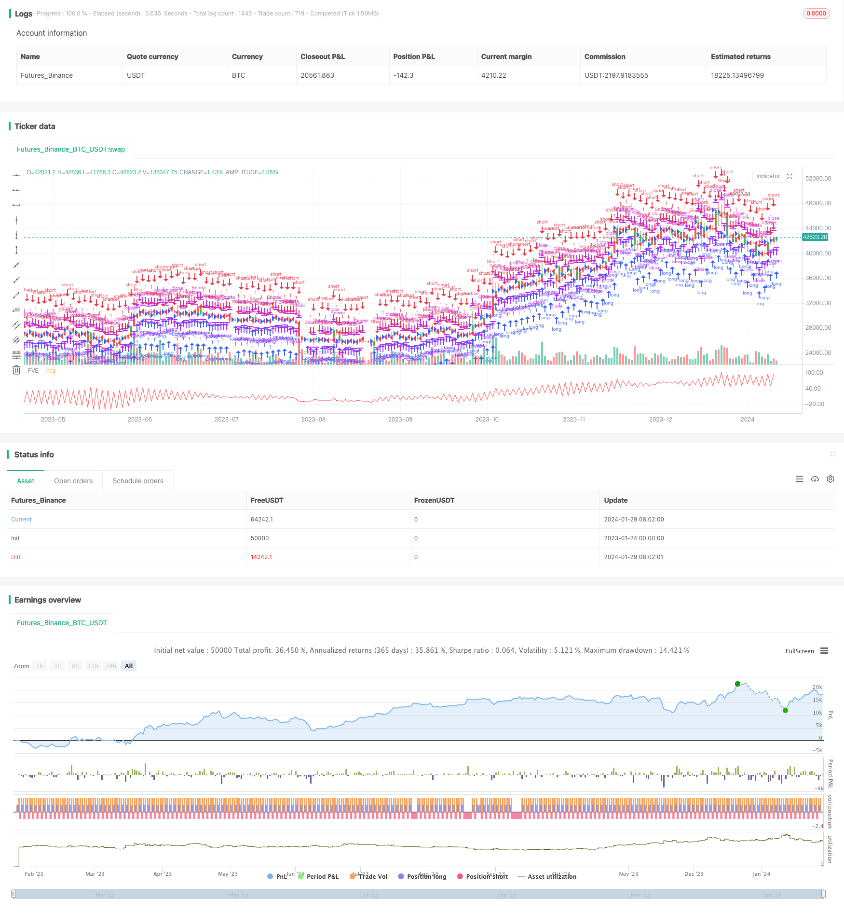

> Name

Bilateral-Three-Point-Moving-Average-Quantitative-Trading-Strategy
> Author

ChaoZhang

> Strategy Description


 [trans]

### Overview
This strategy is based on the bilateral three-point shifting moving average indicator, and realizes the function of judging price trends and issuing trading signals by calculating the average of the highest price, lowest price and closing price in the last N periods. This strategy is suitable for short- and medium-term transactions, and can effectively filter market noise and capture price trends.
### Strategy Principles
The core indicator of this strategy is the bilateral three-point moving average (XHL2, XHLC3). Among them, XHL2 calculates the average of the highest price and lowest price in the recent N periods. XHLC3 calculates the average of the highest price, lowest price and closing price in the last N periods. These two indicators can effectively smooth price data and filter out the impact of short-term fluctuations.
The strategy determines the price trend by calculating the difference nMF between XHL2, XHLC3 and the closing price. When nMF is greater than a factor, it is judged that the price is in an upward trend; when nMF is less than a negative factor, it is judged that the price is in a downward trend. Combined with the trading volume, the indicator nRES is calculated. When it is greater than 0, it indicates a buy signal, and when it is less than 0, it indicates a sell signal. Determine the trend direction and generate trading signals based on the positive, negative and size relationship of nRES.
### Advantage Analysis
The advantages of this strategy are:
1. Using the bilateral three-point moving average indicator, you can effectively filter market noise and determine the mid- and long-term price trends;
2. Combined with changes in trading volume, the flow of funds can be judged more accurately and trading signals can be issued;
3. The strategy has fewer parameters and the method is simple, easy to understand and easy to implement;
4. The position direction can be flexibly set, suitable for different types of investors.
### Risk Analysis
The main risks of this strategy are:
1. Improper parameter settings may lead to incorrect trading signals;
2. During long-term strong market conditions, the strategy may produce too many false trading signals;
3. When the market fluctuates violently, setting a stop loss that is too small may increase the risk of loss.
Corresponding solutions:
1. Optimize parameters and determine the best parameters based on backtesting;
2. Judge the reliability of signals based on trends and support and resistance;
3. Appropriately relax the stop loss range and control single losses.
### Optimization direction
Optimization direction of this strategy:
1. Optimize the moving average parameters and trading volume parameters to improve the sensitivity of the indicator;
2. Add trend judgment indicators to improve the accuracy of trading signals;
3. Add stop-loss strategies to reduce the risk of loss;
4. Combined with machine learning methods to achieve automatic optimization of parameters.
### Summarize
This strategy is based on the design of a bilateral three-point moving average indicator, which determines the medium and long-term trend direction of prices, uses changes in trading volume to confirm the inflow and outflow of funds, and ultimately generates buy and sell trading signals. The strategy optimization space is large and can be improved from multiple dimensions to adapt to a more complex market environment.
||

### Overview

This strategy is based on the bilateral three-point moving average indicator. By calculating the mean value of the highest price, lowest price and closing price of the most recent N periods, it realizes the function of judging price trends and generating trading signals. This strategy is suitable for medium and short term trading, and can effectively filter market noise and capture price trends.

### Strategy Principle

The core indicator of this strategy is the bilateral three-point moving average (XHL2, XHLC3). XHL2 calculates the mean value of the highest price and lowest price of the most recent N periods. XHLC3 calculates the mean value of the highest price, lowest price and closing price of the most recent N periods. These two indicators can effectively smooth price data and filter out the impact of short-term fluctuations.  

The strategy judges the price trend by calculating the difference nMF between XHL2, XHLC3 and the closing price. When nMF is greater than a factor, it is judged that the price is in an upward trend; when nMF is less than a negative factor, it is judged that the price is in a downward trend. Combined with trading volume, the indicator nRES is calculated. nRES greater than 0 indicates a buy signal, and less than 0 indicates a sell signal. Trend direction and trading signals are determined based on the positive/negative sign and magnitude relationship of nRES.

### Advantage Analysis  

The advantages of this strategy are:  

1. Using the bilateral three-point moving average indicator can effectively filter market noise and judge medium and long term price trends;  

2. Combining changes in trading volume can more accurately determine the direction of capital flow and issue trading signals;

3. The strategy has few parameters, simple and easy to understand methods, and is easy to implement;  

4. Flexible setting of holding direction, suitable for different types of investors.  

### Risk Analysis

The main risks of this strategy are:

1. Improper parameter settings may cause erroneous trading signals;  

2. In a long-term strong trending market, the strategy may generate too many false trading signals; 

3. In a volatile market, excessively small stop loss settings may increase the risk of loss.

Solutions:  

1. Optimize parameters and determine the best parameters based on backtesting;

2. Judge the reliability of signals in combination with trends and support/resistance;   

3. Appropriately relax the stop loss range to control single loss.  

### Optimization Directions  

The optimization directions of this strategy:  

1. Optimize the moving average parameters and trading volume parameters to improve the sensitivity of the indicator;

2. Add trend judgment indicators to improve the accuracy of trading signals;  

3. Add stop loss strategies to reduce risk of loss;  

4. Combine machine learning methods to achieve automatic parameter optimization.  

### Summary  

This strategy is designed based on the bilateral three-point moving average indicator to determine the medium and long term trend direction of prices. It uses changes in trading volume to confirm capital inflows and outflows, and finally generates buy and sell trading signals. The strategy has large room for optimization and can be improved in multiple dimensions to adapt to more complex market environments.
[/trans]

> Strategy Arguments


|Argument|Default|Description|
|----|----|----|
|v_input_1|22|Period|
|v_input_2|0.3|Factor|
|v_input_3|false|Trade reverse|


> Source (PineScript)

``` pinescript
/*backtest
start: 2023-01-24 00:00:00
end: 2024-01-30 00:00:00
period: 1d
basePeriod: 1h
exchanges: [{"eid":"Futures_Binance","currency":"BTC_USDT"}]
*/

//@version=2
////////////////////////////////////////////////////////////
//  Copyright by HPotter v1.0 25/06/2018
// The FVE is a pure volume indicator. Unlike most of the other indicators 
// (except OBV), price change doesn?t come into the equation for the FVE (price 
// is not multiplied by volume), but is only used to determine whether money is 
// flowing in or out of the stock. This is contrary to the current trend in the 
// design of modern money flow indicators. The author decided against a price-volume 
// indicator for the following reasons:
// - A pure volume indicator has more power to contradict.
// - The number of buyers or sellers (which is assessed by volume) will be the same, 
//     regardless of the price fluctuation.
// - Price-volume indicators tend to spike excessively at breakouts or breakdowns.
//
// You can change long to short in the Input Settings
// WARNING:
// - For purpose educate only
// - This script to change bars colors.
////////////////////////////////////////////////////////////
strategy(title="Finite Volume Elements (FVE) Backtest", shorttitle="FVE")
Period = input(22, minval=1)
Factor = input(0.3, maxval=1)
reverse = input(false, title="Trade reverse")
xhl2 = hl2
xhlc3 = hlc3
xClose = close
xVolume = volume
xSMAV = sma(xVolume, Period)
nMF = xClose - xhl2 + xhlc3 - xhlc3[1]
nVlm = iff(nMF > Factor * xClose / 100,  xVolume, 
         iff(nMF < -Factor * xClose / 100, -xVolume, 0))
nRes = nz(nRes[1],0) + ((nVlm / xSMAV) / Period) * 100
pos = iff(nRes > nRes[1] and nRes > nRes[2], 1,
         iff(nRes < nRes[1] and nRes < nRes[2], -1, nz(pos[1], 0))) 
possig = iff(reverse and pos == 1, -1,
          iff(reverse and pos == -1, 1, pos))	   
if (possig == 1) 
    strategy.entry("Long", strategy.long)
if (possig == -1)
    strategy.entry("Short", strategy.short)	   	    
barcolor(possig == -1 ? red: possig == 1 ? green : blue ) 
plot(nRes, color=red, title="FVE")
```

> Detail

https://www.fmz.com/strategy/440552

> Last Modified

2024-01-31 16:11:41
