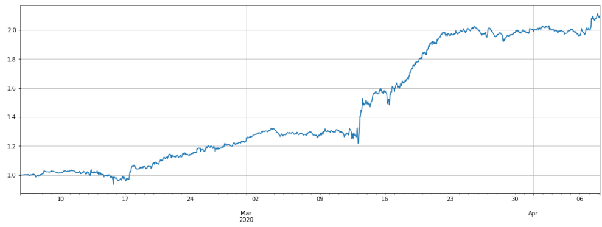
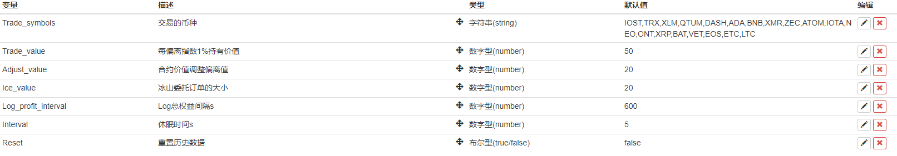

> Name

Binance Strategy 2 Removes High and Low Scores
> Author

District class quantification
> Strategy Description

Thanks to FMZ for disclosing the strategy, and thanks to the guards for their support!
I made two modifications:
1. Because many friends default to 10x and 20x leverage, and this strategy is a full position mode. If the position of one coin is liquidated, the group will be wiped out. Therefore, a Max_amount is added. The purchase amount of a single currency will not exceed this amount to prevent liquidation.
2. If there are coins in the currency pool that are over-priced, over-priced, or unique, it will easily drag everyone down, and the overall strategy will easily fail. Therefore, when I calculate the index, I remove one of the highest scores and one of the lowest scores, and the resulting index is fairer.
   When the special currency returns to normal, you can still buy it normally.
Note: Due to limited conditions, this strategy has not been back-tested and is for reference only. We are not responsible for any losses!
## **Important content! ! **
- Be sure to read this study https://www.fmz.com/digest-topic/5294 first. Understand the strategy principles, risks, how to screen trading pairs, how to set parameters, the ratio of opening positions to total funds, and a series of other issues.
- The previous research report needs to be downloaded and uploaded to your own research environment. Run the actual modifications. If you've seen this report, it was recently updated with data for the latest week.
- **The strategy cannot be backtested directly and needs to be backtested in a research environment**.
- The strategy code and default parameters are for research only. Actual operation requires caution and is at your own risk.
- The code is public and can be modified by yourself. If you have any questions, please leave comments and feedback. It is best to join the inventor Binance exchange group (the method of joining is in the research report)
- The strategy needs to run in cross position mode. **The strategy supports Binance. When creating the robot, just use the default trading pair and K-line cycle. The strategy does not use K-line**
## Strategy Principle
We will short the currency whose price is higher than the altcoin-Bitcoin price index and long the currency whose price is lower than the index. The greater the deviation, the larger the position. (This strategy has no hedging, and BTC can also be added to the trading pair). Performance in the past two months (about 3 times leverage, data updated to 4.8):
 
## Strategy logic
1. Update market conditions and account positions. The initial price will be recorded during the first run (newly added currencies are calculated based on the time of addition)
2. Update the index. The index is Altcoin-Bitcoin price index = mean(sum((Altcoin price/Bitcoin price)/(Altcoin initial price/Bitcoin initial price)))
3. Determine long and short positions based on the deviation index, and determine positions based on the size of the deviation.
4. Place an order. The order quantity is determined by Bingshan Commission, and the transaction is completed according to the opponent's price (buy at the same price as the sell). **Cancel the order immediately after placing it (so you will see many orders with failed cancellation, which is normal)**
5. Cycle again

## Strategy parameters
  

- Trade_symbols: The currency for trading, you need to filter it yourself according to the research platform, you can also add BTC
- Trade_value: The value of short selling altcoins needs to be determined based on the total funds invested. You can check the size of the leverage through backtesting in the research environment.
- Adjust_value: The contract value (priced in USDT) adjusts the deviation value. If it is too large, the adjustment will be slower. It cannot be lower than 20, otherwise the minimum transaction will not be reached.
- Ice_value: Iceberg commission value, which cannot be less than 20. When placing an order, choose the smaller one of Adjust_value/Ice_value.
- Reset: reset historical data

## Strategy Risk
Note that if a certain currency goes out of independent market, for example, it rises several times compared to the index, a large number of short positions will be accumulated on the currency. The same sharp decline will also cause the strategy to go long in large quantities. You can limit the opening amount or stop loss and no longer trade.


> Strategy Arguments


|Argument|Default|Description|
|----|----|----|
|Trade_symbols|IOST,TRX,XLM,QTUM,DASH,ADA,XMR,ZEC,ATOM,IOTA,NEO,ONT,XRP,VET,EOS,ETC,LTC|Trading currencies|
|Trade_value|50|Holding value for every 1% deviation from the index|
|Adjust_value|20|Contract value adjustment deviation value|
|Ice_value|20|Size of iceberg order|
|Log_profit_interval|600|Log total equity interval s|
|Interval|5|Sleep time s|
|Reset|false|Reset historical data|
|Max_amount|300|Maximum trading volume, no buying if it exceeds|

> Source (javascript)

``` javascript
//向上偏离最大的币的索引
var highIndex=0;
//向下偏离最大的币的索引
var lowIndex=0;

var trade_symbols = Trade_symbols.split(',')
var symbols = trade_symbols
var index = 1 //指数
if(trade_symbols.indexOf('BTC')<0){
    symbols = trade_symbols.concat(['BTC'])
}
var update_profit_time = 0
var assets = {}
var trade_info = {}
var exchange_info = HttpQuery('https://fapi.binance.com/fapi/v1/exchangeInfo')
if(!exchange_info){
    Log('无法连接网络')
    return
}
exchange_info = JSON.parse(exchange_info)
for (var i=0; i<exchange_info.symbols.length; i++){
    if(symbols.indexOf(exchange_info.symbols[i].baseAsset) > -1){
       assets[exchange_info.symbols[i].baseAsset] = {amount:0, hold_price:0, value:0, bid_price:0, ask_price:0, 
                                                     btc_price:0, btc_change:1,btc_diff:0,
                                                     realised_profit:0, margin:0, unrealised_profit:0}
       trade_info[exchange_info.symbols[i].baseAsset] = {minQty:parseFloat(exchange_info.symbols[i].filters[1].minQty),
                                                         priceSize:parseInt((Math.log10(1.1/parseFloat(exchange_info.symbols[i].filters[0].tickSize)))),
                                                         amountSize:parseInt((Math.log10(1.1/parseFloat(exchange_info.symbols[i].filters[1].stepSize))))
                                                        }
    }
}
assets.USDT = {unrealised_profit:0, margin:0, margin_balance:0, total_balance:0, leverage:0, update_time:0}

function updateAccount(){ //更新账户和持仓
    var account = exchange.GetAccount()
    var pos = exchange.GetPosition()
    if (account == null || pos == null ){
        Log('update account time out')
        return
    }
    assets.USDT.update_time = Date.now()
    for(var i=0; i<trade_symbols.length; i++){
        assets[trade_symbols[i]].margin = 0
        assets[trade_symbols[i]].unrealised_profit = 0
        assets[trade_symbols[i]].hold_price = 0
        assets[trade_symbols[i]].amount = 0
        assets[trade_symbols[i]].unrealised_profit = 0
    } 
    for(var j=0; j<account.Info.positions.length; j++){
        var pair = account.Info.positions[j].symbol 
        var coin = pair.slice(0,pair.length-4)
        if(symbols.indexOf(coin) < 0){continue}
        assets[coin].margin = parseFloat(account.Info.positions[j].initialMargin) + parseFloat(account.Info.positions[j].maintMargin)
        assets[coin].unrealised_profit = parseFloat(account.Info.positions[j].unrealizedProfit)
    }
    assets.USDT.margin = _N(parseFloat(account.Info.totalInitialMargin) + parseFloat(account.Info.totalMaintMargin),2)
    assets.USDT.margin_balance = _N(parseFloat(account.Info.totalMarginBalance),2)
    assets.USDT.total_balance = _N(parseFloat(account.Info.totalWalletBalance),2)
    assets.USDT.unrealised_profit = _N(parseFloat(account.Info.totalUnrealizedProfit),2)
    assets.USDT.leverage = _N(assets.USDT.margin/assets.USDT.total_balance,2)
    
    if(pos.length > 0){
        pos = JSON.parse(exchange.GetRawJSON())
        for(var k=0; k<pos.length; k++){
            var pair = pos[k].symbol
            var coin = pair.slice(0,pair.length-4)
            if(symbols.indexOf(coin) < 0){continue}
            assets[coin].hold_price = parseFloat(pos[k].entryPrice)
            assets[coin].amount = parseFloat(pos[k].positionAmt)
            assets[coin].unrealised_profit = parseFloat(pos[k].unRealizedProfit)
        }
    }
}

function updateIndex(){ //更新指数
    var init_prices = {}
    if(!_G('init_prices') || Reset){
        for(var i=0; i<trade_symbols.length; i++){
            init_prices[trade_symbols[i]] = (assets[trade_symbols[i]].ask_price+assets[trade_symbols[i]].bid_price)/(assets.BTC.ask_price+assets.BTC.bid_price)
        }
        Log('保存启动时的价格')
        _G('init_prices',init_prices)
    }else{
        init_prices = _G('init_prices')
        var temp = 0
        
        highIndex=0;
        lowIndex=0;
        var highChange;var lowChange;
        //本次计算找出最大偏离的高低分
        for(var i=0; i<trade_symbols.length; i++){
            assets[trade_symbols[i]].btc_price =  (assets[trade_symbols[i]].ask_price+assets[trade_symbols[i]].bid_price)/(assets.BTC.ask_price+assets.BTC.bid_price)
            if(!init_prices[trade_symbols[i]]){
                Log('添加新的币种',trade_symbols[i])
                init_prices[trade_symbols[i]] = assets[trade_symbols[i]].btc_price 
                _G('init_prices',init_prices)
            }
            assets[trade_symbols[i]].btc_change = _N(assets[trade_symbols[i]].btc_price/init_prices[trade_symbols[i]],4)
            if(i==0){
                highChange=assets[trade_symbols[i]].btc_change;
                lowChange=assets[trade_symbols[i]].btc_change;
            }
            
            if(highChange<assets[trade_symbols[i]].btc_change){
                highChange=assets[trade_symbols[i]].btc_change;
                highIndex=i;
            }
            if(lowChange>assets[trade_symbols[i]].btc_change){
                lowChange=assets[trade_symbols[i]].btc_change;
                lowIndex=i;
            }
        }
        
        for(var i=0; i<trade_symbols.length; i++){
            assets[trade_symbols[i]].btc_price =  (assets[trade_symbols[i]].ask_price+assets[trade_symbols[i]].bid_price)/(assets.BTC.ask_price+assets.BTC.bid_price)
            assets[trade_symbols[i]].btc_change = _N(assets[trade_symbols[i]].btc_price/init_prices[trade_symbols[i]],4)
            if(i!=lowIndex&&i!=highIndex){ //去掉高低分的影响
                temp += assets[trade_symbols[i]].btc_change
            }
        }
        //因为去掉了最高最低分，所以减2
        index = _N(temp/(trade_symbols.length-2), 4)
    }
    
}

function updateTick(){ //更新行情
    var ticker = HttpQuery('https://fapi.binance.com/fapi/v1/ticker/bookTicker')
    try {
        ticker = JSON.parse(ticker)
    }catch(e){
        Log('get ticker time out')
        return
    }
    for(var i=0; i<ticker.length; i++){
        var pair = ticker[i].symbol 
        var coin = pair.slice(0,pair.length-4)
        if(symbols.indexOf(coin) < 0){continue}
        assets[coin].ask_price = parseFloat(ticker[i].askPrice)
        assets[coin].bid_price = parseFloat(ticker[i].bidPrice)
        assets[coin].ask_value = _N(assets[coin].amount*assets[coin].ask_price, 2)
        assets[coin].bid_value = _N(assets[coin].amount*assets[coin].bid_price, 2)
    }
    updateIndex()
    for(var i=0; i<trade_symbols.length; i++){
        assets[trade_symbols[i]].btc_diff = _N(assets[trade_symbols[i]].btc_change - index, 4)
    }
}

function trade(symbol, dirction, value){ //交易
    if(Date.now()-assets.USDT.update_time > 10*1000){
        Log('更新账户延时，不交易')
        return
    }
    var price = dirction == 'sell' ? assets[symbol].bid_price : assets[symbol].ask_price
    var amount = _N(Math.min(value,Ice_value)/price, trade_info[symbol].amountSize)
    if(amount <= trade_info[symbol].minQty){
        Log(symbol, '合约价值偏离或冰山委托订单的大小设置过小，达不到最小成交, 至少需要: ', _N(trade_info[symbol].minQty*price,0))
        return
    }
    exchange.IO("currency", symbol+'_'+'USDT')
    exchange.SetContractType('swap')
    exchange.SetDirection(dirction)
    var f = dirction == 'buy' ? 'Buy' : 'Sell'
    var id = exchange[f](price, amount, symbol)
    if(id){
        exchange.CancelOrder(id) //订单会立即撤销
    }
}

function updateStatus(){ //状态栏信息
        var table = {type: 'table', title: '交易对信息更新', 
             cols: ['Symbol', 'amount', 'hold_price',  'price', 'diff', 'value', 'margin', 'unrealised_profit'],
             rows: []}
        var infoList;
    for (var i=0; i<symbols.length; i++){
        var price = _N((assets[symbols[i]].ask_price + assets[symbols[i]].bid_price)/2, trade_info[symbols[i]].priceSize)
        var value = _N((assets[symbols[i]].ask_value + assets[symbols[i]].bid_value)/2, 2)
        if(i==lowIndex){
           infoList = [symbols[i]+"Low", assets[symbols[i]].amount, assets[symbols[i]].hold_price, price, assets[symbols[i]].btc_diff, value, _N(assets[symbols[i]].margin,3), _N(assets[symbols[i]].unrealised_profit,3)]    
        }else if(i==highIndex){
           infoList = [symbols[i]+"High", assets[symbols[i]].amount, assets[symbols[i]].hold_price, price, assets[symbols[i]].btc_diff, value, _N(assets[symbols[i]].margin,3), _N(assets[symbols[i]].unrealised_profit,3)]
        }else{
           infoList = [symbols[i], assets[symbols[i]].amount, assets[symbols[i]].hold_price, price, assets[symbols[i]].btc_diff, value, _N(assets[symbols[i]].margin,3), _N(assets[symbols[i]].unrealised_profit,3)]
        }
        table.rows.push(infoList)
    }
    var logString = _D() + '   ' + JSON.stringify(assets.USDT) + ' Index:' + index + '\n'
    LogStatus(logString + '`' + JSON.stringify(table) + '`')
    
    if(Date.now()-update_profit_time > Log_profit_interval*1000){
        LogProfit(_N(assets.USDT.margin_balance,3))
        update_profit_time = Date.now()
    }
    
}

function onTick(){ //策略逻辑部分
    for(var i=0; i<trade_symbols.length; i++){
        var symbol = trade_symbols[i]
        if(assets[symbol].ask_price == 0){ continue }
        var aim_value = -Trade_value * _N(assets[symbol].btc_diff/0.01,1)
        
        if(i!=lowIndex&&i!=highIndex){ //高低分的货币不交易
           if(aim_value - assets[symbol].ask_value > Adjust_value&&assets[symbol].ask_value<Max_amount){
              trade(symbol,'buy', aim_value - assets[symbol].ask_value)
           }
           if(aim_value - assets[symbol].bid_value < -Adjust_value&&assets[symbol].bid_value<Max_amount){
              trade(symbol,'sell', -(aim_value - assets[symbol].bid_value))
           }
        }
    }
}

function main() {
    while(true){
        updateAccount()
        updateTick()
        onTick()
        updateStatus()
        Sleep(Interval*1000)
    }
}
```

> Detail

https://www.fmz.com/strategy/196445

> Last Modified

2020-04-09 21:51:18
