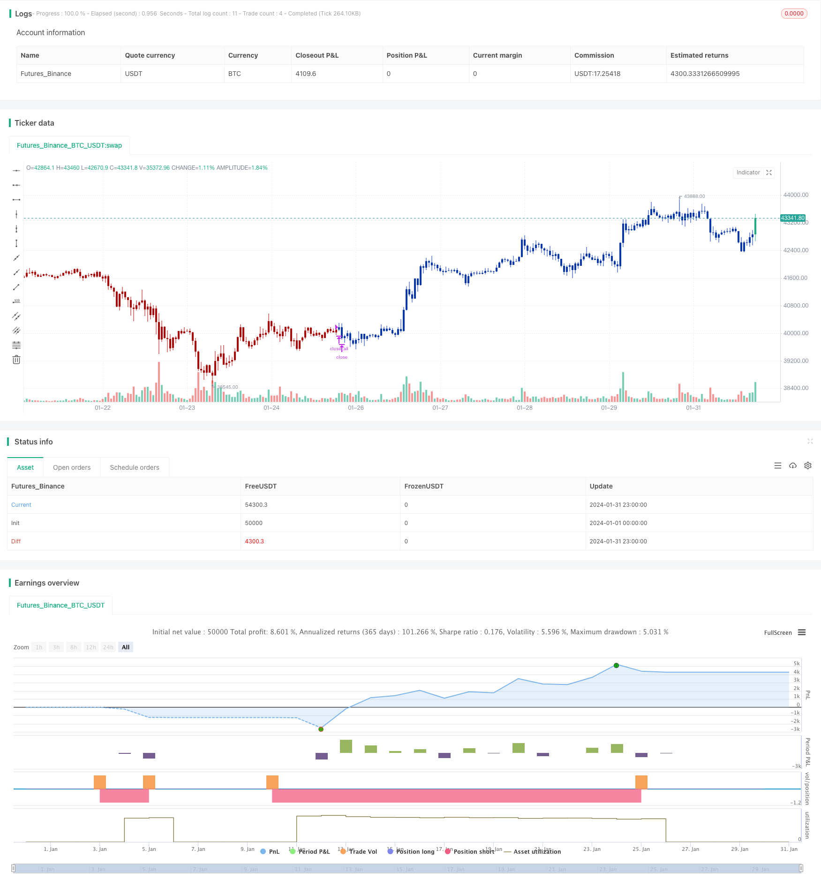

> Name

Binomial-Momentum-Breakout-Reversal-Strategy
> Author

ChaoZhang

> Strategy Description


[trans]
## Overview
The Binomial Momentum Breakout Reversal Strategy combines the Stoxx indicator and the Bull indicator to achieve dual signal filtering, conduct reversal trading at the market reversal point, and pursue oversold and overstretched positions.
## Strategy Principle
The strategy consists of two parts:
1. 123 reversal strategy
Use the reversal strategy proposed by Ulf Jansen in his book How I Tripled My Money in the Futures Market. When the closing price is higher than the previous day's closing price for 2 consecutive days, go long when the 9-day slow K-line Stoxx indicator is below 50; when the closing price is lower than the previous day's closing price for 2 consecutive days, and the 9-day fast K-line Stoxx indicator is above 50, go short.
2. Bull indicator
Use the momentum indicator proposed by Vadim Gimelfarb in his book Bull-Bear Balance Indicator. It calculates the relationship between the current K line and the previous K line, determines the strength of long and short positions, and gives long and short signals.
This strategy combines the above two single signal strategies and sends a trading signal when the two signals are consistent, using double filtering to reduce false signals.
## Advantage Analysis
This strategy combines the advantages of the reversal strategy and the tracking strategy, and can capture reversal signals in time when the market appears. At the same time, it reduces false signals through dual signal filtering and avoids chasing highs and selling lows. The specific advantages are as follows:
1. Use the 123 pattern to determine the market reversal point and identify oversold and overbought points.
2. Dual signal filtering mechanism to avoid false signals generated by a single indicator and improve signal quality.  
3. Use reversal trading methods to pursue trend opportunities brought by market reversals.
4. There is a large space for parameter optimization, and the indicator parameters can be adjusted to adapt to different market environments.
## Risk Analysis
This strategy also has certain risks, the main sources of which are as follows:
1. Reverse the risk of failure. It is difficult to identify reversal signals, and the probability that the price will continue to run in the original trend after the reversal signal is sent out is also very high.
2. Loss of trading opportunities when the double filtering signals are inconsistent.
3. Improper parameters cause inaccurate recognition of reversal signals.
4. This strategy is more suitable for medium and long-term trading, and the short-term trading effect is not very good.
The countermeasures are as follows:
1. Use stop-loss strategies to control single losses.
2. Optimize parameters. Different parameter combinations can be selected for different varieties.
3. Combine with other indicators as auxiliary judgment.
## Optimization direction
This strategy can also be optimized from the following aspects:
1. Test the impact of different parameters on the strategy effect and find the optimal parameter combination. For example, adjust the cycle parameters of the Stork indicator, the smoothing parameters of the KDJ indicator, etc.
2. Add a stop loss strategy to control single losses. The stop loss level can be set in conjunction with the ATR indicator.
3. Combine with other indicators for signal verification. For example, when MACD, KD, RSI and other indicators generate signals, consider issuing trading signals.
4. Use machine learning algorithms to optimize parameters and achieve dynamic adjustment of parameters.
## Summarize
The binomial momentum breakout reversal strategy achieves dual signal filtering and reversal trading through the combination of the Stork indicator and the Bull indicator. It can seize market reversal opportunities and avoid the noise generated by a single signal. It is a stable and effective quantitative strategy. This strategy can be improved through parameter optimization, stop-loss strategies, signal verification, etc., to adapt to more different varieties and market environments, and has great optimization space and application prospects.
||

## Overview

The Binomial Momentum Breakout Reversal Strategy combines the Stochastic indicator and Bull Power indicator to implement dual signal filtering and reversal trading at market turning points to chase oversold and overbought situations.

## Strategy Logic

The strategy consists of two parts:

1. 123 Reversal Strategy

    It uses the reversal strategy proposed by Ulf Jensen in his book "How I Tripled My Money in the Futures Market". It goes long when the close price is higher than the previous close for 2 consecutive days and the 9-day slow stochastic is below 50; it goes short when the close price is lower than the previous close for 2 consecutive days and the 9-day fast stochastic is above 50.  

2. Bull Power Indicator

    It uses the momentum indicator proposed by Vadim Gimelfarb in his book "Bull and Bear Balance Indicator". It judges the bullish/bearish power by calculating the relationship between the current K-line and previous K-line, and generates trading signals.

The strategy combines the above two single signal strategies. It generates trading signals only when the signals of two strategies are consistent to implement dual signal filtering.

## Advantage Analysis  

The strategy combines the advantages of reversal strategies and tracking strategies. It can capture reversal signals timely when the market shows signs of reversal, while reducing false signals through dual signal filtering to avoid chasing highs and selling lows. The main advantages are:

1. Using the 123 pattern to determine market turning points and identify oversold and overbought situations.
2. The dual signal filtering mechanism avoids false signals generated by single indicators and improves the quality of trading signals.
3. Reversal trading to seize the trend opportunities brought by market reversals. 
4. Large parameter optimization space to adapt to different market environments by adjusting indicator parameters.

## Risk Analysis

The strategy also has some risks:

1. Reversal failure risk. Identifying reversal signals has some difficulty. The probability of prices continuing the original trend after giving reversal signals is also very high.
2. Opportunity loss when inconsistent signals between two indicators.  
3. Inaccurate identification of reversal signals due to inappropriate parameters.
4. The strategy is more suitable for medium- and long-term trading. The effect of short-term trading is not very good.

The counter measures:

1. Adopt stop loss strategies to control single loss.
2. Optimize parameters. Different combinations can be selected for different varieties.
3. Combine other indicators as auxiliary judgment.  

## Optimization Directions

The strategy can be further optimized in the following aspects:

1. Test the impact of different parameters on strategy performance to find the optimal parameter combination. For example, adjust the cycle parameters of the Stochastic indicator, the smoothing parameters of the KDJ indicator, etc.
2. Increase stop loss strategies to control single losses. Can set stop loss points combined with the ATR indicator.
3. Combine other indicators for signal verification. For example, MACD, KD, RSI and other indicators can be considered when generating trading signals.
4. Use machine learning algorithms to optimize parameters and achieve dynamic adjustment of parameters.

## Summary  

The Binomial Momentum Breakout Reversal Strategy combines the Stochastic indicator and Bull Power indicator to achieve dual signal filtering and reversal trading. It can seize market reversal opportunities and avoid noise generated by single signals. It is a stable and effective quantitative strategy. The strategy can be improved through parameter optimization, stop loss strategies, signal verification, etc., making it suitable for more varieties and market environments. It has great potential for optimization and application.

[/trans]

> Strategy Arguments


|Argument|Default|Description|
|----|----|----|
|v_input_1|14|Length|
|v_input_2|true|KSmoothing|
|v_input_3|3|DLength|
|v_input_4|50|Level|
|v_input_5|15|SellLevel|
|v_input_6|3|BuyLevel|
|v_input_7|false|Trade reverse|


> Source (PineScript)

``` pinescript
/*backtest
start: 2024-01-01 00:00:00
end: 2024-01-31 23:59:59
period: 1h
basePeriod: 15m
exchanges: [{"eid":"Futures_Binance","currency":"BTC_USDT"}]
*/

//@version=4
////////////////////////////////////////////////////////////
//  Copyright by HPotter v1.0 05/07/2019
// This is combo strategies for get a cumulative signal. 
//
// First strategy
// This System was created from the Book "How I Tripled My Money In The 
// Futures Market" by Ulf Jensen, Page 183. This is reverse type of strategies.
// The strategy buys at market, if close price is higher than the previous close 
// during 2 days and the meaning of 9-days Stochastic Slow Oscillator is lower than 50. 
// The strategy sells at market, if close price is lower than the previous close price 
// during 2 days and the meaning of 9-days Stochastic Fast Oscillator is higher than 50.
//
// Second strategy
//  Bull Power Indicator
//  To get more information please see "Bull And Bear Balance Indicator" 
//  by Vadim Gimelfarb. 
//
// WARNING:
// - For purpose educate only
// - This script to change bars colors.
////////////////////////////////////////////////////////////
Reversal123(Length, KSmoothing, DLength, Level) =>
    vFast = sma(stoch(close, high, low, Length), KSmoothing) 
    vSlow = sma(vFast, DLength)
    pos = 0.0
    pos := iff(close[2] < close[1] and close > close[1] and vFast < vSlow and vFast > Level, 1,
	         iff(close[2] > close[1] and close < close[1] and vFast > vSlow and vFast < Level, -1, nz(pos[1], 0))) 
	pos

BullPower(SellLevel, BuyLevel) =>
    pos = 0
    value = iff (close < open ,  
             iff (close[1] < open ,  max(high - close[1], close - low), max(high - open, close - low)),
              iff (close > open, 
               iff(close[1] > open,  high - low, max(open - close[1], high - low)), 
                 iff(high - close > close - low, 
                  iff (close[1] < open, max(high - close[1], close - low), high - open), 
                   iff (high - close < close - low, 
                     iff(close[1] > open,  high - low, max(open - close, high - low)), 
                      iff (close[1] > open, max(high - open, close - low),
                       iff(close[1] < open, max(open - close, high - low), high - low))))))
    pos := iff(value > SellLevel, -1,
	         iff(value <= BuyLevel, 1, nz(pos[1], 0)))
    pos

strategy(title="Combo Backtest 123 Reversal & Bull Power", shorttitle="Combo", overlay = true)
Length = input(14, minval=1)
KSmoothing = input(1, minval=1)
DLength = input(3, minval=1)
Level = input(50, minval=1)
//-------------------------
SellLevel = input(15, step=1)
BuyLevel = input(3, step=1)
reverse = input(false, title="Trade reverse")
posReversal123 = Reversal123(Length, KSmoothing, DLength, Level)
posBullPower = BullPower(SellLevel, BuyLevel)
pos = iff(posReversal123 == 1 and posBullPower == 1 , 1,
	   iff(posReversal123 == -1 and posBullPower == -1, -1, 0)) 
possig = iff(reverse and pos == 1, -1,
          iff(reverse and pos == -1, 1, pos))	   
if (possig == 1) 
    strategy.entry("Long", strategy.long)
if (possig == -1)
    strategy.entry("Short", strategy.short)	 
if (possig == 0) 
    strategy.close_all()
barcolor(possig == -1 ? #b50404: possig == 1 ? #079605 : #0536b3 )
```

> Detail

https://www.fmz.com/strategy/443036

> Last Modified

2024-02-28 17:20:02
