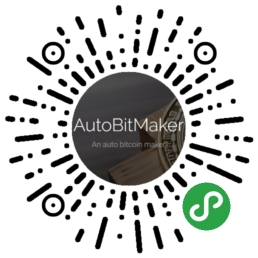

> Name

Bit-Maker-30-Arbitrage-Smart Learning-USDT-Standard-Binance-Single Platform-Arbitrage-USDT-Standard
> Author

AutoBitMaker-ABM

> Strategy Description

Self-learning grid:
The self-learning grid is based on the traditional grid strategy idea, but after long-term real trading + backtest data, dozens of parameter configurations such as position opening logic, position addition timing, take-profit position, position ratio, and grid spacing have been optimized. The intelligent dynamic position addition model and take-profit position are implemented, which can avoid the high risks that traditional grids need to bear when encountering unilateral situations, and use extremely low positions to achieve a good profit drawdown ratio.
The strategy configuration parameters are extremely rich. The team will assign dedicated personnel to customize a unique parameter combination for your account based on customer risk and return needs, and have around-the-clock manual + automated market monitoring.
We have self-developed unique index trading collections. Each index trading collection contains a variety of high-quality single trading pairs, and each trading pair has a unique weight ratio. The robot runs a self-learning grid strategy on the index set to avoid the unilateral risk of a single trading pair.
In addition to the built-in static index, we define dynamic indexes of multiple currency selection models for the index set, and select leading currencies in each sector to form an index level, further reducing risks.
A single account can be configured to run multiple single-currency trading pairs and index trading pairs at the same time, which can not only share risks, but also help you make profits in various complex market conditions.
About optimization + risk control:
The historical backtest server is open year-round, automatically backtests all the latest data, and calculates the optimal parameters in real time.
Our strategy cluster contains more than 50 auxiliary servers, which check the stop-loss conditions of the account at an average speed of 2 times per second, so that we can exit quickly when risks come.
Using the heterogeneous hybrid cloud architecture of Alibaba Cloud, Amazon Cloud, and Microsoft Cloud, management and execution nodes are separated, clusters are formed between multiple nodes to ensure redundancy, and the smooth operation of business and financial security are safely and effectively realized.
About the trial:
Depending on your capital size, we provide a trial run of about 2 weeks. During the trial period, we do not charge commission.
After Bot takes over your account, please do not do any operations on your own. When any other manual positions are detected, all Bots will exit immediately.
About commission:
This depends on the amount of funds you have. We can talk more about it after the trial run. If you create an account using our referral link, we will receive a low commission.
Contact information:
WeChat: DuQi_SEC/autobitmaker/Shawn_gb2312/ABM_DD
Email: liuhongyu.louie@autobitmaker.com/autobitmaker_master@autobitmaker.com
Submit trial application for WeChat mini program:

> Strategy Arguments


|Argument|Default|Description|
|----|----|----|
|baseOriginalBalance|1000|baseOriginalBalance|
|showInfo|false|showInfo|


> Source (javascript)

``` javascript
var chart = {
    __isStock: false,
    extension: {
        layout: 'single',
        col: 8,
        height: '300px'
    },
    tooltip: {
        xDateFormat: '%Y-%m-%d %H:%M:%S, %A'
    },
    title: {
        text: 'Account_Balance_Detail'
    },
    xAxis: {
        type: 'datetime'
    },
    yAxis: {
        title: {
            text: 'USDT'
        },
        opposite: false
    },
    series: []
};

function initChart() {
    chart.series.push({
        name: "Account_" + (Number(0)) + "_Detail",
        id: "Account_" + (Number(0)) + "_Detail",
        data: []
    });
}

function getChartPosition(avaliableMargin) {
    return {
        __isStock: false,
        extension: {
            layout: 'single',
            col: 4,
            height: '300px'
        },
        title: {
            text: '保证金占比(%)'
        },
        series: [{
            type: 'pie',
            name: 'one',
            data: [{
                name: '可用保证金(%)',
                y: avaliableMargin,
                color: '#dff0d8',
                sliced: true,
                selected: true
            }, {
                name: '保证金占用(%)',
                y: 100 - avaliableMargin,
                color: 'rgb(217, 237, 247)',
                sliced: true,
                selected: true
            }]
        }]
    };
}

function updateAccountDetailChart(ObjChart) {
    var nowTime = new Date().getTime();
    var account = exchanges[0].GetAccount();
    try {
        if (account !== null && account.Info !== null && account.Info.totalMarginBalance > 0) {
            ObjChart.add([0, [nowTime, Number(account.Info.totalMarginBalance)]]);
        }
    } catch (err) {
        Log('ERROR ' + account + ',' + err)
    }
}

function getBalance() {
    var currentBalance = 0;
    var account = exchanges[0].GetAccount();
    try {
        if (account !== null && account.Info !== null && account.Info.totalWalletBalance > 0) {
            currentBalance += Number(account.Info.totalWalletBalance);
        }
    } catch (err) {
        Log('ERROR ' + account + ',' + err)
    }
    Sleep(666);
    return Number(currentBalance).toFixed(6);
}

function getMarginBalance() {
    var currentBalance = 0;
    var account = exchanges[0].GetAccount();
    try {
        if (account !== null && account.Info !== null && account.Info.totalMarginBalance > 0) {
            currentBalance += Number(account.Info.totalMarginBalance);
        }
    } catch (err) {
        Log('ERROR ' + account + ',' + err)
    }
    Sleep(666);
    return Number(currentBalance).toFixed(6);
}

function printProfitInfo(currentBalance) {
    var profit = Number((currentBalance) - baseOriginalBalance).toFixed(5);
    var profitRate = Number((((currentBalance) - baseOriginalBalance) / baseOriginalBalance) * 100).toFixed(4);
    LogProfit(Number(profitRate), '&');
    Log('The current balance is ' + currentBalance + ', the profit is ' + profit + ', the profit rate is ' + profitRate + '%');
}

function printPositionInfo(exchangeInnerArray, totalProfitUSDT, totalProfitRate) {
    var totalProfit = 0.0
    var table = {
        type: 'table',
        title: 'POSITIONS',
        cols: ['Symbol', 'Type', 'AvgPrice', 'Position', 'Profit'],
        rows: []
    }
    if (showInfo) {
        table.rows.push([{
            body: '* 2020-09-07 之前一直人民币100万实盘运行，现策略更新，自动将合约闲置资金转入币安宝，即提高资金安全性，也可以双边获利，当合约所需保证金上涨或下降时，将自动调整两边余额。因当前FMZ无法监控币安宝余额，所以剥离10W人民币继续运行原策略以做展示。',
            colspan: 5
        }]);
    }
    table.rows.push([{
        body: '本策略是 USDT 本位，基于均值回归的币安合约套利策略，并以低风险辅助网格并行（BitMEX支持BTC本位）',
        colspan: 5
    }]);
    table.rows.push([{
        body: '套利主要币种是 BTC/USDT 和 ETH/USDT,网格覆盖币安永续合约全部币种交易对',
        colspan: 5
    }]);
    for (var index in exchangeInnerArray) {
        var position = exchangeInnerArray[index].GetPosition()
        for (var indexInner in position) {
            var profit = Number(position[indexInner].Info.unRealizedProfit);
            totalProfit = totalProfit + profit
            table.rows.push([position[indexInner].Info.symbol, (position[indexInner].Type == 1 ? 'SHORT #da1b1bab' : 'LONG #1eda1bab'), position[indexInner].Price, position[indexInner].Amount, profit.toFixed(5)]);
        }
        Sleep(168);
    }
    table.rows.push([{
        body: 'TOTAL PROFIT OF CURRENT POSITION',
        colspan: 4
    }, totalProfit.toFixed(6) + ' USDT']);
    table.rows.push([{
        body: 'TOTAL PROFIT',
        colspan: 4
    }, totalProfitUSDT + ' USDT']);
    table.rows.push([{
        body: 'TOTAL PROFIT RATE',
        colspan: 4
    }, totalProfitRate + ' %']);
    LogStatus('`' + JSON.stringify(table) + '`');
}

function main() {
    initChart();
    var ObjChart = Chart([chart, getChartPosition(100)]);
    while (true) {
        try {
            var currentBalance = getBalance();
            printProfitInfo(currentBalance);
            updateAccountDetailChart(ObjChart);
            for (var i = 0; i < 120; i++) {
                try {
                    var avaliableMargin = ((getMarginBalance()) / (getBalance())) * 100;
                    ObjChart.update([chart, getChartPosition(avaliableMargin)]);
                    var profit = Number((currentBalance) - baseOriginalBalance).toFixed(5);
                    var profitRate = Number((((currentBalance) - baseOriginalBalance) / baseOriginalBalance) * 100).toFixed(4);
                    printPositionInfo(exchanges, profit, profitRate);
                    Sleep(1000 * 120);
                } catch (errInner) {
                    throw errInner;
                }
            }
        } catch (err) {
            throw err;
        }
    }
}
```

> Detail

https://www.fmz.com/strategy/178712

> Last Modified

2021-01-07 08:40:45
