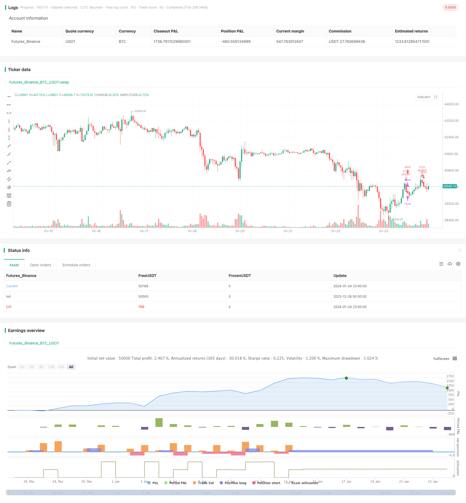

> Name

Bitcoin Futures Position Intelligent Trading Strategy Bitcoin-Futures-Position-Trading-Strategy
> Author

ChaoZhang

> Strategy Description


[trans]

Overview: This strategy uses Bitfinex’s BTC futures position data to guide trades. Go short when the number of short positions rises and go long when the number of short positions decreases. Suitable for following "think tank" trading behavior.
Strategy principle:
1. Use the Bitfinex BTC futures short position amount as an indicator. Bitfinex is considered an institution- and “think tank”-led exchange.
2. When the number of short positions rises, short BTC spot. At this time, institutions are adding positions to short BTC.
3. When the number of short positions decreases, go long BTC spot. Institutions are reducing their positions at this time, indicating bullish signs. 
4. Use the RSI indicator to determine the highs and lows of short positions. RSI above 75 is a high signal, and below 30 is a low signal.
5. Enter long or short positions when highs and lows signal.
Advantage analysis:
1. Use the position data of Bitfinex professional traders as indication signals to capture institutional trading activities.
2. The RSI indicator helps determine the high and low points of short positions and control trading risks.
3. Monitor institutional trading trends in real time and adjust your positions in a timely manner.
4. There is no need to analyze technical indicators yourself and directly follow the trading ideas of the "think tank".
5. The backtest data performed well and the rate of return was considerable.
Risk analysis:
1. It is impossible to determine whether the increase in the number of short positions is speculation or hedging. Follow with caution.
2. There is a delay in updating Bitfinex trading data, and you may miss the best entry opportunity.  
3. Institutional trading is not 100% correct and may fail.
4. Improper setting of RSI parameters may result in false signals or missing signals.
5. If the stop loss setting is too loose, a single loss may be large.
Optimization direction:
1. Optimize RSI parameters and test the effects of different holding periods.
2. Try other indicators such as KD, MACD, etc. to determine the high and low points of short positions.  
3. Tighten the stop loss range to reduce single loss.
4. Add exit conditions, such as trend reversal, breaker and other signals.
5. Test the applicable currency range, such as following BTC short position trading ETH.
Summary:
This strategy achieves timely access to institutional trading signals by following Bitfinex's BTC futures professional traders. It helps investors monitor market enthusiasm and grasp the highs and lows. At the same time, it also warns of investment risks. When professional traders are short selling in large quantities, be careful to reduce long positions. Generally speaking, this strategy takes advantage of futures position information and is an interesting trading idea. However, parameter optimization and risk control still need to be further improved in order to obtain stable returns in the real market.
||

Overview: This strategy uses BitMEX bitcoin futures position data to guide trades. It goes short when short positions increase and goes long when short positions decrease. Suitable for following “smart money” trading behavior.  

Strategy Logic:  
1. Use BitMEX bitcoin futures short positions as indicator. BitMEX is considered dominated by institutions and “smart money”.   
2. When short positions increase, go short on BTC spot. Institutions are adding to their short positions.  
3. When short positions decrease, go long on BTC spot. Institutions are reducing shorts, indicating bullish sentiment.
4. Use RSI indicator to detect peaks and troughs in short positions. RSI above 75 is peak signal, below 30 is trough signal.  
5. Enter long/short positions on peak/trough signals.  

Advantages Analysis:   
1. Uses position data from professional BitMEX traders, capturing institutional activity.  
2. RSI helps determine peaks/troughs, controlling trading risk.
3. Real-time monitoring of institutional moves to adjust own position accordingly.  
4. No need to analyze charts, directly follow “smart money” thinking. 
5. Backtest results look decent, respectable returns.  

Risk Analysis:   
1. Unable to tell if increase in shorts is speculative or hedging. Need to follow cautiously.   
2. BitMEX data has lag, may miss best entry price.   
3. Institutions are not 100% correct, failures happen.  
4. Poor RSI parameter tuning leads to false signals or missing signals.   
5. Stop loss too loose, single loss could be huge.   

Optimization Directions:
1. Optimize RSI parameters, test different holding periods.   
2. Try other indicators like KD, MACD to detect peaks/troughs.   
3. Tighter stop loss to limit single loss.  
4. Add exit conditions like trend reversal, breakers etc.  
5. Test applicability to other coins, e.g. follow BTC shorts to trade ETH.  

Summary:  
This strategy leverages BitMEX professional bitcoin futures traders to get timely signals. It helps investors gauge market sentiment and spot highs/lows. Also warns downside risks when whales are heavily short. Overall an interesting approach utilizing futures position data, but further refinement in parameters and risk control necessary before deploying live.

[/trans]

> Strategy Arguments


|Argument|Default|Description|
|----|----|----|
|v_input_1|timestamp(01 Jan 2021)|Start Date|
|v_input_2|timestamp(01 Jan 2024)|Start Date|
|v_input_3|BTC_USDT:swap|Bitfinex Short Symbol|
|v_input_4|7|(?RSI Settings)Length|
|v_input_5|75|High Shorts Threshold|
|v_input_6|30|Low Shorts Threshold|
|v_input_float_1|25|(?Stop Loss Settings)Long Stop Loss (%)|
|v_input_float_2|25|Short Stop Loss (%)|


> Source (PineScript)

``` pinescript
/*backtest
start: 2023-12-26 00:00:00
end: 2024-01-25 00:00:00
period: 1h
basePeriod: 15m
exchanges: [{"eid":"Futures_Binance","currency":"BTC_USDT"}]
*/

//@version=5
strategy("Bitfinex Shorts Strat", 
     overlay=true,
     default_qty_type=strategy.percent_of_equity,
     default_qty_value=10, precision=2, initial_capital=1000,
     pyramiding=2,
     commission_value=0.05)

//Backtest date range
StartDate = input(timestamp("01 Jan 2021"), title="Start Date")
EndDate = input(timestamp("01 Jan 2024"), title="Start Date")
inDateRange = true

symbolInput = input(title="Bitfinex Short Symbol", defval="BTC_USDT:swap")
Shorts = request.security(symbolInput, "", open)

// RSI Input Settings
length = input(title="Length", defval=7, group="RSI Settings" )
overSold = input(title="High Shorts Threshold", defval=75, group="RSI Settings" )
overBought = input(title="Low Shorts Threshold", defval=30, group="RSI Settings" )

// Calculating RSI
vrsi = ta.rsi(Shorts, length)
RSIunder = ta.crossover(vrsi, overSold)
RSIover = ta.crossunder(vrsi, overBought)

// Stop Loss Input Settings
longLossPerc = input.float(title="Long Stop Loss (%)", defval=25, group="Stop Loss Settings") * 0.01
shortLossPerc = input.float(title="Short Stop Loss (%)", defval=25, group="Stop Loss Settings") * 0.01

// Calculating Stop Loss
longStopPrice  = strategy.position_avg_price * (1 - longLossPerc)
shortStopPrice = strategy.position_avg_price * (1 + shortLossPerc)

// Strategy Entry
if (not na(vrsi))
	if (inDateRange and RSIover)
		strategy.entry("LONG", strategy.long, comment="LONG")
	if (inDateRange and RSIunder)
		strategy.entry("SHORT", strategy.short, comment="SHORT")

// Submit exit orders based on calculated stop loss price
if (strategy.position_size > 0)
    strategy.exit(id="LONG STOP", stop=longStopPrice)
if (strategy.position_size < 0)
    strategy.exit(id="SHORT STOP", stop=shortStopPrice)
```

> Detail

https://www.fmz.com/strategy/440084

> Last Modified

2024-01-26 15:01:24
