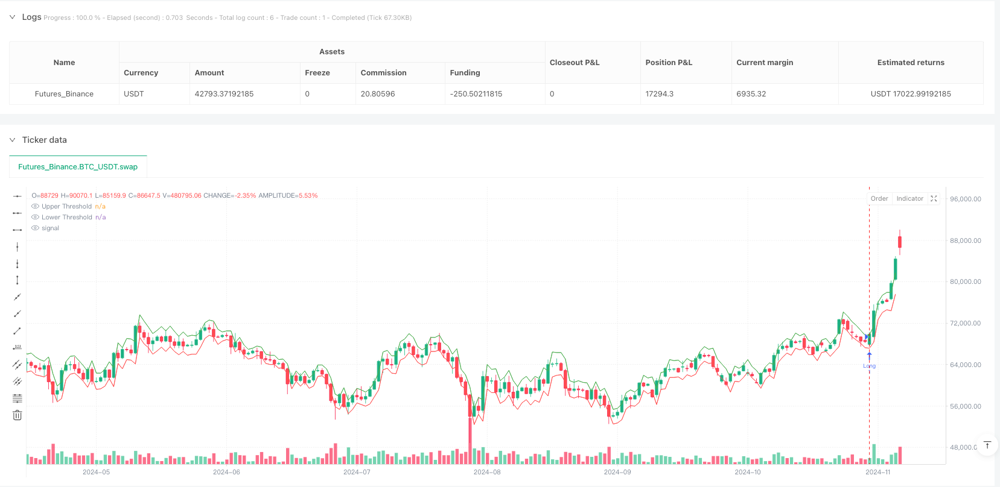
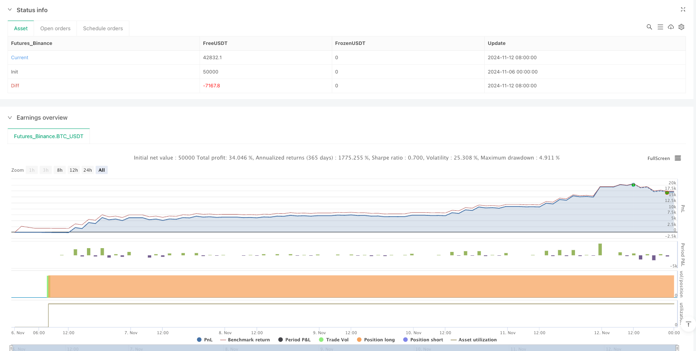

> Name

Breakout trading quantitative strategy and trailing stop loss optimization system based on Black-Scholes theory-Black-Scholes-Volatility-Breakout-Trading-Strategy-with-Dynamic-Trailing-Stop-Optimization
> Author

ianzeng123

> Strategy Description





[trans]
#### Overview
The breakthrough trading quantitative strategy and trailing stop loss optimization system based on Black-Scholes theory is an innovative trading model that combines option pricing theory and technical analysis. The core idea of ​​this strategy is to use the Black-Scholes model to estimate asset price volatility, construct dynamic upper and lower thresholds, and generate trading signals when the price exceeds these thresholds. At the same time, the strategy incorporates a flexible trailing stop loss mechanism, which not only controls the maximum loss in a single transaction, but also locks in profits during the trend. This design is particularly suitable for capturing trading opportunities brought about by abnormal short-term price fluctuations, and performs particularly well in high-volatility market environments.
#### Strategy Principle
The theoretical basis of this strategy comes from the measurement of market volatility in the Black-Scholes option pricing model. The specific implementation process is as follows:
1. First, the strategy calculates the log return of historical prices (logReturn = math.log(close / close[1])), then uses the standard deviation function (ta.stdev) to calculate the volatility and annualizes it (multiplying sqrt(periodsPerYear)). The annualization process takes into account the number of trading days (252 days) and daily trading minutes (390 minutes), divided by the user-set chart time period.
2. Next, the strategy calculates the expected price movement (expectedMove), which is based on the product of the previous closing price, current volatility, and the time factor (sqrt(1/periodsPerYear)). This step essentially quantifies "the expected range of price movement in the next time unit under current volatility conditions."
3. The strategy then constructs dynamic trading thresholds: the upper threshold (upperThreshold) is the previous closing price plus the expected change; the lower threshold (lowerThreshold) is the previous closing price minus the expected change.
4. When the price breaks through the upper threshold, a long signal is triggered; when the price breaks through the lower threshold, a short signal is triggered.
5. In terms of risk management, the strategy adopts a two-layer stop loss protection mechanism:
   - Initial Stop Loss: Set a fixed stop loss based on a user-defined percentage (stopLossPerc)
   - Trailing Stop: When the price moves in a favorable direction, the stop loss point will be dynamically adjusted according to the set trailing percentage (trailingStopPerc) to lock in existing profits.
This design enables the strategy to effectively control risks and improve the efficiency of capital use while capturing price breakthrough opportunities.
#### Strategic Advantages
After in-depth analysis of the code, this strategy has the following significant advantages:
1. **Solid theoretical foundation**: The strategy is based on mature financial theory and uses the Black-Scholes model to scientifically quantify volatility, which has strong theoretical support.
2. **Adaptive to market conditions**: By dynamically calculating volatility and expected price changes, the strategy can automatically adapt to different market environments. In periods of low volatility, the entry threshold is lower; in periods of high volatility, the entry threshold is raised accordingly, avoiding the limitations caused by fixed parameters.
3. **Improved risk management**: The dual stop-loss mechanism (initial stop-loss and trailing stop-loss) effectively controls the risk of a single transaction, while maximizing profits in trending markets.
4. **High calculation efficiency**: The strategy algorithm is simple, efficient, and highly real-time. It can be recalculated every time the price changes and the order is completed (calc_on_order_fills=true, calc_on_every_tick=true), which is suitable for short-term trading within the day.
5. **Visual decision-making assistance**: The strategy displays dynamic thresholds in the form of charts, so traders can intuitively understand the current market status and potential trading opportunities.
6. **Flexible and adjustable parameters**: Users can flexibly adjust key parameters such as volatility lookback period and stop loss ratio according to personal risk preferences and market characteristics to improve strategy adaptability.
#### Strategy Risk
Although this strategy is well designed, it still has the following potential risks:
1. **False breakthrough risk**: The market may briefly break through the threshold and then quickly retrace, resulting in false signals. The solution could be to add a confirmation mechanism, such as requiring the price to stay outside a threshold for a certain period of time or combining it with other indicators for signal filtering.
2. **Volatility estimation bias**: Before and after market turning points or major events, historical volatility may not be able to accurately predict future fluctuations, resulting in unreasonable threshold settings. The introduction of implied volatility or adaptive volatility estimation method improvements can be considered.
3. **Slippage and Execution Risk**: In a high-frequency trading environment, there may be a difference between the order execution price and the signal price. It is recommended to set a reasonable slippage model during the backtesting stage and use limit orders instead of market orders in real orders.
4. **Parameter sensitivity**: Strategy performance is more sensitive to volatility lookback period (volLookback) and stop loss parameters. Robust parameter ranges should be found through historical backtesting to avoid curve fitting caused by over-optimization.
5. **Short Selling Risk**: The potential losses from short selling transactions may theoretically exceed the initial capital. It is recommended to set a maximum position limit in actual applications or adjust the position size according to the account's risk tolerance.
6. **Trend reversal risk**: Trailing stop loss may be triggered frequently in volatile markets, resulting in increased transaction costs. Consider adding a trend confirmation indicator and enabling trailing stops only when the trend is clear.
#### Strategy optimization direction
Based on code analysis, this strategy can be optimized from the following directions:
1. **Dynamic Volatility Calculation Improvement**: The current strategy uses a fixed lookback period to calculate historical volatility. You can consider using a GARCH-type model or an index-weighted volatility model to better capture the dynamic changing characteristics of volatility. The reason for this is that financial market volatility often has "volatility aggregation" characteristics, and recent price fluctuations are more valuable for future predictions.
2. **Introduction of time decay factor**: The time decay factor can be added to the expected movement calculation to make recent data have a greater impact on the forecast and improve the sensitivity of the strategy to market turning points.
3. **Multiple time frame analysis integration**: Combined with longer-period volatility analysis, avoid making counter-trend transactions in the direction of the main trend. For example, you can only open a position in the direction of the daily trend to increase your winning rate.
4. **Trading volume confirmation mechanism**: Integrate trading volume analysis into breakthrough signal confirmation, and only confirm the validity of the breakthrough when the trading volume increases significantly, reducing losses caused by false breakthroughs.
5. **Adaptive Stop Loss Mechanism**: You can dynamically associate the trailing stop loss ratio with market volatility, and set a looser trailing stop loss in a high volatility environment to avoid being triggered by normal market noise.
6. **Fund Management Optimization**: Introduce a dynamic position management module to automatically adjust the position size according to the account net value, market volatility and trading signal strength to balance risks and returns.
7. **Machine Learning Enhancement**: Consider using machine learning algorithms to optimize parameter selection or enhance signal quality assessment to make the strategy more intelligently adaptable to different market environments.
#### Summarize
The breakthrough trading quantitative strategy and trailing stop loss optimization system based on the Black-Scholes theory is a quantitative trading plan that cleverly combines financial theory and practical trading technology. This strategy scientifically quantifies market volatility, dynamically constructs trading thresholds, and cooperates with flexible risk management mechanisms to effectively capture trading opportunities brought about by abnormal short-term price fluctuations.
The core advantages of the strategy lie in its solid theoretical foundation, strong adaptability and perfect risk management, which is particularly suitable for application in volatile market environments. However, users need to be wary of potential risks such as false breakthroughs and parameter sensitivity, and can optimize through improved volatility calculations, multi-time frame analysis, and transaction volume confirmation.
Overall, this is a quantitative trading strategy with well-designed and clear logic, which not only reflects a deep understanding of the operating mechanism of the financial market, but also has strong practicality and scalability. For quantitative traders who are familiar with option theory and pursue a robust trading style, this is a strategic framework worthy of in-depth study and application.
|| 

#### Overview

The Black-Scholes Volatility Breakout Trading Strategy with Dynamic Trailing Stop Optimization is an innovative trading model that combines options pricing theory with technical analysis. The core concept leverages the Black-Scholes model to estimate asset price volatility and construct dynamic upper and lower thresholds. Trading signals are generated when price breaks through these thresholds. Additionally, the strategy incorporates a flexible trailing stop mechanism that both controls maximum loss per trade and locks in profits during trend continuation. This design is particularly effective for capturing trading opportunities from short-term price anomalies, especially in high-volatility market environments.

#### Strategy Principles

The theoretical foundation of this strategy derives from the volatility measurement methodology in the Black-Scholes options pricing model. The implementation process is as follows:

1. First, the strategy calculates the logarithmic return of historical prices (logReturn = math.log(close / close[1])), then uses the standard deviation function (ta.stdev) to compute volatility, which is annualized (multiplied by sqrt(periodsPerYear)). The annualization process accounts for trading days (252) and trading minutes per day (390), divided by the user-defined chart timeframe.

2. Next, the strategy calculates the expected price movement (expectedMove), which is based on the product of the previous closing price, current volatility, and a time factor (sqrt(1/periodsPerYear)). This step essentially quantifies "the expected price range in the next time unit under current volatility conditions."

3. The strategy then constructs dynamic trading thresholds: the upper threshold (upperThreshold) is the previous closing price plus the expected movement; the lower threshold (lowerThreshold) is the previous closing price minus the expected movement.

4. When the price breaks above the upper threshold, a long signal is triggered; when the price breaks below the lower threshold, a short signal is triggered.

5. For risk management, the strategy employs a two-tier stop-loss protection mechanism:
   - Initial stop-loss: Sets a fixed stop point based on user-defined percentage (stopLossPerc)
   - Trailing stop: As price moves favorably, the stop point adjusts dynamically according to the set trailing percentage (trailingStopPerc), locking in existing profits

This design enables the strategy to effectively control risk and improve capital efficiency while capturing price breakout opportunities.

#### Strategy Advantages

Through in-depth analysis of the code, this strategy demonstrates the following significant advantages:

1. **Solid Theoretical Foundation**: The strategy is based on mature financial theory, using the Black-Scholes model for scientific volatility quantification, providing strong theoretical support.

2. **Adaptive to Market Conditions**: By dynamically calculating volatility and expected price movement, the strategy automatically adapts to different market environments. During low volatility periods, entry thresholds are lower; during high volatility periods, entry thresholds correspondingly increase, avoiding the limitations of fixed parameters.

3. **Comprehensive Risk Management**: The dual stop-loss mechanism (initial stop-loss and trailing stop) effectively controls individual trade risk while maximizing profit capture during trend movements.

4. **High Computational Efficiency**: The strategy algorithm is concise and efficient with strong real-time capabilities, recalculating at each price change and order execution (calc_on_order_fills=true, calc_on_every_tick=true), suitable for intraday short-term trading.

5. **Visualization Aids Decision-Making**: The strategy displays dynamic thresholds in chart form, allowing traders to intuitively understand current market conditions and potential trading opportunities.

6. **Flexible Parameters**: Users can adjust key parameters such as volatility lookback period and stop-loss percentages according to personal risk preferences and market characteristics, enhancing strategy adaptability.

#### Strategy Risks

Despite its sophisticated design, the strategy still has the following potential risks:

1. **False Breakout Risk**: The market may exhibit brief threshold breakouts followed by rapid retracements, leading to false signals. A solution could be to add confirmation mechanisms, such as requiring price to remain beyond the threshold for a certain time or integrating other indicators for signal filtering.

2. **Volatility Estimation Bias**: At market turning points or around major events, historical volatility may not accurately predict future volatility, resulting in inappropriate threshold settings. Consider introducing implied volatility or adaptive volatility estimation methods for improvement.

3. **Slippage and Execution Risk**: In high-frequency trading environments, execution prices may differ from signal prices. It is advisable to set reasonable slippage models during backtesting and use limit orders rather than market orders in live trading.

4. **Parameter Sensitivity**: Strategy performance is relatively sensitive to the volatility lookback period (volLookback) and stop-loss parameters. Robust parameter ranges should be identified through historical backtesting to avoid curve-fitting from excessive optimization.

5. **Short Selling Risk**: Potential losses in short trades can theoretically exceed initial capital. In practical applications, it is recommended to set maximum position size limits or adjust position sizes according to account risk tolerance.

6. **Trend Reversal Risk**: Trailing stops may be frequently triggered in oscillating markets, increasing transaction costs. Consider adding trend confirmation indicators and only enabling trailing stops when trends are clearly established.

#### Strategy Optimization Directions

Based on code analysis, the strategy can be optimized in the following directions:

1. **Dynamic Volatility Calculation Improvement**: The current strategy uses a fixed lookback period to calculate historical volatility. Consider adopting GARCH models or exponentially weighted volatility models to better capture the dynamic characteristics of volatility. This is beneficial because financial market volatility typically exhibits "volatility clustering," where recent price fluctuations have greater predictive value for the future.

2. **Time Decay Factor Introduction**: A time decay factor could be incorporated into the expected movement calculation, giving recent data greater influence on predictions and improving the strategy's sensitivity to market turning points.

3. **Multi-Timeframe Analysis Integration**: Combine longer-term volatility analysis to avoid counter-trend trading in the primary trend direction. For example, only taking positions in the direction of the daily trend to improve win rates.

4. **Volume Confirmation Mechanism**: Integrate volume analysis into breakout signal confirmation, only validating breakouts when accompanied by significant volume increases, reducing losses from false breakouts.

5. **Adaptive Stop-Loss Mechanism**: Dynamically link trailing stop percentages with market volatility, setting more flexible trailing stops in high-volatility environments to avoid triggering by normal market noise.

6. **Capital Management Optimization**: Introduce a dynamic position sizing module that automatically adjusts position size based on account equity, market volatility, and signal strength, balancing risk and reward.

7. **Machine Learning Enhancement**: Consider using machine learning algorithms to optimize parameter selection or enhance signal quality assessment, allowing the strategy to adapt more intelligently to different market environments.

#### Summary

The Black-Scholes Volatility Breakout Trading Strategy with Dynamic Trailing Stop Optimization is a quantitative trading solution that cleverly combines financial theory with practical trading techniques. By scientifically quantifying market volatility, dynamically constructing trading thresholds, and incorporating flexible risk management mechanisms, the strategy effectively captures trading opportunities arising from short-term price anomalies.

The core strengths of the strategy lie in its solid theoretical foundation, strong adaptability, and comprehensive risk management, making it particularly suitable for application in volatile market environments. However, users need to be vigilant about potential risks such as false breakouts and parameter sensitivity, and can optimize through improved volatility calculations, multi-timeframe analysis, volume confirmation, and other approaches.

Overall, this is an elegantly designed, logically clear quantitative trading strategy that demonstrates both a profound understanding of financial market mechanisms and strong practicality and scalability. For quantitative traders familiar with options theory and pursuing a robust trading style, this represents a strategy framework worthy of in-depth study and application.
[/trans]


> Source (PineScript)

``` pinescript
/*backtest
start: 2024-11-06 00:00:00
end: 2024-11-13 00:00:00
period: 1d
basePeriod: 1d
exchanges: [{"eid":"Futures_Binance","currency":"BTC_USDT"}]
*/

//@version=5
strategy("black-scholes breakout with trailing stop", overlay=true, initial_capital=100000, currency=currency.USD, calc_on_order_fills=true, calc_on_every_tick=true)

// User Inputs
chartRes         = input.int(title="Chart Timeframe in Minutes", defval=1, minval=1)
volLookback      = input.int(title="Volatility Lookback (bars)", defval=20, minval=1)
stopLossPerc     = input.float(title="Initial Stop Loss (%)", defval=1.0, minval=0.1, step=0.1)
trailingStopPerc = input.float(title="Trailing Stop (%)", defval=0.5, minval=0.1, step=0.1)

// Calculate periods per year based on chart timeframe
periodsPerYear = (252 * 390) / chartRes

// Calculate annualized volatility from log returns
logReturn    = math.log(close / close[1])
volatility   = ta.stdev(logReturn, volLookback) * math.sqrt(periodsPerYear)
expectedMove = close[1] * volatility * math.sqrt(1 / periodsPerYear)

// Define dynamic thresholds around previous close
upperThreshold = close[1] + expectedMove
lowerThreshold = close[1] - expectedMove

// Plot thresholds for visual reference
plot(upperThreshold, color=color.green, title="Upper Threshold")
plot(lowerThreshold, color=color.red, title="Lower Threshold")

// Trading Signals: breakout conditions
longCondition  = close > upperThreshold
shortCondition = close < lowerThreshold

if (longCondition)
    strategy.entry("Long", strategy.long)
if (shortCondition)
    strategy.entry("Short", strategy.short)

// Trailing Stop Risk Management using expected move for initial stop loss and a trailing stop
if (strategy.position_size > 0)
    strategy.exit("Exit Long", from_entry="Long", 
                  stop=close * (1 - stopLossPerc / 100), 
                  trail_points=close * trailingStopPerc / 100)
if (strategy.position_size < 0)
    strategy.exit("Exit Short", from_entry="Short", 
                  stop=close * (1 + stopLossPerc / 100), 
                  trail_points=close * trailingStopPerc / 100)

```

> Detail

https://www.fmz.com/strategy/489038

> Last Modified

2025-04-01 14:16:34
