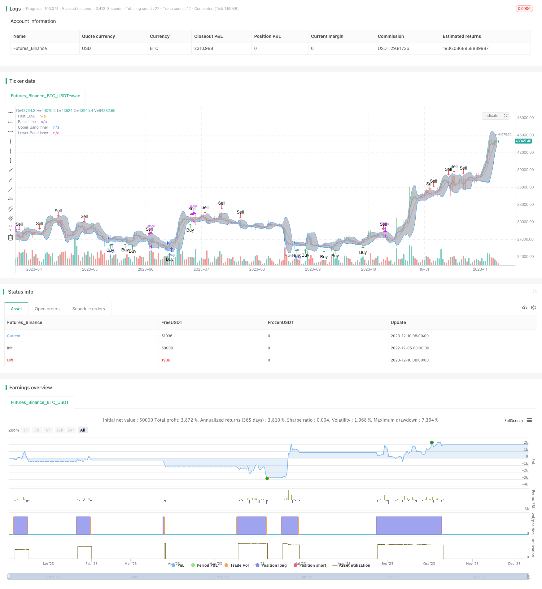

> Name

Bollinger-Band-Awesome-Oscillator-Breakout-Trading-Strategy
> Author

ChaoZhang

> Strategy Description


[trans]

### Overview
This strategy combines the dual waveband indicator and the strength index indicator to achieve a breakout trading pattern. When the fast EMA breaks through the band channel, combined with the long and short direction signals of the AO indicator, buy and sell signals are generated.
### Strategy Principles
1. Use the middle track, upper track and lower track of Bollinger Bands to determine the price channel.
2. When the fast EMA crosses the middle rail, it is judged as a channel breakthrough.
3. The strength index AO indicator determines the direction of long and short positions.
4. When the fast EMA breaks through the middle rail upwards and the AO is positive, a buy signal is generated.
5. When the fast EMA breaks through the middle rail downwards and the AO is negative, a sell signal is generated.
### Advantage Analysis
1. The dual-band indicator determines the price channel and avoids false signals.
2. The AO indicator determines the trend direction and makes trading signals more accurate.
3. Combined with channel breakout pattern trading, you can capture greater profits at the beginning of the trend.
### Risk Analysis
1. Improper Bollinger Band parameters may cause the channel to be too wide or too narrow.
2. AO indicator parameter settings will affect the accuracy of judgment.
3. The breakthrough signal may be a false breakthrough, and it is necessary to ensure that there is sufficient breakthrough strength.
#### Solution
1. Optimize the parameters of Bollinger Bands and AO indicators to find the best combination.
2. Increase the intensity conditions for breakthroughs and avoid false breakthroughs.
3. Use in combination with other indicators to ensure the reliability of trading signals.
### Optimization direction
1. Optimize the parameters of Bollinger Bands and find the most suitable channel range.
2. Optimize the long and short-term moving average parameters of the AO indicator to improve the accuracy of judgment.  
3. Add volume or other indicator filters to ensure the reliability of breakthroughs.
4. Optimize breakthrough intensity parameters and reduce false breakthrough rate.
### Summarize
This strategy comprehensively considers the price channel, trend direction and breakthrough mode, and is a relatively stable and efficient trading strategy. Through parameter optimization and combined indicator filtering, the robustness and profitability of the strategy can be further enhanced. Its breakthrough trading model can capture early opportunities in trends and has great practical value.
||

### Overview

This strategy combines the Bollinger Bands indicator and the Awesome Oscillator (AO) indicator to implement a breakout trading model. It generates buy and sell signals when the fast EMA breaks through the BB channel, together with the AO indicator's directional signals.

### Strategy Logic  

1. Use the middle, upper and lower bands of Bollinger Bands to determine the price channel.
2. Judge a channel breakout when fast EMA crosses the middle band.
3. AO indicator determines the direction of uptrend or downtrend. 
4. When fast EMA breaks through middle band upward and AO is positive, a buy signal is generated.
5. When fast EMA breaks through middle band downward and AO is negative, a sell signal is generated.

### Advantage Analysis

1. BB channel avoids wrong signals.  
2. AO indicator improves accuracy of signals.
3. Captures greater profit at the beginning of a trend.

### Risk Analysis  

1. Improper BB parameters may cause too wide or too narrow channel.
2. AO parameters affect the accuracy.   
3. Breakout signal may be false breakout.

#### Solutions

1. Optimize parameters of BB and AO to find best combination.  
2. Add strength condition to avoid false breakout.
3. Combine with other indicators to ensure reliability.  

### Optimization Directions

1. Optimize BB parameters to find suitable channel range.
2. Optimize long and short term periods of AO to improve accuracy.
3. Add volume or other filters to ensure breakout reliability.  
4. Optimize strength condition to lower false breakout rate.

### Conclusion

This strategy comprehensively considers the price channel, trend direction and breakout model. It can be more robust and profitable through parameter optimization and indicator combinations. Its breakout model captures early trend opportunities and is very practical.

[/trans]

> Strategy Arguments


|Argument|Default|Description|
|----|----|----|
|v_input_1|6|From Month|
|v_input_2|true|From Day|
|v_input_3|2018|From Year|
|v_input_4|true|To Month|
|v_input_5|true|To Day|
|v_input_6|9999|To Year|
|v_input_7|false|Use EMA for Bollinger Band|
|v_input_8|5|Bollinger Length|
|v_input_9_close|0|Bollinger Source: close|high|low|open|hl2|hlc3|hlcc4|ohlc4|
|v_input_10|2|Base Multiplier|
|v_input_11|2|Fast EMA length|
|v_input_12|34|Awesome Length Slow|
|v_input_13|5|Awesome Length Fast|


> Source (PineScript)

``` pinescript
/*backtest
start: 2022-12-05 00:00:00
end: 2023-12-11 00:00:00
period: 1d
basePeriod: 1h
exchanges: [{"eid":"Futures_Binance","currency":"BTC_USDT"}]
*/

//@version=3

strategy(shorttitle="BB+AO STRAT", title="BB+AO STRAT", overlay=true)


// === BACKTEST RANGE ===
FromMonth = input(defval = 6, title = "From Month", minval = 1)
FromDay   = input(defval = 1, title = "From Day", minval = 1)
FromYear  = input(defval = 2018, title = "From Year", minval = 2014)
ToMonth   = input(defval = 1, title = "To Month", minval = 1)
ToDay     = input(defval = 1, title = "To Day", minval = 1)
ToYear    = input(defval = 9999, title = "To Year", minval = 2014)

// Bollinger Bands Inputs
bb_use_ema = input(false, title="Use EMA for Bollinger Band")
bb_length = input(5, minval=1, title="Bollinger Length")
bb_source = input(close, title="Bollinger Source")
bb_mult = input(2.0, title="Base Multiplier", minval=0.5, maxval=10)
// EMA inputs
fast_ma_len = input(2, title="Fast EMA length", minval=2)
// Awesome Inputs
nLengthSlow = input(34, minval=1, title="Awesome Length Slow")
nLengthFast = input(5, minval=1, title="Awesome Length Fast")


// Breakout Indicator Inputs
bb_basis = bb_use_ema ? ema(bb_source, bb_length) : sma(bb_source, bb_length)
fast_ma  = ema(bb_source, fast_ma_len)

// Deviation

dev = stdev(bb_source, bb_length)
bb_dev_inner = bb_mult * dev

// Upper bands
inner_high = bb_basis + bb_dev_inner
// Lower Bands
inner_low = bb_basis - bb_dev_inner

// Calculate Awesome Oscillator
xSMA1_hl2 = sma(hl2, nLengthFast)
xSMA2_hl2 = sma(hl2, nLengthSlow)
xSMA1_SMA2 = xSMA1_hl2 - xSMA2_hl2
// Calculate direction of AO
AO = xSMA1_SMA2>=0? xSMA1_SMA2 > xSMA1_SMA2[1] ? 1 : 2 : xSMA1_SMA2 > xSMA1_SMA2[1] ? -1 : -2


// === PLOTTING ===

// plot BB basis
plot(bb_basis, title="Basis Line", color=red, transp=10, linewidth=2)
// plot BB upper and lower bands
ubi = plot(inner_high, title="Upper Band Inner", color=blue, transp=10, linewidth=1)
lbi = plot(inner_low, title="Lower Band Inner", color=blue, transp=10, linewidth=1)
// center BB channel fill
fill(ubi, lbi, title="Center Channel Fill", color=silver, transp=90)

// plot fast ma
plot(fast_ma, title="Fast EMA", color=black, transp=10, linewidth=2)

// Calc breakouts
break_down =   crossunder(fast_ma, bb_basis) and close < bb_basis and abs(AO)==2
break_up   =  crossover(fast_ma, bb_basis) and close > bb_basis and abs(AO)==1

// Show Break Alerts
plotshape(break_down, title="Breakout Down", style=shape.arrowdown, location=location.abovebar, size=size.auto, text="Sell", color=red, transp=0)
plotshape(break_up, title="Breakout Up", style=shape.arrowup, location=location.belowbar, size=size.auto, text="Buy", color=green, transp=0)
// === ALERTS ===


strategy.entry("L", strategy.long, when=(break_up and (time > timestamp(FromYear, FromMonth, FromDay, 00, 00)) and (time < timestamp(ToYear, ToMonth, ToDay, 23, 59))))


strategy.close("L", when=(break_down and (time < timestamp(ToYear, ToMonth, ToDay, 23, 59))))

// === /PLOTTING ===
barcolor(AO == 2 ? red: AO == 1 ? green : blue )


// eof
```

> Detail

https://www.fmz.com/strategy/435155

> Last Modified

2023-12-12 17:47:33
