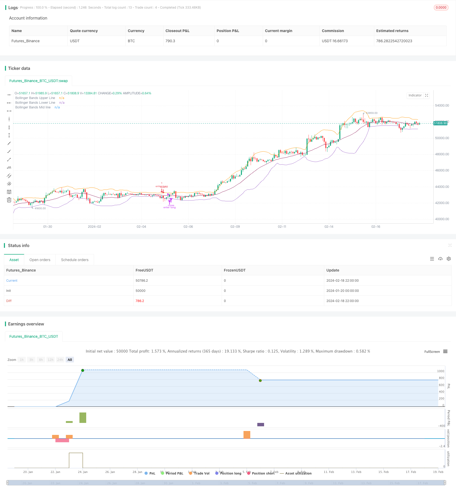

> Name

Bollinger-Band-Mean-Reversion-Strategy-with-Intraday-Intensity-Index
> Author

ChaoZhang

> Strategy Description


[trans]
## Overview
This strategy is a mean reversion strategy based on Bollinger Bands and intraday strength index. It uses the price to break through the upper and lower rails of the Bollinger Bands, and combines the intraday strength index of the trading volume indicator to determine the timing of entry. The strategic advantages include: using the average price regression characteristics to make profits, and combining the volume and energy indicators to filter signals. However, there are also risks such as large retracement and long profit time.
## Strategy Principle
The strategy first calculates the middle, upper and lower Bollinger Bands. The middle rail is the simple moving average or exponential moving average of the closing price. The upper and lower rails are constructed by calculating the standard deviation and adding and subtracting twice the standard deviation above and below the middle rail. When the price breaks through the lower track, it is regarded as an opportunity for mean reversion and a long position is taken. When the price breaks through the upper track, it is considered that the price deviates excessively from the mean, and a short position is taken.
As an auxiliary judgment indicator, the strategy introduces the intraday strength index. This indicator combines price information and volume information. When the index is positive, it means that the buying power has increased, which serves as a long position signal. When the index is negative, it indicates that selling power has increased and serves as a short position signal.
In terms of opening a position, the strategy requires both the price to break through the upper and lower Bollinger Bands and the judgment indicator of the intraday strength index. In terms of stop loss, the strategy adopts time stop loss. If no profit is made after a certain period, choose stop loss to exit.
## Advantage Analysis
The biggest advantage of this strategy is that it uses the average reversion characteristics of prices to make profits. When the price deviates greatly, according to statistical laws, the probability of the price returning to the mean axis is greater, which provides a theoretical basis for the operation of the strategy.
Another advantage is that the strategy incorporates a volume indicator – the intraday strength index – to filter price signals. Volume can prove the effectiveness of price signals. This avoids the generation of false signals when some prices fluctuate violently and trading volume is insufficient.
## Risk Analysis
Although this strategy relies on the probabilistic event of price average reversion to make profits, random walks in market prices may also cause stop losses to be triggered, resulting in losses. This is a common risk faced by mean reversion strategies.
Another major risk is that price reversion to the mean itself is a long-term process. For investors, funds may be tied up for a period of time. This timing risk may cause investors to lose other better investment opportunities.
## Optimization direction
This strategy can be optimized from the following aspects:
1. Optimize the Bollinger Band parameters, adjust the cycle and standard deviation indicators to adapt to the fluctuation environment of different markets
2. Try other types of moving averages, such as linear weighted moving averages to improve smoothness
3. Try other types of trading volume indicators to find better volume and price confirmation signals
4. Add stop-loss and take-profit strategies to control the maximum loss of a single order
## Summarize
This strategy as a whole is a typical mean reversion strategy. Rely on probabilistic events to make profits, but the risks are also obvious. Through parameter adjustment and indicator optimization, it is possible to obtain better results. But for investors, correctly grasping the attributes of this strategy is also key.
||

## Overview 

This strategy is a mean reversion strategy based on Bollinger Bands and Intraday Intensity Index. It utilizes the price breakouts of Bollinger Bands upper and lower band, combined with the volume indicator Intraday Intensity Index to determine the entry timing. The advantages of this strategy include: gaining profits from the mean reversion of prices, and filtering signals with volume indicators. However, it also has risks like large drawdowns and long profit time.

## Strategy Principle

The strategy first calculates the middle band, upper band and lower band of Bollinger Bands. The middle band is the simple moving average or exponential moving average of the closing price. The upper and lower bands are constructed by adding/subtracting two standard deviations on the middle band. When price breaks through the lower band, it is considered an opportunity for mean reversion, taking long position. When price breaks through upper band, it is considered over-deviation from mean, taking short position.  

As an assisted indicator for judgement, the strategy introduces Intraday Intensity Index. This indicator combines both price and volume information. When the index is positive, it indicates the buying power is strengthening, giving long signal. When the index is negative, it indicates selling power is strengthening, giving short signal.

For opening positions, the strategy requires both price breakout of Bollinger Bands band and the Intraday Intensity Index indicator judgement. For stop loss, the strategy adopts time based stop loss. If no profits after certain periods, the strategy chooses to cut loss and exit.  

## Advantage Analysis

The biggest advantage of this strategy is utilizing the mean reversion of prices to profit. When prices have large deviations from mean, according to statistical laws, the probability prices revert back to mean is relatively large. This provides the theoretical basis for the strategy's operations.

Another advantage is the introduction of volume indicator - Intraday Intensity Index, to filter price signals. Trading volumes can prove the validity of price signals. This avoids the wrong signals generated in some violent price fluctuations with low volumes.

## Risk Analysis  

Although this strategy relies on the probability event of price mean reversions, the random walk of market prices can still trigger stop loss, leading to losses. This is a common risk faced by mean reversion strategies.  

Another major risk is that the process of prices reverting to mean itself is a relatively long cycle. For investors, capital may be held for some period of time. Such time risk may cause investors to miss other better investment opportunities.

## Optimization Directions

The strategy can be optimized in the following aspects:

1. Optimize Bollinger Bands parameters, adjust cycle and deviation metrics to adapt to volatility of different markets

2. Try other types of moving averages, like weighted moving average to increase smoothness  

3. Try other types of volume indicators, searching for better volume-price confirmation signals 

4. Add stop loss/profit taking strategies, control max loss per order

## Conclusion   

In conclusion, this strategy is a typical mean reversion strategy. It profits on probability events, but the risks are obvious as well. Better results may be obtained through adjustments of parameters and optimizations of indicators. But for investors, recognizing the attributes correctly of this strategy is also the key.

[/trans]

> Strategy Arguments


|Argument|Default|Description|
|----|----|----|
|v_input_1|20|Bollinger Bands length|
|v_input_2|0|Bollinger Bands MA type: SMA|EMA|
|v_input_3_close|0|source: close|high|low|open|hl2|hlc3|hlcc4|ohlc4|
|v_input_4|10|Time-based stop length|
|v_input_5|2|Bollinger Bands Standard Deviation|
|v_input_6|true|with Intraday Intensity Index?|
|v_input_7|21|Intraday Intensity Index length|


> Source (PineScript)

``` pinescript
/*backtest
start: 2024-01-20 00:00:00
end: 2024-02-19 00:00:00
period: 2h
basePeriod: 15m
exchanges: [{"eid":"Futures_Binance","currency":"BTC_USDT"}]
*/

//@version=4
// This source code is subject to the terms of the Mozilla Public License 2.0 at https://mozilla.org/MPL/2.0/

// Bollinger Bands Strategy with Intraday Intensity Index
// by SparkyFlary

//For Educational Purposes
//Results can differ on different markets and can fail at any time. Profit is not guaranteed.
strategy(title="Bollinger Bands Strategy with Intraday Intensity Index", shorttitle="Bollinger Bands Strategy", overlay=true)

BBlength = input(20, title="Bollinger Bands length")
BBmaType = input("SMA", title="Bollinger Bands MA type", type=input.string, options=["SMA", "EMA"])
BBprice = input(close, title="source")
timeStop = input(10, title="Time-based stop length")
BBmult = input(2.0, title="Bollinger Bands Standard Deviation")
withIII = input(true, title="with Intraday Intensity Index?")
IIIlength = input(21, title="Intraday Intensity Index length")

//function for choosing moving averages
f_ma(type, src, len) =>
    float result = 0
    if type == "SMA"
        result := sma(src, len)
    if type == "EMA"
        result := ema(src, len)
    result

//Intraday Intensity Index
k1 = (2 * close - high - low) * volume
k2 = high != low ? high - low : 1
i = k1 / k2
iSum = sum(i, IIIlength)

//Bollinger Bands
BBbasis = f_ma(BBmaType, BBprice, BBlength)
BBdev = BBmult * stdev(BBprice, BBlength)
BBupper = BBbasis + BBdev
BBlower = BBbasis - BBdev

plot(BBupper, title="Bollinger Bands Upper Line")
plot(BBlower, title="Bollinger Bands Lower Line")
plot(BBbasis, title="Bollinger Bands Mid line", color=color.maroon)

//Strategy
buy = close[1]<BBlower[1] and close>BBlower and (withIII ? iSum>0 : 1)
sell = close>BBbasis or buy[timeStop] or (strategy.openprofit>0 and buy==0 and buy[1]==0 and buy[2]==0 and buy[3]==0)
short = close[1]>BBupper[1] and close<BBupper and (withIII ? iSum<0 : 1)
cover = close<BBbasis or short[timeStop] or (strategy.openprofit>0 and short==0 and short[1]==0 and short[2]==0 and short[3]==0)

strategy.entry(id="enter long", long=true, when=buy)
strategy.close(id="enter long", comment="exit long", when=sell)
strategy.entry(id="enter short", long=false, when=short)
strategy.close(id="enter short", comment="exit short", when=cover)
```

> Detail

https://www.fmz.com/strategy/442246

> Last Modified

2024-02-20 15:07:59
