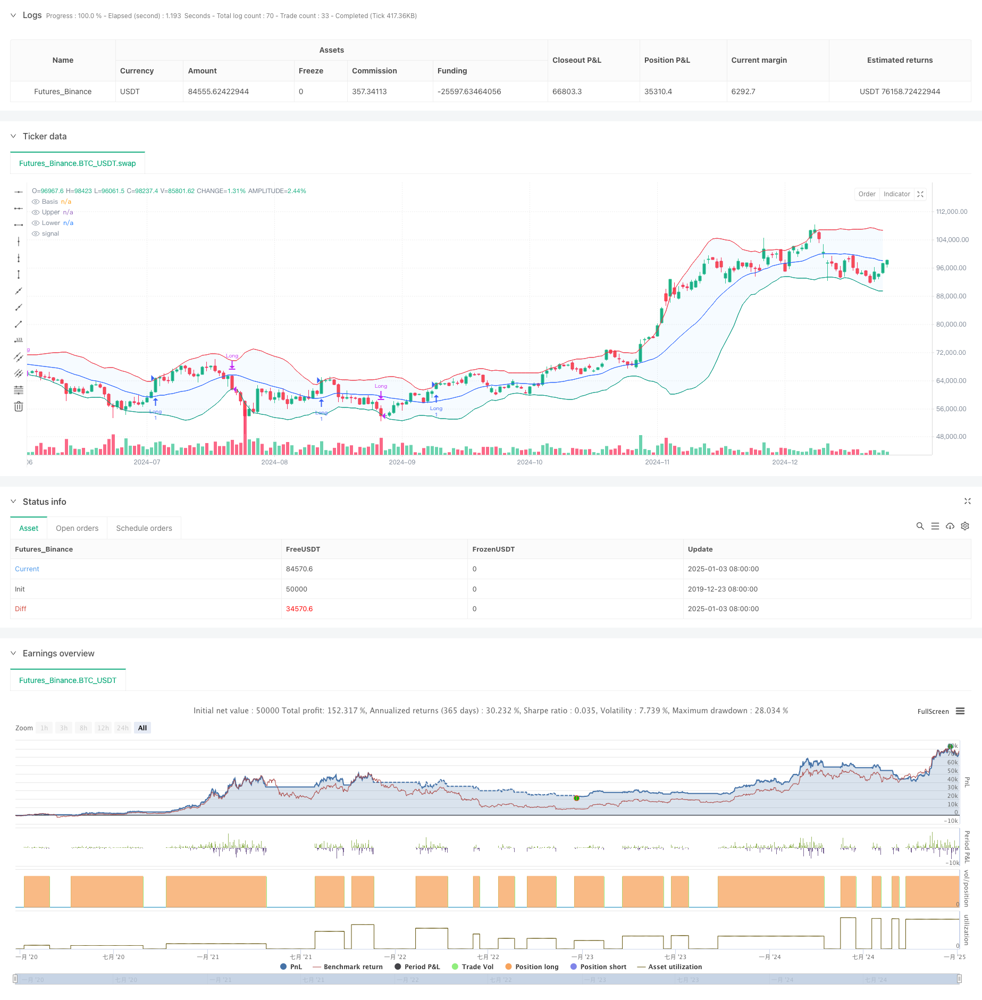

> Name

Bollinger Bands Breakout Momentum Tracking Trading Strategy-Bollinger-Bands-Breakout-Momentum-Trading-Strategy
> Author

ChaoZhang

> Strategy Description



[trans]
#### Overview
This strategy is a momentum tracking trading system based on the Bollinger Bands indicator. It identifies potential breakout opportunities by monitoring price in relation to the upper Bollinger Bands, and closing positions when prices fall below the lower Bollinger Bands. Bollinger Bands are composed of three lines: the middle track (moving average), the upper track, and the lower track (calculated by the standard deviation). The strategy supports multiple moving average types, and parameters can be adjusted according to trader preferences.
#### Strategy Principle
The core logic of the strategy is based on the following points:
1. Entry signal: When the closing price breaks through the upper Bollinger Band, it indicates that the market may have a strong upward trend, and a long position is opened at this time.
2. Exit signal: When the closing price falls below the lower Bollinger Band, it indicates that the upward momentum may be exhausted, and the position can be closed at this time to make a profit. 
3. Bollinger Bands calculation: The middle track uses optional moving average types (SMA, EMA, SMMA, WMA, VWMA), and the upper and lower tracks determine the bandwidth through standard deviation multiples.
4. Transaction management: The strategy executes transactions within the specified time window, using 100% of the funds for each transaction, and taking into account handling fees and slippage factors.
#### Strategic Advantages
1. Strong adaptability: supports a variety of moving average types and parameter adjustments, and can adapt to different market environments.
2. Improved risk management: Use the lower Bollinger Bands as a stop loss point to effectively control risks.
3. Breakthrough confirmation: Using the upper Bollinger Bands as the entry point can filter out false breakthroughs.
4. Reasonable fund management: adopt fixed proportion fund management to avoid excessive leverage.
5. Transaction cost considerations: Including handling fees and slippage in the calculation is more in line with the actual trading environment.
#### Strategy Risk
1. Risk of volatile market: False signals are easily generated in a volatile market.
2. Lagging risk: The moving average is lagging and may miss the best entry opportunity.
3. Parameter sensitivity: Different parameter combinations may lead to large differences in strategy performance.
4. Fund usage risk: 100% fund allocation may lead to larger drawdowns.
#### Strategy optimization direction
1. Add trend confirmation indicators: You can add trend indicators such as ADX to improve the accuracy of entry.
2. Optimize fund management: introduce dynamic position management and adjust positions according to market fluctuations.
3. Improve the profit-taking mechanism: you can set dynamic profit-taking points to obtain more profits in strong market conditions.
4. Add market environment filtering: add volatility indicators to avoid transactions in unsuitable market environments.
#### Summary
This is a trend following strategy based on Bollinger Bands, which captures market trends by observing the relationship between price and Bollinger Bands. The strategy design is reasonable and has good adjustability and risk management mechanism. Through the suggested optimization direction, the stability and profitability of the strategy can be further improved. The strategy is particularly suitable for volatile markets, but requires traders to adjust parameters and risk control measures based on actual conditions.
|| 

#### Overview
This strategy is a momentum tracking trading system based on Bollinger Bands indicator. It identifies potential breakout opportunities by monitoring the relationship between price and the upper Bollinger Band, and closes positions when price breaks below the lower band. Bollinger Bands consist of three lines: the middle band (moving average), upper and lower bands (calculated using standard deviation). The strategy supports multiple types of moving averages and allows parameter adjustment based on trader preferences.

#### Strategy Principles
The core logic of the strategy is based on the following points:
1. Entry Signal: When the closing price breaks above the upper Bollinger Band, indicating a potential strong uptrend, a long position is opened.
2. Exit Signal: When the closing price falls below the lower Bollinger Band, suggesting momentum exhaustion, the position is closed.
3. Bollinger Bands Calculation: The middle band uses selectable moving average types (SMA, EMA, SMMA, WMA, VWMA), and band width is determined by standard deviation multiplier.
4. Trade Management: The strategy executes trades within a specified time window, uses 100% capital per trade, and considers commission and slippage factors.

#### Strategy Advantages
1. High Adaptability: Supports multiple moving average types and parameter adjustments to adapt to different market conditions.
2. Robust Risk Management: Effectively controls risk using the lower Bollinger Band as a stop-loss point.
3. Breakout Confirmation: Uses upper Bollinger Band as entry point to filter false breakouts.
4. Rational Capital Management: Adopts fixed proportion capital management to avoid excessive leverage.
5. Transaction Cost Consideration: Incorporates commission and slippage for more realistic trading conditions.

#### Strategy Risks
1. Sideways Market Risk: Prone to false signals in range-bound markets.
2. Lag Risk: Moving averages have inherent lag, potentially missing optimal entry points.
3. Parameter Sensitivity: Different parameter combinations may lead to significant performance variations.
4. Capital Usage Risk: 100% capital allocation may result in substantial drawdowns.

#### Strategy Optimization Directions
1. Add Trend Confirmation Indicators: Include indicators like ADX to improve entry accuracy.
2. Optimize Capital Management: Introduce dynamic position sizing based on market volatility.
3. Enhance Profit-Taking Mechanism: Set dynamic take-profit points to capture more gains in strong trends.
4. Add Market Environment Filters: Incorporate volatility indicators to avoid trading in unsuitable market conditions.

#### Summary
This is a trend-following strategy based on Bollinger Bands, capturing market trends by observing the relationship between price and the bands. The strategy is well-designed with good adaptability and risk management mechanisms. Through the suggested optimization directions, the strategy's stability and profitability can be further enhanced. It is particularly suitable for volatile markets, but traders need to adjust parameters and risk control measures according to actual conditions.
[/trans]


> Source (PineScript)

``` pinescript
/*backtest
start: 2019-12-23 08:00:00
end: 2025-01-04 08:00:00
period: 1d
basePeriod: 1d
exchanges: [{"eid":"Futures_Binance","currency":"BTC_USDT"}]
*/

//@version=5
strategy(title="Demo GPT - Bollinger Bands Strategy", overlay=true, initial_capital=100000, commission_type=strategy.commission.percent, commission_value=0.1, slippage=3)

// Inputs
length = input.int(20, minval=1, title="Length")
maType = input.string("SMA", "Basis MA Type", options=["SMA", "EMA", "SMMA (RMA)", "WMA", "VWMA"])
src = input(close, title="Source")
mult = input.float(2.0, minval=0.001, maxval=50, title="StdDev")
offset = input.int(0, "Offset", minval=-500, maxval=500)
startDate = input(timestamp('01 Jan 2018 00:00 +0000'), title="Start Date")
endDate = input(timestamp('31 Dec 2069 23:59 +0000'), title="End Date")

// Moving Average Function
ma(source, length, _type) =>
    switch _type
        "SMA" => ta.sma(source, length)
        "EMA" => ta.ema(source, length)
        "SMMA (RMA)" => ta.rma(source, length)
        "WMA" => ta.wma(source, length)
        "VWMA" => ta.vwma(source, length)

// Calculations
basis = ma(src, length, maType)
dev = mult * ta.stdev(src, length)
upper = basis + dev
lower = basis - dev

// Plotting
plot(basis, "Basis", color=#2962FF, offset=offset)
p1 = plot(upper, "Upper", color=#F23645, offset=offset)
p2 = plot(lower, "Lower", color=#089981, offset=offset)
fill(p1, p2, title="Background", color=color.rgb(33, 150, 243, 95))

// Strategy Logic
inTradeWindow = true
longCondition = close > upper and inTradeWindow
exitCondition = close < lower and inTradeWindow

if (longCondition)
    strategy.entry("Long", strategy.long, qty=1)
if (exitCondition)
    strategy.close("Long")

```

> Detail

https://www.fmz.com/strategy/477579

> Last Modified

2025-01-06 15:19:50
